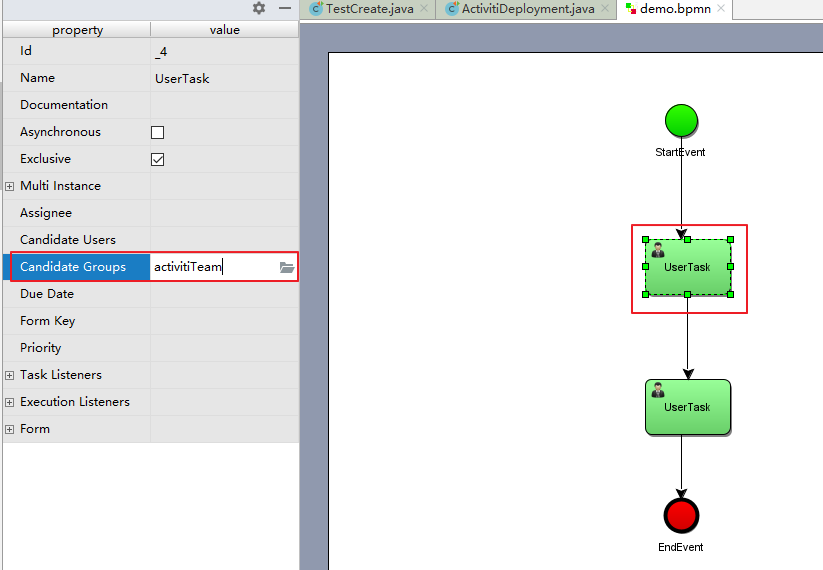

[[TOC]]
# Activiti整合Spring

# 一、Activiti与Spring整合开发

## 1.1 Activiti与Spring整合的配置

### 1)、在pom.xml文件引入坐标

如下

```xml
<properties>
        <slf4j.version>1.6.6</slf4j.version>
        <log4j.version>1.2.12</log4j.version>
</properties>
<dependencies>
    <dependency>
        <groupId>org.activiti</groupId>
        <artifactId>activiti-engine</artifactId>
        <version>7.0.0.Beta1</version>
    </dependency>
    <dependency>
        <groupId>org.activiti</groupId>
        <artifactId>activiti-spring</artifactId>
        <version>7.0.0.Beta1</version>
    </dependency>
    <dependency>
        <groupId>org.activiti</groupId>
        <artifactId>activiti-bpmn-model</artifactId>
        <version>7.0.0.Beta1</version>
    </dependency>
    <dependency>
        <groupId>org.activiti</groupId>
        <artifactId>activiti-bpmn-converter</artifactId>
        <version>7.0.0.Beta1</version>
    </dependency>
    <dependency>
        <groupId>org.activiti</groupId>
        <artifactId>activiti-json-converter</artifactId>
        <version>7.0.0.Beta1</version>
    </dependency>
    <dependency>
        <groupId>org.activiti</groupId>
        <artifactId>activiti-bpmn-layout</artifactId>
        <version>7.0.0.Beta1</version>
    </dependency>
    <dependency>
        <groupId>org.activiti.cloud</groupId>
        <artifactId>activiti-cloud-services-api</artifactId>
        <version>7.0.0.Beta1</version>
    </dependency>
    <dependency>
        <groupId>aspectj</groupId>
        <artifactId>aspectjweaver</artifactId>
        <version>1.5.4</version>
    </dependency>
    <dependency>
        <groupId>mysql</groupId>
        <artifactId>mysql-connector-java</artifactId>
        <version>5.1.40</version>
    </dependency>
    <dependency>
        <groupId>junit</groupId>
        <artifactId>junit</artifactId>
        <version>4.12</version>
    </dependency>
    <dependency>
        <groupId>org.springframework</groupId>
        <artifactId>spring-test</artifactId>
        <version>5.0.7.RELEASE</version>
    </dependency>
    <!-- log start -->
    <dependency>
        <groupId>log4j</groupId>
        <artifactId>log4j</artifactId>
        <version>${log4j.version}</version>
    </dependency>
    <dependency>
        <groupId>org.slf4j</groupId>
        <artifactId>slf4j-api</artifactId>
        <version>${slf4j.version}</version>
    </dependency>
    <dependency>
        <groupId>org.slf4j</groupId>
        <artifactId>slf4j-log4j12</artifactId>
        <version>${slf4j.version}</version>
    </dependency>
    <dependency>
        <groupId>org.slf4j</groupId>
        <artifactId>slf4j-nop</artifactId>
        <version>${slf4j.version}</version>
    </dependency>
    <!-- log end -->
    <dependency>
        <groupId>org.mybatis</groupId>
        <artifactId>mybatis</artifactId>
        <version>3.4.5</version>
    </dependency>
    <dependency>
        <groupId>commons-dbcp</groupId>
        <artifactId>commons-dbcp</artifactId>
        <version>1.4</version>
    </dependency>
</dependencies>
<repositories>
    <repository>
        <id>alfresco</id>
        <name>Activiti Releases</name>
        <url>https://artifacts.alfresco.com/nexus/content/repositories/activiti-releases/</url>
        <releases>
            <enabled>true</enabled>
        </releases>
    </repository>
</repositories>
```

在Activiti中核心类的是ProcessEngine流程引擎，与Spring整合就是让Spring来管理ProcessEngine

通过org.activiti.spring.SpringProcessEngineConfiguration 与Spring整合方式来创建ProcessEngine对象。 

 创建spring与activiti的整合配置文件：activiti-spring.xml（名称不固定）

### 2)、创建activiti-spring.xml

```xml
<beans xmlns="http://www.springframework.org/schema/beans"
       xmlns:xsi="http://www.w3.org/2001/XMLSchema-instance"
       xmlns:tx="http://www.springframework.org/schema/tx"
       xmlns:aop="http://www.springframework.org/schema/aop"
       xsi:schemaLocation="http://www.springframework.org/schema/beans
        http://www.springframework.org/schema/beans/spring-beans.xsd
        http://www.springframework.org/schema/tx
        http://www.springframework.org/schema/tx/spring-tx.xsd
        http://www.springframework.org/schema/aop
        http://www.springframework.org/schema/aop/spring-aop.xsd">
    <!-- 数据源 -->
    <bean id="dataSource" class="org.apache.commons.dbcp.BasicDataSource">
        <property name="driverClassName" value="com.mysql.jdbc.Driver"/>
        <property name="url" value="jdbc:mysql://localhost:3306/activiti"/>
        <property name="username" value="root"/>
        <property name="password" value="123456"/>
        <property name="maxActive" value="3"/>
        <property name="maxIdle" value="1"/>
    </bean>
    <!-- 工作流引擎配置bean -->
    <bean id="processEngineConfiguration" class="org.activiti.spring.SpringProcessEngineConfiguration">
        <!-- 数据源 -->
        <property name="dataSource" ref="dataSource"/>
        <!-- 使用spring事务管理器 -->
        <property name="transactionManager" ref="transactionManager"/>
        <!-- 数据库策略 -->
        <property name="databaseSchemaUpdate" value="drop-create"/>
    </bean>
    <!-- 流程引擎 -->
    <bean id="processEngine" class="org.activiti.spring.ProcessEngineFactoryBean">
        <property name="processEngineConfiguration" ref="processEngineConfiguration"/>
    </bean>
    <!-- 资源服务service -->
    <bean id="repositoryService" factory-bean="processEngine" factory-method="getRepositoryService"/>
    <!-- 流程运行service -->
    <bean id="runtimeService" factory-bean="processEngine"  factory-method="getRuntimeService"/>
    <!-- 任务管理service -->
    <bean id="taskService" factory-bean="processEngine" factory-method="getTaskService"/>
    <!-- 历史管理service -->
    <bean id="historyService" factory-bean="processEngine" factory-method="getHistoryService"/>
    <!-- 事务管理器 -->
    <bean id="transactionManager" class="org.springframework.jdbc.datasource.DataSourceTransactionManager">
        <property name="dataSource" ref="dataSource"/>
    </bean>
    <!-- 通知 -->
    <tx:advice id="txAdvice" transaction-manager="transactionManager">
        <tx:attributes>
            <!-- 传播行为 -->
            <tx:method name="save*" propagation="REQUIRED"/>
            <tx:method name="insert*" propagation="REQUIRED"/>
            <tx:method name="delete*" propagation="REQUIRED"/>
            <tx:method name="update*" propagation="REQUIRED"/>
            <tx:method name="find*" propagation="SUPPORTS" read-only="true"/>
            <tx:method name="get*" propagation="SUPPORTS" read-only="true"/>
        </tx:attributes>
    </tx:advice>
    <!-- 切面，根据具体项目修改切点配置
    <aop:config proxy-target-class="true">
        <aop:advisor advice-ref="txAdvice"
                     pointcut="execution(*com.itheima.service.impl..(..))"/>
    </aop:config>-->
</beans>
```

databaseSchemaUpdate的取值内容：

flase：       默认值。activiti在启动时，会对比数据库表中保存的版本，如果没有表或者版本不匹配，将抛出异常。（生产环境常用）
true：        activiti会对数据库中所有表进行更新操作。如果表不存在，则自动创建。（开发时常用）
create_drop： 在activiti启动时创建表，在关闭时删除表（必须手动关闭引擎，才能删除表）。（单元测试常用）
drop-create： 在activiti启动时删除原来的旧表，然后在创建新表（不需要手动关闭引擎）。


## 1.2 测试Activiti与Spring整合

### 1）、测试代码

```java
/**
   测试activiti与spring整合是否成功
**/
@RunWith(SpringJUnit4ClassRunner.class)
@ContextConfiguration(locations = "classpath:activiti-spring.xml")
 public class ActivitiTest {
     @Autowired
     private RepositoryService repositoryService;
     
     @Test
     public void test01(){
         System.out.println("部署对象:"+repositoryService);
     }
 }
```


### 2）、执行流程分析

下面我们一起来分析Activiti与Spring整合加载的过程。

1、加载activiti-spring.xml配置文件

2、加载SpringProcessEngineConfiguration对象，这个对象它需要依赖注入dataSource对象和transactionManager对象。

3、加载ProcessEngineFactoryBean工厂来创建ProcessEngine对象，而ProcessEngineFactoryBean工厂又需要依赖注入processEngineConfiguration对象。

4、processEngine对象来负责创建我们的Service对象，从而简化Activiti的开发过程。

# 二、Activiti7与SpringBoot整合开发

Activiti7发布正式版之后，它与SpringBoot2.x已经完全支持整合开发。

## 2.1     SpringBoot整合Activiti7的配置

为了能够实现SpringBoot与Activiti7整合开发，首先我们要引入相关的依赖支持。

在工程的pom.xml文件中引入相关的依赖，其中activiti的依赖是：activiti-spring-boot-starter。

具体依赖如下所示：

```xml

<parent>
    <groupId>org.springframework.boot</groupId>
    <artifactId>spring-boot-starter-parent</artifactId>
    <version>2.1.0.RELEASE</version>
</parent>
<properties>
    <project.build.sourceEncoding>UTF-8</project.build.sourceEncoding>
    <project.reporting.outputEncoding>UTF-8</project.reporting.outputEncoding>
    <java.version>1.8</java.version>
</properties>
<dependencies>
    <dependency>
        <groupId>org.springframework.boot</groupId>
        <artifactId>spring-boot-starter-web</artifactId>
    </dependency>
    <dependency>
        <groupId>org.springframework.boot</groupId>
        <artifactId>spring-boot-starter-jdbc</artifactId>
    </dependency>
    <dependency>
        <groupId>org.springframework.boot</groupId>
        <artifactId>spring-boot-starter-test</artifactId>
    </dependency>
    <dependency>
        <groupId>org.activiti</groupId>
        <artifactId>activiti-spring-boot-starter</artifactId>
        <version>7.0.0.Beta2</version>
    </dependency>
    <dependency>
        <groupId>mysql</groupId>
        <artifactId>mysql-connector-java</artifactId>
        <version>5.1.29</version>
    </dependency>
    <dependency>
        <groupId>org.projectlombok</groupId>
        <artifactId>lombok</artifactId>
    </dependency>
</dependencies>
<build>
    <plugins>
        <plugin>
            <groupId>org.springframework.boot</groupId>
            <artifactId>spring-boot-maven-plugin</artifactId>
        </plugin>
    </plugins>
</build>
```

通过该pom.xml文件所导入的坐标，我们就可以实现activiti7与Springboot整合。

## 2.2    SpringBoot的application.yml文件配置

为了能够实现Activiti7生成的表放到Mysql数据库中，需要在配置文件application.yml中添加相关的配置

注意：activiti7默认没有开启数据库历史记录，需要手动配置开启

```yaml
spring:
  datasource:
    url: jdbc:mysql:///activiti?useUnicode=true&characterEncoding=utf8&serverTimezone=GMT
    username: root
    password: 123456
    driver-class-name: com.mysql.jdbc.Driver
  activiti:
    #1.flase：默认值。activiti在启动时，对比数据库表中保存的版本，如果没有表或者版本不匹配，将抛出异常
    #2.true： activiti会对数据库中所有表进行更新操作。如果表不存在，则自动创建
    #3.create_drop： 在activiti启动时创建表，在关闭时删除表（必须手动关闭引擎，才能删除表）
    #4.drop-create： 在activiti启动时删除原来的旧表，然后在创建新表（不需要手动关闭引擎）
    database-schema-update: true
    #检测历史表是否存在 activiti7默认没有开启数据库历史记录 启动数据库历史记录
    db-history-used: true
    #记录历史等级 可配置的历史级别有none, activity, audit, full
    #none：不保存任何的历史数据，因此，在流程执行过程中，这是最高效的。
    #activity：级别高于none，保存流程实例与流程行为，其他数据不保存。
    #audit：除activity级别会保存的数据外，还会保存全部的流程任务及其属性。audit为history的默认值。
    #full：保存历史数据的最高级别，除了会保存audit级别的数据外，还会保存其他全部流程相关的细节数据，包括一些流程参数等。
    history-level: full
    #校验流程文件，默认校验resources下的processes文件夹里的流程文件
    check-process-definitions: false
```

## 2.3 编写启动类

```java
package com.itheima;

import org.springframework.boot.SpringApplication;
import org.springframework.boot.autoconfigure.SpringBootApplication;

@SpringBootApplication
public class ActApplication {
    public static void main(String[] args) {
        SpringApplication.run(ActApplication.class,args);
    }
}

```

## 2.4    添加SpringSecurity安全框架整合配置

因为Activiti7与SpringBoot整合后，默认情况下，集成了SpringSecurity安全框架，这样我们就要去准备SpringSecurity整合进来的相关用户权限配置信息。

SpringBoot的依赖包已经将SpringSecurity的依赖包也添加进项目中。

### 2.4.1  添加SecurityUtil类

为了能够快速实现SpringSecurity安全框架的配置，所添加的一个组件。

```java
package com.itheima.utils;

import org.slf4j.Logger;
import org.slf4j.LoggerFactory;
import org.springframework.beans.factory.annotation.Autowired;
import org.springframework.beans.factory.annotation.Qualifier;
import org.springframework.security.core.Authentication;
import org.springframework.security.core.GrantedAuthority;
import org.springframework.security.core.context.SecurityContextHolder;
import org.springframework.security.core.context.SecurityContextImpl;
import org.springframework.security.core.userdetails.UserDetails;
import org.springframework.security.core.userdetails.UserDetailsService;
import org.springframework.stereotype.Component;

import java.util.Collection;


@Component
public class SecurityUtil {
    private Logger logger = LoggerFactory.getLogger(SecurityUtil.class);

     @Autowired
     @Qualifier("myUserDetailsService")
     private UserDetailsService userDetailsService;
 
    public void logInAs(String username) {
     UserDetails user = userDetailsService.loadUserByUsername(username);

     if (user == null) {
         throw new IllegalStateException("User " + username + " doesn't exist, please provide a valid user");
     }
     logger.info("> Logged in as: " + username);

     SecurityContextHolder.setContext(
             new SecurityContextImpl(
                     new Authentication() {
                         @Override
                         public Collection<? extends GrantedAuthority> getAuthorities() {
                             return user.getAuthorities();
                         }
                         @Override
                         public Object getCredentials() {
                             return user.getPassword();
                         }
                         @Override
                         public Object getDetails() {
                             return user;
                         }
                         @Override
                         public Object getPrincipal() {
                             return user;
                         }
                         @Override
                         public boolean isAuthenticated() {
                             return true;
                         }
                         @Override
                         public void setAuthenticated(boolean isAuthenticated) throws IllegalArgumentException { }
                         @Override
                         public String getName() {
                             return user.getUsername();
                         }
     }));
     org.activiti.engine.impl.identity.Authentication.setAuthenticatedUserId(username);
 }
  }
```
这个类可以从我们下载的Activiti7官方提供的Example中找到。

### 2.4.2  添加DemoApplicationConfig类

在Activiti7官方下载的Example中找到DemoApplicationConfig类，它的作用是为了实现SpringSecurity框架的用户权限的配置，这样我们就可以在系统中使用用户权限信息。

本次项目中基本是在文件中定义出来的用户信息，当然也可以是数据库中查询的用户权限信息。

后面处理流程时用到的任务负责人，需要添加在这里

```java
package com.itheima.config;

import org.slf4j.Logger;
import org.slf4j.LoggerFactory;
import org.springframework.context.annotation.Bean;
import org.springframework.context.annotation.Configuration;
import org.springframework.security.core.authority.SimpleGrantedAuthority;
import org.springframework.security.core.userdetails.User;
import org.springframework.security.core.userdetails.UserDetailsService;
import org.springframework.security.crypto.bcrypt.BCryptPasswordEncoder;
import org.springframework.security.crypto.password.PasswordEncoder;
import org.springframework.security.provisioning.InMemoryUserDetailsManager;

import java.util.Arrays;
import java.util.List;
import java.util.stream.Collectors;

@Configuration
public class DemoApplicationConfiguration {
    private Logger logger = LoggerFactory.getLogger(DemoApplicationConfiguration.class);
     @Bean
     public UserDetailsService myUserDetailsService() {
         InMemoryUserDetailsManager inMemoryUserDetailsManager = new InMemoryUserDetailsManager();
         //这里添加用户，后面处理流程时用到的任务负责人，需要添加在这里
         String[][] usersGroupsAndRoles = {
                 {"jack", "password", "ROLE_ACTIVITI_USER", "GROUP_activitiTeam"},
                 {"rose", "password", "ROLE_ACTIVITI_USER", "GROUP_activitiTeam"},
                 {"tom", "password", "ROLE_ACTIVITI_USER", "GROUP_activitiTeam"},
                 {"other", "password", "ROLE_ACTIVITI_USER", "GROUP_otherTeam"},
                 {"system", "password", "ROLE_ACTIVITI_USER"},
                 {"admin", "password", "ROLE_ACTIVITI_ADMIN"},
         };

         for (String[] user : usersGroupsAndRoles) {
             List<String> authoritiesStrings = Arrays.asList(Arrays.copyOfRange(user, 2, user.length));
             logger.info("> Registering new user: " + user[0] + " with the following Authorities[" + authoritiesStrings + "]");
             inMemoryUserDetailsManager.createUser(new User(user[0], passwordEncoder().encode(user[1]),
                     authoritiesStrings.stream().map(s -> new SimpleGrantedAuthority(s)).collect(Collectors.toList())));
         }

         return inMemoryUserDetailsManager;
     }
     @Bean
     public PasswordEncoder passwordEncoder() {
         return new BCryptPasswordEncoder();
     }
}
```

##  2.5 创建Bpmn文件

> Activiti7可以自动部署流程，前提是在resources目录下，创建一个新的目录processes，用来放置bpmn文件。

创建一个简单的Bpmn流程文件，并设置任务的用户组Candidate Groups。

Candidate Groups中的内容与上面DemoApplicationConfiguration类中出现的用户组名称要保持一致，可以填写：activitiTeam 或者 otherTeam。

这样填写的好处：当不确定到底由谁来负责当前任务的时候，只要是Groups内的用户都可以拾取这个任务



## 2.6    使用Junit方式测试

### src/test/java/com/itheima/test/TestActiviti.java

```java
package com.itheima.test;

import com.itheima.utils.SecurityUtil;
import org.activiti.api.process.model.ProcessInstance;
import org.activiti.api.process.model.builders.ProcessPayloadBuilder;
import org.activiti.api.process.runtime.ProcessRuntime;
import org.activiti.api.runtime.shared.query.Page;
import org.activiti.api.runtime.shared.query.Pageable;
import org.activiti.api.task.model.Task;
import org.activiti.api.task.model.builders.TaskPayloadBuilder;
import org.activiti.api.task.runtime.TaskRuntime;
import org.activiti.engine.repository.ProcessDefinition;
import org.junit.Test;
import org.junit.runner.RunWith;
import org.springframework.beans.factory.annotation.Autowired;
import org.springframework.boot.test.context.SpringBootTest;
import org.springframework.test.context.junit4.SpringRunner;

@RunWith(SpringRunner.class)
@SpringBootTest
 public class Actviti7DemoApplicationTests {
     @Autowired
     private ProcessRuntime processRuntime;
     @Autowired
     private TaskRuntime taskRuntime;
     @Autowired
     private SecurityUtil securityUtil;

    @Test
    public void testActBoot(){
        System.out.println(taskRuntime);
    }

    /**
     * 查看流程定义
     */
    @Test
    public void contextLoads() {
        securityUtil.logInAs("system");
        Page<org.activiti.api.process.model.ProcessDefinition> processDefinitionPage =
                processRuntime.processDefinitions(Pageable.of(0, 10));
        System.out.println("可用的流程定义数量：" + processDefinitionPage.getTotalItems());
        for (org.activiti.api.process.model.ProcessDefinition pd : processDefinitionPage.getContent()) {
            System.out.println("流程定义：" + pd);
        }
    }


    /**
     * 启动流程实例
     */
    @Test
    public void testStartProcess() {
        securityUtil.logInAs("system");
        ProcessInstance pi = processRuntime.start(ProcessPayloadBuilder.
                start().
                withProcessDefinitionKey("myProcess").
                build());
        System.out.println("流程实例ID：" + pi.getId());
    }


    /**
     **查询任务，并完成自己的任务
     **/
    @Test
    public void testTask() {
        securityUtil.logInAs("jack");
        Page<Task> taskPage=taskRuntime.tasks(Pageable.of(0,10));
        if (taskPage.getTotalItems()>0){
            for (Task task:taskPage.getContent()){
                taskRuntime.claim(TaskPayloadBuilder.
                        claim().
                        withTaskId(task.getId()).build());
                System.out.println("任务："+task);
                taskRuntime.complete(TaskPayloadBuilder.
                        complete().
                        withTaskId(task.getId()).build());
            }
        }
        Page<Task> taskPage2=taskRuntime.tasks(Pageable.of*(0,10));
        if (taskPage2.getTotalItems()>0){
            System.out.println("任务："+taskPage2.getContent());
        }
    }
}
```

### src/test/java/com/itheima/test/iTestActiviti.java
```java
package com.itheima.test;

import com.itheima.test.dot.ActTaskDTO;
import com.itheima.utils.JsonUtils;
import com.itheima.utils.SecurityUtil;
import lombok.extern.slf4j.Slf4j;
import org.activiti.api.process.model.ProcessInstance;
import org.activiti.api.process.model.builders.ProcessPayloadBuilder;
import org.activiti.api.process.runtime.ProcessRuntime;
import org.activiti.api.runtime.shared.query.Page;
import org.activiti.api.runtime.shared.query.Pageable;
import org.activiti.api.task.model.Task;
import org.activiti.api.task.model.builders.TaskPayloadBuilder;
import org.activiti.api.task.runtime.TaskRuntime;
import org.activiti.bpmn.model.Process;
import org.activiti.bpmn.model.*;
import org.activiti.engine.HistoryService;
import org.activiti.engine.RepositoryService;
import org.activiti.engine.RuntimeService;
import org.activiti.engine.history.HistoricActivityInstance;
import org.activiti.engine.history.HistoricProcessInstance;
import org.activiti.engine.history.HistoricTaskInstance;
import org.activiti.engine.repository.Deployment;
import org.activiti.engine.repository.ProcessDefinition;
import org.activiti.engine.repository.ProcessDefinitionQuery;
import org.junit.Test;
import org.junit.runner.RunWith;
import org.springframework.beans.factory.annotation.Autowired;
import org.springframework.boot.test.context.SpringBootTest;
import org.springframework.test.context.junit4.SpringRunner;

import java.io.IOException;
import java.io.InputStream;
import java.util.Collection;
import java.util.HashMap;
import java.util.List;
import java.util.Set;
import java.util.stream.Collectors;


/**
 * 	部署ID f6fbfa74-2383-11ed-9ba4-0a0027000002 act_re_deployment ID_;ACT_RE_PROCDEF DEPLOYMENT_ID_
 * 	实例ID 81ffdcf5-2353-11ed-aaec-0a0027000002 act_ru_execution ID_
 * 	流程ID testleave1:1:67ed4864-2346-11ed-bd18-0a0027000002 act_ru_execution PROC_DEF_ID_
 * 	任务ID 1bfa4bdb-22b0-11ed-a687-0a0027000002 act_ru_task ID_
 *
 * 定义
 * 实例
 * 任务
 *
 * 类似 TestActiviti2.java
 */
@Slf4j
@RunWith(SpringRunner.class)
@SpringBootTest
public class iTestActiviti {

    @Autowired
    private RepositoryService repositoryService;
    @Autowired
    private HistoryService historyService;
    @Autowired
    private RuntimeService runtimeService;
    @Autowired
    private ProcessRuntime processRuntime;
    @Autowired
    private TaskRuntime taskRuntime;

    @Test
    public void testProcessDefinitionQuery(){
        ProcessDefinitionQuery processDefinitionQuery = repositoryService.createProcessDefinitionQuery().orderByProcessDefinitionId().orderByProcessDefinitionVersion().desc();
        // java.lang.IllegalArgumentException: class org.activiti.engine.impl.ProcessDefinitionQueryImpl declares multiple JSON fields named databaseType
//        JsonUtils.log(log, "ProcessDefinitionQuery processDefinitionQuery:", processDefinitionQuery);
        List list = processDefinitionQuery.list();
        JsonUtils.log(log, "processDefinitionQuery.list()", list);
    }

    @Test
    public void deploy1() throws IOException {
        // 方式一
//        ClassPathResource resource = new ClassPathResource("bpmn/testleave1.bpmn");
//        InputStream inputStream = resource.getInputStream();
//        Deployment deploy = repositoryService.createDeployment().addInputStream("testleave1.bpmn", resource).deploy();
//        Deployment deploy = repositoryService.createDeployment()
//                .addInputStream("testleave1.bpmn", inputStream)
//                .deploy();

        // 方式二
//        3、使用service进行流程的部署，定义一个流程的名字，把bpmn和png部署到数据中
        Deployment deploy = repositoryService.createDeployment()
                .name("我的请假流程部署名称1")
                .addClasspathResource("bpmn/ileave1.bpmn")
                .deploy();
//        4、输出部署信息
        JsonUtils.log(log, "Deployment deploy:", deploy);
        //{"name":"测试请假流程-普通表单2","tenantId":"","resources":{"bpmn/testleave2.bpmn":{"name":"bpmn/testleave2.bpmn","bytes":[60,63,120,109,108,32,118,101,114,115,105,111,110,61,34,49,46,48,34,32,101,110,99,111,100,105,110,103,61,34,85,84,70,45,56,34,63,62,13,10,60,100,101,102,105,110,105,116,105,111,110,115,32,120,109,108,110,115,61,34,104,116,116,112,58,47,47,119,119,119,46,111,109,103,46,111,114,103,47,115,112,101,99,47,66,80,77,78,47,50,48,49,48,48,53,50,52,47,77,79,68,69,76,34,32,120,109,108,110,115,58,120,115,105,61,34,104,116,116,112,58,47,47,119,119,119,46,119,51,46,111,114,103,47,50,48,48,49,47,88,77,76,83,99,104,101,109,97,45,105,110,115,116,97,110,99,101,34,32,120,109,108,110,115,58,97,99,116,105,118,105,116,105,61,34,104,116,116,112,58,47,47,97,99,116,105,118,105,116,105,46,111,114,103,47,98,112,109,110,34,32,120,109,108,110,115,58,98,112,109,110,100,105,61,34,104,116,116,112,58,47,47,119,119,119,46,111,109,103,46,111,114,103,47,115,112,101,99,47,66,80,77,78,47,50,48,49,48,48,53,50,52,47,68,73,34,32,120,109,108,110,115,58,111,109,103,100,99,61,34,104,116,116,112,58,47,47,119,119,119,46,111,109,103,46,111,114,103,47,115,112,101,99,47,68,68,47,50,48,49,48,48,53,50,52,47,68,67,34,32,120,109,108,110,115,58,111,109,103,100,105,61,34,104,116,116,112,58,47,47,119,119,119,46,111,109,103,46,111,114,103,47,115,112,101,99,47,68,68,47,50,48,49,48,48,53,50,52,47,68,73,34,32,120,109,108,110,115,58,120,115,100,61,34,104,116,116,112,58,47,47,119,119,119,46,119,51,46,111,114,103,47,50,48,48,49,47,88,77,76,83,99,104,101,109,97,34,32,116,97,114,103,101,116,78,97,109,101,115,112,97,99,101,61,34,104,116,116,112,58,47,47,119,119,119,46,107,97,102,101,105,116,117,46,109,101,47,97,99,116,105,118,105,116,105,47,108,101,97,118,101,34,62,13,10,32,32,60,112,114,111,99,101,115,115,32,105,100,61,34,116,101,115,116,108,101,97,118,101,50,34,32,110,97,109,101,61,34,-26,-75,-117,-24,-81,-107,-24,-81,-73,-27,-127,-121,-26,-75,-127,-25,-88,-117,45,-26,-103,-82,-23,-128,-102,-24,-95,-88,-27,-115,-107,50,34,32,105,115,69,120,101,99,117,116,97,98,108,101,61,34,116,114,117,101,34,62,13,10,32,32,32,32,60,100,111,99,117,109,101,110,116,97,116,105,111,110,62,-24,-81,-73,-27,-127,-121,-26,-75,-127,-25,-88,-117,-26,-68,-108,-25,-92,-70,60,47,100,111,99,117,109,101,110,116,97,116,105,111,110,62,13,10,32,32,32,32,60,115,116,97,114,116,69,118,101,110,116,32,105,100,61,34,115,116,97,114,116,101,118,101,110,116,49,34,32,110,97,109,101,61,34,83,116,97,114,116,34,32,47,62,13,10,32,32,32,32,60,117,115,101,114,84,97,115,107,32,105,100,61,34,100,101,112,116,76,101,97,100,101,114,86,101,114,105,102,121,34,32,110,97,109,101,61,34,-23,-125,-88,-23,-105,-88,-23,-94,-122,-27,-81,-68,-27,-82,-95,-26,-119,-71,34,32,97,99,116,105,118,105,116,105,58,102,111,114,109,75,101,121,61,34,100,101,112,116,76,101,97,100,101,114,86,101,114,105,102,121,34,32,97,99,116,105,118,105,116,105,58,99,97,110,100,105,100,97,116,101,85,115,101,114,115,61,34,36,123,100,101,112,116,76,101,97,100,101,114,125,34,62,13,10,32,32,32,32,32,32,60,101,120,116,101,110,115,105,111,110,69,108,101,109,101,110,116,115,62,13,10,32,32,32,32,32,32,32,32,60,97,99,116,105,118,105,116,105,58,102,111,114,109,80,114,111,112,101,114,116,121,32,105,100,61,34,70,111,114,109,80,114,111,112,101,114,116,121,95,51,113,105,112,105,115,50,45,45,95,95,33,33,114,97,100,105,111,45,45,95,95,33,33,-27,-82,-95,-26,-119,-71,-26,-124,-113,-24,-89,-127,45,45,95,95,33,33,105,45,45,95,95,33,33,-27,-112,-116,-26,-124,-113,45,45,95,95,45,45,-28,-72,-115,-27,-112,-116,-26,-124,-113,34,32,116,121,112,101,61,34,115,116,114,105,110,103,34,32,47,62,13,10,32,32,32,32,32,32,32,32,60,97,99,116,105,118,105,116,105,58,102,111,114,109,80,114,111,112,101,114,116,121,32,105,100,61,34,70,111,114,109,80,114,111,112,101,114,116,121,95,48,108,102,102,112,99,109,45,45,95,95,33,33,116,101,120,116,97,114,101,97,45,45,95,95,33,33,-26,-119,-71,-26,-77,-88,45,45,95,95,33,33,102,95,95,33,33,110,117,108,108,34,32,116,121,112,101,61,34,115,116,114,105,110,103,34,32,47,62,13,10,32,32,32,32,32,32,60,47,101,120,116,101,110,115,105,111,110,69,108,101,109,101,110,116,115,62,13,10,32,32,32,32,60,47,117,115,101,114,84,97,115,107,62,13,10,32,32,32,32,60,101,120,99,108,117,115,105,118,101,71,97,116,101,119,97,121,32,105,100,61,34,101,120,99,108,117,115,105,118,101,103,97,116,101,119,97,121,53,34,62,13,10,32,32,32,32,32,32,60,111,117,116,103,111,105,110,103,62,70,108,111,119,95,48,113,51,98,98,106,108,60,47,111,117,116,103,111,105,110,103,62,13,10,32,32,32,32,60,47,101,120,99,108,117,115,105,118,101,71,97,116,101,119,97,121,62,13,10,32,32,32,32,60,117,115,101,114,84,97,115,107,32,105,100,61,34,104,114,86,101,114,105,102,121,34,32,110,97,109,101,61,34,-28,-70,-70,-28,-70,-117,-27,-82,-95,-26,-119,-71,34,32,97,99,116,105,118,105,116,105,58,102,111,114,109,75,101,121,61,34,104,114,86,101,114,105,102,121,34,32,97,99,116,105,118,105,116,105,58,99,97,110,100,105,100,97,116,101,71,114,111,117,112,115,61,34,104,114,34,62,13,10,32,32,32,32,32,32,60,101,120,116,101,110,115,105,111,110,69,108,101,109,101,110,116,115,62,13,10,32,32,32,32,32,32,32,32,60,97,99,116,105,118,105,116,105,58,102,111,114,109,80,114,111,112,101,114,116,121,32,105,100,61,34,70,111,114,109,80,114,111,112,101,114,116,121,95,50,51,117,57,53,106,98,45,45,95,95,33,33,114,97,100,105,111,45,45,95,95,33,33,-27,-82,-95,-26,-119,-71,-26,-124,-113,-24,-89,-127,45,45,95,95,33,33,105,45,45,95,95,33,33,-27,-112,-116,-26,-124,-113,45,45,95,95,45,45,-28,-72,-115,-27,-112,-116,-26,-124,-113,34,32,116,121,112,101,61,34,115,116,114,105,110,103,34,32,47,62,13,10,32,32,32,32,32,32,32,32,60,97,99,116,105,118,105,116,105,58,102,111,114,109,80,114,111,112,101,114,116,121,32,105,100,61,34,70,111,114,109,80,114,111,112,101,114,116,121,95,51,116,55,116,102,107,118,45,45,95,95,33,33,116,101,120,116,97,114,101,97,45,45,95,95,33,33,-26,-119,-71,-26,-77,-88,45,45,95,95,33,33,102,45,45,95,95,33,33,110,117,108,108,34,32,116,121,112,101,61,34,115,116,114,105,110,103,34,32,47,62,13,10,32,32,32,32,32,32,60,47,101,120,116,101,110,115,105,111,110,69,108,101,109,101,110,116,115,62,13,10,32,32,32,32,60,47,117,115,101,114,84,97,115,107,62,13,10,32,32,32,32,60,101,120,99,108,117,115,105,118,101,71,97,116,101,119,97,121,32,105,100,61,34,101,120,99,108,117,115,105,118,101,103,97,116,101,119,97,121,54,34,62,13,10,32,32,32,32,32,32,60,111,117,116,103,111,105,110,103,62,70,108,111,119,95,48,112,56,53,57,53,52,60,47,111,117,116,103,111,105,110,103,62,13,10,32,32,32,32,32,32,60,111,117,116,103,111,105,110,103,62,70,108,111,119,95,48,106,105,55,113,99,118,60,47,111,117,116,103,111,105,110,103,62,13,10,32,32,32,32,60,47,101,120,99,108,117,115,105,118,101,71,97,116,101,119,97,121,62,13,10,32,32,32,32,60,101,110,100,69,118,101,110,116,32,105,100,61,34,101,110,100,101,118,101,110,116,49,34,32,110,97,109,101,61,34,69,110,100,34,62,13,10,32,32,32,32,32,32,60,105,110,99,111,109,105,110,103,62,70,108,111,119,95,48,112,56,53,57,53,52,60,47,105,110,99,111,109,105,110,103,62,13,10,32,32,32,32,32,32,60,105,110,99,111,109,105,110,103,62,70,108,111,119,95,48,106,105,55,113,99,118,60,47,105,110,99,111,109,105,110,103,62,13,10,32,32,32,32,32,32,60,105,110,99,111,109,105,110,103,62,70,108,111,119,95,48,113,51,98,98,106,108,60,47,105,110,99,111,109,105,110,103,62,13,10,32,32,32,32,60,47,101,110,100,69,118,101,110,116,62,13,10,32,32,32,32,60,115,101,113,117,101,110,99,101,70,108,111,119,32,105,100,61,34,102,108,111,119,50,34,32,115,111,117,114,99,101,82,101,102,61,34,115,116,97,114,116,101,118,101,110,116,49,34,32,116,97,114,103,101,116,82,101,102,61,34,100,101,112,116,76,101,97,100,101,114,86,101,114,105,102,121,34,32,47,62,13,10,32,32,32,32,60,115,101,113,117,101,110,99,101,70,108,111,119,32,105,100,61,34,102,108,111,119,51,34,32,115,111,117,114,99,101,82,101,102,61,34,100,101,112,116,76,101,97,100,101,114,86,101,114,105,102,121,34,32,116,97,114,103,101,116,82,101,102,61,34,101,120,99,108,117,115,105,118,101,103,97,116,101,119,97,121,53,34,32,47,62,13,10,32,32,32,32,60,115,101,113,117,101,110,99,101,70,108,111,119,32,105,100,61,34,102,108,111,119,53,34,32,110,97,109,101,61,34,-27,-112,-116,-26,-124,-113,34,32,115,111,117,114,99,101,82,101,102,61,34,101,120,99,108,117,115,105,118,101,103,97,116,101,119,97,121,53,34,32,116,97,114,103,101,116,82,101,102,61,34,104,114,86,101,114,105,102,121,34,62,13,10,32,32,32,32,32,32,60,99,111,110,100,105,116,105,111,110,69,120,112,114,101,115,115,105,111,110,32,120,115,105,58,116,121,112,101,61,34,116,70,111,114,109,97,108,69,120,112,114,101,115,115,105,111,110,34,62,36,123,70,111,114,109,80,114,111,112,101,114,116,121,95,51,113,105,112,105,115,50,61,61,48,125,60,47,99,111,110,100,105,116,105,111,110,69,120,112,114,101,115,115,105,111,110,62,13,10,32,32,32,32,60,47,115,101,113,117,101,110,99,101,70,108,111,119,62,13,10,32,32,32,32,60,115,101,113,117,101,110,99,101,70,108,111,119,32,105,100,61,34,102,108,111,119,54,34,32,115,111,117,114,99,101,82,101,102,61,34,104,114,86,101,114,105,102,121,34,32,116,97,114,103,101,116,82,101,102,61,34,101,120,99,108,117,115,105,118,101,103,97,116,101,119,97,121,54,34,32,47,62,13,10,32,32,32,32,60,115,101,113,117,101,110,99,101,70,108,111,119,32,105,100,61,34,70,108,111,119,95,48,112,56,53,57,53,52,34,32,115,111,117,114,99,101,82,101,102,61,34,101,120,99,108,117,115,105,118,101,103,97,116,101,119,97,121,54,34,32,116,97,114,103,101,116,82,101,102,61,34,101,110,100,101,118,101,110,116,49,34,62,13,10,32,32,32,32,32,32,60,101,120,116,101,110,115,105,111,110,69,108,101,109,101,110,116,115,62,13,10,32,32,32,32,32,32,32,32,60,97,99,116,105,118,105,116,105,58,101,120,101,99,117,116,105,111,110,76,105,115,116,101,110,101,114,32,99,108,97,115,115,61,34,99,111,109,46,114,117,111,121,105,46,108,101,97,118,101,46,105,110,115,116,101,110,101,114,46,76,101,97,118,101,69,110,100,83,116,97,116,101,76,105,115,116,101,110,101,114,34,32,101,118,101,110,116,61,34,116,97,107,101,34,62,13,10,32,32,32,32,32,32,32,32,32,32,60,97,99,116,105,118,105,116,105,58,102,105,101,108,100,32,110,97,109,101,61,34,115,116,97,116,101,34,62,13,10,32,32,32,32,32,32,32,32,32,32,32,32,60,97,99,116,105,118,105,116,105,58,115,116,114,105,110,103,62,49,60,47,97,99,116,105,118,105,116,105,58,115,116,114,105,110,103,62,13,10,32,32,32,32,32,32,32,32,32,32,60,47,97,99,116,105,118,105,116,105,58,102,105,101,108,100,62,13,10,32,32,32,32,32,32,32,32,60,47,97,99,116,105,118,105,116,105,58,101,120,101,99,117,116,105,111,110,76,105,115,116,101,110,101,114,62,13,10,32,32,32,32,32,32,60,47,101,120,116,101,110,115,105,111,110,69,108,101,109,101,110,116,115,62,13,10,32,32,32,32,32,32,60,99,111,110,100,105,116,105,111,110,69,120,112,114,101,115,115,105,111,110,32,120,115,105,58,116,121,112,101,61,34,116,70,111,114,109,97,108,69,120,112,114,101,115,115,105,111,110,34,62,36,123,70,111,114,109,80,114,111,112,101,114,116,121,95,50,51,117,57,53,106,98,61,61,48,125,60,47,99,111,110,100,105,116,105,111,110,69,120,112,114,101,115,115,105,111,110,62,13,10,32,32,32,32,60,47,115,101,113,117,101,110,99,101,70,108,111,119,62,13,10,32,32,32,32,60,115,101,113,117,101,110,99,101,70,108,111,119,32,105,100,61,34,70,108,111,119,95,48,106,105,55,113,99,118,34,32,115,111,117,114,99,101,82,101,102,61,34,101,120,99,108,117,115,105,118,101,103,97,116,101,119,97,121,54,34,32,116,97,114,103,101,116,82,101,102,61,34,101,110,100,101,118,101,110,116,49,34,62,13,10,32,32,32,32,32,32,60,101,120,116,101,110,115,105,111,110,69,108,101,109,101,110,116,115,62,13,10,32,32,32,32,32,32,32,32,60,97,99,116,105,118,105,116,105,58,101,120,101,99,117,116,105,111,110,76,105,115,116,101,110,101,114,32,99,108,97,115,115,61,34,99,111,109,46,114,117,111,121,105,46,108,101,97,118,101,46,105,110,115,116,101,110,101,114,46,76,101,97,118,101,69,110,100,83,116,97,116,101,76,105,115,116,101,110,101,114,34,32,101,118,101,110,116,61,34,116,97,107,101,34,62,13,10,32,32,32,32,32,32,32,32,32,32,60,97,99,116,105,118,105,116,105,58,102,105,101,108,100,32,110,97,109,101,61,34,115,116,97,116,101,34,62,13,10,32,32,32,32,32,32,32,32,32,32,32,32,60,97,99,116,105,118,105,116,105,58,115,116,114,105,110,103,62,50,60,47,97,99,116,105,118,105,116,105,58,115,116,114,105,110,103,62,13,10,32,32,32,32,32,32,32,32,32,32,60,47,97,99,116,105,118,105,116,105,58,102,105,101,108,100,62,13,10,32,32,32,32,32,32,32,32,60,47,97,99,116,105,118,105,116,105,58,101,120,101,99,117,116,105,111,110,76,105,115,116,101,110,101,114,62,13,10,32,32,32,32,32,32,60,47,101,120,116,101,110,115,105,111,110,69,108,101,109,101,110,116,115,62,13,10,32,32,32,32,60,47,115,101,113,117,101,110,99,101,70,108,111,119,62,13,10,32,32,32,32,60,115,101,113,117,101,110,99,101,70,108,111,119,32,105,100,61,34,70,108,111,119,95,48,113,51,98,98,106,108,34,32,115,111,117,114,99,101,82,101,102,61,34,101,120,99,108,117,115,105,118,101,103,97,116,101,119,97,121,53,34,32,116,97,114,103,101,116,82,101,102,61,34,101,110,100,101,118,101,110,116,49,34,62,13,10,32,32,32,32,32,32,60,101,120,116,101,110,115,105,111,110,69,108,101,109,101,110,116,115,62,13,10,32,32,32,32,32,32,32,32,60,97,99,116,105,118,105,116,105,58,101,120,101,99,117,116,105,111,110,76,105,115,116,101,110,101,114,32,99,108,97,115,115,61,34,99,111,109,46,114,117,111,121,105,46,108,101,97,118,101,46,105,110,115,116,101,110,101,114,46,76,101,97,118,101,69,110,100,83,116,97,116,101,76,105,115,116,101,110,101,114,34,32,101,118,101,110,116,61,34,116,97,107,101,34,62,13,10,32,32,32,32,32,32,32,32,32,32,60,97,99,116,105,118,105,116,105,58,102,105,101,108,100,32,110,97,109,101,61,34,115,116,97,116,101,34,62,13,10,32,32,32,32,32,32,32,32,32,32,32,32,60,97,99,116,105,118,105,116,105,58,115,116,114,105,110,103,62,50,60,47,97,99,116,105,118,105,116,105,58,115,116,114,105,110,103,62,13,10,32,32,32,32,32,32,32,32,32,32,60,47,97,99,116,105,118,105,116,105,58,102,105,101,108,100,62,13,10,32,32,32,32,32,32,32,32,60,47,97,99,116,105,118,105,116,105,58,101,120,101,99,117,116,105,111,110,76,105,115,116,101,110,101,114,62,13,10,32,32,32,32,32,32,60,47,101,120,116,101,110,115,105,111,110,69,108,101,109,101,110,116,115,62,13,10,32,32,32,32,60,47,115,101,113,117,101,110,99,101,70,108,111,119,62,13,10,32,32,60,47,112,114,111,99,101,115,115,62,13,10,32,32,60,98,112,109,110,100,105,58,66,80,77,78,68,105,97,103,114,97,109,32,105,100,61,34,66,80,77,78,68,105,97,103,114,97,109,95,108,101,97,118,101,34,62,13,10,32,32,32,32,60,98,112,109,110,100,105,58,66,80,77,78,80,108,97,110,101,32,105,100,61,34,66,80,77,78,80,108,97,110,101,95,108,101,97,118,101,34,32,98,112,109,110,69,108,101,109,101,110,116,61,34,108,101,97,118,101,34,62,13,10,32,32,32,32,32,32,60,98,112,109,110,100,105,58,66,80,77,78,69,100,103,101,32,105,100,61,34,70,108,111,119,95,48,113,51,98,98,106,108,95,100,105,34,32,98,112,109,110,69,108,101,109,101,110,116,61,34,70,108,111,119,95,48,113,51,98,98,106,108,34,62,13,10,32,32,32,32,32,32,32,32,60,111,109,103,100,105,58,119,97,121,112,111,105,110,116,32,120,61,34,50,54,48,34,32,121,61,34,56,51,34,32,47,62,13,10,32,32,32,32,32,32,32,32,60,111,109,103,100,105,58,119,97,121,112,111,105,110,116,32,120,61,34,50,54,48,34,32,121,61,34,49,52,48,34,32,47,62,13,10,32,32,32,32,32,32,32,32,60,111,109,103,100,105,58,119,97,121,112,111,105,110,116,32,120,61,34,53,56,50,34,32,121,61,34,49,52,48,34,32,47,62,13,10,32,32,32,32,32,32,60,47,98,112,109,110,100,105,58,66,80,77,78,69,100,103,101,62,13,10,32,32,32,32,32,32,60,98,112,109,110,100,105,58,66,80,77,78,69,100,103,101,32,105,100,61,34,70,108,111,119,95,48,106,105,55,113,99,118,95,100,105,34,32,98,112,109,110,69,108,101,109,101,110,116,61,34,70,108,111,119,95,48,106,105,55,113,99,118,34,62,13,10,32,32,32,32,32,32,32,32,60,111,109,103,100,105,58,119,97,121,112,111,105,110,116,32,120,61,34,53,48,53,34,32,121,61,34,56,51,34,32,47,62,13,10,32,32,32,32,32,32,32,32,60,111,109,103,100,105,58,119,97,121,112,111,105,110,116,32,120,61,34,53,48,53,34,32,121,61,34,49,52,48,34,32,47,62,13,10,32,32,32,32,32,32,32,32,60,111,109,103,100,105,58,119,97,121,112,111,105,110,116,32,120,61,34,53,56,50,34,32,121,61,34,49,52,48,34,32,47,62,13,10,32,32,32,32,32,32,60,47,98,112,109,110,100,105,58,66,80,77,78,69,100,103,101,62,13,10,32,32,32,32,32,32,60,98,112,109,110,100,105,58,66,80,77,78,69,100,103,101,32,105,100,61,34,70,108,111,119,95,48,112,56,53,57,53,52,95,100,105,34,32,98,112,109,110,69,108,101,109,101,110,116,61,34,70,108,111,119,95,48,112,56,53,57,53,52,34,62,13,10,32,32,32,32,32,32,32,32,60,111,109,103,100,105,58,119,97,121,112,111,105,110,116,32,120,61,34,53,50,53,34,32,121,61,34,54,51,34,32,47,62,13,10,32,32,32,32,32,32,32,32,60,111,109,103,100,105,58,119,97,121,112,111,105,110,116,32,120,61,34,54,48,48,34,32,121,61,34,54,51,34,32,47,62,13,10,32,32,32,32,32,32,32,32,60,111,109,103,100,105,58,119,97,121,112,111,105,110,116,32,120,61,34,54,48,48,34,32,121,61,34,49,50,50,34,32,47,62,13,10,32,32,32,32,32,32,60,47,98,112,109,110,100,105,58,66,80,77,78,69,100,103,101,62,13,10,32,32,32,32,32,32,60,98,112,109,110,100,105,58,66,80,77,78,69,100,103,101,32,105,100,61,34,66,80,77,78,69,100,103,101,95,102,108,111,119,54,34,32,98,112,109,110,69,108,101,109,101,110,116,61,34,102,108,111,119,54,34,62,13,10,32,32,32,32,32,32,32,32,60,111,109,103,100,105,58,119,97,121,112,111,105,110,116,32,120,61,34,52,53,51,34,32,121,61,34,54,51,34,32,47,62,13,10,32,32,32,32,32,32,32,32,60,111,109,103,100,105,58,119,97,121,112,111,105,110,116,32,120,61,34,52,56,53,34,32,121,61,34,54,51,34,32,47,62,13,10,32,32,32,32,32,32,60,47,98,112,109,110,100,105,58,66,80,77,78,69,100,103,101,62,13,10,32,32,32,32,32,32,60,98,112,109,110,100,105,58,66,80,77,78,69,100,103,101,32,105,100,61,34,66,80,77,78,69,100,103,101,95,102,108,111,119,53,34,32,98,112,109,110,69,108,101,109,101,110,116,61,34,102,108,111,119,53,34,62,13,10,32,32,32,32,32,32,32,32,60,111,109,103,100,105,58,119,97,121,112,111,105,110,116,32,120,61,34,50,56,48,34,32,121,61,34,54,51,34,32,47,62,13,10,32,32,32,32,32,32,32,32,60,111,109,103,100,105,58,119,97,121,112,111,105,110,116,32,120,61,34,51,52,56,34,32,121,61,34,54,51,34,32,47,62,13,10,32,32,32,32,32,32,32,32,60,98,112,109,110,100,105,58,66,80,77,78,76,97,98,101,108,62,13,10,32,32,32,32,32,32,32,32,32,32,60,111,109,103,100,99,58,66,111,117,110,100,115,32,120,61,34,51,48,48,34,32,121,61,34,52,54,34,32,119,105,100,116,104,61,34,50,50,34,32,104,101,105,103,104,116,61,34,49,49,34,32,47,62,13,10,32,32,32,32,32,32,32,32,60,47,98,112,109,110,100,105,58,66,80,77,78,76,97,98,101,108,62,13,10,32,32,32,32,32,32,60,47,98,112,109,110,100,105,58,66,80,77,78,69,100,103,101,62,13,10,32,32,32,32,32,32,60,98,112,109,110,100,105,58,66,80,77,78,69,100,103,101,32,105,100,61,34,66,80,77,78,69,100,103,101,95,102,108,111,119,51,34,32,98,112,109,110,69,108,101,109,101,110,116,61,34,102,108,111,119,51,34,62,13,10,32,32,32,32,32,32,32,32,60,111,109,103,100,105,58,119,97,121,112,111,105,110,116,32,120,61,34,49,56,53,34,32,121,61,34,54,51,34,32,47,62,13,10,32,32,32,32,32,32,32,32,60,111,109,103,100,105,58,119,97,121,112,111,105,110,116,32,120,61,34,50,52,48,34,32,121,61,34,54,51,34,32,47,62,13,10,32,32,32,32,32,32,60,47,98,112,109,110,100,105,58,66,80,77,78,69,100,103,101,62,13,10,32,32,32,32,32,32,60,98,112,109,110,100,105,58,66,80,77,78,69,100,103,101,32,105,100,61,34,66,80,77,78,69,100,103,101,95,102,108,111,119,50,34,32,98,112,109,110,69,108,101,109,101,110,116,61,34,102,108,111,119,50,34,62,13,10,32,32,32,32,32,32,32,32,60,111,109,103,100,105,58,119,97,121,112,111,105,110,116,32,120,61,34,51,53,34,32,121,61,34,54,51,34,32,47,62,13,10,32,32,32,32,32,32,32,32,60,111,109,103,100,105,58,119,97,121,112,111,105,110,116,32,120,61,34,56,48,34,32,121,61,34,54,51,34,32,47,62,13,10,32,32,32,32,32,32,60,47,98,112,109,110,100,105,58,66,80,77,78,69,100,103,101,62,13,10,32,32,32,32,32,32,60,98,112,109,110,100,105,58,66,80,77,78,83,104,97,112,101,32,105,100,61,34,66,80,77,78,83,104,97,112,101,95,115,116,97,114,116,101,118,101,110,116,49,34,32,98,112,109,110,69,108,101,109,101,110,116,61,34,115,116,97,114,116,101,118,101,110,116,49,34,62,13,10,32,32,32,32,32,32,32,32,60,111,109,103,100,99,58,66,111,117,110,100,115,32,120,61,34,48,34,32,121,61,34,52,54,34,32,119,105,100,116,104,61,34,51,53,34,32,104,101,105,103,104,116,61,34,51,53,34,32,47,62,13,10,32,32,32,32,32,32,32,32,60,98,112,109,110,100,105,58,66,80,77,78,76,97,98,101,108,62,13,10,32,32,32,32,32,32,32,32,32,32,60,111,109,103,100,99,58,66,111,117,110,100,115,32,120,61,34,53,34,32,121,61,34,56,49,34,32,119,105,100,116,104,61,34,50,53,34,32,104,101,105,103,104,116,61,34,49,52,34,32,47,62,13,10,32,32,32,32,32,32,32,32,60,47,98,112,109,110,100,105,58,66,80,77,78,76,97,98,101,108,62,13,10,32,32,32,32,32,32,60,47,98,112,109,110,100,105,58,66,80,77,78,83,104,97,112,101,62,13,10,32,32,32,32,32,32,60,98,112,109,110,100,105,58,66,80,77,78,83,104,97,112,101,32,105,100,61,34,66,80,77,78,83,104,97,112,101,95,100,101,112,116,76,101,97,100,101,114,86,101,114,105,102,121,34,32,98,112,109,110,69,108,101,109,101,110,116,61,34,100,101,112,116,76,101,97,100,101,114,86,101,114,105,102,121,34,62,13,10,32,32,32,32,32,32,32,32,60,111,109,103,100,99,58,66,111,117,110,100,115,32,120,61,34,56,48,34,32,121,61,34,51,54,34,32,119,105,100,116,104,61,34,49,48,53,34,32,104,101,105,103,104,116,61,34,53,53,34,32,47,62,13,10,32,32,32,32,32,32,60,47,98,112,109,110,100,105,58,66,80,77,78,83,104,97,112,101,62,13,10,32,32,32,32,32,32,60,98,112,109,110,100,105,58,66,80,77,78,83,104,97,112,101,32,105,100,61,34,66,80,77,78,83,104,97,112,101,95,101,120,99,108,117,115,105,118,101,103,97,116,101,119,97,121,53,34,32,98,112,109,110,69,108,101,109,101,110,116,61,34,101,120,99,108,117,115,105,118,101,103,97,116,101,119,97,121,53,34,32,105,115,77,97,114,107,101,114,86,105,115,105,98,108,101,61,34,116,114,117,101,34,62,13,10,32,32,32,32,32,32,32,32,60,111,109,103,100,99,58,66,111,117,110,100,115,32,120,61,34,50,52,48,34,32,121,61,34,52,51,34,32,119,105,100,116,104,61,34,52,48,34,32,104,101,105,103,104,116,61,34,52,48,34,32,47,62,13,10,32,32,32,32,32,32,60,47,98,112,109,110,100,105,58,66,80,77,78,83,104,97,112,101,62,13,10,32,32,32,32,32,32,60,98,112,109,110,100,105,58,66,80,77,78,83,104,97,112,101,32,105,100,61,34,66,80,77,78,83,104,97,112,101,95,104,114,86,101,114,105,102,121,34,32,98,112,109,110,69,108,101,109,101,110,116,61,34,104,114,86,101,114,105,102,121,34,62,13,10,32,32,32,32,32,32,32,32,60,111,109,103,100,99,58,66,111,117,110,100,115,32,120,61,34,51,52,56,34,32,121,61,34,51,54,34,32,119,105,100,116,104,61,34,49,48,53,34,32,104,101,105,103,104,116,61,34,53,53,34,32,47,62,13,10,32,32,32,32,32,32,60,47,98,112,109,110,100,105,58,66,80,77,78,83,104,97,112,101,62,13,10,32,32,32,32,32,32,60,98,112,109,110,100,105,58,66,80,77,78,83,104,97,112,101,32,105,100,61,34,66,80,77,78,83,104,97,112,101,95,101,120,99,108,117,115,105,118,101,103,97,116,101,119,97,121,54,34,32,98,112,109,110,69,108,101,109,101,110,116,61,34,101,120,99,108,117,115,105,118,101,103,97,116,101,119,97,121,54,34,32,105,115,77,97,114,107,101,114,86,105,115,105,98,108,101,61,34,116,114,117,101,34,62,13,10,32,32,32,32,32,32,32,32,60,111,109,103,100,99,58,66,111,117,110,100,115,32,120,61,34,52,56,53,34,32,121,61,34,52,51,34,32,119,105,100,116,104,61,34,52,48,34,32,104,101,105,103,104,116,61,34,52,48,34,32,47,62,13,10,32,32,32,32,32,32,60,47,98,112,109,110,100,105,58,66,80,77,78,83,104,97,112,101,62,13,10,32,32,32,32,32,32,60,98,112,109,110,100,105,58,66,80,77,78,83,104,97,112,101,32,105,100,61,34,66,80,77,78,83,104,97,112,101,95,101,110,100,101,118,101,110,116,49,34,32,98,112,109,110,69,108,101,109,101,110,116,61,34,101,110,100,101,118,101,110,116,49,34,62,13,10,32,32,32,32,32,32,32,32,60,111,109,103,100,99,58,66,111,117,110,100,115,32,120,61,34,53,56,50,34,32,121,61,34,49,50,50,34,32,119,105,100,116,104,61,34,51,53,34,32,104,101,105,103,104,116,61,34,51,53,34,32,47,62,13,10,32,32,32,32,32,32,32,32,60,98,112,109,110,100,105,58,66,80,77,78,76,97,98,101,108,62,13,10,32,32,32,32,32,32,32,32,32,32,60,111,109,103,100,99,58,66,111,117,110,100,115,32,120,61,34,53,57,48,34,32,121,61,34,49,53,55,34,32,119,105,100,116,104,61,34,50,48,34,32,104,101,105,103,104,116,61,34,49,52,34,32,47,62,13,10,32,32,32,32,32,32,32,32,60,47,98,112,109,110,100,105,58,66,80,77,78,76,97,98,101,108,62,13,10,32,32,32,32,32,32,60,47,98,112,109,110,100,105,58,66,80,77,78,83,104,97,112,101,62,13,10,32,32,32,32,60,47,98,112,109,110,100,105,58,66,80,77,78,80,108,97,110,101,62,13,10,32,32,60,47,98,112,109,110,100,105,58,66,80,77,78,68,105,97,103,114,97,109,62,13,10,60,47,100,101,102,105,110,105,116,105,111,110,115,62,13,10],"deploymentId":"f6fbfa74-2383-11ed-9ba4-0a0027000002","generated":false,"id":"f6fbfa75-2383-11ed-9ba4-0a0027000002","isInserted":true,"isUpdated":false,"isDeleted":false}},"deploymentTime":"2022-08-24 04:08:40","isNew":true,"version":1,"deployedArtifacts":{"class org.activiti.engine.impl.persistence.entity.ProcessDefinitionEntityImpl":[{"name":"测试请假流程-普通表单2","description":"请假流程演示","key":"testleave2","version":1,"category":"http://www.kafeitu.me/activiti/leave","deploymentId":"f6fbfa74-2383-11ed-9ba4-0a0027000002","resourceName":"bpmn/testleave2.bpmn","tenantId":"","isGraphicalNotationDefined":true,"hasStartFormKey":false,"suspensionState":1,"isIdentityLinksInitialized":false,"definitionIdentityLinkEntities":[],"id":"testleave2:1:f7135306-2383-11ed-9ba4-0a0027000002","revision":1,"isInserted":true,"isUpdated":false,"isDeleted":false}]},"id":"f6fbfa74-2383-11ed-9ba4-0a0027000002","isInserted":true,"isUpdated":false,"isDeleted":false}
    }

    /**
     * 删除流程部署信息 `act_ge_bytearray` `act_re_deployment` `act_re_procdef`
     * 当前的流程如果并没有完成，想要删除的话需要使用特殊方式，原理就是 级联删除
     */
    @Test
    public void deleteDeployment(){
        String deploymentId="51bcef02-2347-11ed-a7d2-0a0027000002";
        repositoryService.deleteDeployment(deploymentId, false);
    }


    /**
     * act_re_procdef
     * com.itheima.test.ActivitiDemo#getDeployment()
     */
    @Test
    public void getDeploymentResource() throws IOException {
        // DEPLOYMENT_ID_
        String deploymentId = "a6404063-2422-11ed-af37-0a0027000002";
        // RESOURCE_NAME_
        String resourceName = "bpmn/ileave.bpmn";

        InputStream inputStream = repositoryService.getResourceAsStream(deploymentId, resourceName);
        int count = inputStream.available();
        byte[] bytes = new byte[count];
        while (inputStream.read(bytes) != -1) {
            JsonUtils.log(log, "new String(bytes):", new String(bytes));
        }
        inputStream.close();
    }

    /**
     * com.itheima.test.ActivtiBusinessDemo#suspendAllProcessInstance()
     * act_re_procdef
     *  ID_
     *  SUSPENSION_STATE_
     */
    @Test
    public void suspendOrActivateProcessDefinitionById(){
        String processDefinitionId = "testleave1:1:67ed4864-2346-11ed-bd18-0a0027000002";
        processDefinitionId="ileave:1:a65b9095-2422-11ed-af37-0a0027000002";
        // 当流程定义被挂起时，已经发起的该流程定义的流程实例不受影响（如果选择级联挂起则流程实例也会被挂起）。
        // 当流程定义被挂起时，无法发起新的该流程定义的流程实例。
        // 直观变化：act_re_procdef 的 SUSPENSION_STATE_ 为 2
        // org.activiti.engine.ActivitiException: Cannot set suspension state 'suspended' for ProcessDefinitionEntity[testleave1:1:67ed4864-2346-11ed-bd18-0a0027000002]': already in state 'suspended'.
//        repositoryService.suspendProcessDefinitionById(processDefinitionId);
        repositoryService.activateProcessDefinitionById(processDefinitionId);
    }
    @Autowired
    private SecurityUtil securityUtil;
    /**
     * org.springframework.security.authentication.AuthenticationCredentialsNotFoundException: An Authentication object was not found in the SecurityContext
     * 启动流程实例
     * `act_hi_actinst`    流程实例执行历史信息
     * `act_hi_identitylink` 流程参与用户的历史信息
     * `act_hi_procinst`     流程实例的历史信息
     * `act_hi_taskinst`     流程任务的历史信息
     * `act_ru_execution`    流程执行信息
     * `act_ru_identitylink`  流程的正在参与用户信息
     * `act_ru_task`         流程当前任务信息
     */
    @Test
    public void startProcess(){
        securityUtil.logInAs("guanxing");   //act_ru_execution START_USER_ID_
        String id = "BusinessKey-ileave1-1";
        String join = "guanyu,zhaoyun"; //岗位为se 部门领导（审批） 候选用户
        ProcessInstance processInstance = processRuntime.start(ProcessPayloadBuilder
                .start()
                .withProcessDefinitionKey("ileave1") //ACT_RE_PROCDEF KEY_->ID_ =>act_ru_execution PROC_DEF_ID_
                .withName("ileave1的年假申请082501")   //7.1.0.M4 act_ru_execution NAME_
                .withBusinessKey(id) //act_ru_execution BUSINESS_KEY_
                .withVariable("deptLeader",join)    //act_ru_variable (EXECUTION_ID_) NAME_ TEXT_ 候选用户
                .build());

        //流程实例 ID ACT_RU_EXECUTION act_ru_execution ID_
        JsonUtils.log(log, "ProcessInstance processInstance:", processInstance);
        //ProcessInstance processInstance: [org.activiti.api.runtime.model.impl.ProcessInstanceImpl]
        //{"id":"e58a16d2-2388-11ed-acf4-0a0027000002","name":"testleave2的年假申请082402","processDefinitionId":"testleave2:1:f7135306-2383-11ed-9ba4-0a0027000002","processDefinitionKey":"testleave2","initiator":"guanxing","startDate":"2022-08-24 04:43:59","businessKey":"BusinessKey-testleave2_1","status":"RUNNING","processDefinitionVersion":1}
    }

    /**
     * 查看进度-1
     * ACT_RU_EXECUTION act_ru_execution ID_
     * ACT_RE_PROCDEF DEPLOYMENT_ID_ RESOURCE_NAME_
     */
    @Test
    public void viewProgress1(){
        String instanceId = "81ffdcf5-2353-11ed-aaec-0a0027000002";
        instanceId="71183d8d-2424-11ed-8b41-0a0027000002";
        org.activiti.engine.runtime.ProcessInstance processInstance = runtimeService.createProcessInstanceQuery().processInstanceId(instanceId).singleResult();
        // java.lang.IllegalArgumentException: class org.activiti.engine.impl.persistence.entity.ExecutionEntityImpl declares multiple JSON fields named isDeleted
        JsonUtils.log(log, "org.activiti.engine.runtime.ProcessInstance processInstance:", processInstance);
        String deploymentId = processInstance.getDeploymentId();
        ProcessDefinition processDefinition = repositoryService.createProcessDefinitionQuery().deploymentId(deploymentId).singleResult();
        log.info("DeploymentId:{}\tResourceName:{}",
                processDefinition.getDeploymentId(),    //ACT_RE_PROCDEF DEPLOYMENT_ID_
                processDefinition.getResourceName());   //ACT_RE_PROCDEF RESOURCE_NAME_
        JsonUtils.log(log, "ProcessDefinition processDefinition:", processDefinition);
        // ProcessDefinition processDefinition: [org.activiti.engine.impl.persistence.entity.ProcessDefinitionEntityImpl]
        // {"name":"测试请假流程-普通表单2","description":"请假流程演示","key":"testleave2","version":1,"category":"http://www.kafeitu.me/activiti/leave","deploymentId":"f6fbfa74-2383-11ed-9ba4-0a0027000002","resourceName":"bpmn/testleave2.bpmn","tenantId":"","isGraphicalNotationDefined":true,"hasStartFormKey":false,"suspensionState":1,"isIdentityLinksInitialized":false,"definitionIdentityLinkEntities":[],"id":"testleave2:1:f7135306-2383-11ed-9ba4-0a0027000002","revision":3,"isInserted":false,"isUpdated":false,"isDeleted":false}
    }

    /**
     * public ActivitiHighLineDTO gethighLine(String instanceId) {
     */
    @Test
    public void viewProgress2(){
        String instanceId = "81ffdcf5-2353-11ed-aaec-0a0027000002";
        instanceId="e58a16d2-2388-11ed-acf4-0a0027000002";
        HistoricProcessInstance historicProcessInstance = historyService.createHistoricProcessInstanceQuery()
                .processInstanceId(instanceId).singleResult();
//        JsonUtils.log(log, "HistoricProcessInstance historicProcessInstance:", historicProcessInstance);
//        HistoricProcessInstance historicProcessInstance: [org.activiti.engine.impl.persistence.entity.HistoricProcessInstanceEntityImpl]
//        {"businessKey":"BusinessKey-testleave2_1","startUserId":"guanxing","startActivityId":"startevent1","tenantId":"","name":"testleave2的年假申请082402","processDefinitionKey":"testleave2","processDefinitionName":"测试请假流程-普通表单2","processDefinitionVersion":1,"deploymentId":"f6fbfa74-2383-11ed-9ba4-0a0027000002","processInstanceId":"e58a16d2-2388-11ed-acf4-0a0027000002","processDefinitionId":"testleave2:1:f7135306-2383-11ed-9ba4-0a0027000002","startTime":"2022-08-24 04:43:59","id":"e58a16d2-2388-11ed-acf4-0a0027000002","isInserted":false,"isUpdated":false,"isDeleted":false}

        //获取bpmnModel对象
        BpmnModel bpmnModel = repositoryService.getBpmnModel(historicProcessInstance.getProcessDefinitionId());
//        JsonUtils.log(log, "BpmnModel bpmnModel.getDefinitionsAttributes():", bpmnModel.getDefinitionsAttributes());
//        JsonUtils.log(log, "BpmnModel bpmnModel:", bpmnModel);
        // java.lang.StackOverflowError

        //因为我们这里只定义了一个Process 所以获取集合中的第一个即可
        Process process = bpmnModel.getProcesses().get(0);

        //java.lang.StackOverflowError
        JsonUtils.log(log, "Process process:", process);

        //获取所有的FlowElement信息
        Collection<FlowElement> flowElements = process.getFlowElements();
        //java.lang.StackOverflowError
        JsonUtils.log(log, "Collection<FlowElement> flowElements:", flowElements);


        //获取流程实例 历史节点(全部)
        List<HistoricActivityInstance> list = historyService.createHistoricActivityInstanceQuery()
                .processInstanceId(instanceId)
                .list();
        JsonUtils.log(log, "List<HistoricActivityInstance> list:", list);

        //获取流程实例 历史节点（已完成）
        List<HistoricActivityInstance> listFinished = historyService.createHistoricActivityInstanceQuery()
                .processInstanceId(instanceId)
                .finished()
                .list();
        JsonUtils.log(log, "List<HistoricActivityInstance> listFinished:", listFinished);

        //获取流程实例 历史节点（待办节点）
        List<HistoricActivityInstance> listUnFinished = historyService.createHistoricActivityInstanceQuery()
                .processInstanceId(instanceId)
                .unfinished()
                .list();
        JsonUtils.log(log, "List<HistoricActivityInstance> listUnFinished:", listUnFinished);

        //当前用户已完成的任务
        List<HistoricTaskInstance> taskInstanceList = historyService.createHistoricTaskInstanceQuery()
//                    .taskAssignee(SecurityUtils.getUsername())
                .finished()
                .processInstanceId(instanceId).list();
        JsonUtils.log(log, "List<HistoricTaskInstance> taskInstanceList:", taskInstanceList);
    }

    /**
     * 代办任务
     * act_ru_identitylink TASK_ID_
     */
    @Test
    public void agencyTask(){
        String username = "guanyu"; //部门领导审批 候选用户
//        username = "zhaoyun"; //部门领导审批 候选用户
//        username = "zhugeliang";    //人事审批 候选组
        securityUtil.logInAs(username);
        Integer pageNum = 1;
        Integer pageSize = 10;
        Page<Task> pageTasks = taskRuntime.tasks(Pageable.of((pageNum - 1) * pageSize, pageSize));
        JsonUtils.log(log, "pageTasks:", pageTasks);
        // pageTasks: [org.activiti.runtime.api.query.impl.PageImpl]
        //{"content":[{"id":"8206e1dc-2353-11ed-aaec-0a0027000002","name":"部门领导审批","status":"CREATED","createdDate":"2022-08-24 10:21:48","priority":50,"processDefinitionId":"testleave1:1:67ed4864-2346-11ed-bd18-0a0027000002","processInstanceId":"81ffdcf5-2353-11ed-aaec-0a0027000002","formKey":"deptLeaderVerify"},{"id":"e592c969-2388-11ed-acf4-0a0027000002","name":"部门领导审批","status":"CREATED","createdDate":"2022-08-24 04:43:59","priority":50,"processDefinitionId":"testleave2:1:f7135306-2383-11ed-9ba4-0a0027000002","processInstanceId":"e58a16d2-2388-11ed-acf4-0a0027000002","formKey":"deptLeaderVerify"}],"totalItems":2}
        List<Task> tasks = pageTasks.getContent();
        int totalItems = pageTasks.getTotalItems();
        if (totalItems != 0) {
            Set<String> processInstanceIdIds = tasks.parallelStream().map(t -> t.getProcessInstanceId()).collect(Collectors.toSet());
            List<org.activiti.engine.runtime.ProcessInstance> processInstanceList = runtimeService.createProcessInstanceQuery().processInstanceIds(processInstanceIdIds).list();
            List<ActTaskDTO> actTaskDTOS = tasks.stream()
                    .map(t -> new ActTaskDTO(t, processInstanceList.parallelStream().filter(pi -> t.getProcessInstanceId().equals(pi.getId())).findAny().get()))
                    .collect(Collectors.toList());

            JsonUtils.log(log, "List<ActTaskDTO> actTaskDTOS:", actTaskDTOS);
            //List<ActTaskDTO> actTaskDTOS: [com.itheima.test.dot.ActTaskDTO]
            //[{"id":"8206e1dc-2353-11ed-aaec-0a0027000002","name":"部门领导审批","status":"CREATED","createdDate":"2022-08-24 10:21:48","instanceName":"TESTXX的年假申请0824","definitionKey":"testleave1","businessKey":"BusinessKey-TEST1"},{"id":"e592c969-2388-11ed-acf4-0a0027000002","name":"部门领导审批","status":"CREATED","createdDate":"2022-08-24 04:43:59","instanceName":"testleave2的年假申请082402","definitionKey":"testleave2","businessKey":"BusinessKey-testleave2_1"}]
        }
    }

    /**
     * 审核打开-1
     */
    @Test
    public void auditOpen1(){
        String username = "guanyu"; // 部门领导审批 候选用户
//        username = "zhugeliang";    //人事审批 候选组
        securityUtil.logInAs(username);

        String taskId = "30ca2354-2376-11ed-967f-0a0027000002";
        taskId = "039f009f-2432-11ed-91ff-0a0027000002";
        Task task = taskRuntime.task(taskId);
        JsonUtils.log(log, "Task task:", task);
        /*  ------------------------------------------------------------------------------
            FormProperty_0ueitp2--__!!类型--__!!名称--__!!是否参数--__!!默认值
            例子：
            FormProperty_0lovri0--__!!string--__!!姓名--__!!f--__!!同意!!__--驳回
            FormProperty_1iu6onu--__!!int--__!!年龄--__!!s

            默认值：无、字符常量、FormProperty_开头定义过的控件ID
            是否参数：f为不是参数，s是字符，t是时间(不需要int，因为这里int等价于string)
            注：类型是可以获取到的，但是为了统一配置原则，都配置到
            */

        //注意!!!!!!!!:表单Key必须要任务编号一模一样，因为参数需要任务key，但是无法获取，只能获取表单key“task.getFormKey()”当做任务key
        BpmnModel bpmnModel = repositoryService.getBpmnModel(task.getProcessDefinitionId());
        JsonUtils.log(log, "BpmnModel bpmnModel:", bpmnModel);
        FlowElement flowElement = bpmnModel.getFlowElement(task.getFormKey());
        UserTask userTask = (UserTask)flowElement;
//        JsonUtils.log(log, "UserTask userTask:", userTask);
        if(userTask == null){
            return ;
        }
        List<FormProperty> formProperties = userTask.getFormProperties();
        JsonUtils.log(log, "List<FormProperty> formProperties:", formProperties);

        List<String> collect = formProperties.stream().map(fp -> fp.getId()).collect(Collectors.toList());
        JsonUtils.log(log, "List<String> collect:", collect);
    }

    /**
     * 审核确认
     */
    @Test
    public void auditConfirmation(){
        String username = "guanyu"; //部门领导审批 候选用户
        username = "zhugeliang";    //人事审批 候选组
        securityUtil.logInAs(username);

        String taskID = "7120f024-2424-11ed-8b41-0a0027000002";
        taskID = "d4cb33ae-2425-11ed-83ef-0a0027000002";    //人事审批 候选组

        Task task = taskRuntime.task(taskID);
        JsonUtils.log(log, "Task task:", task);
        org.activiti.engine.runtime.ProcessInstance processInstance = runtimeService.createProcessInstanceQuery().processInstanceId(task.getProcessInstanceId()).singleResult();
//        log.info("\t\nprocessInstance:\t\n{}", JsonUtils.getJsonString(processInstance));
        JsonUtils.log(log, "org.activiti.engine.runtime.ProcessInstance processInstance:", processInstance);

        Boolean hasVariables = true;//没有任何参数
        HashMap<String, Object> variables = new HashMap<String, Object>();
//        variables.put("FormProperty_3qipis2", 0);
//        variables.put("FormProperty_0lffpcm", "批注0825");

        // FormProperty_23u95jb
        variables.put("FormProperty_23u95jb", 0);
        variables.put("FormProperty_3t7tfkv", "批注0825RS");
        //for结束
        if (task.getAssignee() == null) {
            //拾取任务
            taskRuntime.claim(TaskPayloadBuilder.claim().withTaskId(task.getId()).build());
        }
        if (hasVariables) {
            //带参数完成任务
            taskRuntime.complete(TaskPayloadBuilder.complete().withTaskId(taskID)
                    .withVariables(variables)
                    .build());
        } else {
            taskRuntime.complete(TaskPayloadBuilder.complete().withTaskId(taskID)
                    .build());
        }

    }
}


```
