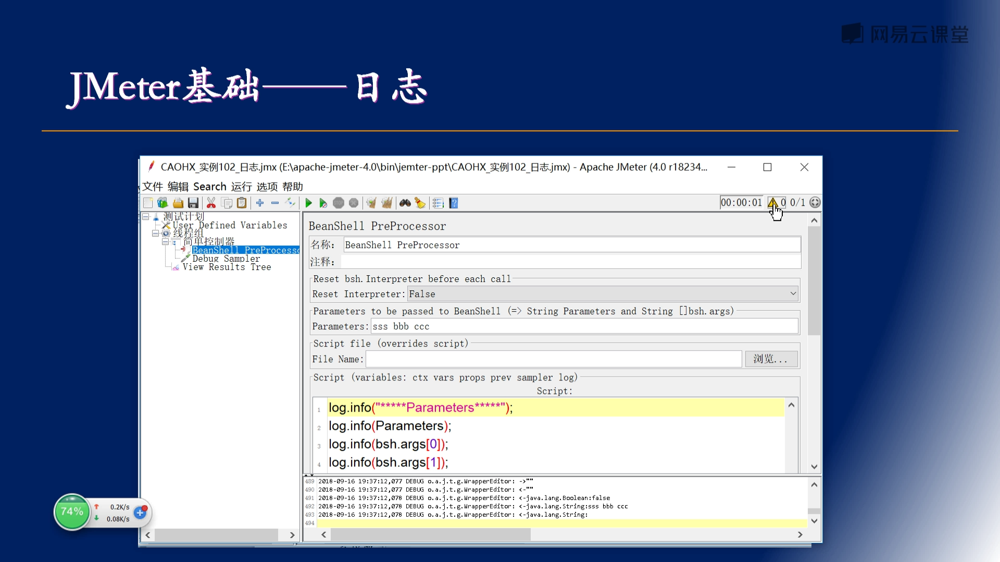

[[TOC]]

# JMeter

## 搜集
###  [Jmeter安装配置详细教程](https://blog.csdn.net/NoamaNelson/article/details/109118031)


```
3、Jmeter环境部署

变量名：JMETER_HOME
D:\tools\portable\apache-jmeter-5.5

在已有的CLASSPATH中添加如下内容：
CLASSPATH
;%JMETER_HOME%\lib\ext\ApacheJMeter_core.jar; %JMETER_HOME%\lib\jorphan.jar;

在系统变量path后面加上如下：
%JMETER_HOME%\bin

启动
C:\Users\User>jmeter
bin\jmeter.bat
```

#### 5、修改语言
##### 5.1、临时性设置
- 选择Options—>Choose Language—>选择其他语言（例如：Chinese（Simplified）简体中文）

### [chromedriver下载与安装方法，亲测可用](https://blog.csdn.net/zhoukeguai/article/details/113247342)
- http://chromedriver.storage.googleapis.com/index.html
	- http://chromedriver.storage.googleapis.com/index.html?path=108.0.5359.71/
		- http://chromedriver.storage.googleapis.com/108.0.5359.71/chromedriver_win32.zip


## JMETER性能测试快速入门
- https://chromedriver.chromium.org/downloads
- https://study.163.com/course/courseMain.htm?courseId=1005116030&share=1&shareId=1463550676 5.24.28
- F:\PersonalPromotion\Jmeter


1. CAOHX_实例61-定时器_固定定时器.jmx
```
GET http://www.ip138.com/sj/

GET data:


[no cookies]
```
### 缺失课件
- 11 性能测试_001.jmx
- 12 录制脚本001.jmx
- 27 jmeter件数.xls
#### 环境
- https://hub.docker.com/r/idoop/zentao
- [Docker部署禅道zentao](https://blog.csdn.net/m0_46243410/article/details/108353172)
- [docker 下安装禅道](https://blog.csdn.net/qq_20042935/article/details/106554497)


##### 禅道

```
1. 下载查到镜像
[root@Docker ~]# docker pull idoop/zentao

2. 运行镜像
[root@Docker ~]# mkdir -p /data/zbox && \
docker run -d -p 8183:80 -p 8184:3306 \
        -e ADMINER_USER="root" -e ADMINER_PASSWD="password" \
        -e BIND_ADDRESS="false" \
        -v /data/zbox/:/opt/zbox/ \
        --name zentao-server \
        idoop/zentao:latest

3.查看启动日志，可以看到启动成功：
[root@Docker ~]# docker logs -f zentao-server
Installing Zentao version: 17.6.1 ...
Adding password for user root
ZBOX是Apache、Mysql、PHP的精简的集成环境。使用时，需要将其解压到/opt目录。

/opt/zbox/zbox -h     可以获取帮助
/opt/zbox/zbox start  启动脚本

Mysql 用户名root，密码为123456。

更多可以访问http://www.zentao.net/goto.php?item=zbox.
Start Apache success
Start Mysql success

3.启动完成后，使用IP+端口访问（默认用户名：admin，密码：123456；数据库用户：root，默认密码：123456），浏览器访问：http://192.168.56.106:8183
Cd123456

```


### 章节1课程总体安排
#### 试看总体安排介绍03:03

### 章节2jmeter4.0 概述
#### 试看JMeter是干什么的？为什么要学习它？04:01

#### 试看JMeter性能测试的基本原理01:49

#### 课时4JMeter性能测试的基本流程01:40

#### [2.4]--课时5如何学习JMeter01:22

### 章节3JMeter的下载安装及部署
#### 课时6JDK8、JMeter、JMeter插件的安装以及Jmeter的界面语言设置
#### [3.2]--课时7JMeter及其插件的安装05:26


##### JMeter插件
1. PerfMon (Servers Performance Monitoring)
1. HTTP/2 Sampler(BlazeMeter - HTTP/2 Plugin) 
1. Dummy Sampler模拟取样器
#### [3.3]--JMeter的分布式部署03:36
#### [3.4]--课时9JMeter的目录结构04:18


1. bin 配置文件
    1. jmeter.properties 主要配置文件
    
    1. system.properties
    1. user.properties

2. bin 启动文件
    1. jmeter.bat windows下JMeter界面启动程序
    1. jmeter.sh linux下JMeter界面启动程序
    1. jmeter-n.cmd
    1. jmeter-server.bat


3. 插件库 lib\ext
#### [3.5]--课时10JMeter的主界面06:22
##### 菜单栏
- Options
	- Look and Feel 界面风格设置
		- Darklaf - Darcula
	- Choose Language 语言设置
		- English
		- Chinese(Simplified)
##### 工具条
1. Templates..
    - 
1. Toggle 禁用/启用测试元件
1. Clear 清除选定监听器下执行结果
1. Clear All 清除所有监听器里的执行结果
1. Step-by-step Debugger 单步调试
    - https://github.com/Blazemeter/jmeter-debugger
    - 安装插件 BlazeMeter Step-by-step Debugger
    - 
1. Search 搜索
1. Reset Search 清除搜索结果
1. Function Helper Dialog 函数助手对话框
    - 
    - ${__split("aa-bb-cc",var1,"-")}
1. Help
1. Elapsed time of current running Test 上次测试计划的执行时长
1. Show the number of errors in log, click to open Log Viewer panel 显示/关闭日志的显示 日志中错误数 
1. 已执行的线程数/总线程数

### 章节4第一个测试脚本
#### [4.1]--课时11第一个手工编写的测试计划20:03
#### [4.2]--课时12第一个录制的测试计划08:33
##### 脚本录制实操1


##### 脚本
- 性能测试_001_录制.jmx
- 性能测试_001_录制-www.ip138.com.jmx
### 章节5基础知识--12类测试元件及其作用域、执行顺序


#### [5.1]--课时13十二类元件概述02:16


- 十二类元件概述
    1. 测试计划 测试脚本的容器，其他元件都会包含在它当中
    1. 线程组 测试计划执行的入口，线程组的每个线程都独立运行测试脚本，一个线程相当于一个用户，通过多线程并发执行实现并发性能测试
    1. 逻辑控制器 指定它下面的取样器是如何发送请求以及这些取样器的执行顺序
    1. 取样器 完成JMeter实际工作，每一个取样器生成一个或多个取样结果
    1. 配置元件 可以修改请求
    1. 前置处理器 在取样器运行之前执行，主要目的是修改取样器或更新变量
    1. 后置处理器 在取样器运行之后执行，主要用于处理响应数据
    1. 定时器 设置请求之间的时间间隔
    1. 断言 对响应结果进行验证
    1. 监听器 可以监听、查看、保存测试结果
    1. 测试片段 辅助组件，它不会被执行
    1. 非测试元件 主要是完成脚本的录制或者辅助调试
#### [5.2]--课时14测试计划03:07
> 测试计划 测试脚本的容器，其他元件都会包含在它当中


1. 定义用户变量，是全局变量
	- 引用变量的方法：${变量名}
1. Run Thread Groups consecutively(i.e. one at a time) 
	- 独立运行每个线程组 【默认不勾选，标识各线程组间并行执行，勾选，则标识串行执行】
        - 
1. Run tearDown Thread Groups after shutdown of main threads
	- 勾选 主线程结束后执行tearDown线程组；如不勾选tearDown线程组是不会被执行的
1. Functional TestMode(i.e. save Response Data and Sampler Data)
	- 函数测试模式 【功能测试模式：取样器和响应结果会被保存，该模式可能对性能测试有影响】
1. 将目录或者jar添加到classpath
    - 

#### [5.3]--课时15线程组09:39
> 线程组 测试计划执行的入口，线程组的每个线程都独立运行测试脚本，一个线程相当于一个用户，通过多线程并发执行实现并发性能测试


- 指定取样器出错后，要采取的动作：
	1. 继续
	1. 启动下一个线程循环 本次循环结束，执行下一个线程循环
	1. 停止线程 虚拟用户执行出错之后，后边就不再执行了，也不再循环了
	1. 停止测试 所有正在执行的取样器，执行结束后，程序停止
	1. 立刻停止测试 所有的线程马上停止


#### [5.4]--课时16逻辑控制器05:15
> 逻辑控制器 指定它下面的取样器是如何发送请求以及这些取样器的执行顺序


##### 1. Simple Controller 简单控制器
- 只是一个容器，无其他作用


##### 2. If Controller 如果控制器
- 可以设置一个条件，当条件满足时，它下面的元件才会被执行


##### 3. Transaction Controller 事务控制器


##### 4. Loop Controller 循环控制器


##### 6. Interleave Controller 交替控制器
- Ignore sub-controller blocks 忽略子控制器块


#### [5.5]--课时17取样器15:11
> 取样器 完成JMeter实际工作，每一个取样器生成一个或多个取样结果


##### 1. HTTP Request


##### 2. jp@gc - Dummy Sampler


##### 3. Debug Sampler 提示取样器


##### 4. JDBC Request 


#### [5.6]--课时18配置元件16:30
> 配置元件 可以修改请求，或为请求做准备工作


##### 1. HTTP Request Default 请求默认值
- 和HTTP Request页面是一样的


##### 2. HTTP Cookie Manager 管理器
- 通常情况下只需要添加进去，不需要做额外的操作


##### 3. HTTP Cache Manager 管理器


##### 4. HTTP Authorization Manager 授权管理器


##### 5. User Defined Variables 用户定义的变量
- 和测试计划中用户定义的变量功能是一样的


##### 6. CSV Data Set Config 数据读取配置


##### 7. JDBC Connection Configuration 连接配置


#### [5.7]--课时19前置处理器13:40
> 前置处理器 在取样器运行之前执行，主要目的是修改取样器或更新变量


##### 1. User Parameters 用户参数


- 样例
	1. CAOHX_实例40-前置处理器_用户参数_simple.jmx


###### 每次迭代更新一次


- 样例
	2. CAOHX_实例40-前置处理器_用户参数.jmx


##### 2. BeanShell PreProcessor


- 样例
	- CAOHX_实例41-前置处理器_Beanshell前置处理器.jmx
	- CAOHX_实例41-前置处理器_Beanshell前置处理器作用域.jmx


	

#### [5.8]--课时20后置处理器27:22
> 后置处理器 在取样器运行之后执行，主要用于处理响应数据


##### 1. Regular Expression Extractor 正则表达式提取器


- 样例
	- CAOHX_实例51-后置处理器_正则表达式提取器.jmx


###### 正则表达式简介


##### 2. XPath Extractor XPath提取器
> chrome 开发者工具 复制XPath


- 样例
	- CAOHX_实例52-后置处理器xpath提取器ok.jmx


###### XPath基础知识


#### [5.9]--课时21定时器11:21
> 定时器 设置请求之间的时间间隔


##### 1. Constant Timer 固定定时器


##### 2. Uniform Random Timer 均匀随机定时器


##### 3. Gaussian Random Timer 高斯随机定时器


##### 4. Synchronizing Timer 同步定时器（集合时间）


##### 5. Constant Throughput Timer 固定吞吐率定时器
- 目标吞吐量 每秒4个请求
- 吞吐量的计算范围
    1. 这一个线程
    1. 所有活动线程（共享） 所有活动线程是排着队、均匀地向服务器发送请求
    
    
    
    
    - 线程组 1-1 每秒钟发送一次，4个线程每分钟发送240个请求
        
    - jp@gc - Transactions per Second 每秒事务数
        

#### [5.10]--课时22断言12:23
> 断言 对响应结果进行验证


##### 1. Response Assertion 响应断言
1. 匹配范围
    1. 主子取样器
    1. 主取样器
    1. 子取样器
    1. JMeter变量
2. 要测试的响应字段
    1. Ignore Status 
3. 模式匹配规则
    1. Contains 应用正则表达式 部分匹配
    1. Matches 应用正则表达式 全部匹配
    1. Equals 使用普通文本模式匹配 全部匹配
    1. Substring 使用普通文本模式匹配 部分匹配
    1. Not 否 取反 
    1. Or 
- 样例
    - CAOHX_实例74-断言_响应断言_Ignore status选项ok.jmx
    - CAOHX_实例72-断言_响应断言-选项含义.jmx


##### 2. XPath Assertion XPath断言
- 样例
    - CAOHX_实例75-断言_XPATH断言.jmx


##### 3. BeanShell Assertion BeanShell断言
- 样例
    - CAOHX_实例75-断言_Beanshell断言.jmx


#### [5.11]--课时23监听器15:07
> 监听器 可以监听、查看、保存测试结果


##### 1. View Results Tree 查看结果树


- CAOHX_实例90-监听器-察看结果树_保存响应到文件.jmx


##### 2. View Results in Table 用表格察看结果


- CAOHX_实例90-监听器-察看结果树_保存响应到文件.jmx


##### 3. Aggregate Report 聚合报告


- CAOHX_实例90-监听器-查看结果树-线程号ok.jmx


##### 4. Assertion Results 断言结果


- CAOHX_实例92-监听器-断言结果.jmx


##### 5. Save Responses to a file 保存响应到文件
> 通常用于功能测试


- CAOHX_实例90-监听器-保存响应到文件.jmx


##### 6. Transactions per Second 每秒事务数


- CAOHX_实例90-监听器-tps.jmx

##### 7. PerfMon Metrics Collector 服务器性能监控插件


- ServerAgent-2.2.3\
	1. startAgent.bat
	1. startAgent.sh
- CAOHX_实例94-监听器-PerfMon Metrics Collector.jmx


#### [5.12]--课时24非测试元件15:26
> 非测试元件 主要是完成脚本的录制或者辅助调试


##### HTTP(S) Test Script Recorder HTTP测试脚本录制器（代理服务器）


##### JMeter性能测试原理

##### JMeter录制原理

##### JMeter代理方式录制

##### 脚本录制实操2

1. 为测试计划添加控制管理器
	1. HTTP Cookie Manager
	1. HTTP Cache Manager
	1. HTTP Request Defaults
		- Server Name or IP: 测试网站的域名或IP cn.bing.com www.baidu.com
2. 为测试计划添加线程组 Thread Group
	1. 为线程组添加逻辑控制器用来保存录制的脚本 Recording Controller
		1. Recording Controller1
		1. Recording Controller2

3. 为测试计划添加非测试元件 HTTP(S) Test Script Recorder
	1. Port: 8888
	1. Target Controller: Test Plan > Thread Group > Recording Controller1
	1. Grouping: Put each group in a new controller 每一组放入一个新的控制器
	1. Start -> OK
4. 设置
	1. chrome 代理服务器 【验证 不启动代理验证，是否切换到代理服务器】
	1. JMeter证书 【重新安装后，无效的话重启浏览器】
5. 操作录制
	1. 刷新 https://cn.bing.com/ 
	1. 切换Target Controller， 搜索


###### 设置
- chrome
    1. chrome://settings/?search=proxy
        - 
    2. chrome://settings/security?search=Manage+device+certificates
        - 


##### 录HTTPs请求，安装JMeter根证书到浏览器
> 证书过期后，删除之前的证书，重新安装 重启浏览器


#### [5.13]--课时25测试元件的作用域和执行顺序11:29

##### 元件的作用域


##### 元件的执行顺序


##### 样例1


##### 样例2


### 章节6基础知识——变量、函数、属性和日志


#### [6.1]--课时26jmeter变量05:23

##### 变量定义方式1 用户定义变量

##### 变量定义方式2 用户参数

##### 变量定义方式3 脚本（如beanshell）或提取器等定义的变量


##### 变量定义方式4 CSV数据文件设置

##### 调试脚本时查看变量方式
1. Debug Sampler
2. Dummy Sampler
	- Response Data

##### CAOHX_实例100_变量.jmx


#### [6.2]--课时27jmeter函数05:15


#### [6.3]--课时28jmeter属性03:39
- apache-jmeter-X.X\bin
	- jmeter.properties
	- system.properties
	- user.properties


- CAOHX_实例100_变量.jmx


#### [6.4]--课时29jmeter日志01:19
- CAOHX_实例102_日志.jmx





### 章节7测试脚本的录制

#### [7.1]--课时30HTTP代理服务器的配置05:12
- 参见 [5.12]--课时24非测试元件15:26
##### JMeter代理方式录制
- 参见：HTTP(S) Test Script Recorder HTTP测试脚本录制器（代理服务器）
##### Badboy软件录制                              
#### [7.2]--课时31脚本录制的原理01:33
- 参见
	- JMeter性能测试原理
	- JMeter录制原理
#### [7.3]--课时32脚本录制实操05:55
- 参见 JMeter代理方式录制
#### [7.4]--课时33为HTTPS录制安装jmeter根证书到浏览器03:07
- 参见 录HTTPs请求，安装JMeter根证书到浏览器


### 章节8测试脚本的增强
#### [8.1]--课时34测试脚本增强概述05:28


#### [8.2]--课时35脚本增强—添加监听器07:16


- caohx_001.jmx
```
- 聚合报告
${__property(user.dir)}${__BeanShell(File.separator,)}result_${__time(yyyyMMdd-HHmmss)}.csv
- jp@gc - PerfMon Metrics Collector
${__property(user.dir)}${__BeanShell(File.separator,)}perfmon-result_${__time(yyyyMMdd-HHmmss)}.csv
```


#### [8.3]--课时36脚本增强—增加定时器05:10


- caohx_300_脚本增强_增加定时器.jmx


#### [8.4]--课时37脚本增强—增加断言10:01


- caohx_300_脚本增强_增强概述_禅道网站1.jmx


- 登录
- 响应文本中包含指定字符串 /zentao/bug-browse-1.html
	- 
	- 

-响应文本中没有出现指定字符串 登录失败，请检查您的用户名或密码是否填写正确
	- 

- 响应文本中包括（包含）正则表达式 admin，.*?好
	- 
	
- 我的地盘 我的任务数据检查
	- XPath Extractor提取我的任务数到 mytask_num 变量  默认提取XML文档，要提取html勾选Use Tidy、Quiet
		- 
	- mytask_num 变量的值等于0	
		- 

#### [8.5]--课时38脚本增强—参数化04:12

- caohx_002.jmx


#### [8.6]--课时39脚本增强—增加关联07:57


1. 提取plansn变量，然后使用


- caohx_300_脚本增强-增加关联_禅道.jmx


1. 提取变量
	1. XPath Extractor
	- 
	2. Boundary Extractor
	- 
	3. CSS/JQuery Extractor
	- 
	4. 使用变量 BeanShell PostProcessor，计算新的变量
	- 
2. 使用新的变量 


#### [8.7]--课时40脚本增强—增加事务03:50


- caohx_300_脚本增强-事务处理器.jmx


### 章节9测试脚本的执行
#### [9.1]--课时41测试脚本的执行07:12


##### GUI模式执行


- 工具条
    - Start
    - Start no Pauses

- 线程组右键
    - Start
    - Start no Pauses

##### 非GUI模式执行


##### 实操
- caohx_400_non_GUI_zentao.jmx


### 章节10测试脚本的结果分析
#### [10.1]--课时42测试脚本的结果分析16:33

### 章节11jmeter最佳实践
#### [11.1]--课时43jmeter最佳实践06:21

- caohx_600_best_practice_zentao-transaction.jmx
##### 1. 使用最新版本的jmeter
##### 2. 使用正确的线程数
##### 3. HTTP Cookie管理器放在合适的位置
##### 4. 使用HTTP（S）代理录制脚本


- 录制的脚本保存在指定的控制器里


- 录制过程中进行变量替换admin->${var1}


##### 5. 使用用户变量


##### 6. 减少资源需求
- 执行时禁用聚合报告、jp@gc-ResponseTimesOverTime、jp@gc-TransactionsperSecond，执行完后再查看


##### 7. 参数化脚本
- 执行时通过属性值把线程数threadnum、rampup启动时间传递过去


##### 8. 在不同线程组间共享变量
- 属性属于全局性的变量，属性作为线程间通讯的工具。还可以把值写入到文件，不同的线程取文件，进行线程间的信息交换


##### 9. 管理属性
- 修改jmeter属性时，不要修改bin/jmeter.properties中的属性值，将其拷贝到bin/user.properties进行修改


##### 10. 建议不适用不推荐的元素


### 章节12jmeter学习参考资料
#### 课时44jmeter学习参考资料
- [JMeter 官网](http://jmeter.apache.org/)
    - [下载](https://jmeter.apache.org/download_jmeter.cgi)
        - https://dlcdn.apache.org//jmeter/binaries/apache-jmeter-5.5.zip

- [Help](https://jmeter.apache.org/usermanual/component_reference.html)
    - [HTTP(S)_Test_Script_Recorder](https://jmeter.apache.org/usermanual/component_reference.html#HTTP(S)_Test_Script_Recorder)

- [JMeter 入门链接](http://jmeter.apache.org/usermanual/get-started.html)

- [JMeter 的 FAQ 链接](https://wiki.apache.org/jmeter/JMeterFAQ)
- CSDN 博客：https://blog.csdn.net/caohongxing
    - https://so.csdn.net/so/search?q=jmeter&t=blog&u=caohongxing
- [英文视频资料](https://academy.blazemeter.com/courses/an-introduction-to-jmeter/)


### 问题汇总
#### [Jmeter响应内容显示乱码问题的解决办法](https://www.cnblogs.com/xiaxiaoxu/p/9607017.html)
- 方法一：改配置文件 apache-jmeter-5.5\bin\jmeter.properties
```
#sampleresult.default.encoding=ISO-8859-1
sampleresult.default.encoding=utf-8
```
- 方法二：通过后置处理器BeanShell PostProcessor
```
prev.setDataEncoding("utf-8");
```

# 下载器
- https://www.xuewuzhi.cn/study163_downloader
- https://www.xuewuzhi.cn/downloader
    - Setup-学无止下载器-v2.1.6(稳定)-Win.exe

```
        =========================================================================================
        |                               学无止下载器(V2.1.6稳定版)                              |
        -----------------------------------------------------------------------------------------
        |  支持网站: |  慕课网,中国大学,网易云课堂,有道精品课,超星学习通,智慧树,爱课程,学堂在线 |
        |  程序说明: |  除以上八个网站外还支持优酷,抖音,腾讯,爱奇艺,微博视频,好看视频,芒果TV    |
        |  用户说明: |  普通:限速1M/s; VIP:无限速下载; SVIP:无限速且可下载账号中已购买的付费课程|
        |  功能说明: |  1.会员关联微信,可换电脑登录; 2.支持断点续下,重开软件会跳过已下载文件    |
        |  功能说明: |  3.充值会员,邀请活动,更改路径等功能,请在首页输入“m”回车进入菜单栏选择  |
        |  免费福利: |  微信搜索公共号并关注 “学无止科技” ,参与活动可免费领取会员！           |
        |  邀请活动: |  将邀请码分享给好友,对方在软件内激活后,双方均可获得1天SVIP时长！         |
        |  最新公告: |  网赚项目每人可赚取2-4万，具体流程关注微信公共号“学无止科技”联系客服！
        -----------------------------------------------------------------------------------------
        |  用户ID: 860282 | 用户昵称: TosinJia    | 用户级别: 普通用户  | 到期时间: 无          |
        -----------------------------------------------------------------------------------------
        |   我的邀请码:   |     37849961          |   已邀请人数:       |         0人           |
        =========================================================================================
           下载路径:    F:\LEL\LEL-Downloader\Download

输入一个视频课程网址并按回车(输入“q”关闭退出, 输入“m”进入菜单, 输入“h”查看帮助):
https://study.163.com/course/courseLearn.htm?courseId=1005116030&share=1&shareId=1463550676#/learn/video?lessonId=1053263365&courseId=1005116030
提示：如果未在软件内登录课程账号无权限下载已购买的付费课程！
您未登录，是否在软件内登录网易云课程(SVIP专属功能)[输入“y”或“n”,或者回车跳过]: y
登录失败！当前非SVIP用户,不支持登录课程账号下载已购买的付费课程,请升级为下载器SVIP后继续...
请输入一个0-4的数选择性下载内容
[(1):超清mp4+课件, 2:高清mp4+课件, 3:标清mp4+课件, 4:仅下载课件] [0退出]:

```
# JMeter源码
- https://github.com/apache/jmeter
    - https://github.com/TosinJia/jmeter
- https://archive.apache.org/dist/jmeter/
    - https://archive.apache.org/dist/jmeter/binaries/
    - https://archive.apache.org/dist/jmeter/source/

## TosinJia/jmeter
### Gradle配置
### 本地环境搭建

#### 代码下载
- git@github.com:apache/jmeter.git
```
F:\PersonalPromotion\Jmeter\source>git clone git@github.com:apache/jmeter.git
Cloning into 'jmeter'...
remote: Enumerating objects: 220007, done.
remote: Counting objects: 100% (726/726), done.
remote: Compressing objects: 100% (453/453), done.
remote: Total 220007 (delta 140), reused 664 (delta 110), pack-reused 219281 eceiving objects: 100% (220007/220007), 88.Receiving objects: 100% (220007/220007), 89.45 MiB | 2.12 MiB/s, done.

Resolving deltas: 100% (118192/118192), done.
Updating files: 100% (3555/3555), done.

F:\PersonalPromotion\Jmeter\source>cd jmeter

F:\PersonalPromotion\Jmeter\source\jmeter>git branch -a
* master
  remotes/origin/HEAD -> origin/master
  remotes/origin/bug_64553
  remotes/origin/fix-CVE-2021-44228
  remotes/origin/fix-CVE-2021-45105
  remotes/origin/fix_64581
  remotes/origin/master
F:\PersonalPromotion\Jmeter\source\jmeter>git tag
rel/v5.2
rel/v5.2.1
rel/v5.3
rel/v5.4
rel/v5.4.1
rel/v5.4.2
rel/v5.4.3
rel/v5.5
v1_7_1
```
- git@github.com:TosinJia/jmeter.git
```
F:\PersonalPromotion\Jmeter\source>git clone git@github.com:TosinJia/jmeter.git
```
#### 开发环境搭建
1. File->Open...->Open File or Project jmeter
    1. Trust Project
    1. Settings 
        - Maven
        - Gradle
            1. Gradle user home: E:\iEnviroment\development\gradle\repository
            1. Use Gradle from: Specified location E:\iEnviroment\development\gradle\gradle-7.6
            1. Gradle JVM: 1.8 version 1.8.0_202
        - OK
1. Project Structure... -> Project SDK: 1.8 version 1.8.0_202

1. Gradle window
	1. Unlick Gradle Project Delete
	1. Load Gradle Project

1. Gradle window
    - jmeter
        1. -> Tasks -> build -> clean
        1. -> development -> runGui
    - Execute Gradle Task 
        1. gradle clean
        1. gradle runGui

### 开发环境联调
#### 配置
- F:\PersonalPromotion\Jmeter\source\TosinJia_jmeter\bin\jmeter.properties
```
#Preferred GUI language. Comment out to use the JVM default locale's language.
language=en
```
#### 插件
- lib/ext/jmeter-plugins-manager-1.8.jar
#### backups 自动生成
- apache-jmeter-5.4.1\backups\性能测试_001_录制-www.ip138.com-000001.jmx

#### BeanShell PreProcessor
- org.apache.jmeter.util.JSR223TestElement#populateBindings
- org.apache.jmeter.modifiers.BeanShellPreProcessor extends org.apache.jmeter.util.BeanShellTestElement
    - org.apache.jmeter.modifiers.BeanShellPreProcessor#process
        1. org.apache.jmeter.util.BeanShellTestElement#getBeanShellInterpreter
        1. org.apache.jmeter.util.BeanShellTestElement#processFileOrScript

## 5.4.1
- [以Jmeter源码方式在idea中运行Jmeter界面(Jmeter最新版本5.4.1)最全趟坑指南](https://blog.csdn.net/ttt_12345/article/details/119613745)

### 环境配置
#### Gradle配置


### 本地搭建
1. 解压 https://archive.apache.org/dist/jmeter/source/apache-jmeter-5.4.1_src.zip 
1. File->Open...->Open File or Project F:\PersonalPromotion\Jmeter\source\apache-jmeter-5.4.1
    1. Trust Project
    1. Settings 
        - Maven
        - Gradle
            1. Gradle user home: E:\iEnviroment\development\gradle\repository
            1. Use Gradle from: Specified location E:\iEnviroment\development\gradle\gradle-7.6
            1. Gradle JVM: 1.8 version 1.8.0_202
        - OK

1. Project Structure... -> Project SDK: 1.8 version 1.8.0_202

1. Gradle
	1. Unlick Gradle Project Delete
	1. Load Gradle Project
1. 此时也会自动进行依赖加载，如果觉得依赖加载比较慢，将maven仓库改为阿里云的地址
```
- settings.gradle.kts文件中121，添加
    repositories {
        maven("http://maven.aliyun.com/repository/gradle-plugin")
        gradlePluginPortal()
    }
	
- build.gradle.kts文件中276行
    repositories {
        // RAT and Autostyle dependencies
        maven("http://maven.aliyun.com/repository/central")
        mavenCentral()
    }
- build.gradle.kts文件中501行
        repositories {
            maven("http://maven.aliyun.com/repository/public")
            jcenter()
        }
```
1. 异常
```
Caused by: java.io.FileNotFoundException: E:\iEnviroment\development\gradle\gradle-7.1.1\caches\transforms-2\files-2.1\66995dac4f35e82e41eaa05cb13d5314\unzipped-distribution\gradle-6.7\subprojects\configuration-cache\src\main\kotlin (�ܾ����ʡ�)
```


1. Gradle window
    - jmeter
        1. -> Tasks -> build -> clean
        1. -> development -> runGui
    - Execute Gradle Task 


# Gradle 教程

- [Gradle 教程](https://www.w3cschool.cn/gradle/)

- [gradle本地仓库设置](https://blog.csdn.net/weixin_38491225/article/details/111666399)
- [Gradle安装和使用maven仓库配置](https://blog.csdn.net/rao991207823/article/details/110952583)
- [Gradle的配置与简单使用](https://developer.aliyun.com/article/1086291)


## Gradle配置
- 系统变量配置
```
GRADLE_HOME E:\iEnviroment\development\gradle\gradle-7.6
Path %GRADLE_HOME%\bin
GRADLE_USER_HOME E:\iEnviroment\development\gradle\repository
```
- 验证测试
```
C:\Users\User>gradle -v

------------------------------------------------------------
Gradle 7.6
------------------------------------------------------------

Build time:   2022-11-25 13:35:10 UTC
Revision:     daece9dbc5b79370cc8e4fd6fe4b2cd400e150a8

Kotlin:       1.7.10
Groovy:       3.0.13
Ant:          Apache Ant(TM) version 1.10.11 compiled on July 10 2021
JVM:          1.8.0_05 (Oracle Corporation 25.5-b02)
OS:           Windows 8.1 6.3 x86
```
- 全局配置 E:\iEnviroment\development\gradle\gradle-7.6\init.d\init.gradle
```
allprojects {
    repositories {
        maven { url 'file:///E:/iEnviroment/development/gradle/repository'}
        mavenLocal()
        maven{ name "Alibaba" ; url 'http://maven.aliyun.com/repository/gradle-plugin' }
        gradlePluginPortal()
        maven { name "Alibaba" ; url "https://maven.aliyun.com/repository/public" }
        maven { name "Bstek" ; url "http://nexus.bsdn.org/content/groups/public/" }
        mavenCentral()
		maven{ name "Alibaba" ; url 'http://maven.aliyun.com/repository/public' }
		jcenter()
		google()
    }

    buildscript { 
        repositories { 
            maven { name "Alibaba" ; url 'https://maven.aliyun.com/repository/public' }
            maven { name "Bstek" ; url 'http://nexus.bsdn.org/content/groups/public/' }
            maven { name "M2" ; url 'https://plugins.gradle.org/m2/' }
        }
    }
}
```
