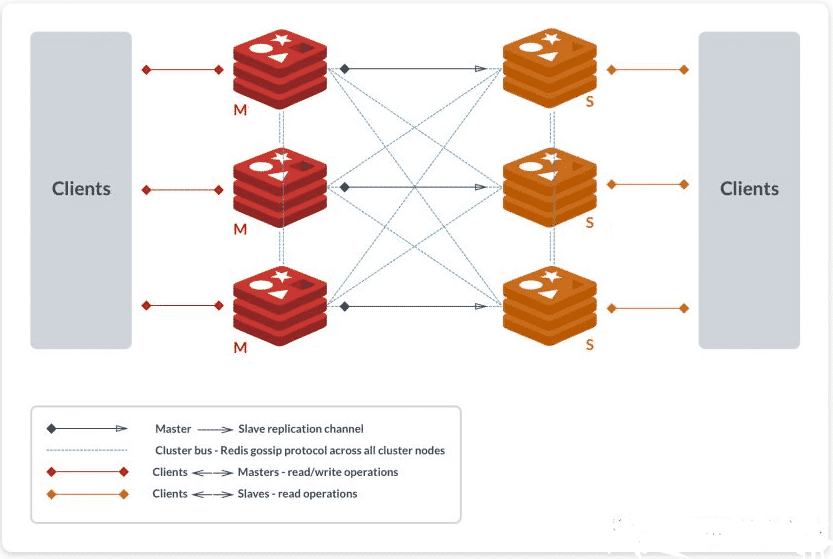
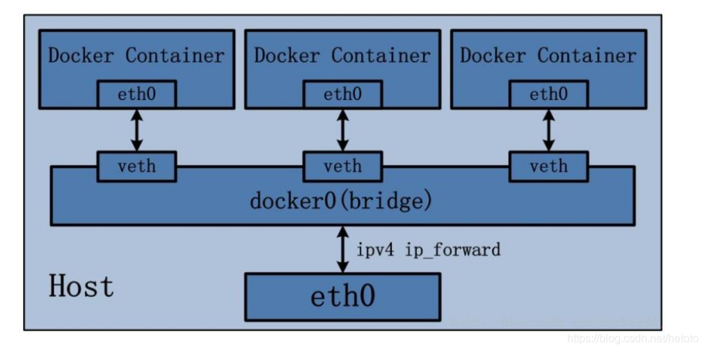
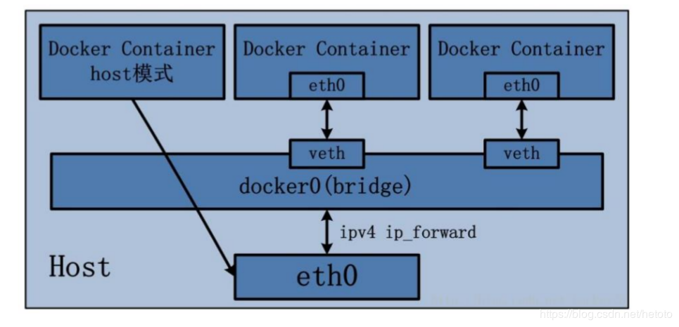
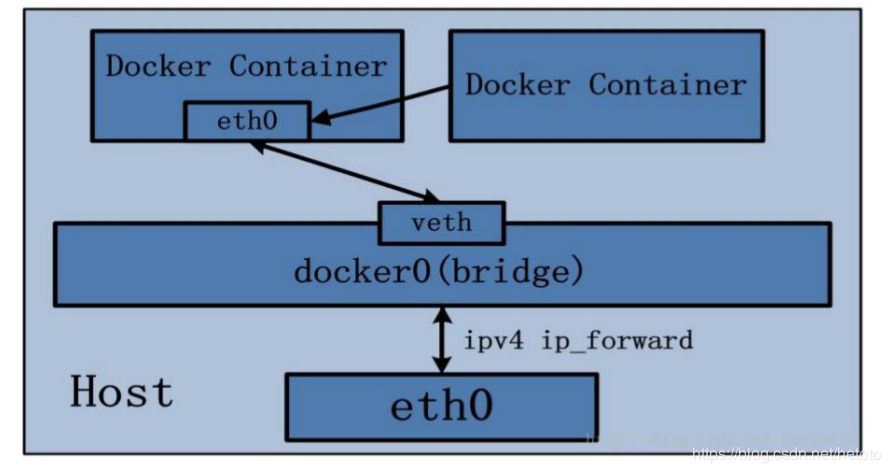

# Docker
[[TOC]]
## 参考
- https://www.docker.com/
    - https://docs.docker.com/
        - [docker (base command)](https://docs.docker.com/engine/reference/commandline/docker/)
        - https://docs.docker.com/engine/reference/commandline/cli/
        - https://docs.docker.com/engine/reference/commandline/run/
        - [docker update](https://docs.docker.com/engine/reference/commandline/update/)
- Docker Hub
		- https://docs.docker.com/reference/

- [Docker Hub](https://hub.docker.com/)
	- https://hub.docker.com/\_/centos
	- https://hub.docker.com/\_/nginx
	- https://hub.docker.com/\_/redis
	- https://hub.docker.com/\_/tomcat
	- https://hub.docker.com/\_/mysql
	- 云笔记
    	- https://hub.docker.com/r/wiznote/wizserver
    	- https://hub.docker.com/r/leanote/leanote

- 中文参考
    - http://www.runoob.com/docker/docker-command-manual.html
- Docker Toolbox
    - https://www.docker.com/products/docker-toolbox

## Docker Toolbox
    C:\Users\TosinJia\.docker\machine\cache

## 常用命令及参数
    docker -v
### docker 镜像命令
#### 检索
    docker search 镜像名
#### 下载
    docker pull 镜像名
#### 列表
    docker images
#### 删除
    docker rmi image-id
    docker rmi $(docker images -q)

### docker 容器命令
#### 基本操作
    docker run --name container-name -d image-name
#### 列表
    docker ps
	-a
```
docker -H tcp://172.16.88.80:2376 ps

```
#### 停止、启动
    docker stop container-name/conainer-id
    docker start container-name/conainer-id
#### 端口映射	-p
    docker run -d -p 6378:6379 --name port-redis redis
#### 删除
    docker rm container-id
    docker rm $(docker ps -a -q)
#### 日志
    docker logs container-name/conainer-id
```
[root@localhost yy-frame-java]# docker logs -f -t --since="2021-11-25" --tail=10 yy-frame-java
```
#### 登录
    docker exec -it container-name/conainer-id bash


## demo
### 安装docker
#### CentOS7使用阿里yum源安装Docker
```
# 1. 安装环境
## 1.1 查看CentOS版本
[root@etc ~]# cat /etc/os-release 
NAME="CentOS Linux"
VERSION="7 (Core)"
ID="centos"
ID_LIKE="rhel fedora"
VERSION_ID="7"
PRETTY_NAME="CentOS Linux 7 (Core)"
ANSI_COLOR="0;31"
CPE_NAME="cpe:/o:centos:centos:7"
HOME_URL="https://www.centos.org/"
BUG_REPORT_URL="https://bugs.centos.org/"

CENTOS_MANTISBT_PROJECT="CentOS-7"
CENTOS_MANTISBT_PROJECT_VERSION="7"
REDHAT_SUPPORT_PRODUCT="centos"
REDHAT_SUPPORT_PRODUCT_VERSION="7"
## 1.2. CentOS 7安装docker要求系统为64位、系统内核版本为 3.10 以上
[root@etc ~]# uname -r
3.10.0-1160.el7.x86_64
# 2. yum安装
## 2.1 查看是否已安装docker列表
[root@etc ~]# yum list installed | grep docker
Repodata is over 2 weeks old. Install yum-cron? Or run: yum makecache fast
# step 1: 安装必要的一些系统工具
[root@etc ~]# yum install -y yum-utils device-mapper-persistent-data lvm2
# Step 2: 添加软件源信息 阿里yum源
[root@etc ~]# yum-config-manager --add-repo http://mirrors.aliyun.com/docker-ce/linux/centos/docker-ce.repo
Loaded plugins: fastestmirror
adding repo from: http://mirrors.aliyun.com/docker-ce/linux/centos/docker-ce.repo
grabbing file http://mirrors.aliyun.com/docker-ce/linux/centos/docker-ce.repo to /etc/yum.repos.d/docker-ce.repo
repo saved to /etc/yum.repos.d/docker-ce.repo
# Step 3: 更新并安装 Docker-CE
# 把服务器的包信息下载到本地缓存起来
[root@etc ~]# yum makecache fast
Loaded plugins: fastestmirror
Loading mirror speeds from cached hostfile
 * base: mirrors.163.com
 * extras: mirrors.aliyun.com
 * updates: mirror.lzu.edu.cn
base                                                                                                                | 3.6 kB  00:00:00     
docker-ce-stable                                                                                                    | 3.5 kB  00:00:00     
extras                                                                                                              | 2.9 kB  00:00:00     
updates                                                                                                             | 2.9 kB  00:00:00     
(1/2): docker-ce-stable/7/x86_64/primary_db                                                                         |  63 kB  00:00:00     
(2/2): docker-ce-stable/7/x86_64/updateinfo                                                                         |   55 B  00:00:00     
Metadata Cache Created
# 安装最新版本的Docker CE（社区版）
[root@etc ~]# yum -y install docker-ce

# Step 4: 开启Docker服务
[root@etc ~]# service docker start
Redirecting to /bin/systemctl start docker.service
# 设置开机启动
[root@etc ~]# chkconfig docker on
Note: Forwarding request to 'systemctl enable docker.service'.
Created symlink from /etc/systemd/system/multi-user.target.wants/docker.service to /usr/lib/systemd/system/docker.service.
[root@etc ~]# service docker status
Redirecting to /bin/systemctl status docker.service
● docker.service - Docker Application Container Engine
   Loaded: loaded (/usr/lib/systemd/system/docker.service; enabled; vendor preset: disabled)
   Active: active (running) since Thu 2021-09-30 22:13:17 CST; 8min ago
     Docs: https://docs.docker.com
 Main PID: 1654 (dockerd)
   CGroup: /system.slice/docker.service
           └─1654 /usr/bin/dockerd -H fd:// --containerd=/run/containerd/containerd.sock

Sep 30 22:13:15 etc dockerd[1654]: time="2021-09-30T22:13:15.729088409+08:00" level=info msg="scheme \"unix\" not registered, fa...ule=grpc
Sep 30 22:13:15 etc dockerd[1654]: time="2021-09-30T22:13:15.729107841+08:00" level=info msg="ccResolverWrapper: sending update ...ule=grpc
Sep 30 22:13:15 etc dockerd[1654]: time="2021-09-30T22:13:15.729117462+08:00" level=info msg="ClientConn switching balancer to \...ule=grpc
Sep 30 22:13:15 etc dockerd[1654]: time="2021-09-30T22:13:15.925794568+08:00" level=info msg="Loading containers: start."
Sep 30 22:13:16 etc dockerd[1654]: time="2021-09-30T22:13:16.261949927+08:00" level=info msg="Default bridge (docker0) is assign...address"
Sep 30 22:13:16 etc dockerd[1654]: time="2021-09-30T22:13:16.583209008+08:00" level=info msg="Loading containers: done."
Sep 30 22:13:17 etc dockerd[1654]: time="2021-09-30T22:13:17.224288589+08:00" level=info msg="Docker daemon" commit=75249d8 grap...=20.10.8
Sep 30 22:13:17 etc dockerd[1654]: time="2021-09-30T22:13:17.315505234+08:00" level=info msg="Daemon has completed initialization"
Sep 30 22:13:17 etc systemd[1]: Started Docker Application Container Engine.
Sep 30 22:13:17 etc dockerd[1654]: time="2021-09-30T22:13:17.659581210+08:00" level=info msg="API listen on /var/run/docker.sock"
Hint: Some lines were ellipsized, use -l to show in full.
# 配置镜像加速器
[root@etc ~]# ll /etc/docker/
total 4
-rw-------. 1 root root 244 Sep 30 22:13 key.json
[root@etc ~]# tee /etc/docker/daemon.json <<-'EOF'
> {
>   "registry-mirrors": ["https://gwvjjhq5.mirror.aliyuncs.com"]
> }
> EOF
{
  "registry-mirrors": ["https://gwvjjhq5.mirror.aliyuncs.com"]
}
[root@etc ~]# cat /etc/docker/daemon.json 
{
  "registry-mirrors": ["https://gwvjjhq5.mirror.aliyuncs.com"]
}
[root@etc ~]# systemctl daemon-reload
[root@etc ~]# systemctl restart docker

# 3. 安装验证
## 查看docker版本信息 有Client和Server两部分表示docker安装启动都成功了
[root@etc ~]# docker version
Client: Docker Engine - Community
 Version:           20.10.8
 API version:       1.41
 Go version:        go1.16.6
 Git commit:        3967b7d
 Built:             Fri Jul 30 19:55:49 2021
 OS/Arch:           linux/amd64
 Context:           default
 Experimental:      true

Server: Docker Engine - Community
 Engine:
  Version:          20.10.8
  API version:      1.41 (minimum version 1.12)
  Go version:       go1.16.6
  Git commit:       75249d8
  Built:            Fri Jul 30 19:54:13 2021
  OS/Arch:          linux/amd64
  Experimental:     false
 containerd:
  Version:          1.4.9
  GitCommit:        e25210fe30a0a703442421b0f60afac609f950a3
 runc:
  Version:          1.0.1
  GitCommit:        v1.0.1-0-g4144b63
 docker-init:
  Version:          0.19.0
  GitCommit:        de40ad0
## 查看docker版本
[root@etc ~]# docker --version
Docker version 20.10.8, build 3967b7d

[root@etc ~]# yum list installed | grep docker
containerd.io.x86_64                 1.4.9-3.1.el7                  @docker-ce-stable
docker-ce.x86_64                     3:20.10.8-3.el7                @docker-ce-stable
docker-ce-cli.x86_64                 1:20.10.8-3.el7                @docker-ce-stable
docker-ce-rootless-extras.x86_64     20.10.8-3.el7                  @docker-ce-stable
docker-scan-plugin.x86_64            0.8.0-3.el7                    @docker-ce-stable

## 通过运行hello-world镜像验证安装是否正确
[root@etc ~]# docker run hello-world
Unable to find image 'hello-world:latest' locally
latest: Pulling from library/hello-world
2db29710123e: Pull complete 
Digest: sha256:393b81f0ea5a98a7335d7ad44be96fe76ca8eb2eaa76950eb8c989ebf2b78ec0
Status: Downloaded newer image for hello-world:latest

Hello from Docker!
This message shows that your installation appears to be working correctly.

To generate this message, Docker took the following steps:
 1. The Docker client contacted the Docker daemon.
 2. The Docker daemon pulled the "hello-world" image from the Docker Hub.
    (amd64)
 3. The Docker daemon created a new container from that image which runs the
    executable that produces the output you are currently reading.
 4. The Docker daemon streamed that output to the Docker client, which sent it
    to your terminal.

To try something more ambitious, you can run an Ubuntu container with:
 $ docker run -it ubuntu bash

Share images, automate workflows, and more with a free Docker ID:
 https://hub.docker.com/

For more examples and ideas, visit:
 https://docs.docker.com/get-started/

[root@etc ~]# docker images hello-world
### 来自于哪个仓库	标签（镜像的发行版本）		ID（唯一）	创建时间	大小
REPOSITORY    TAG       IMAGE ID       CREATED      SIZE
hello-world   latest    feb5d9fea6a5   6 days ago   13.3kB

# 4. 彻底卸载
yum remove docker docker-common docker-selinux docker-engine
```
- [linux 安装docker](https://www.cnblogs.com/kingsonfu/p/11576797.html)
- [CentOS7使用阿里yum源安装Docker](https://www.cnblogs.com/yjlch1016/p/8969751.html)
- [阿里云容器镜像服务](https://cr.console.aliyun.com/cn-hangzhou/instances/mirrors)
	- https://developer.aliyun.com/article/110806

### oracle
    docker run -d -p 9090:8080 -p 1521:1521 --name ioracle wnameless/oracle-xe-11g
> - vm端口转发规则
> - oracle TCP 0.0.0.0 1521  1521
### mysql
    docker run -p 3306:3306 --name imysql5.6 -e MYSQL_ROOT_PASSWORD=root -d mysql:5.6


## Docker入门到精通

- [2021最新Docker入门到精通视频](https://www.bilibili.com/video/BV1844y167D1)
- [笔记](https://www.cnblogs.com/mrhelloworld/tag/Docker/)


### Docker Swarm 集群环境搭建及弹性服务部署
- [Docker Swarm 集群环境搭建及弹性服务部署](https://www.cnblogs.com/mrhelloworld/p/docker16.html)

#### 参考资料
- https://docs.docker.com/engine/swarm/swarm-tutorial/
- https://docs.docker.com/engine/swarm/swarm-mode/
- https://docs.docker.com/engine/swarm/how-swarm-mode-works/pki/
- https://docs.docker.com/engine/swarm/join-nodes/
- https://docs.docker.com/engine/swarm/swarm-tutorial/rolling-update/
### Docker Swarm 集群管理利器核心概念扫盲
- [Docker Swarm 集群管理利器核心概念扫盲](https://www.cnblogs.com/mrhelloworld/p/docker15.html)

#### 1.0 Swarm 简介
- Docker Swarm 和 Docker Compose 一样，都是 Docker 官方容器编排工具，但不同的是，**Docker Compose 是一个在单个服务器或主机上创建多个容器的工具**，而 **Docker Swarm 则可以在多个服务器或主机上创建容器集群服务**，对于微服务的部署，显然 Docker Swarm 会更加适合。
#### 2.0 Swarm 核心概念
##### Swarm
- Docker Engine 1.12 引入了 Swarm 模式，一个 Swarm 由多个 Docker 主机组成，它们以 Swarm 集群模式运行。Swarm 集群由 **Manager 节点**（管理者角色，管理成员和委托任务）和 **Worker 节点**（工作者角色，运行 Swarm 服务）组成。这些 Docker 主机有些是 Manager 节点，有些是 Worker 节点，或者同时扮演这两种角色。

- Swarm 创建服务时，需要指定要使用的镜像、在运行的容器中执行的命令、定义其副本的数量、可用的网络和数据卷、将服务公开给外部的端口等等。与独立容器相比，群集服务的主要优势之一是，你可以修改服务的配置，包括它所连接的网络和数据卷等，而不需要手动重启服务。还有就是，如果一个 Worker Node 不可用了，Docker 会调度不可用 Node 的 Task 任务到其他 Nodes 上。

#### 参考资料
- https://docs.docker.com/engine/swarm/
- https://docs.docker.com/engine/swarm/key-concepts/
- https://docs.docker.com/engine/swarm/ swarm-tutorial/
- https://docs.docker.com/engine/swarm/how-swarm-mode-works/nodes/
- https://docs.docker.com/engine/swarm/how-swarm-mode-works/services/

### Docker Compose 搭建 Redis Cluster 集群环境
- [Docker Compose 搭建 Redis Cluster 集群环境](https://www.cnblogs.com/mrhelloworld/p/docker14.html)

- 在前文《Docker 搭建 Redis Cluster 集群环境》中我已经教过大家如何搭建了，本文使用 Docker Compose 再带大家搭建一遍，其目的主要是为了让大家感受 Docker Compose 所带来的便捷之处。

- 按照 Redis 官网：[https://redis.io/topics/cluster-tutorial](https://redis.io/topics/cluster-tutorial) 的提示，为了使 Docker 与 Redis Cluster 兼容，您需要使用 Docker 的 ```host``` 网络模式。
    - https://redis.io/docs/manual/scaling/#redis-cluster-and-docker

- ```host``` 网络模式需要在创建容器时通过参数 ```--net host``` 或者 ```--network host``` 指定，```host``` 网络模式可以让```容器共享宿主机网络栈```，容器将不会虚拟出自己的网卡，配置自己的 IP 等，而是使用宿主机的 IP 和端口。

- 关于 Docker 网络模式更多的内容请阅读《Docker 网络模式详解及容器间网络通信》。

#### 1.0  环境
- 同 《Docker 搭建 Redis Cluster 集群环境》
#### 2.0  搭建
- 整体搭建步骤主要分为以下几步：
    1. 下载 Redis 镜像（其实这步可以省略，因为创建容器时，如果本地镜像不存在，就会去远程拉取）；
    1. 编写 Redis 配置文件；
    1. 编写 Docker Compose 模板文件；
    1. 创建并启动所有服务容器；
    1. 创建 Redis Cluster 集群。

##### 2.1  编写 Redis 配置文件
###### 创建目录及文件
- 分别在 192.168.56.106 和 192.168.56.107 两台机器上执行以下操作。
```
# 创建目录
[root@ ~]# mkdir -p /usr/local/docker-redis/redis-cluster
# 切换至指定目录
[root@ ~]# cd /usr/local/docker-redis/redis-cluster
# 编写 redis-cluster.tmpl 文件
[root@ redis-cluster]# touch redis-cluster.tmpl
```
###### 编写配置文件
- 192.168.56.106(192.168.56.107) 机器的 redis-cluster.tmpl 文件内容如下：
```
port ${PORT}
requirepass 1234
masterauth 1234
protected-mode no
daemonize no
appendonly yes
cluster-enabled yes
cluster-config-file nodes.conf
cluster-node-timeout 15000
cluster-announce-ip 192.168.56.xxx
cluster-announce-port ${PORT}
cluster-announce-bus-port 1${PORT}
```

- ```port```：节点端口；
- ```requirepass```：添加访问认证；
- ```masterauth```：如果主节点开启了访问认证，从节点访问主节点需要认证；
- ```protected-mode```：保护模式，默认值 yes，即开启。开启保护模式以后，需配置 bind ip 或者设置访问密码；关闭保护模式，外部网络可以直接访问；
- ```daemonize```：是否以守护线程的方式启动（后台启动），默认 no；
- ```appendonly```：是否开启 AOF 持久化模式，默认 no；
- ```cluster-enabled```：是否开启集群模式，默认 no；
- ```cluster-config-file```：集群节点信息文件；
- ```cluster-node-timeout```：集群节点连接超时时间；
- ```cluster-announce-ip```：集群节点 IP，填写宿主机的 IP；
- ```cluster-announce-port```：集群节点映射端口；
- ```cluster-announce-bus-port```：集群节点总线端口。

> 每个 Redis 集群节点都需要打开两个 TCP 连接。一个用于为客户端提供服务的正常 Redis TCP 端口，例如 6379。还有一个基于 6379 端口加 10000 的端口，比如 16379。

> 第二个端口用于集群总线，这是一个使用二进制协议的节点到节点通信通道。节点使用集群总线进行故障检测、配置更新、故障转移授权等等。客户端永远不要尝试与集群总线端口通信，与正常的 Redis 命令端口通信即可，但是请确保防火墙中的这两个端口都已经打开，否则 Redis 集群节点将无法通信。

- 在 ```192.168.56.106``` 机器的 ```redis-cluster``` 目录下执行以下命令：
```
for port in `seq 6371 6373`; do
  echo "port is $port .";
  mkdir -p ${port}/conf && PORT=${port} envsubst < redis-cluster.tmpl > ${port}/conf/redis.conf && mkdir -p ${port}/data;
done
```
- 在 ```192.168.56.107``` 机器的 ```redis-cluster``` 目录下执行以下命令：
```
for port in `seq 6374 6376`; do \
  echo "port is $port .";\
  mkdir -p ${port}/conf \
  && PORT=${port} envsubst < redis-cluster.tmpl > ${port}/conf/redis.conf \
  && mkdir -p ${port}/data; \
done
```
> 上面两段 shell for 语句，意思就是循环创建 6371 ~ 6376 相关的目录及文件。

- 在 192.168.56.106(192.168.56.107)  机器执行查看命令结果如下：
```
[root@Docker redis-cluster]# tree /usr/local/docker-redis/redis-cluster
/usr/local/docker-redis/redis-cluster
├── 6371
│   ├── conf
│   │   └── redis.conf
│   └── data
├── 6372
│   ├── conf
│   │   └── redis.conf
│   └── data
├── 6373
│   ├── conf
│   │   └── redis.conf
│   └── data
└── redis-cluster.tmpl

9 directories, 4 files
# 每个节点的配置文件详细信息。
# [root@Docker redis-cluster]# cat /usr/local/docker-redis/redis-cluster/637[1-3]/conf/redis.conf  
[root@Docker redis-cluster]# cat /usr/local/docker-redis/redis-cluster/637{1..3}/conf/redis.conf
port 6371
requirepass 1234
masterauth 1234
protected-mode no
daemonize no
appendonly yes
cluster-enabled yes
cluster-config-file nodes.conf
cluster-node-timeout 15000
cluster-announce-ip 192.168.56.106
cluster-announce-port 6371
cluster-announce-bus-port 16371
port 6372
requirepass 1234
masterauth 1234
protected-mode no
daemonize no
appendonly yes
cluster-enabled yes
cluster-config-file nodes.conf
cluster-node-timeout 15000
cluster-announce-ip 192.168.56.106
cluster-announce-port 6372
cluster-announce-bus-port 16372
port 6373
requirepass 1234
masterauth 1234
protected-mode no
daemonize no
appendonly yes
cluster-enabled yes
cluster-config-file nodes.conf
cluster-node-timeout 15000
cluster-announce-ip 192.168.56.106
cluster-announce-port 6373
cluster-announce-bus-port 16373

[root@SystemFramework redis-cluster]# tree /usr/local/docker-redis/redis-cluster
/usr/local/docker-redis/redis-cluster
├── 6374
│   ├── conf
│   │   └── redis.conf
│   └── data
├── 6375
│   ├── conf
│   │   └── redis.conf
│   └── data
├── 6376
│   ├── conf
│   │   └── redis.conf
│   └── data
└── redis-cluster.tmpl

9 directories, 4 files
# 每个节点的配置文件详细信息。
[root@SystemFramework redis-cluster]# cat /usr/local/docker-redis/redis-cluster/637{4..6}/conf/redis.conf   
port 6374
requirepass 1234
masterauth 1234
protected-mode no
daemonize no
appendonly yes
cluster-enabled yes
cluster-config-file nodes.conf
cluster-node-timeout 15000
cluster-announce-ip 192.168.56.107
cluster-announce-port 6374
cluster-announce-bus-port 16374
port 6375
requirepass 1234
masterauth 1234
protected-mode no
daemonize no
appendonly yes
cluster-enabled yes
cluster-config-file nodes.conf
cluster-node-timeout 15000
cluster-announce-ip 192.168.56.107
cluster-announce-port 6375
cluster-announce-bus-port 16375
port 6376
requirepass 1234
masterauth 1234
protected-mode no
daemonize no
appendonly yes
cluster-enabled yes
cluster-config-file nodes.conf
cluster-node-timeout 15000
cluster-announce-ip 192.168.56.107
cluster-announce-port 6376
cluster-announce-bus-port 16376
```
##### 2.2  编写 Docker Compose 模板文件
- 在 ```192.168.56.106``` 机器的 ```/usr/local/docker-redis``` 目录下创建 ```docker-compose.yml``` 文件并编辑。
```
# 描述 Compose 文件的版本信息
version: "3.8"

# 定义服务，可以多个
services:
    redis-6371: # 服务名称
        image: redis # 创建容器时所需的镜像
        container_name: redis-6371 # 容器名称
        restart: always # 容器总是重新启动
        network_mode: "host" # host 网络模式
        volumes: # 数据卷，目录挂载
            - /usr/local/docker-redis/redis-cluster/6371/conf/redis.conf:/usr/local/etc/redis/redis.conf
            - /usr/local/docker-redis/redis-cluster/6371/data:/data
        command: redis-server /usr/local/etc/redis/redis.conf # 覆盖容器启动后默认执行的命令

    redis-6372:
        image: redis
        container_name: redis-6372
        network_mode: "host"
        volumes:
            - /usr/local/docker-redis/redis-cluster/6372/conf/redis.conf:/usr/local/etc/redis/redis.conf
            - /usr/local/docker-redis/redis-cluster/6372/data:/data
        command: redis-server /usr/local/etc/redis/redis.conf

    redis-6373:
        image: redis
        container_name: redis-6373
        network_mode: "host"
        volumes:
            - /usr/local/docker-redis/redis-cluster/6373/conf/redis.conf:/usr/local/etc/redis/redis.conf
            - /usr/local/docker-redis/redis-cluster/6373/data:/data
        command: redis-server /usr/local/etc/redis/redis.conf
```
- 在 ```192.168.56.107``` 机器的 ```/usr/local/docker-redis``` 目录下创建 ```docker-compose.yml``` 文件并编辑。
```
# 描述 Compose 文件的版本信息
version: "3.8"

# 定义服务，可以多个
services:
    redis-6374: # 服务名称
        image: redis # 创建容器时所需的镜像
        container_name: redis-6374 # 容器名称
        restart: always # 容器总是重新启动
        network_mode: "host" # host 网络模式
        volumes: # 数据卷，目录挂载
            - /usr/local/docker-redis/redis-cluster/6374/conf/redis.conf:/usr/local/etc/redis/redis.conf
            - /usr/local/docker-redis/redis-cluster/6374/data:/data
        command: redis-server /usr/local/etc/redis/redis.conf # 覆盖容器启动后默认执行的命令

    redis-6375:
        image: redis
        container_name: redis-6375
        network_mode: "host"
        volumes:
            - /usr/local/docker-redis/redis-cluster/6375/conf/redis.conf:/usr/local/etc/redis/redis.conf
            - /usr/local/docker-redis/redis-cluster/6375/data:/data
        command: redis-server /usr/local/etc/redis/redis.conf

    redis-6376:
        image: redis
        container_name: redis-6376
        network_mode: "host"
        volumes:
            - /usr/local/docker-redis/redis-cluster/6376/conf/redis.conf:/usr/local/etc/redis/redis.conf
            - /usr/local/docker-redis/redis-cluster/6376/data:/data
        command: redis-server /usr/local/etc/redis/redis.conf
```
##### 2.3  创建并启动所有服务容器
- 分别在 ```192.168.56.106``` 和 ```192.168.56.107``` 机器的 ```/usr/local/docker-redis``` 目录下执行以下命令：
```

```
##### 2.4  创建 Redis Cluster 集群
- 请先确保你的两台机器可以互相通信，然后随便进入一个容器节点，并进入 ```/usr/local/bin/``` 目录：
```

```
- 接下来我们就可以通过以下命令实现 Redis Cluster 集群的创建。
```

```
- 出现选择提示信息，输入 yes，结果如下所示：
- 集群创建成功如下：

- 至此一个高可用的 Redis Cluster 集群搭建完成，如下图所示，该集群中包含 6 个 Redis 节点，3 主 3 从。三个主节点会分配槽，处理客户端的命令请求，而从节点可用在主节点故障后，顶替主节点。

#### 3.0  查看集群状态
- 我们先进入容器，然后通过一些集群常用的命令查看一下集群的状态。

```

```
##### 3.1  检查集群状态
##### 3.2  查看集群信息和节点信息
##### 3.3  SET/GET
#### 4.0  客户端连接
-  最后来一波客户端连接操作，随便哪个节点，看看可否通过外部访问 Redis Cluster 集群。
- 至此使用多机环境基于 Docker Compose 搭建 Redis Cluster 就到这里。虽然整体搭建过程感觉比起之前并没有简化太多。但是，如果我们想要停止并删除 Redis Cluster 集群环境，之前的方式就需要一个个去操作，而 Docker Compose 只需要一个 ```docker-compose down``` 命令的操作即可。Docker Compose 的学习及使用就到这里，下文开始我们学习 Docker Swarm 的相关内容。
### 13 Docker 容器编排利器 Docker Compose
- [Docker 容器编排利器 Docker Compose](https://www.cnblogs.com/mrhelloworld/p/docker13.html)

#### 1.0  Compose 简介
- 通过前面几篇文章的学习，我们可以通过 Dockerfile 文件让用户很方便的定义一个单独的应用容器。然而，在日常工作中，经常会碰到需要多个容器相互配合来完成某项任务的情况，例如之前我给大家讲过的《Docker 搭建 Redis Cluster 集群》，或者开发一个 Web 应用，除了 Web 服务容器本身，还需要数据库服务容器、缓存容器，甚至还包括负载均衡容器等等。

- Docker Compose 恰好满足了这样的需求，它是用于定义和运行多容器 Docker 应用程序的工具。通过 Compose，您可以使用 ```YAML``` 文件来配置应用程序所需要的服务。然后使用一个命令，就可以通过 ```YAML``` 配置文件创建并启动所有服务。

- Docker Compose 项目是 Docker 官方的开源项目，来源于之前的 Fig 项目，使用 Python 语言编写。负责实现对 Docker 容器集群的快速编排。项目地址为：[https://github.com/docker/compose/releases](https://github.com/docker/compose/releases)

- Docker Compose 使用的三个步骤为：
    - 使用 ```Dockerfile``` 文件定义应用程序的环境；
    - 使用 ```docker-compose.yml``` 文件定义构成应用程序的服务，这样它们可以在隔离环境中一起运行；
    - 最后，执行 ```docker-compose up``` 命令来创建并启动所有服务。
#### 2.0  Compose 安装
##### 2.1  下载
- 官方文档：[https://docs.docker.com/compose/install/](https://docs.docker.com/compose/install/)
- 您可以在 macOS，Windows 和 Linux 上运行 Compose。本文演示基于 Linux 环境的安装。我们可以使用 ```curl``` 命令从 Github 下载它的二进制文件来使用，运行以下命令下载 Docker Compose 的当前稳定版本。或者从网页下载后上传至服务器指定目录 ```/usr/local/bin``` 也行。
    - [https://github.com/docker/compose/releases](https://github.com/docker/compose/releases)
```
[root@Docker ~]# uname -s
Linux
[root@Docker ~]# uname -m
x86_64
[root@Docker ~]# curl -L "https://github.com/docker/compose/releases/download/1.26.2/docker-compose-$(uname -s)-$(uname -m)" -o /usr/local/bin/docker-compose
  % Total    % Received % Xferd  Average Speed   Time    Time     Time  Current
                                 Dload  Upload   Total   Spent    Left  Speed
  0     0    0     0    0     0      0      0 --:--:-- --:--:-- --:--:--     0
100 11.6M  100 11.6M    0     0  97938      0  0:02:05  0:02:05 --:--:-- 1986k
```
- 因为 Docker Compose 存放在 GitHub，可能不太稳定。你也可以通过执行下面的命令，高速安装 Compose。该加速通道由 ```DaoCloud``` 提供：[http://get.daocloud.io/#install-compose](http://get.daocloud.io/#install-compose)
```
sudo curl -L https://get.daocloud.io/docker/compose/releases/download/1.26.2/docker-compose-`uname -s`-`uname -m` > /usr/local/bin/docker-compose

```
- 您可以通过修改 URL 中的版本，自定义您所需要的版本文件。
##### 2.2  授权
- 安装完成以后，查看指定目录，发现该文件没有可执行权限，进行授权操作。
```
[root@Docker ~]# cd /usr/local/bin/
[root@Docker bin]# ll
total 11968
-rw-r--r--. 1 root root 12254160 May  5 10:34 docker-compose
# 将可执行权限应用于该二进制文件
[root@Docker bin]# chmod +x /usr/local/bin/docker-compose 
[root@Docker bin]# ll
total 11968
-rwxr-xr-x. 1 root root 12254160 May  5 10:34 docker-compose
```
##### 2.3  测试
```
[root@Docker bin]# docker-compose --version
docker-compose version 1.26.2, build eefe0d31
[root@Docker bin]# docker-compose version
docker-compose version 1.26.2, build eefe0d31
docker-py version: 4.2.2
CPython version: 3.7.7
OpenSSL version: OpenSSL 1.1.0l  10 Sep 2019

[root@Docker bin]# docker --version
Docker version 20.10.9, build c2ea9bc
```
##### 2.4  卸载
- 卸载 Compose 非常简单，直接删除二进制文件即可。
```
sudo rm /usr/local/bin/docker-compose
```
#### 3.0  docker-compose.yml 文件详解
##### 3.1  概念
- 官方文档：[https://docs.docker.com/compose/compose-file/](https://docs.docker.com/compose/compose-file/)

- Docker Compose 允许用户通过 ```docker-compose.yml``` 文件（YAML 格式）来定义一组相关联的容器为一个工程```（project）```。一个工程包含多个服务```（service）```，每个服务中定义了创建容器时所需的镜像、参数、依赖等。

> 工程名若无特殊指定，即为 ```docker-compose.yml``` 文件所在目录的名称。

- Docker Compose 模板文件我们需要关注的顶级配置有 ```version```、```services```、```networks```、```volumes``` 几个部分，除 ```version``` 外，其他几个顶级配置下还有很多下级配置，后面也会详细给大家介绍，先来看看这几个顶级配置都什么意思：
    - ```version```：描述 Compose 文件的版本信息，当前最新版本为 3.8，对应的 Docker 版本为 19.03.0+；
    - ```services```：定义服务，可以多个，每个服务中定义了创建容器时所需的镜像、参数、依赖等；
    - ```networkds```：定义网络，可以多个，根据 DNS server 让相同网络中的容器可以直接通过容器名称进行通信；
    - ```volumes```：数据卷，用于实现目录挂载。

##### 3.2  案例
- 在配置文件中，所有的容器通过 ```services``` 来定义，然后使用 ```docker-compose``` 脚本来启动，停止和重启容器，非常适合多个容器组合使用进行开发的场景。我们先从一个简单的 Compose 案例学起。

- 编写 docker-compose.yml 文件。
```
# 创建目录
[root@Docker ~]# mkdir -p /usr/local/docker-nginx
# 切换至指定目录
[root@Docker ~]# cd /usr/local/docker-nginx/
# 编写 docker-compose.yml 文件
[root@Docker docker-nginx]# touch docker-compose.yml

[root@Docker docker-nginx]# cat docker-compose.yml 
# 描述 Compose 文件的版本信息
version: "3.8"
# 定义服务，可以多个
services:
    nginx: # 服务名称
        image: nginx # 创建容器时所需的镜像
        container_name: mynginx # 容器名称，默认为"工程名称_服务条目名称_序号"
        ports: # 宿主机与容器的端口映射关系
            - "80:80" # 左边宿主机端口:右边容器端口
        networks: # 配置容器连接的网络，引用顶级 networks 下的条目
            - nginx-net

# 定义网络，可以多个。如果不声明，默认会创建一个网络名称为"工程名称_default"的 bridge 网络
networks:
    nginx-net: # 一个具体网络的条目名称
        name: nginx-net # 网络名称，默认为"工程名称_网络条目名称"
        driver: bridge # 网络模式，默认为 bridge
```
- 使用 ```docker-compose up``` 创建并启动所有服务。这个简单的案例中就只有一个 Nginx 后续我们会来一些复杂的练习：

```
[root@Docker docker-nginx]# docker-compose --help
  down               Stop and remove containers, networks, images, and volumes
  up                 Create and start containers

[root@Docker docker-nginx]# docker-compose up --help
Usage: up [options] [--scale SERVICE=NUM...] [SERVICE...]

Options:
    -d, --detach               Detached mode: Run containers in the background

# 前台启动
[root@Docker docker-nginx]# docker-compose up
Creating network "nginx-net" with driver "bridge"
Creating mynginx ... done
Attaching to mynginx
mynginx  | /docker-entrypoint.sh: /docker-entrypoint.d/ is not empty, will attempt to perform configuration
mynginx  | /docker-entrypoint.sh: Looking for shell scripts in /docker-entrypoint.d/
mynginx  | /docker-entrypoint.sh: Launching /docker-entrypoint.d/10-listen-on-ipv6-by-default.sh
mynginx  | 10-listen-on-ipv6-by-default.sh: info: Getting the checksum of /etc/nginx/conf.d/default.conf
mynginx  | 10-listen-on-ipv6-by-default.sh: info: Enabled listen on IPv6 in /etc/nginx/conf.d/default.conf
mynginx  | /docker-entrypoint.sh: Launching /docker-entrypoint.d/20-envsubst-on-templates.sh
mynginx  | /docker-entrypoint.sh: Launching /docker-entrypoint.d/30-tune-worker-processes.sh
mynginx  | /docker-entrypoint.sh: Configuration complete; ready for start up
mynginx  | 2022/05/05 03:10:30 [notice] 1#1: using the "epoll" event method
mynginx  | 2022/05/05 03:10:30 [notice] 1#1: nginx/1.21.3
mynginx  | 2022/05/05 03:10:30 [notice] 1#1: built by gcc 8.3.0 (Debian 8.3.0-6) 
mynginx  | 2022/05/05 03:10:30 [notice] 1#1: OS: Linux 3.10.0-1160.el7.x86_64
mynginx  | 2022/05/05 03:10:30 [notice] 1#1: getrlimit(RLIMIT_NOFILE): 1048576:1048576
mynginx  | 2022/05/05 03:10:30 [notice] 1#1: start worker processes
mynginx  | 2022/05/05 03:10:30 [notice] 1#1: start worker process 31

# 后台启动
[root@Docker docker-nginx]# docker-compose up -d
Creating network "nginx-net" with driver "bridge"
Creating mynginx ... done
```
- http://192.168.56.106/

- 使用 ```docker-compose down``` 可以停止并删除容器、网络。
```
[root@Docker docker-nginx]# docker-compose down
Stopping mynginx ... done
Removing mynginx ... done
Removing network nginx-net
```
##### 3.3  version
- 描述 Compose 文件的版本信息，当前最新版本为 3.8，对应的 Docker 版本为 19.03.0+。关于每个版本的详细信息请参考：[https://docs.docker.com/compose/compose-file/compose-versioning/](https://docs.docker.com/compose/compose-file/compose-versioning/)
- 以下为 Compose 文件的版本信息所对应的 Docker 版本。

Compose file format | Docker Engine release
--|--
3.8 | 19.03.0+
3.7 | 18.06.0+
3.6 | 18.02.0+
3.5 | 17.12.0+
3.4 | 17.09.0+
3.3 | 17.06.0+
3.2 | 17.04.0+
3.1 | 1.13.1+
3.0 | 1.13.0+
2.4 | 17.12.0+
2.3 | 17.06.0+
2.2 | 1.13.0+
2.1 | 1.12.0+
2.0 | 1.10.0+
1.0 | 1.9.1.+
##### 3.4  services
- 刚才我们提到 ```docker-compose.yml``` 文件中包含很多下级配置项，下面带大家把一些常用的配置项详细了解一下，先从顶级配置 ```services``` 开始。
- ```services``` 用来定义服务，可以多个，每个服务中定义了创建容器时所需的镜像、参数、依赖等，就像将命令行参数传递给 ```docker run``` 一样。同样，网络和数据卷的定义也是一样的。
- 比如，之前我们通过 docker run 命令构建一个 MySQL 应用容器的命令如下：
```
[root@Docker ~]# docker run -di --name mysql8 -p 3306:3306 -v /mydata/docker_mysql8/conf:/etc/mysql/conf.d -v /mydata/docker_mysql8/data:/var/lib/mysql -e MYSQL_ROOT_PASSWORD=1234 mysql:8
749864c33e24df0c2720e9207e3bed9f4388619c4eebb33084668f84327e4e43
[root@Docker ~]# docker ps
CONTAINER ID   IMAGE     COMMAND                  CREATED          STATUS          PORTS                                                  NAMES
749864c33e24   mysql:8   "docker-entrypoint.s…"   51 seconds ago   Up 49 seconds   0.0.0.0:3306->3306/tcp, :::3306->3306/tcp, 33060/tcp   mysql8
[root@Docker ~]# docker stop mysql8
mysql8
[root@Docker ~]# docker rm mysql8  
mysql8
```
- 使用 ```docker-compose.yml``` 以后则可以这样定义：
```
[root@Docker ~]# mkdir docker-test/docker-myql8
[root@Docker ~]# cd docker-test/docker-myql8/
[root@Docker docker-myql8]# vim docker-compose.yml
# 描述 Compose 文件的版本信息
version: "3.8"
# 定义服务，可以多个
services:
    mysql: # 服务名称
        image: mysql:8 # 创建容器时所需的镜像
        container_name: mysql8 # 容器名称，默认为"工程名称_服务条目名称_序号"
        ports: # 宿主机与容器的端口映射关系
            - "3306:3306" # 左边宿主机端口:右边容器端口
        environment: # 创建容器时所需的环境变量
            MYSQL_ROOT_PASSWORD: 1234
        volumes:
            - "/mydata/docker_mysql8/conf:/etc/mysql/conf.d"
            - "/mydata/docker_mysql8/data:/var/lib/mysql"
```
- 然后通过 ```dokcer-compose``` 相关命令即可完成容器的创建，停止或删除等一系列操作。
```
[root@Docker docker-myql8]# docker-compose up -d  
Creating network "docker-myql8_default" with the default driver
Creating mysql8 ... done
[root@Docker docker-myql8]# docker network ls
NETWORK ID     NAME                   DRIVER    SCOPE
1ed7e29224d6   docker-myql8_default   bridge    local
[root@Docker docker-myql8]# docker ps
CONTAINER ID   IMAGE     COMMAND                  CREATED              STATUS              PORTS                                                  NAMES
ecaf27fa80cd   mysql:8   "docker-entrypoint.s…"   About a minute ago   Up About a minute   0.0.0.0:3306->3306/tcp, :::3306->3306/tcp, 33060/tcp   mysql8
[root@Docker docker-myql8]# docker-compose down
Stopping mysql8 ... done
Removing mysql8 ... done
Removing network docker-myql8_default
```

###### image
- 指定创建容器时所需的镜像名称标签或者镜像 ID。如果镜像在本地不存在，会去远程拉取。
```
services:
  web:
    image: hello-world # 创建容器时所需的镜像
```
###### build
- 除了可以基于指定的镜像构建容器，还可以基于 ```Dockerfile``` 文件构建，在使用 ```up``` 命令时会执行构建任务。
- 通过 ```build``` 配置项可以指定 ```Dockerfile``` 所在文件夹的路径。Compose 将会利用 ```Dockerfile``` 自动构建镜像，然后使用镜像启动服务容器。
- ```build``` 配置项可以使用绝对路径，也可以使用相对路径。
```
# 绝对路径，在该路径下基于名称为 Dockerfile 的文件构建镜像
/usr/local/docker-centos
# 相对路径，相对当前 docker-compose.yml 文件所在目录，基于名称为 Dockerfile 的文件构建镜像
.
```
- 接下来我们来个稍微复杂点的练习，通过基础镜像 ```centos:7```，在该镜像中安装 jdk 和 tomcat 以后将其制作为一个新的镜像 ```mycentos:7```。
- 创建目录并编写 ```Dockerfile``` 文件。
```
# 创建目录
[root@Docker ~]# mkdir -p /usr/local/docker-centos
# 切换至指定目录
[root@Docker ~]# cd /usr/local/docker-centos/
# 编写 Dockerfile 文件
[root@Docker docker-centos]# vim Dockerfile
```
- ```Dockerfile``` 文件内容如下：
```
# 指明构建的新镜像是来自于 centos:7 基础镜像
FROM centos:7
# 通过镜像标签声明了作者信息
LABEL maintainer="tosin.com"
# 设置工作目录
WORKDIR /usr/local
# 新镜像构建成功以后创建指定目录
RUN mkdir -p /usr/local/java && mkdir -p /usr/local/tomcat
# 拷贝文件到镜像中并解压
ADD jdk-11.0.6_linux-x64_bin.tar.gz /usr/local/java
ADD apache-tomcat-9.0.54.tar.gz /usr/local/tomcat
# 暴露容器运行时的 8080 监听端口给外部
EXPOSE 8080
# 设置容器内 JAVA_HOME 环境变量
ENV JAVA_HOME /usr/local/java/jdk-11.0.6/
ENV PATH $PATH:$JAVA_HOME/bin
# 启动容器时启动 tomcat 并查看 tomcat 日志信息
CMD ["/usr/local/tomcat/apache-tomcat-9.0.54/bin/catalina.sh", "run"]
```
- 将所需的资源包 ```jdk``` 和 ```tomcat``` 上传至 Dockerfile 同一目录。
```
[root@Docker docker-centos]# ls
apache-tomcat-9.0.54.tar.gz  Dockerfile  jdk-11.0.6_linux-x64_bin.tar.gz
```
- 创建目录并编写 ```docker-compose.yml``` 文件。
```
[root@Docker docker-centos]# vim docker-compose.yml
# 描述 Compose 文件的版本信息
version: "3.8"
# 定义服务，可以多个
services:
    mycentos: # 服务名称
        build: . # 相对当前 docker-compose.yml 文件所在目录，基于名称为 Dockerfile-alternate 的文件构建镜像
        container_name: mycentos7 # 容器名称，默认为"工程名称_服务条目名称_序号"
        ports: # 宿主机与容器的端口映射关系
            - "8080:8080" # 左边宿主机端口:右边容器端口
```
- 然后通过 ```dokcer-compose``` 相关命令即可完成容器的创建，停止或删除等一系列操作。
```
[root@Docker docker-centos]# docker-compose up -d
Creating network "docker-centos_default" with the default driver
Building mycentos
Step 1/10 : FROM centos:7
 ---> eeb6ee3f44bd
Step 2/10 : LABEL maintainer="tosin.com"
 ---> Running in 3bbb6d453780
Removing intermediate container 3bbb6d453780
 ---> edafe9ccc9b9
Step 3/10 : WORKDIR /usr/local
 ---> Running in 349f2462bb64
Removing intermediate container 349f2462bb64
 ---> 944030e15f1d
Step 4/10 : RUN mkdir -p /usr/local/java && mkdir -p /usr/local/tomcat
 ---> Running in bb757530ff1e
Removing intermediate container bb757530ff1e
 ---> b1699fdec7c7
Step 5/10 : ADD jdk-11.0.6_linux-x64_bin.tar.gz /usr/local/java
 ---> c7d1458a364e
Step 6/10 : ADD apache-tomcat-9.0.54.tar.gz /usr/local/tomcat
 ---> 27f22dd3e4ef
Step 7/10 : EXPOSE 8080
 ---> Running in c3b9a7b9f264
Removing intermediate container c3b9a7b9f264
 ---> bda082eafaf4
Step 8/10 : ENV JAVA_HOME /usr/local/java/jdk-11.0.6/
 ---> Running in 2dc5c7f1bd85
Removing intermediate container 2dc5c7f1bd85
 ---> bbd2199d42bb
Step 9/10 : ENV PATH $PATH:$JAVA_HOME/bin
 ---> Running in 39131efef790
Removing intermediate container 39131efef790
 ---> 8b5c98c818d7
Step 10/10 : CMD ["/usr/local/tomcat/apache-tomcat-9.0.54/bin/catalina.sh", "run"]
 ---> Running in 4eb85c1b6807
Removing intermediate container 4eb85c1b6807
 ---> e2797d7e7d39

Successfully built e2797d7e7d39
Successfully tagged docker-centos_mycentos:latest
WARNING: Image for service mycentos was built because it did not already exist. To rebuild this image you must use `docker-compose build` or `docker-compose up --build`.
Creating mycentos7 ... done

[root@Docker docker-centos]# docker-compose down
Stopping mycentos7 ... done
Removing mycentos7 ... done
Removing network docker-centos_default
```
- [http://192.168.56.106:8080/](http://192.168.56.106:8080/)
###### context
- 该选项可以是 Dockerfile 文件的绝对/相对路径，也可以是远程 Git 仓库的 URL，当提供的值是相对路径时，相对当前 docker-compose.yml 文件所在目录。
```
build:
  context: . # 相对当前 docker-compose.yml 文件所在目录，基于名称为 Dockerfile 的文件构建镜像
```
###### dockerfile
- 一般情况下，默认都基于文件名叫 Dockerfile 的文件构建镜像，当然也可以是自定义的文件名，使用 ```dockerfile``` 声明，不过这个选项只能声明文件名，文件所在路径还是要通过 centext 来声明。
```
build:
  context: . # 相对当前 docker-compose.yml 文件所在目录
  dockerfile: Dockerfile-alternate # 基于名称为 Dockerfile-alternate 的文件构建镜像
```
###### container_name
- Compose 创建的容器默认生成的名称格式为：```工程名称_服务条目名称_序号```。如果要使用自定义名称，使用 ```container_name``` 声明。
```
services:
  mycentos:
    build: .
    container_name: mycentos7 # 容器名称，默认为"工程名称_服务条目名称_序号"
```
> 因为 Docker 容器名称必须是唯一的，所以如果指定了自定义名称，就不能将服务扩展至多个容器。这样做可能会导致错误。
###### 关于序号
- 序号是干什么用的呢，看下面这个例子你就懂了，docker-compose.yml 文件内容如下：
```
[root@Docker ~]# mkdir -p docker-test/docker-helloworld
[root@Docker ~]# cd docker-test/docker-helloworld/
# 描述 Compose 文件的版本信息
version: "3.8"
# 定义服务，可以多个
services:
    helloworld: # 服务名称
        image: hello-world    
```
- 然后通过 ```--scale``` 指定 helloworld 服务一次性启动 3 个。
- 通过下图可以看到有 3 个容器被创建，容器名称最后的序号是从 1 开始累加的，这就是序号的作用。所以如果指定了自定义名称，就不能将服务扩展至多个容器。
```
[root@Docker docker-helloworld]# docker-compose up -d --scale helloworld=3
Creating network "docker-helloworld_default" with the default driver
Creating docker-helloworld_helloworld_1 ... done
Creating docker-helloworld_helloworld_2 ... done
Creating docker-helloworld_helloworld_3 ... done
[root@Docker docker-helloworld]# docker-compose ps
             Name                Command   State    Ports
---------------------------------------------------------
docker-helloworld_helloworld_1   /hello    Exit 0        
docker-helloworld_helloworld_2   /hello    Exit 0        
docker-helloworld_helloworld_3   /hello    Exit 0        

[root@Docker docker-helloworld]# docker-compose down
Removing docker-helloworld_helloworld_1 ... done
Removing docker-helloworld_helloworld_2 ... done
Removing docker-helloworld_helloworld_3 ... done
Removing network docker-helloworld_default
```
###### depends_on
- 使用 Compose 最大的好处就是敲最少的命令做更多的事情，但一般项目容器启动的顺序是有要求的，如果直接从上到下启动容器，必然会因为容器依赖问题而启动失败。例如在没有启动数据库容器的情况下启动了 Web 应用容器，应用容器会因为找不到数据库而退出。```depends_on``` 就是用来解决容器依赖、启动先后问题的配置项。
```
version: "3.8"
services:
  web:
    build: .
    depends_on:
      - db
      - redis
  redis:
    image: redis
  db:
    image: mysql
```
- 上述 YAML 文件定义的容器会先启动 db 和 redis 两个服务，最后才启动 web 服务。

###### ports
- 容器对外暴露的端口，格式：```左边宿主机端口:右边容器端口```。
```
ports:
  - "80:80"
  - "8080:8080"
```
###### expose
- 容器暴露的端口不映射到宿主机，只允许能被连接的服务访问。
```
expose:
  - "80"
  - "8080"
```
###### restart
- 容器重启策略，简单的理解就是 Docker 重启以后容器要不要一起启动：
    - ```no```：默认的重启策略，在任何情况下都不会重启容器；
    - ```on-failure```：容器非正常退出时，比如退出状态为```非0```(异常退出)，才会重启容器；
    - ```always```：容器总是重新启动，即使容器被手动停止了，当 Docker 重启时容器也还是会一起启动；
    - ```unless-stopped```：容器总是重新启动，除非容器被停止（手动或其他方式），那么 Docker 重启时容器则不会启动。

```
services:
  nginx:
    image: nginx
    container_name: mynginx
    ports:
      - "80:80"
    restart: always
```
###### environment
- 添加环境变量。可以使用数组也可以使用字典。布尔相关的值（true、false、yes、no）都需要用引号括起来，以确保 YML 解析器不会将它们转换为真或假。
```
environment:
  RACK_ENV: development
  SHOW: 'true'
  SESSION_SECRET:
```
- 或者以下格式：
```
environment:
  - RACK_ENV=development
  - SHOW=true
  - SESSION_SECRET
```
###### env_file
- 从文件中获取环境变量，可以指定一个或多个文件，其优先级低于 environment 指定的环境变量。
```
env_file:
  - /opt/runtime_opts.env # 绝对路径
  - ./common.env # 相对路径，相对当前 docker-compose.yml 文件所在目录
  - ./apps/web.env # 相对路径，相对当前 docker-compose.yml 文件所在目录
```
- 注意：env 文件中的每一行需采用 键=值 格式。以 # 开头的行会被视为注释并被忽略。空行也会被忽略。
###### command
- 覆盖容器启动后默认执行的命令。
```
command: echo "helloworld"
```
- 该命令也可以是一个列表。
```
command: ["echo", "helloworld"]
```
###### volumes
- 数据卷，用于实现目录挂载，支持**指定目录挂载**、**匿名挂载**、**具名挂载**。
    - 指定目录挂载的格式为：```左边宿主机目录:右边容器目录```，或者```左边宿主机目录:右边容器目录:读写权限```；
    - 匿名挂载格式为：```容器目录```即可，或者```容器目录:读写权限```；
    - 具名挂载格式为：```数据卷条目名称:容器目录```，或者```数据卷条目名称:容器目录:读写权限```。

> 关于**匿名挂载/具名挂载**更多的内容请阅读《Docker 最常用的镜像命令和容器命令》文章中容器相关命令部分的**目录挂载**（容器数据卷操作）的内容。

```
[root@Docker docker-test]# mkdir docker-myql8-2
[root@Docker docker-myql8-2]# pwd
/root/docker-test/docker-myql8-2
[root@Docker docker-myql8-2]# vim docker-compose.yml
# 描述 Compose 文件的版本信息
version: "3.8"
# 定义服务，可以多个
services:
    mysql: # 服务名称
        image: mysql:8 # 创建容器时所需的镜像
        container_name: mysql8 # 容器名称，默认为"工程名称_服务条目名称_序号"
        ports: # 宿主机与容器的端口映射关系
            - "3306:3306" # 左边宿主机端口:右边容器端口
        environment: # 创建容器时所需的环境变量
            MYSQL_ROOT_PASSWORD: 1234
        volumes:
            # 绝对路径
            - "/mydata/docker_mysql8/data:/var/lib/mysql"
            # 相对路径，相对当前 docker-compose.yml 文件所在目录
            - "./conf:/etc/mysql/conf.d"
            # 匿名挂载，匿名挂载只需要写容器目录即可，容器外对应的目录会在 /var/lib/docker/volume 中生成
            - "/var/lib/mysql"
            # 具名挂载，就是给数据卷起了个名字，容器外对应的目录会在 /var/lib/docker/volume 中生成
            - "mysql-data-volume:/var/lib/mysql"

# 定义数据卷，可以多个
volumes:
    mysql-data-volume: # 一个具体数据卷的条目名称
        name: mysql-data-volume # 数据卷名称，默认为"工程名称_数据卷条目名称"
[root@Docker docker-myql8-2]# docker-compose up -d
ERROR: Duplicate mount points: [/mydata/docker_mysql8/data:/var/lib/mysql:rw, /var/lib/mysql, mysql-data-volume:/var/lib/mysql:rw]

[root@Docker docker-myql8-2]# vim docker-compose.yml
            # 绝对路径
            # - "/mydata/docker_mysql8/data:/var/lib/mysql"
            # 相对路径，相对当前 docker-compose.yml 文件所在目录
            - "./conf:/etc/mysql/conf.d"
            # 匿名挂载，匿名挂载只需要写容器目录即可，容器外对应的目录会在 /var/lib/docker/volume 中生成
            # - "/var/lib/mysql"
            # 具名挂载，就是给数据卷起了个名字，容器外对应的目录会在 /var/lib/docker/volume 中生成
            - "mysql-data-volume:/var/lib/mysql"

[root@Docker docker-myql8-2]# docker-compose up -d  
Creating network "docker-myql8-2_default" with the default driver
Creating volume "mysql-data-volume" with default driver
Creating mysql8 ... done
[root@Docker docker-myql8-2]# docker inspect mysql8 
        "Mounts": [
            {
                "Type": "bind",
                "Source": "/root/docker-test/docker-myql8-2/conf",
                "Destination": "/etc/mysql/conf.d",
                "Mode": "rw",
                "RW": true,
                "Propagation": "rprivate"
            },
            {
                "Type": "volume",
                "Name": "mysql-data-volume",
                "Source": "/var/lib/docker/volumes/mysql-data-volume/_data",
                "Destination": "/var/lib/mysql",
                "Driver": "local",
                "Mode": "rw",
                "RW": true,
                "Propagation": ""
            }
        ],

            "Networks": {
                "docker-myql8-2_default": {
                    "IPAMConfig": null,
                    "Links": null,
                    "Aliases": [
                        "mysql",
                        "504be86485f8"
                    ],
                    "NetworkID": "59bb231be0aa602e94bd8e59759656ff9735a287bb37f62bcf296fa0d4204c42",
                    "EndpointID": "43fe50c5f2bcbbbff973c32a040fc58c7506d0f1ada35a67ca658f748fa2ac9f",
                    "Gateway": "172.24.0.1",
                    "IPAddress": "172.24.0.2",
                    "IPPrefixLen": 16,
                    "IPv6Gateway": "",
                    "GlobalIPv6Address": "",
                    "GlobalIPv6PrefixLen": 0,
                    "MacAddress": "02:42:ac:18:00:02",
                    "DriverOpts": null
                }
            }
        }

[root@Docker docker-myql8-2]# docker-compose down
Stopping mysql8 ... done
Removing mysql8 ... done
Removing network docker-myql8-2_default

[root@Docker docker-myql8-2]# vim docker-compose.yml
            # 相对路径，相对当前 docker-compose.yml 文件所在目录
            - "./conf:/etc/mysql/conf.d"
            # 匿名挂载，匿名挂载只需要写容器目录即可，容器外对应的目录会在 /var/lib/docker/volume 中生成
            - "/var/lib/mysql"
            # 具名挂载，就是给数据卷起了个名字，容器外对应的目录会在 /var/lib/docker/volume 中生成
[root@Docker docker-myql8-2]# docker-compose up -d       
Creating network "docker-myql8-2_default" with the default driver
Creating mysql8 ... done
[root@Docker docker-myql8-2]# docker inspect mysql8
        "Mounts": [
            {
                "Type": "bind",
                "Source": "/root/docker-test/docker-myql8-2/conf",
                "Destination": "/etc/mysql/conf.d",
                "Mode": "rw",
                "RW": true,
                "Propagation": "rprivate"
            },
            {
                "Type": "volume",
                "Name": "fc4e7e8e6f1c31d5fa14a6845481001e24312a77cf426c0532fb2e65d7ee161a",
                "Source": "/var/lib/docker/volumes/fc4e7e8e6f1c31d5fa14a6845481001e24312a77cf426c0532fb2e65d7ee161a/_data",
                "Destination": "/var/lib/mysql",
                "Driver": "local",
                "Mode": "",
                "RW": true,
                "Propagation": ""
            }
        ],
[root@Docker docker-myql8-2]# docker-compose down    
Stopping mysql8 ... done
Removing mysql8 ... done
Removing network docker-myql8-2_default

[root@Docker docker-myql8-2]# vim docker-compose.yml
            # 绝对路径
            - "/mydata/docker_mysql8/data:/var/lib/mysql"
            # 相对路径，相对当前 docker-compose.yml 文件所在目录
            - "./conf:/etc/mysql/conf.d"
[root@Docker docker-myql8-2]# docker-compose up -d   
Creating network "docker-myql8-2_default" with the default driver
Creating mysql8 ... done
[root@Docker docker-myql8-2]# docker inspect mysql8 
        "Mounts": [
            {
                "Type": "bind",
                "Source": "/mydata/docker_mysql8/data",
                "Destination": "/var/lib/mysql",
                "Mode": "rw",
                "RW": true,
                "Propagation": "rprivate"
            },
            {
                "Type": "bind",
                "Source": "/root/docker-test/docker-myql8-2/conf",
                "Destination": "/etc/mysql/conf.d",
                "Mode": "rw",
                "RW": true,
                "Propagation": "rprivate"
            }
        ],
[root@Docker docker-myql8-2]# docker-compose down    
Stopping mysql8 ... done
Removing mysql8 ... done
Removing network docker-myql8-2_default
```
###### network_mode
- 设置网络模式，类似 ```docker run``` 时添加的参数 ```--net host``` 或者 ```--network host``` 的用法。
```
network_mode: "bridge"
network_mode: "host"
network_mode: "none"
network_mode: "service:[service name]"
network_mode: "container:[container name/id]"
```
###### networks
- 配置容器连接的网络，引用顶级 networks 下的条目。
```
# 定义服务，可以多个
services:
  nginx: # 服务名称
    networks: # 配置容器连接的网络，引用顶级 networks 下的条目
      - nginx-net # 一个具体网络的条目名称

# 定义网络，可以多个。如果不声明，默认会创建一个网络名称为"工程名称_default"的 bridge 网络
networks:
  nginx-net: # 一个具体网络的条目名称
    name: nginx-net # 网络名称，默认为"工程名称_网络条目名称"
    driver: bridge # 网络模式，默认为 bridge
```
###### aliases
- 网络上此服务的别名。同一网络上的其他容器可以使用服务名或此别名连接到服务容器。同一服务在不同的网络上可以具有不同的别名。

```
# 定义服务，可以多个
services:
  nginx: # 服务名称
    networks: # 配置容器连接的网络，引用顶级 networks 下的条目
      nginx-net: # 一个具体网络的条目名称
        aliases: # 服务别名，可以多个
          - nginx1 # 同一网络上的其他容器可以使用服务名或此别名连接到服务容器

# 定义网络，可以多个。如果不声明，默认会创建一个网络名称为"工程名称_default"的 bridge 网络
networks:
  nginx-net: # 一个具体网络的条目名称
    name: nginx-net # 网络名称，默认为"工程名称_网络条目名称"
    driver: bridge # 网络模式，默认为 bridge
```
###### links

##### 3.5  volumes
- 通过顶级配置 ```services``` 的学习，大家应该已经明白顶级配置 ```volumes``` 是干嘛的了，这里再详细把配置的不同方式讲解一下。
- 以下方式的数据卷声明创建卷时会使用默认的名称："工程名称_数据卷条目名称"。
```
[root@Docker docker-myql8-3]# pwd
/root/docker-test/docker-myql8-3
[root@Docker docker-myql8-3]# vim docker-compose.yml
# 描述 Compose 文件的版本信息
version: "3.8"
# 定义服务，可以多个
services:
    mysql: # 服务名称
        image: mysql:8 # 创建容器时所需的镜像
        container_name: mysql8 # 容器名称，默认为"工程名称_服务条目名称_序号"
        ports: # 宿主机与容器的端口映射关系
            - "3306:3306" # 左边宿主机端口:右边容器端口
        environment: # 创建容器时所需的环境变量
            MYSQL_ROOT_PASSWORD: 1234
        volumes:
            # 具名挂载，就是给数据卷起了个名字，容器外对应的目录会在 /var/lib/docker/volume 中生成
            - "mysql-data-volume:/var/lib/mysql"

# 定义数据卷，可以多个
volumes:
    mysql-data-volume: # 一个具体数据卷的条目名称
        # name: mysql-data-volume # 数据卷名称，默认为"工程名称_数据卷条目名称"

[root@Docker docker-myql8-3]# docker-compose up -d  
Creating network "docker-myql8-3_default" with the default driver
Creating volume "docker-myql8-3_mysql-data-volume" with default driver
Creating mysql8 ... done
[root@Docker docker-myql8-3]# docker inspect mysql8
        "Mounts": [
            {
                "Type": "volume",
                "Name": "docker-myql8-3_mysql-data-volume",
                "Source": "/var/lib/docker/volumes/docker-myql8-3_mysql-data-volume/_data",
                "Destination": "/var/lib/mysql",
                "Driver": "local",
                "Mode": "rw",
                "RW": true,
                "Propagation": ""
            }
        ],
[root@Docker docker-myql8-3]# docker-compose down   
Stopping mysql8 ... done
Removing mysql8 ... done
Removing network docker-myql8-3_default
```

- 以下方式的数据卷声明创建卷时会使用自定义的名称。

```
[root@Docker docker-myql8-3]# vim docker-compose.yml
        name: mysql-data-volume # 数据卷名称，默认为"工程名称_数据卷条目名称"

[root@Docker docker-myql8-3]# docker-compose up -d
Creating network "docker-myql8-3_default" with the default driver
Creating mysql8 ... done
[root@Docker docker-myql8-3]# docker inspect mysql8
        "Mounts": [
            {
                "Type": "volume",
                "Name": "mysql-data-volume",
                "Source": "/var/lib/docker/volumes/mysql-data-volume/_data",
                "Destination": "/var/lib/mysql",
                "Driver": "local",
                "Mode": "rw",
                "RW": true,
                "Propagation": ""
            }
        ],
[root@Docker docker-myql8-3]# docker-compose down
Stopping mysql8 ... done
Removing mysql8 ... done
Removing network docker-myql8-3_default
```
##### 3.6  networks
- 通过顶级配置 ```services``` 的讲解，大家其实已经明白顶级配置 ```volumes``` 是干嘛的了，这里再详细把配置的不同方式讲解一下。
- 如果不声明网络，每个工程默认会创建一个网络名称为"```工程名称_default```"的 ```bridge``` 网络。

```
[root@Docker docker-test]# mkdir docker-nginx
[root@Docker docker-test]# cd docker-nginx/
```
- 如果不声明网络，每个工程默认会创建一个网络名称为"工程名称_default"的 bridge 网络。
```
[root@Docker docker-nginx]# vim docker-compose.yml
# 描述 Compose 文件的版本信息
version: "3.8"
# 定义服务，可以多个
services:
    nginx: # 服务名称
        image: nginx # 创建容器时所需的镜像
        container_name: mynginx # 容器名称，默认为"工程名称_服务条目名称_序号"
        ports: # 宿主机与容器的端口映射关系
            - "80:80" # 左边宿主机端口:右边容器端口
#        networks: # 配置容器连接的网络，引用顶级 networks 下的条目
#            nginx-net:

# 定义网络，可以多个。如果不声明，默认会创建一个网络名称为"工程名称_default"的 bridge 网络
#networks:
#    nginx-net: # 一个具体网络的条目名称
#        name: nginx-net # 网络名称，默认为"工程名称_网络条目名称"
#        driver: bridge # 网络模式，默认为 bridge

[root@Docker docker-nginx]# docker-compose up -d  
Creating network "docker-nginx_default" with the default driver
Creating mynginx ... done
[root@Docker docker-nginx]# docker inspect mynginx
            "Networks": {
                "docker-nginx_default": {
                    "IPAMConfig": null,
                    "Links": null,
                    "Aliases": [
                        "bc193356abd5",
                        "nginx"
                    ],
                    "NetworkID": "6d7570711975210e796f9697209ebd6d8e05b4c916e2de11bca6bb3933120438",
                    "EndpointID": "58a28c6b74d3d0868937dd53b74f121a76d7e0a90dbed015f2daebf77d1208c1",
                    "Gateway": "172.30.0.1",
                    "IPAddress": "172.30.0.2",
                    "IPPrefixLen": 16,
                    "IPv6Gateway": "",
                    "GlobalIPv6Address": "",
                    "GlobalIPv6PrefixLen": 0,
                    "MacAddress": "02:42:ac:1e:00:02",
                    "DriverOpts": null
                }
            }
        }
[root@Docker docker-nginx]# docker network ls
NETWORK ID     NAME                   DRIVER    SCOPE
6d7570711975   docker-nginx_default   bridge    local
[root@Docker docker-nginx]# docker-compose down
Stopping mynginx ... done
Removing mynginx ... done
Removing network docker-nginx_default
```
- 以下方式的网络声明创建网络时会使用默认的名称："```工程名称_网络条目名称```"，网络模式默认为 ```bridge```。
```
[root@Docker docker-nginx]# vim docker-compose.yml
# 描述 Compose 文件的版本信息
version: "3.8"
# 定义服务，可以多个
services:
    nginx: # 服务名称
        image: nginx # 创建容器时所需的镜像
        container_name: mynginx # 容器名称，默认为"工程名称_服务条目名称_序号"
        ports: # 宿主机与容器的端口映射关系
            - "80:80" # 左边宿主机端口:右边容器端口
        networks: # 配置容器连接的网络，引用顶级 networks 下的条目
            nginx-net:

# 定义网络，可以多个。如果不声明，默认会创建一个网络名称为"工程名称_default"的 bridge 网络
networks:
    nginx-net: # 一个具体网络的条目名称
#        name: nginx-net # 网络名称，默认为"工程名称_网络条目名称"
#        driver: bridge # 网络模式，默认为 bridge

[root@Docker docker-nginx]# docker-compose up -d  
Creating network "docker-nginx_nginx-net" with the default driver
Creating mynginx ... done
[root@Docker docker-nginx]# docker inspect mynginx
            "Networks": {
                "docker-nginx_nginx-net": {
                    "IPAMConfig": null,
                    "Links": null,
                    "Aliases": [
                        "nginx",
                        "aa0c366f6127"
                    ],
                    "NetworkID": "d05067d8ec6dbef91445bec83ea7849736b733df4e19016a4389126566e5c9a3",
                    "EndpointID": "5fd853276c6e83d0a1ceb91b9ac106193d4177a0870c27ffe89e24e01b873b95",
                    "Gateway": "172.31.0.1",
                    "IPAddress": "172.31.0.2",
                    "IPPrefixLen": 16,
                    "IPv6Gateway": "",
                    "GlobalIPv6Address": "",
                    "GlobalIPv6PrefixLen": 0,
                    "MacAddress": "02:42:ac:1f:00:02",
                    "DriverOpts": null
                }
            }
        }
[root@Docker docker-nginx]# docker network ls
NETWORK ID     NAME                     DRIVER    SCOPE
d05067d8ec6d   docker-nginx_nginx-net   bridge    local
[root@Docker docker-nginx]# docker-compose down   
Stopping mynginx ... done
Removing mynginx ... done
Removing network docker-nginx_nginx-net
```
- 以下方式的网络声明创建网络时会使用自定义的名称，还可以通过 driver 选择网络模式，默认为 bridge。
```
[root@Docker docker-nginx]# vim docker-compose.yml
# 描述 Compose 文件的版本信息
version: "3.8"
# 定义服务，可以多个
services:
    nginx: # 服务名称
        image: nginx # 创建容器时所需的镜像
        container_name: mynginx # 容器名称，默认为"工程名称_服务条目名称_序号"
        ports: # 宿主机与容器的端口映射关系
            - "80:80" # 左边宿主机端口:右边容器端口
        networks: # 配置容器连接的网络，引用顶级 networks 下的条目
            nginx-net:

# 定义网络，可以多个。如果不声明，默认会创建一个网络名称为"工程名称_default"的 bridge 网络
networks:
    nginx-net: # 一个具体网络的条目名称
        name: nginx-net # 网络名称，默认为"工程名称_网络条目名称"
        driver: bridge # 网络模式，默认为 bridge

[root@Docker docker-nginx]# docker-compose up -d  
Creating network "nginx-net" with driver "bridge"
Creating mynginx ... done
[root@Docker docker-nginx]# docker inspect mynginx
            "Networks": {
                "nginx-net": {
                    "IPAMConfig": null,
                    "Links": null,
                    "Aliases": [
                        "nginx",
                        "3e7cc6bba060"
                    ],
                    "NetworkID": "198cebdd2b6e5bd7e6ed1fdfac77834b1d8069e0781f802f15af727653b555ed",
                    "EndpointID": "a0e9ef178e1631ecd7c33930b2fe0a160a37c1c17d713062713cd9724591ab9c",
                    "Gateway": "192.168.0.1",
                    "IPAddress": "192.168.0.2",
                    "IPPrefixLen": 20,
                    "IPv6Gateway": "",
                    "GlobalIPv6Address": "",
                    "GlobalIPv6PrefixLen": 0,
                    "MacAddress": "02:42:c0:a8:00:02",
                    "DriverOpts": null
                }
            }
        }

[root@Docker docker-nginx]# docker network ls
NETWORK ID     NAME             DRIVER    SCOPE
198cebdd2b6e   nginx-net        bridge    local
[root@Docker docker-nginx]# docker-compose down   
Stopping mynginx ... done
Removing mynginx ... done
Removing network nginx-net
```
- http://192.168.56.106/
#### 4.0  Compose 常用命令
-  官方文档：[https://docs.docker.com/compose/reference/overview/](https://docs.docker.com/compose/reference/overview/)
- 为了更熟练的使用 Compose，以下常用命令大家多多练习，方可熟能生巧。
```
docker-compose [-f <arg>...] [options] [COMMAND] [ARGS...]
```
- 部分命令选项如下：
    - ```-f，--file```：指定使用的 Compose 模板文件，默认为 ```docker-compose.yml```，可以多次指定，指定多个 yml；
    - ```-p, --project-name```：指定工程名称，默认使用 ```docker-compose.yml``` 文件所在目录的名称；
    - ```-v```：打印版本并退出；
    - ```--log-level```：定义日志等级（DEBUG, INFO, WARNING, ERROR, CRITICAL）。
##### 4.1  help
- ```docker-compose --help``` 查看帮助。
```
[root@Docker ~]# docker-compose --help
Define and run multi-container applications with Docker.

Usage:
  docker-compose [-f <arg>...] [options] [COMMAND] [ARGS...]
  docker-compose -h|--help

Options:
  -f, --file FILE             Specify an alternate compose file
                              (default: docker-compose.yml)
  -p, --project-name NAME     Specify an alternate project name
                              (default: directory name)
  -c, --context NAME          Specify a context name
  --verbose                   Show more output
  --log-level LEVEL           Set log level (DEBUG, INFO, WARNING, ERROR, CRITICAL)
  --no-ansi                   Do not print ANSI control characters
  -v, --version               Print version and exit
  -H, --host HOST             Daemon socket to connect to

  --tls                       Use TLS; implied by --tlsverify
  --tlscacert CA_PATH         Trust certs signed only by this CA
  --tlscert CLIENT_CERT_PATH  Path to TLS certificate file
  --tlskey TLS_KEY_PATH       Path to TLS key file
  --tlsverify                 Use TLS and verify the remote
  --skip-hostname-check       Don't check the daemon's hostname against the
                              name specified in the client certificate
  --project-directory PATH    Specify an alternate working directory
                              (default: the path of the Compose file)
  --compatibility             If set, Compose will attempt to convert keys
                              in v3 files to their non-Swarm equivalent
  --env-file PATH             Specify an alternate environment file

Commands:
  build              Build or rebuild services
  config             Validate and view the Compose file
  create             Create services
  down               Stop and remove containers, networks, images, and volumes
  events             Receive real time events from containers
  exec               Execute a command in a running container
  help               Get help on a command
  images             List images
  kill               Kill containers
  logs               View output from containers
  pause              Pause services
  port               Print the public port for a port binding
  ps                 List containers
  pull               Pull service images
  push               Push service images
  restart            Restart services
  rm                 Remove stopped containers
  run                Run a one-off command
  scale              Set number of containers for a service
  start              Start services
  stop               Stop services
  top                Display the running processes
  unpause            Unpause services
  up                 Create and start containers
  version            Show the Docker-Compose version information
```
##### 4.2  config
- ``docker-compose config -q`` 验证 ```docker-compose.yml``` 文件。当配置正确时，不输出任何内容，当配置错误时，输出错误信息。
```
[root@Docker docker-myql8-2]# pwd
/root/docker-test/docker-myql8-2
[root@Docker docker-myql8-2]# vim docker-compose.yml 
# 描述 Compose 文件的版本信息
version: "3.8"
# 定义服务，可以多个
services:
    mysql: # 服务名称
        image: mysql:8 # 创建容器时所需的镜像
        container_name: mysql8 # 容器名称，默认为"工程名称_服务条目名称_序号"
        ports: # 宿主机与容器的端口映射关系
            - "3306:3306" # 左边宿主机端口:右边容器端口
        environment: # 创建容器时所需的环境变量
            MYSQL_ROOT_PASSWORD: 1234
        volumes:
            # 绝对路径
            - "/mydata/docker_mysql8/data:/var/lib/mysql"
            # 相对路径，相对当前 docker-compose.yml 文件所在目录
            - "./conf:/etc/mysql/conf.d"
            # 匿名挂载，匿名挂载只需要写容器目录即可，容器外对应的目录会在 /var/lib/docker/volume 中生成
            - "/var/lib/mysql"
            # 具名挂载，就是给数据卷起了个名字，容器外对应的目录会在 /var/lib/docker/volume 中生成
            # - "mysql-data-volume:/var/lib/mysql"

# 定义数据卷，可以多个
volumes:
    mysql-data-volume: # 一个具体数据卷的条目名称
        name: mysql-data-volume # 数据卷名称，默认为"工程名称_数据卷条目名称"

[root@Docker docker-myql8-2]# docker-compose config -q
ERROR: Duplicate mount points: [/mydata/docker_mysql8/data:/var/lib/mysql:rw, /var/lib/mysql]
```
##### 4.3  pull
- docker-compose pull 拉取服务依赖的镜像。
```
[root@Docker docker-myql8-2]# vim docker-compose.yml  
# 描述 Compose 文件的版本信息
version: "3.8"
# 定义服务，可以多个
services:
    mysql: # 服务名称
        image: mysql:8 # 创建容器时所需的镜像
        container_name: mysql8 # 容器名称，默认为"工程名称_服务条目名称_序号"
        ports: # 宿主机与容器的端口映射关系
            - "3306:3306" # 左边宿主机端口:右边容器端口
        environment: # 创建容器时所需的环境变量
            MYSQL_ROOT_PASSWORD: 1234
        volumes:
            # 绝对路径
            - "/mydata/docker_mysql8/data:/var/lib/mysql"
            # 相对路径，相对当前 docker-compose.yml 文件所在目录
            - "./conf:/etc/mysql/conf.d"
            # 匿名挂载，匿名挂载只需要写容器目录即可，容器外对应的目录会在 /var/lib/docker/volume 中生成
            # - "/var/lib/mysql"
            # 具名挂载，就是给数据卷起了个名字，容器外对应的目录会在 /var/lib/docker/volume 中生成
            # - "mysql-data-volume:/var/lib/mysql"

# 定义数据卷，可以多个
volumes:
    mysql-data-volume: # 一个具体数据卷的条目名称
        name: mysql-data-volume # 数据卷名称，默认为"工程名称_数据卷条目名称"


# 拉取工程中所有服务依赖的镜像
[root@Docker docker-myql8-2]# docker-compose pull
Pulling mysql ... done
# 拉取工程中 nginx 服务依赖的镜像
[root@Docker docker-myql8-2]# docker-compose pull nginx
ERROR: No such service: nginx
[root@Docker docker-myql8-2]# docker-compose pull mysql
Pulling mysql ... done
# 拉取镜像过程中不打印拉取进度信息
[root@Docker docker-myql8-2]# docker-compose pull -q
```
##### 4.4  up
- ```docker-compose up``` 创建并启动所有服务的容器。指定多个 yml 加 ```-f``` 选项。以守护进程模式运行加 -d 选项。
```
# 前台启动
docker-compose up
# 后台启动
docker-compose up -d
# -f 指定使用的 Compose 模板文件，默认为 docker-compose.yml，可以多次指定，指定多个 yml
[root@Docker docker-myql8-2]# docker-compose -f docker-compose.yml up -d
Creating network "docker-myql8-2_default" with the default driver
Creating mysql8 ... do
```
##### 4.5  logs
- ```docker-compose logs``` 查看服务容器的输出日志。默认情况下，docker-compose 将对不同的服务输出使用不同的颜色来区分。可以通过 ```--no-color``` 来关闭颜色。
```
# 输出日志，不同的服务输出使用不同的颜色来区分
[root@Docker docker-myql8-2]# docker-compose logs
# 跟踪日志输出
[root@Docker docker-myql8-2]# docker-compose logs -f
# 关闭颜色
[root@Docker docker-myql8-2]# docker-compose logs -f --no-color
```
##### 4.6  ps
- ```docker-compose ps``` 列出工程中所有服务的容器。
```
# 列出工程中所有服务的容器
[root@Docker docker-myql8-2]# docker-compose ps
 Name              Command             State                          Ports                       
--------------------------------------------------------------------------------------------------
mysql8   docker-entrypoint.sh mysqld   Up      0.0.0.0:3306->3306/tcp,:::3306->3306/tcp, 33060/tcp
# 列出工程中指定服务的容器
[root@Docker docker-myql8-2]# docker-compose ps mysql
 Name              Command             State                          Ports                       
--------------------------------------------------------------------------------------------------
mysql8   docker-entrypoint.sh mysqld   Up      0.0.0.0:3306->3306/tcp,:::3306->3306/tcp, 33060/tcp
[root@Docker docker-myql8-2]# docker-compose ps mysql8
ERROR: No such service: mysql8
```
##### 4.7  run
```
[root@Docker docker-nginx]# pwd
/root/docker-test/docker-nginx
[root@Docker docker-nginx]# cat docker-compose.yml 
# 描述 Compose 文件的版本信息
version: "3.8"
# 定义服务，可以多个
services:
    nginx: # 服务名称
        image: nginx # 创建容器时所需的镜像
        container_name: mynginx # 容器名称，默认为"工程名称_服务条目名称_序号"
        ports: # 宿主机与容器的端口映射关系
            - "80:80" # 左边宿主机端口:右边容器端口
        networks: # 配置容器连接的网络，引用顶级 networks 下的条目
            nginx-net:

# 定义网络，可以多个。如果不声明，默认会创建一个网络名称为"工程名称_default"的 bridge 网络
networks:
    nginx-net: # 一个具体网络的条目名称
        name: nginx-net # 网络名称，默认为"工程名称_网络条目名称"
        driver: bridge # 网络模式，默认为 bridge

# 在工程中指定服务的容器上执行 echo "helloworld"
[root@Docker docker-nginx]# docker-compose run nginx echo "helloworld"
Creating network "nginx-net" with driver "bridge"
helloworld
[root@Docker docker-nginx]# docker-compose down
Removing docker-nginx_nginx_run_fa15940e2827 ... done
Removing network nginx-net
```
##### 4.8  exec
- ```docker-compose exec``` 进入服务容器。
```
[root@Docker docker-nginx]# docker-compose up -d
Creating network "nginx-net" with driver "bridge"
Creating mynginx ... don

# 进入工程中指定服务的容器
[root@Docker docker-nginx]# docker-compose exec nginx bash
root@22569bee9446:/# exit
exit
# 当一个服务拥有多个容器时，可通过 --index 参数进入到该服务下的任何容器
[root@Docker docker-nginx]# docker-compose exec --index=1 nginx bash
root@22569bee9446:/# exit
exit
[root@Docker docker-nginx]# docker-compose exec --index=2 nginx bash 
ERROR: No container found for nginx_2
```
##### 4.9  pause
- ```docker-compose pause``` 暂停服务容器。
```
# 暂停工程中所有服务的容器
[root@Docker docker-nginx]# docker-compose pause
Pausing mynginx ... done
# 暂停工程中指定服务的容器
[root@Docker docker-nginx]# docker-compose pause nginx
Pausing mynginx ... done
```
##### 4.10  unpause
- ```docker-compose unpause ```恢复服务容器。
```
# 恢复工程中所有服务的容器
[root@Docker docker-nginx]# docker-compose unpause
Unpausing mynginx ... done
# 恢复工程中指定服务的容器
[root@Docker docker-nginx]# docker-compose unpause nginx
Unpausing mynginx ... done
```
##### 4.11  restart
- ```docker-compose restart``` 重启服务容器。
```
[root@Docker docker-nginx]# docker-compose up -d
Creating network "nginx-net" with driver "bridge"
Creating mynginx ... done
# 重启工程中所有服务的容器
[root@Docker docker-nginx]# docker-compose restart
Restarting mynginx ... done
# 重启工程中指定服务的容器
[root@Docker docker-nginx]# docker-compose restart nginx
Restarting mynginx ... done
```
##### 4.12  start
- ```docker-compose start``` 启动服务容器。
```
# 启动工程中所有服务的容器
[root@Docker docker-nginx]# docker-compose start
Starting nginx ... done
# 启动工程中指定服务的容器
[root@Docker docker-nginx]# docker-compose start nginx
Starting nginx ... done
[root@Docker docker-nginx]# docker-compose down
Stopping mynginx ... done
Removing mynginx ... done
Removing network nginx-net
[root@Docker docker-nginx]# docker-compose start
Starting nginx ... failed
ERROR: No containers to start
[root@Docker docker-nginx]# docker-compose start nginx
Starting nginx ... failed
ERROR: No containers to start
```
##### 4.13  stop
- ```docker-compose stop``` 停止服务容器。
```
[root@Docker docker-nginx]# docker-compose up -d
Creating network "nginx-net" with driver "bridge"
Creating mynginx ... done
# 停止工程中所有服务的容器
[root@Docker docker-nginx]# docker-compose stop
Stopping mynginx ... done
[root@Docker docker-nginx]# docker-compose start
Starting nginx ... done
# 停止工程中指定服务的容器
[root@Docker docker-nginx]# docker-compose stop nginx
Stopping mynginx ... done
[root@Docker docker-nginx]# docker-compose start nginx
Starting nginx ... done
```
##### 4.14  kill
- ```docker-compose kill``` 通过发送 ```SIGKILL``` 信号停止指定服务的容器。
```
# 通过发送 SIGKILL 信号停止工程中指定服务的容器
[root@Docker docker-nginx]# docker-compose kill nginx
Killing mynginx ... done
[root@Docker docker-nginx]# docker-compose start nginx
Starting nginx ... done
```
##### 4.15  rm
- ```docker-compose rm``` 删除服务（停止状态）容器。
```
# 删除所有（停止状态）服务的容器
[root@Docker docker-nginx]# docker-compose rm
No stopped containers
# 先停止所有服务的容器，再删除所有服务的容器
[root@Docker docker-nginx]# docker-compose rm -s
Stopping mynginx ... done
Going to remove mynginx
Are you sure? [yN] y
Removing mynginx ... done
[root@Docker docker-nginx]# docker-compose up -d
Creating mynginx ... done
[root@Docker docker-nginx]# docker-compose down
Stopping mynginx ... done
Removing mynginx ... done
Removing network nginx-net
[root@Docker docker-nginx]# docker-compose up -d
Creating network "nginx-net" with driver "bridge"
Creating mynginx ... done
# 不询问是否删除，直接删除
docker-compose rm -f
[root@Docker docker-nginx]# docker-compose rm -f
No stopped containers
[root@Docker docker-nginx]# docker-compose stop
Stopping mynginx ... done
[root@Docker docker-nginx]# docker-compose rm -f
Going to remove mynginx
Removing mynginx ... done

[root@Docker docker-myql8-3]# rm -rf /var/lib/docker/volumes/docker-myql8-3_mysql-data-volume
[root@Docker docker-myql8-3]# docker-compose up -d                                           
Creating network "docker-myql8-3_default" with the default driver
Creating mysql8 ... error

ERROR: for mysql8  Cannot create container for service mysql: open /var/lib/docker/volumes/docker-myql8-3_mysql-data-volume/_data: no such file or directory

ERROR: for mysql  Cannot create container for service mysql: open /var/lib/docker/volumes/docker-myql8-3_mysql-data-volume/_data: no such file or directory
ERROR: Encountered errors while bringing up the project.

[root@Docker docker-myql8-3]# docker volume ls
[root@Docker docker-myql8-3]# docker volume rm docker-myql8-3_mysql-data-volume
docker-myql8-3_mysql-data-volume
[root@Docker docker-myql8-3]# docker-compose down
Removing network docker-myql8-3_default

[root@Docker docker-myql8-3]# docker-compose up -d
Creating network "docker-myql8-3_default" with the default driver
Creating volume "docker-myql8-3_mysql-data-volume" with default driver
Creating mysql8 ... done
# 删除服务容器--删除服务容器挂载的数据卷
[root@Docker docker-myql8-3]# docker-compose stop 
Stopping mysql8 ... done
[root@Docker docker-myql8-3]# docker-compose rm -v
Going to remove mysql8
Are you sure? [yN] y
Removing mysql8 ... done
[root@Docker docker-myql8-3]# docker volume ls
DRIVER    VOLUME NAME
local     docker-myql8-3_mysql-data-volume
[root@Docker docker-myql8-3]# docker-compose down -v   
Removing network docker-myql8-3_default
Removing volume docker-myql8-3_mysql-data-volume

[root@Docker docker-myql8-3]# docker-compose rm --help
    -v            Remove any anonymous volumes attached to containers

[root@Docker docker-myql8-3]# docker-compose up -d     
Creating network "docker-myql8-3_default" with the default driver
Creating volume "docker-myql8-3_mysql-data-volume" with default driver
Creating mysql8 ... done
# 删除工程中指定服务的容器
[root@Docker docker-myql8-3]# docker-compose rm -sv mysql
Stopping mysql8 ... done
Going to remove mysql8
Are you sure? [yN] y
Removing mysql8 ... done
```
##### 4.16  down
- 停止并删除所有服务的容器、网络、镜像、数据卷。
```
[root@Docker docker-myql8-3]# docker-compose up -d  
Creating network "docker-myql8-3_default" with the default driver
Creating volume "docker-myql8-3_mysql-data-volume" with default driver
Creating mysql8 ... done
# 1 停止工程中所有服务的容器--停止并删除工程中所有服务的容器、网络
[root@Docker docker-myql8-3]# docker-compose stop
Stopping mysql8 ... done


[root@Docker docker-myql8-3]# docker-compose up -d  
Creating network "docker-myql8-3_default" with the default driver
Creating volume "docker-myql8-3_mysql-data-volume" with default driver
Creating mysql8 ... done
[root@Docker docker-myql8-3]# docker-compose down   
Stopping mysql8 ... done
Removing mysql8 ... done
Removing network docker-myql8-3_default


[root@Docker docker-myql8-3]# docker-compose up -d  
Creating network "docker-myql8-3_default" with the default driver
Creating volume "docker-myql8-3_mysql-data-volume" with default driver
Creating mysql8 ... done
# 2 停止并删除工程中所有服务的容器、网络、镜像
[root@Docker docker-myql8-3]# docker-compose down --rmi all
Stopping mysql8 ... done
Removing mysql8 ... done
Removing network docker-myql8-3_default
Removing image mysql:8
[root@Docker docker-myql8-3]# docker-compose down -v
Removing network docker-myql8-3_default
WARNING: Network docker-myql8-3_default not found.
Removing volume docker-myql8-3_mysql-data-volume
[root@Docker docker-myql8-3]# docker-compose up -d         
Creating network "docker-myql8-3_default" with the default driver
Creating volume "docker-myql8-3_mysql-data-volume" with default driver
Pulling mysql (mysql:8)...
8: Pulling from library/mysql
72a69066d2fe: Pull complete
93619dbc5b36: Pull complete
99da31dd6142: Pull complete
626033c43d70: Pull complete
37d5d7efb64e: Pull complete
ac563158d721: Pull complete
d2ba16033dad: Pull complete
688ba7d5c01a: Pull complete
00e060b6d11d: Pull complete
1c04857f594f: Pull complete
4d7cfa90e6ea: Pull complete
e0431212d27d: Pull complete
Digest: sha256:e9027fe4d91c0153429607251656806cc784e914937271037f7738bd5b8e7709
Status: Downloaded newer image for mysql:8
Creating mysql8 ... done

# 3 停止并删除工程中所有服务的容器、网络、数据卷
[root@Docker docker-myql8-3]# docker-compose down -v
Stopping mysql8 ... done
Removing mysql8 ... done
Removing network docker-myql8-3_default
Removing volume docker-myql8-3_mysql-data-volume
```
##### 4.17  create
- ```docker-compose create``` 为服务创建容器，已不推荐使用。推荐使用 ```docker-compose up``` 来实现该功能。
```
[root@Docker docker-nginx]# docker-compose create nginx
WARNING: The create command is deprecated. Use the up command with the --no-start flag instead.
Creating mynginx ... done
```
##### 4.18  scale
- ```docker-compose scale``` 设置指定服务运行的容器个数，已不推荐使用。

- 推荐使用 ```--scale service=num``` 的参数来设置数量。
```
[root@Docker docker-helloworld]# pwd
/root/docker-test/docker-helloworld
[root@Docker docker-helloworld]# cat docker-compose.yml 
# 描述 Compose 文件的版本信息
version: "3.8"
# 定义服务，可以多个
services:
    helloworld: # 服务名称
        image: hello-world

# 通过 --scale 指定 helloworld 服务一次性启动 3 个
[root@Docker docker-helloworld]# docker-compose up -d --scale helloworld=3
Creating network "docker-helloworld_default" with the default driver
Creating docker-helloworld_helloworld_1 ... done
Creating docker-helloworld_helloworld_2 ... done
Creating docker-helloworld_helloworld_3 ... done
[root@Docker docker-helloworld]# docker-compose exec --index=3 helloworld bash
ERROR: No container found for helloworld_3
```
##### 4.19  images
- ```docker-compose images``` 打印服务容器所对应的镜像。

```
[root@Docker docker-nginx]# docker-compose up -d
Creating network "nginx-net" with driver "bridge"
Creating mynginx ... done
# # 打印所有服务的容器所对应的镜像
[root@Docker docker-nginx]# docker-compose images
Container   Repository    Tag       Image Id       Size  
---------------------------------------------------------
mynginx     nginx        latest   87a94228f133   133.3 MB
# 打印指定服务的容器所对应的镜像
[root@Docker docker-nginx]# docker-compose images nginx
Container   Repository    Tag       Image Id       Size  
---------------------------------------------------------
mynginx     nginx        latest   87a94228f133   133.3 MB
```
##### 4.20  port
- ```docker-compose port``` 打印指定服务容器的某个端口所映射的宿主机端口。
```
[root@Docker docker-nginx]# docker-compose port nginx 80
0.0.0.0:80
```
##### 4.21  top
- ```docker-compose top``` 显示正在运行的进程。
```
# 1 显示工程中所有服务的容器正在运行的进程
[root@Docker docker-nginx]# docker-compose top
mynginx
UID    PID    PPID   C   STIME   TTY     TIME                        CMD                    
--------------------------------------------------------------------------------------------
root   8426   8408   1   08:40   ?     00:00:00   nginx: master process nginx -g daemon off;
101    8494   8426   0   08:40   ?     00:00:00   nginx: worker process                     
# 2 显示工程中指定服务的容器正在运行的进程
[root@Docker docker-nginx]# docker-compose top nginx
mynginx
UID    PID    PPID   C   STIME   TTY     TIME                        CMD                    
--------------------------------------------------------------------------------------------
root   8426   8408   0   08:40   ?     00:00:00   nginx: master process nginx -g daemon off;
101    8494   8426   0   08:40   ?     00:00:00   nginx: worker process                     

```
#### 5.0  总结
- Docker Compose 的整体使用步骤还是比较简单的，三个步骤为：
    1. 使用 ```Dockerfile``` 文件定义应用程序的环境；
    1. 使用 ```docker-compose.yml``` 文件定义构成应用程序的服务，这样它们可以在隔离环境中一起运行；
    1. 最后，执行 ```docker-compose up``` 命令来创建并启动所有服务。
- 虽然 **docker-compose.yml 文件详解**和**Compose 常用命令**这两大块的内容比较多，但是如果要快速入门使用 ```Compose```，其实只需要了解其中部分内容即可。后期大家可在项目生产环境中根据自身情况再进一步深入学习即可。

- 接下来我们使用 Docker Compose 搭建一遍 Redis Cluster 集群环境，感受感受与之前的区别。
#### 6.0  参考资料

#### 参考资料
- [https://docs.docker.com/compose/install/](https://docs.docker.com/compose/install/)
- [http://get.daocloud.io/#install-compose](http://get.daocloud.io/#install-compose)
- [https://docs.docker.com/compose/](https://docs.docker.com/compose/)
- [https://docs.docker.com/compose/compose-file/](https://docs.docker.com/compose/compose-file/)
- [https://docs.docker.com/compose/reference/overview/](https://docs.docker.com/compose/reference/overview/)

### Docker 搭建 Redis Cluster 集群环境
- [Docker 搭建 Redis Cluster 集群环境](https://www.cnblogs.com/mrhelloworld/p/docker12.html)
#### 1.0  环境
- 为了让环境更加真实，本文使用多机环境：
    - 192.168.56.106
    - 192.168.56.107
```
[root@Docker ~]# ip addr
1: lo: <LOOPBACK,UP,LOWER_UP> mtu 65536 qdisc noqueue state UNKNOWN group default qlen 1000
    link/loopback 00:00:00:00:00:00 brd 00:00:00:00:00:00
    inet 127.0.0.1/8 scope host lo
       valid_lft forever preferred_lft forever
    inet6 ::1/128 scope host 
       valid_lft forever preferred_lft forever
2: enp0s3: <BROADCAST,MULTICAST,UP,LOWER_UP> mtu 1500 qdisc pfifo_fast state UP group default qlen 1000
    link/ether 08:00:27:06:95:01 brd ff:ff:ff:ff:ff:ff
    inet 10.0.2.15/24 brd 10.0.2.255 scope global noprefixroute dynamic enp0s3
       valid_lft 62635sec preferred_lft 62635sec
    inet6 fe80::806f:eb6c:8c0f:1819/64 scope link noprefixroute 
       valid_lft forever preferred_lft forever
3: enp0s8: <BROADCAST,MULTICAST,UP,LOWER_UP> mtu 1500 qdisc pfifo_fast state UP group default qlen 1000
    link/ether 08:00:27:27:bb:60 brd ff:ff:ff:ff:ff:ff
    inet 192.168.56.106/24 brd 192.168.56.255 scope global noprefixroute dynamic enp0s8
       valid_lft 525sec preferred_lft 525sec
    inet6 fe80::7601:80e4:1d9f:6c8c/64 scope link noprefixroute 
       valid_lft forever preferred_lft forever
[root@SystemFramework ~]# ip addr
1: lo: <LOOPBACK,UP,LOWER_UP> mtu 65536 qdisc noqueue state UNKNOWN group default qlen 1000
    link/loopback 00:00:00:00:00:00 brd 00:00:00:00:00:00
    inet 127.0.0.1/8 scope host lo
       valid_lft forever preferred_lft forever
    inet6 ::1/128 scope host 
       valid_lft forever preferred_lft forever
2: enp0s3: <BROADCAST,MULTICAST,UP,LOWER_UP> mtu 1500 qdisc pfifo_fast state UP group default qlen 1000
    link/ether 08:00:27:62:70:fe brd ff:ff:ff:ff:ff:ff
    inet 10.0.2.15/24 brd 10.0.2.255 scope global noprefixroute dynamic enp0s3
       valid_lft 86327sec preferred_lft 86327sec
    inet6 fe80::806f:eb6c:8c0f:1819/64 scope link noprefixroute 
       valid_lft forever preferred_lft forever
3: enp0s8: <BROADCAST,MULTICAST,UP,LOWER_UP> mtu 1500 qdisc pfifo_fast state UP group default qlen 1000
    link/ether 08:00:27:6d:a9:b6 brd ff:ff:ff:ff:ff:ff
    inet 192.168.56.107/24 brd 192.168.56.255 scope global noprefixroute dynamic enp0s8
       valid_lft 527sec preferred_lft 527sec
    inet6 fe80::743a:5bee:6fea:2e30/64 scope link noprefixroute 
       valid_lft forever preferred_lft forever
```
- 每台机器所使用的基础设施环境如下：
    - CentOS 7.9.2009 ```centos-release-7-9```
    - ```Docker version 20.10.9```
```
[root@Docker ~]# rpm -q centos-release
centos-release-7-9.2009.0.el7.centos.x86_64
[root@Docker ~]# cat /etc/redhat-release 
CentOS Linux release 7.9.2009 (Core)
[root@Docker ~]# docker -v
Docker version 20.10.9, build c2ea9bc

[root@SystemFramework ~]# rpm -q centos-release
centos-release-7-9.2009.0.el7.centos.x86_64
[root@SystemFramework ~]# cat /etc/redhat-release 
CentOS Linux release 7.9.2009 (Core)
[root@SystemFramework ~]# docker -v
Docker version 20.10.8, build 3967b7d
```
#### 2.0  搭建
- 整体搭建步骤主要分为以下几步：
    - 下载 Redis 镜像（其实这步可以省略，因为创建容器时，如果本地镜像不存在，就会去远程拉取）；
    - 编写 Redis 配置文件；
    - 创建 Redis 容器；
    - 创建 Redis Cluster 集群。
##### 2.1  编写 Redis 配置文件
##### 2.2  创建 Redis 容器
##### 2.3  创建 Redis Cluster 集群

#### 3.0  查看集群状态
- 我们先进入容器，然后通过一些集群常用的命令查看一下集群的状态。
```

```
##### 3.1  检查集群状态
##### 3.2  查看集群信息和节点信息
##### 3.3  SET/GET
#### 4.0  客户端连接
- 最后来一波客户端连接操作，随便哪个节点，看看可否通过外部访问 Redis Cluster 集群。

- 至此使用多机环境多个容器搭建 Redis Cluster 集群环境就到这里，其实整体搭建过程不算特别麻烦，因为：
    - 创建 Redis 集群需要用到 Ruby，否则就得自己关联节点构建集群，自己分配槽；
    - 如果使用 Ruby 构建 Redis 集群，就需要安装 Ruby 环境；
    - 而 Redis 从 5 版本开始可以直接使用 redis-cli 命令创建集群了，就省去了很多麻烦事；
    - 我们还使用了 shell for 循环语句简化了构建过程，否则那些语句一条条执行也够你闹心的。

- 综上所述，有没有更简单的办法呢？当然有了，不然我在这跟你卖什么关子。
- Docker Compose 就可以解决这个问题。后面我们先学习一下什么是 Docker Compose，然后使用 Docker Compose 再来搭建一遍 Redis Cluster 集群环境，感受感受这前后的区别。
### 11 Docker 网络模式详解及容器间网络通信
- [Docker 网络模式详解及容器间网络通信](https://www.cnblogs.com/mrhelloworld/p/docker11.html)
- 当项目大规模使用 Docker 时，容器通信的问题也就产生了。要解决容器通信问题，必须先了解很多关于网络的知识。Docker 作为目前最火的轻量级容器技术，有很多令人称道的功能，如 Docker 的镜像管理。然而，Docker 同样有着很多不完善的地方，网络方面就是 Docker 比较薄弱的部分。因此，我们有必要深入了解 Docker 的网络知识，以满足更高的网络需求。

#### 1.0  默认网络
- 安装 Docker 以后，会默认创建三种网络，可以通过 docker network ls 查看。
```
[root@Docker ~]# docker network ls
NETWORK ID     NAME      DRIVER    SCOPE
4ae0332db571   bridge    bridge    local
d8c2a3f46d08   host      host      local
abadbe38c594   none      null      local
```
- 在学习 Docker 网络之前，我们有必要先来了解一下这几种网络模式都是什么意思。

网络模式 | 简介
--|--
bridge | 为每一个容器分配、设置 IP 等，并将容器连接到一个 ```docker0``` 虚拟网桥，默认为该模式。
host | 容器将不会虚拟出自己的网卡，配置自己的 IP 等，而是使用宿主机的 IP 和端口。
none | 容器有独立的 Network namespace，但并没有对其进行任何网络设置，如分配 veth pair 和网桥连接，IP 等。
container | 新创建的容器不会创建自己的网卡和配置自己的 IP，而是和一个指定的容器共享 IP、端口范围等。

##### 1.1  bridge 网络模式
- 在该模式中，Docker 守护进程创建了一个虚拟以太网桥 ```docker0```，新建的容器会自动桥接到这个接口，附加在其上的任何网卡之间都能自动转发数据包。
- 默认情况下，守护进程会创建一对对等虚拟设备接口 ```veth pair```，将其中一个接口设置为容器的 ```eth0``` 接口（容器的网卡），另一个接口放置在宿主机的命名空间中，以类似 ```vethxxx``` 这样的名字命名，从而将宿主机上的所有容器都连接到这个内部网络上。
- 比如我运行一个基于 ```busybox``` 镜像构建的容器 ```bbox01```，查看 ```ip addr```：

> busybox 被称为嵌入式 Linux 的瑞士军刀，整合了很多小的 unix 下的通用功能到一个小的可执行文件中。

```
[root@Docker ~]# docker run -it --name bbox01 busybox
Unable to find image 'busybox:latest' locally
latest: Pulling from library/busybox
5cc84ad355aa: Pull complete 
Digest: sha256:5acba83a746c7608ed544dc1533b87c737a0b0fb730301639a0179f9344b1678
Status: Downloaded newer image for busybox:latest
/ # ip addr
1: lo: <LOOPBACK,UP,LOWER_UP> mtu 65536 qdisc noqueue qlen 1000
    link/loopback 00:00:00:00:00:00 brd 00:00:00:00:00:00
    inet 127.0.0.1/8 scope host lo
       valid_lft forever preferred_lft forever
7: eth0@if8: <BROADCAST,MULTICAST,UP,LOWER_UP,M-DOWN> mtu 1500 qdisc noqueue 
    link/ether 02:42:ac:11:00:03 brd ff:ff:ff:ff:ff:ff
    inet 172.17.0.3/16 brd 172.17.255.255 scope global eth0
       valid_lft forever preferred_lft forever
/ # 

[root@Docker ~]# docker exec -it iauth-registry sh
/ # ip addr
1: lo: <LOOPBACK,UP,LOWER_UP> mtu 65536 qdisc noqueue state UNKNOWN qlen 1000
    link/loopback 00:00:00:00:00:00 brd 00:00:00:00:00:00
    inet 127.0.0.1/8 scope host lo
       valid_lft forever preferred_lft forever
5: eth0@if6: <BROADCAST,MULTICAST,UP,LOWER_UP,M-DOWN> mtu 1500 qdisc noqueue state UP 
    link/ether 02:42:ac:11:00:02 brd ff:ff:ff:ff:ff:ff
    inet 172.17.0.2/16 brd 172.17.255.255 scope global eth0
       valid_lft forever preferred_lft forever
```
- 然后宿主机通过 ip addr 查看信息如下：
```
[root@Docker ~]# ip addr
4: docker0: <BROADCAST,MULTICAST,UP,LOWER_UP> mtu 1500 qdisc noqueue state UP group default 
    link/ether 02:42:16:c6:5e:87 brd ff:ff:ff:ff:ff:ff
    inet 172.17.0.1/16 brd 172.17.255.255 scope global docker0
       valid_lft forever preferred_lft forever
    inet6 fe80::42:16ff:fec6:5e87/64 scope link 
       valid_lft forever preferred_lft forever
6: veth0d9b0ab@if5: <BROADCAST,MULTICAST,UP,LOWER_UP> mtu 1500 qdisc noqueue master docker0 state UP group default 
    link/ether b6:e9:be:c6:15:7d brd ff:ff:ff:ff:ff:ff link-netnsid 0
    inet6 fe80::b4e9:beff:fec6:157d/64 scope link 
       valid_lft forever preferred_lft forever
8: vetha1c5d0c@if7: <BROADCAST,MULTICAST,UP,LOWER_UP> mtu 1500 qdisc noqueue master docker0 state UP group default 
    link/ether 9a:c6:42:99:91:67 brd ff:ff:ff:ff:ff:ff link-netnsid 1
    inet6 fe80::98c6:42ff:fe99:9167/64 scope link 
       valid_lft forever preferred_lft forever
```

- 通过以上的比较可以发现，证实了之前所说的：守护进程会创建一对对等虚拟设备接口 ```veth pair```，将其中一个接口设置为容器的 ```eth0``` [eth0@if8]接口（容器的网卡），另一个接口放置在宿主机的命名空间中，以类似 ```vethxxx``` [vetha1c5d0c@if7]这样的名字命名。

- 同时，守护进程还会从网桥 ```docker0``` 的私有地址空间中分配一个 IP 地址和子网给该容器，并设置 docker0 的 IP 地址为容器的默认网关。也可以安装 ```yum install -y bridge-utils``` 以后，通过 ```brctl show``` 命令查看网桥信息。

```
[root@Docker ~]# yum install -y bridge-utils
[root@Docker ~]# brctl show
bridge name     bridge id               STP enabled     interfaces
docker0         8000.024216c65e87       no              veth0d9b0ab
                                                        vetha1c5d0c
```
- 对于每个容器的 IP 地址和 Gateway 信息，我们可以通过 ```docker inspect 容器名称|ID``` 进行查看，在 ```NetworkSettings``` 节点中可以看到详细信息。

```{27-28}
[root@Docker ~]# docker inspect bbox01
        "NetworkSettings": {
            "Bridge": "",
            "SandboxID": "0f788c163a95cd94257a652ed4dd026bcf7329b7945c8d415f3d32f5ee0d662a",
            "HairpinMode": false,
            "LinkLocalIPv6Address": "",
            "LinkLocalIPv6PrefixLen": 0,
            "Ports": {},
            "SandboxKey": "/var/run/docker/netns/0f788c163a95",
            "SecondaryIPAddresses": null,
            "SecondaryIPv6Addresses": null,
            "EndpointID": "a13cc91243c1e4741a6e38fdbee2a36313423b1e89058b8ee015b591647ab0bd",
            "Gateway": "172.17.0.1",
            "GlobalIPv6Address": "",
            "GlobalIPv6PrefixLen": 0,
            "IPAddress": "172.17.0.3",
            "IPPrefixLen": 16,
            "IPv6Gateway": "",
            "MacAddress": "02:42:ac:11:00:03",
            "Networks": {
                "bridge": {
                    "IPAMConfig": null,
                    "Links": null,
                    "Aliases": null,
                    "NetworkID": "4ae0332db57103ab7bbc5528b2c747201c0a4fdd51d0399d61924fc8be211a78",
                    "EndpointID": "a13cc91243c1e4741a6e38fdbee2a36313423b1e89058b8ee015b591647ab0bd",
                    "Gateway": "172.17.0.1",
                    "IPAddress": "172.17.0.3",
                    "IPPrefixLen": 16,
                    "IPv6Gateway": "",
                    "GlobalIPv6Address": "",
                    "GlobalIPv6PrefixLen": 0,
                    "MacAddress": "02:42:ac:11:00:03",
                    "DriverOpts": null
                }
            }
        }
```
- 我们可以通过 ```docker network inspect bridge``` 查看所有 ```bridge``` 网络模式下的容器，在 ```Containers``` 节点中可以看到容器名称。
```{1,4,36}
[root@Docker ~]# docker network inspect bridge
[
    {
        "Name": "bridge",
        "Id": "4ae0332db57103ab7bbc5528b2c747201c0a4fdd51d0399d61924fc8be211a78",
        "Created": "2022-04-29T10:35:04.412494977+08:00",
        "Scope": "local",
        "Driver": "bridge",
        "EnableIPv6": false,
        "IPAM": {
            "Driver": "default",
            "Options": null,
            "Config": [
                {
                    "Subnet": "172.17.0.0/16",
                    "Gateway": "172.17.0.1"
                }
            ]
        },
        "Internal": false,
        "Attachable": false,
        "Ingress": false,
        "ConfigFrom": {
            "Network": ""
        },
        "ConfigOnly": false,
        "Containers": {
            "6cbedf1bc79b8134398899f235c181416eb351b0534c10ef9064a500dfd43f0e": {
                "Name": "iauth-registry",
                "EndpointID": "443c87f86790501ba6736731e1e7063d5ecb43896a4bed61e18778b6b448cbff",
                "MacAddress": "02:42:ac:11:00:02",
                "IPv4Address": "172.17.0.2/16",
                "IPv6Address": ""
            },
            "f67155142ee170a49f7e25f625c38ca47c1b8f250daf4ffaccc4ba893243caf4": {
                "Name": "bbox01",
                "EndpointID": "a13cc91243c1e4741a6e38fdbee2a36313423b1e89058b8ee015b591647ab0bd",
                "MacAddress": "02:42:ac:11:00:03",
                "IPv4Address": "172.17.0.3/16",
                "IPv6Address": ""
            }
        },
        "Options": {
            "com.docker.network.bridge.default_bridge": "true",
            "com.docker.network.bridge.enable_icc": "true",
            "com.docker.network.bridge.enable_ip_masquerade": "true",
            "com.docker.network.bridge.host_binding_ipv4": "0.0.0.0",
            "com.docker.network.bridge.name": "docker0",
            "com.docker.network.driver.mtu": "1500"
        },
        "Labels": {}
    }
]
```


> 关于 ```bridge``` 网络模式的使用，只需要在创建容器时通过参数 ```--net bridge``` 或者 ```--network bridge``` 指定即可，当然这也是创建容器默认使用的网络模式，也就是说这个参数是可以省略的。



容器名 | eth0 | veth
--|--|--
iauth-registry | eth0@if6 | veth0d9b0ab@if5
bbox01 | eth0@if8 | vetha1c5d0c@if7

- Bridge 桥接模式的实现步骤主要如下：
    - Docker Daemon 利用 veth pair 技术，在宿主机上创建一对对等虚拟网络接口设备，假设为 veth0 和 veth1。而veth pair 技术的特性可以保证无论哪一个 veth 接收到网络报文，都会将报文传输给另一方。
    - Docker Daemon 将 veth0 附加到 Docker Daemon 创建的 docker0 网桥上。保证宿主机的网络报文可以发往 veth0；
    - Docker Daemon 将 veth1 添加到 Docker Container 所属的 namespace 下，并被改名为 eth0。如此一来，宿主机的网络报文若发往 veth0，则立即会被 Container 的 eth0 接收，实现宿主机到 Docker Container 网络的联通性；同时，也保证 Docker Container 单独使用 eth0，实现容器网络环境的隔离性。
##### 1.2  host 网络模式
- host 网络模式需要在创建容器时通过参数 ```--net host``` 或者 ```--network host``` 指定；
- 采用 host 网络模式的 Docker Container，可以直接使用宿主机的 IP 地址与外界进行通信，若宿主机的 eth0 是一个公有 IP，那么容器也拥有这个公有 IP。同时容器内服务的端口也可以使用宿主机的端口，无需额外进行 NAT 转换；
- host 网络模式可以让容器共享宿主机网络栈，这样的好处是外部主机与容器直接通信，但是容器的网络缺少隔离性。



- 比如我基于 host 网络模式创建了一个基于 busybox 镜像构建的容器 bbox02，查看 ip addr：
```
[root@Docker ~]# docker run -di --name bbox02 --network host busybox  
2c21d009f790237a6dab75658f06c7c01bbf7e2c363df7e5fea44f6d4703bc4e
[root@Docker ~]# docker exec -it bbox02 sh
/ # ip addr
1: lo: <LOOPBACK,UP,LOWER_UP> mtu 65536 qdisc noqueue qlen 1000
    link/loopback 00:00:00:00:00:00 brd 00:00:00:00:00:00
    inet 127.0.0.1/8 scope host lo
       valid_lft forever preferred_lft forever
    inet6 ::1/128 scope host 
       valid_lft forever preferred_lft forever
2: enp0s3: <BROADCAST,MULTICAST,UP,LOWER_UP> mtu 1500 qdisc pfifo_fast qlen 1000
    link/ether 08:00:27:06:95:01 brd ff:ff:ff:ff:ff:ff
    inet 10.0.2.15/24 brd 10.0.2.255 scope global dynamic noprefixroute enp0s3
       valid_lft 71032sec preferred_lft 71032sec
    inet6 fe80::806f:eb6c:8c0f:1819/64 scope link noprefixroute 
       valid_lft forever preferred_lft forever
3: enp0s8: <BROADCAST,MULTICAST,UP,LOWER_UP> mtu 1500 qdisc pfifo_fast qlen 1000
    link/ether 08:00:27:27:bb:60 brd ff:ff:ff:ff:ff:ff
    inet 192.168.56.106/24 brd 192.168.56.255 scope global dynamic noprefixroute enp0s8
       valid_lft 567sec preferred_lft 567sec
    inet6 fe80::7601:80e4:1d9f:6c8c/64 scope link noprefixroute 
       valid_lft forever preferred_lft forever
4: docker0: <BROADCAST,MULTICAST,UP,LOWER_UP> mtu 1500 qdisc noqueue 
    link/ether 02:42:16:c6:5e:87 brd ff:ff:ff:ff:ff:ff
    inet 172.17.0.1/16 brd 172.17.255.255 scope global docker0
       valid_lft forever preferred_lft forever
    inet6 fe80::42:16ff:fec6:5e87/64 scope link 
       valid_lft forever preferred_lft forever
6: veth0d9b0ab@if5: <BROADCAST,MULTICAST,UP,LOWER_UP,M-DOWN> mtu 1500 qdisc noqueue master docker0 
    link/ether b6:e9:be:c6:15:7d brd ff:ff:ff:ff:ff:ff
    inet6 fe80::b4e9:beff:fec6:157d/64 scope link 
       valid_lft forever preferred_lft forever
8: vetha1c5d0c@if7: <BROADCAST,MULTICAST,UP,LOWER_UP,M-DOWN> mtu 1500 qdisc noqueue master docker0 
    link/ether 9a:c6:42:99:91:67 brd ff:ff:ff:ff:ff:ff
    inet6 fe80::98c6:42ff:fe99:9167/64 scope link 
       valid_lft forever preferred_lft forever
```
- 然后宿主机通过 ip addr 查看信息如下：
```
[root@Docker ~]# ip addr
1: lo: <LOOPBACK,UP,LOWER_UP> mtu 65536 qdisc noqueue state UNKNOWN group default qlen 1000
    link/loopback 00:00:00:00:00:00 brd 00:00:00:00:00:00
    inet 127.0.0.1/8 scope host lo
       valid_lft forever preferred_lft forever
    inet6 ::1/128 scope host 
       valid_lft forever preferred_lft forever
2: enp0s3: <BROADCAST,MULTICAST,UP,LOWER_UP> mtu 1500 qdisc pfifo_fast state UP group default qlen 1000
    link/ether 08:00:27:06:95:01 brd ff:ff:ff:ff:ff:ff
    inet 10.0.2.15/24 brd 10.0.2.255 scope global noprefixroute dynamic enp0s3
       valid_lft 70979sec preferred_lft 70979sec
    inet6 fe80::806f:eb6c:8c0f:1819/64 scope link noprefixroute 
       valid_lft forever preferred_lft forever
3: enp0s8: <BROADCAST,MULTICAST,UP,LOWER_UP> mtu 1500 qdisc pfifo_fast state UP group default qlen 1000
    link/ether 08:00:27:27:bb:60 brd ff:ff:ff:ff:ff:ff
    inet 192.168.56.106/24 brd 192.168.56.255 scope global noprefixroute dynamic enp0s8
       valid_lft 515sec preferred_lft 515sec
    inet6 fe80::7601:80e4:1d9f:6c8c/64 scope link noprefixroute 
       valid_lft forever preferred_lft forever
4: docker0: <BROADCAST,MULTICAST,UP,LOWER_UP> mtu 1500 qdisc noqueue state UP group default 
    link/ether 02:42:16:c6:5e:87 brd ff:ff:ff:ff:ff:ff
    inet 172.17.0.1/16 brd 172.17.255.255 scope global docker0
       valid_lft forever preferred_lft forever
    inet6 fe80::42:16ff:fec6:5e87/64 scope link 
       valid_lft forever preferred_lft forever
6: veth0d9b0ab@if5: <BROADCAST,MULTICAST,UP,LOWER_UP> mtu 1500 qdisc noqueue master docker0 state UP group default 
    link/ether b6:e9:be:c6:15:7d brd ff:ff:ff:ff:ff:ff link-netnsid 0
    inet6 fe80::b4e9:beff:fec6:157d/64 scope link 
       valid_lft forever preferred_lft forever
8: vetha1c5d0c@if7: <BROADCAST,MULTICAST,UP,LOWER_UP> mtu 1500 qdisc noqueue master docker0 state UP group default 
    link/ether 9a:c6:42:99:91:67 brd ff:ff:ff:ff:ff:ff link-netnsid 1
    inet6 fe80::98c6:42ff:fe99:9167/64 scope link 
       valid_lft forever preferred_lft forever
```
- 对，你没有看错，返回信息一模一样，不信接着往下看。我们可以通过 ```docker network inspect host``` 查看所有 ```host``` 网络模式下的容器，在 Containers 节点中可以看到容器名称。

```{1,4,24}
[root@Docker ~]# docker network inspect host
[
    {
        "Name": "host",
        "Id": "d8c2a3f46d08b8c0231d1cf7f553e724c0179254991fc6e08470e95698ea10a5",
        "Created": "2021-10-17T12:13:11.090522799+08:00",
        "Scope": "local",
        "Driver": "host",
        "EnableIPv6": false,
        "IPAM": {
            "Driver": "default",
            "Options": null,
            "Config": []
        },
        "Internal": false,
        "Attachable": false,
        "Ingress": false,
        "ConfigFrom": {
            "Network": ""
        },
        "ConfigOnly": false,
        "Containers": {
            "2c21d009f790237a6dab75658f06c7c01bbf7e2c363df7e5fea44f6d4703bc4e": {
                "Name": "bbox02",
                "EndpointID": "ba3b52244b8768aa6c0391ef30bed1f283eb3f01fbee96f850055158c76cae26",
                "MacAddress": "",
                "IPv4Address": "",
                "IPv6Address": ""
            }
        },
        "Options": {},
        "Labels": {}
    }
]
```

##### 1.3  none 网络模式
- none 网络模式是指禁用网络功能，只有 lo 接口 local 的简写，代表 127.0.0.1，即 localhost 本地环回接口。在创建容器时通过参数 ```--net none``` 或者 ```--network none``` 指定；
- none 网络模式即不为 Docker Container 创建任何的网络环境，容器内部就只能使用 loopback 网络设备，不会再有其他的网络资源。可以说 none 模式为 Docke Container 做了极少的网络设定，但是俗话说得好“少即是多”，在没有网络配置的情况下，作为 Docker 开发者，才能在这基础做其他无限多可能的网络定制开发。这也恰巧体现了 Docker 设计理念的开放。

- 比如我基于 none 网络模式创建了一个基于 busybox 镜像构建的容器 bbox03，查看 ip addr：
```
[root@Docker ~]# docker run -di --name bbox3 --network none busybox
1b569f8d7989b6e11e2cbef2c4a1ee68216924d4645684d9465dd9a8ca40174d
[root@Docker ~]# docker exec -it bbox3 sh
/ # ip addr
1: lo: <LOOPBACK,UP,LOWER_UP> mtu 65536 qdisc noqueue qlen 1000
    link/loopback 00:00:00:00:00:00 brd 00:00:00:00:00:00
    inet 127.0.0.1/8 scope host lo
       valid_lft forever preferred_lft forever
/ # 
```
- 我们可以通过 ```docker network inspect none``` 查看所有 ```none``` 网络模式下的容器，在 ```Containers``` 节点中可以看到容器名称。
```{1,4,24}
[root@Docker ~]# docker network inspect none
[
    {
        "Name": "none",
        "Id": "abadbe38c594a75e7346c5f25183685f89013721ffced5dc1d4725c2e2083c82",
        "Created": "2021-10-17T12:13:11.011457614+08:00",
        "Scope": "local",
        "Driver": "null",
        "EnableIPv6": false,
        "IPAM": {
            "Driver": "default",
            "Options": null,
            "Config": []
        },
        "Internal": false,
        "Attachable": false,
        "Ingress": false,
        "ConfigFrom": {
            "Network": ""
        },
        "ConfigOnly": false,
        "Containers": {
            "1b569f8d7989b6e11e2cbef2c4a1ee68216924d4645684d9465dd9a8ca40174d": {
                "Name": "bbox3",
                "EndpointID": "a4b858333156a6c229b0739d59d24e0709ecda06ffe12fbde910183eac2b5d05",
                "MacAddress": "",
                "IPv4Address": "",
                "IPv6Address": ""
            }
        },
        "Options": {},
        "Labels": {}
    }
]

```
##### 1.4  container 网络模式
- Container 网络模式是 Docker 中一种较为特别的网络的模式。在创建容器时通过参数 ```--net container:已运行的容器名称|ID``` 或者 ```--network container:已运行的容器名称|ID``` 指定；
- 处于这个模式下的 Docker 容器会共享一个网络栈，这样两个容器之间可以使用 localhost 高效快速通信。



- **Container 网络模式即新创建的容器不会创建自己的网卡，配置自己的 IP，而是和一个指定的容器共享 IP、端口范围等**。同样两个容器除了网络方面相同之外，其他的如文件系统、进程列表等还是隔离的。
- 比如我基于容器 ```bbox01``` 创建了 ```container``` 网络模式的容器 ```bbox04```，查看 ```ip addr```：
```
[root@Docker ~]# docker run -di --name bbox04 --network container:bbox01 busybox
51c2c51fbb779f39d23fdf9c484490bd32f533de9e756b81fd9208a57514e444
[root@Docker ~]# docker exec -it bbox04 sh
/ # ip addr
1: lo: <LOOPBACK,UP,LOWER_UP> mtu 65536 qdisc noqueue qlen 1000
    link/loopback 00:00:00:00:00:00 brd 00:00:00:00:00:00
    inet 127.0.0.1/8 scope host lo
       valid_lft forever preferred_lft forever
7: eth0@if8: <BROADCAST,MULTICAST,UP,LOWER_UP,M-DOWN> mtu 1500 qdisc noqueue 
    link/ether 02:42:ac:11:00:03 brd ff:ff:ff:ff:ff:ff
    inet 172.17.0.3/16 brd 172.17.255.255 scope global eth0
       valid_lft forever preferred_lft forever
```
- 容器 bbox01 的 ip addr 信息如下：

```
[root@Docker ~]# docker exec -it bbox01 sh
/ # ip addr
1: lo: <LOOPBACK,UP,LOWER_UP> mtu 65536 qdisc noqueue qlen 1000
    link/loopback 00:00:00:00:00:00 brd 00:00:00:00:00:00
    inet 127.0.0.1/8 scope host lo
       valid_lft forever preferred_lft forever
7: eth0@if8: <BROADCAST,MULTICAST,UP,LOWER_UP,M-DOWN> mtu 1500 qdisc noqueue 
    link/ether 02:42:ac:11:00:03 brd ff:ff:ff:ff:ff:ff
    inet 172.17.0.3/16 brd 172.17.255.255 scope global eth0
       valid_lft forever preferred_lft forever
```
- 宿主机的 ip addr 信息如下：
```{1,30-33}
[root@Docker ~]# ip addr
1: lo: <LOOPBACK,UP,LOWER_UP> mtu 65536 qdisc noqueue state UNKNOWN group default qlen 1000
    link/loopback 00:00:00:00:00:00 brd 00:00:00:00:00:00
    inet 127.0.0.1/8 scope host lo
       valid_lft forever preferred_lft forever
    inet6 ::1/128 scope host 
       valid_lft forever preferred_lft forever
2: enp0s3: <BROADCAST,MULTICAST,UP,LOWER_UP> mtu 1500 qdisc pfifo_fast state UP group default qlen 1000
    link/ether 08:00:27:06:95:01 brd ff:ff:ff:ff:ff:ff
    inet 10.0.2.15/24 brd 10.0.2.255 scope global noprefixroute dynamic enp0s3
       valid_lft 69743sec preferred_lft 69743sec
    inet6 fe80::806f:eb6c:8c0f:1819/64 scope link noprefixroute 
       valid_lft forever preferred_lft forever
3: enp0s8: <BROADCAST,MULTICAST,UP,LOWER_UP> mtu 1500 qdisc pfifo_fast state UP group default qlen 1000
    link/ether 08:00:27:27:bb:60 brd ff:ff:ff:ff:ff:ff
    inet 192.168.56.106/24 brd 192.168.56.255 scope global noprefixroute dynamic enp0s8
       valid_lft 594sec preferred_lft 594sec
    inet6 fe80::7601:80e4:1d9f:6c8c/64 scope link noprefixroute 
       valid_lft forever preferred_lft forever
4: docker0: <BROADCAST,MULTICAST,UP,LOWER_UP> mtu 1500 qdisc noqueue state UP group default 
    link/ether 02:42:16:c6:5e:87 brd ff:ff:ff:ff:ff:ff
    inet 172.17.0.1/16 brd 172.17.255.255 scope global docker0
       valid_lft forever preferred_lft forever
    inet6 fe80::42:16ff:fec6:5e87/64 scope link 
       valid_lft forever preferred_lft forever
6: veth0d9b0ab@if5: <BROADCAST,MULTICAST,UP,LOWER_UP> mtu 1500 qdisc noqueue master docker0 state UP group default 
    link/ether b6:e9:be:c6:15:7d brd ff:ff:ff:ff:ff:ff link-netnsid 0
    inet6 fe80::b4e9:beff:fec6:157d/64 scope link 
       valid_lft forever preferred_lft forever
8: vetha1c5d0c@if7: <BROADCAST,MULTICAST,UP,LOWER_UP> mtu 1500 qdisc noqueue master docker0 state UP group default 
    link/ether 9a:c6:42:99:91:67 brd ff:ff:ff:ff:ff:ff link-netnsid 1
    inet6 fe80::98c6:42ff:fe99:9167/64 scope link 
       valid_lft forever preferred_lft forever
```
- 通过以上测试可以发现，Docker 守护进程只创建了一对对等虚拟设备接口用于连接 bbox01 容器和宿主机，而 bbox04 容器则直接使用了 bbox01 容器的网卡信息。
- 这个时候如果将 bbox01 容器停止，会发现 bbox04 容器就只剩下 lo 接口了。
```
[root@Docker ~]# docker stop bbox01
bbox01
[root@Docker ~]# docker exec -it bbox04 sh
/ # ip addr
1: lo: <LOOPBACK,UP,LOWER_UP> mtu 65536 qdisc noqueue qlen 1000
    link/loopback 00:00:00:00:00:00 brd 00:00:00:00:00:00
    inet 127.0.0.1/8 scope host lo
       valid_lft forever preferred_lft forever
/ # 

```
- 然后 bbox01 容器重启以后，bbox04 容器也重启一下，就又可以获取到网卡信息了。
```
[root@Docker ~]# docker restart bbox01
[root@Docker ~]# docker exec -it bbox04 sh
/ # ip addr
1: lo: <LOOPBACK,UP,LOWER_UP> mtu 65536 qdisc noqueue qlen 1000
    link/loopback 00:00:00:00:00:00 brd 00:00:00:00:00:00
    inet 127.0.0.1/8 scope host lo
       valid_lft forever preferred_lft forever
/ # exit
[root@Docker ~]# docker restart bbox04
bbox04
[root@Docker ~]# docker exec -it bbox04 sh
/ # ip addr
1: lo: <LOOPBACK,UP,LOWER_UP> mtu 65536 qdisc noqueue qlen 1000
    link/loopback 00:00:00:00:00:00 brd 00:00:00:00:00:00
    inet 127.0.0.1/8 scope host lo
       valid_lft forever preferred_lft forever
9: eth0@if10: <BROADCAST,MULTICAST,UP,LOWER_UP,M-DOWN> mtu 1500 qdisc noqueue 
    link/ether 02:42:ac:11:00:03 brd ff:ff:ff:ff:ff:ff
    inet 172.17.0.3/16 brd 172.17.255.255 scope global eth0
       valid_lft forever preferred_lft forever
```
##### 1.5  link
- ```docker run --link``` 可以用来链接两个容器，使得源容器（被链接的容器）和接收容器（主动去链接的容器）之间可以互相通信，并且接收容器可以获取源容器的一些数据，如源容器的环境变量。
- 这种方式**官方已不推荐使用**，并且在未来版本可能会被移除，所以这里不作为重点讲解，感兴趣可自行了解。
- 官网警告信息：[Legacy container links | Docker Documentation](https://docs.docker.com/network/links/)
#### 2.0  自定义网络
##### 2.1  创建网络
- 通过 ```docker network create``` 命令可以创建自定义网络模式，命令提示如下：
```{1,9}
[root@Docker ~]# docker network --help

Usage:  docker network COMMAND

Manage networks

Commands:
  connect     Connect a container to a network
  create      Create a network
  disconnect  Disconnect a container from a network
  inspect     Display detailed information on one or more networks
  ls          List networks
  prune       Remove all unused networks
  rm          Remove one or more networks

Run 'docker network COMMAND --help' for more information on a command.
```
- 进一步查看 ```docker network create``` 命令使用详情，发现可以通过 ```--driver``` 指定网络模式且默认是 ```bridge``` 网络模式，提示如下：
```{1,12}
[root@Docker ~]# docker network create --help

Usage:  docker network create [OPTIONS] NETWORK

Create a network

Options:
      --attachable           Enable manual container attachment
      --aux-address map      Auxiliary IPv4 or IPv6 addresses used by Network driver (default map[])
      --config-from string   The network from which to copy the configuration
      --config-only          Create a configuration only network
  -d, --driver string        Driver to manage the Network (default "bridge")
      --gateway strings      IPv4 or IPv6 Gateway for the master subnet
      --ingress              Create swarm routing-mesh network
      --internal             Restrict external access to the network
      --ip-range strings     Allocate container ip from a sub-range
      --ipam-driver string   IP Address Management Driver (default "default")
      --ipam-opt map         Set IPAM driver specific options (default map[])
      --ipv6                 Enable IPv6 networking
      --label list           Set metadata on a network
  -o, --opt map              Set driver specific options (default map[])
      --scope string         Control the network's scope
      --subnet strings       Subnet in CIDR format that represents a network segment
```
- 创建一个基于 ```bridge``` 网络模式的自定义网络模式 ```custom_network```，完整命令如下：
```{1,2}
[root@Docker ~]# docker network create custom_network
0925ffa4481531a8cc8d9f7ff1f046ab9d31c49bdb32ae30d78ae0f15dcb65ea
```
- 通过 ```docker network ls``` 查看网络模式：
```{1,4}
[root@Docker ~]# docker network ls
NETWORK ID     NAME             DRIVER    SCOPE
4ae0332db571   bridge           bridge    local
0925ffa44815   custom_network   bridge    local
d8c2a3f46d08   host             host      local
abadbe38c594   none             null      local
```
- 通过自定义网络模式 ```custom_network``` 创建容器：
```
[root@Docker ~]# docker run -di --name bbox05 --network custom_network busybox
7687391d404e1d526fdb8fd8d2707807bd51d7714775e554902506cc7c44881d
```
- 通过 ```docker inspect 容器名称|ID``` 查看容器的网络信息，在 ```NetworkSettings``` 节点中可以看到详细信息。
```{21}
[root@Docker ~]# docker inspect bbox05
        "NetworkSettings": {
            "Bridge": "",
            "SandboxID": "38f0611b5d44f080a28f112715e0bea98653badeaad04a0080296c991a035ae2",
            "HairpinMode": false,
            "LinkLocalIPv6Address": "",
            "LinkLocalIPv6PrefixLen": 0,
            "Ports": {},
            "SandboxKey": "/var/run/docker/netns/38f0611b5d44",
            "SecondaryIPAddresses": null,
            "SecondaryIPv6Addresses": null,
            "EndpointID": "",
            "Gateway": "",
            "GlobalIPv6Address": "",
            "GlobalIPv6PrefixLen": 0,
            "IPAddress": "",
            "IPPrefixLen": 0,
            "IPv6Gateway": "",
            "MacAddress": "",
            "Networks": {
                "custom_network": {
                    "IPAMConfig": null,
                    "Links": null,
                    "Aliases": [
                        "7687391d404e"
                    ],
                    "NetworkID": "0925ffa4481531a8cc8d9f7ff1f046ab9d31c49bdb32ae30d78ae0f15dcb65ea",
                    "EndpointID": "cdecd69b44c08a29b880aa78b3d6cacb15804eb6df6db54110182d3fa03a3a38",
                    "Gateway": "172.18.0.1",
                    "IPAddress": "172.18.0.2",
                    "IPPrefixLen": 16,
                    "IPv6Gateway": "",
                    "GlobalIPv6Address": "",
                    "GlobalIPv6PrefixLen": 0,
                    "MacAddress": "02:42:ac:12:00:02",
                    "DriverOpts": null
                }
            }
        }

```
##### 2.2  连接网络
- 通过 ```docker network connect 网络名称 容器名称``` 为容器连接新的网络模式。
```{1,3}
[root@Docker ~]# docker network connect --help

Usage:  docker network connect [OPTIONS] NETWORK CONTAINER

Connect a container to a network

Options:
      --alias strings           Add network-scoped alias for the container
      --driver-opt strings      driver options for the network
      --ip string               IPv4 address (e.g., 172.30.100.104)
      --ip6 string              IPv6 address (e.g., 2001:db8::33)
      --link list               Add link to another container
      --link-local-ip strings   Add a link-local address for the container

[root@Docker ~]# docker network ls
NETWORK ID     NAME             DRIVER    SCOPE
4ae0332db571   bridge           bridge    local
0925ffa44815   custom_network   bridge    local
d8c2a3f46d08   host             host      local
abadbe38c594   none             null      local
[root@Docker ~]# docker network connect bridge bbox05
```
- 通过 ```docker inspect 容器名称|ID``` 再次查看容器的网络信息，多增加了默认的 ```bridge```。
```{21,36}
[root@Docker ~]# docker inspect bbox05
        "NetworkSettings": {
            "Bridge": "",
            "SandboxID": "38f0611b5d44f080a28f112715e0bea98653badeaad04a0080296c991a035ae2",
            "HairpinMode": false,
            "LinkLocalIPv6Address": "",
            "LinkLocalIPv6PrefixLen": 0,
            "Ports": {},
            "SandboxKey": "/var/run/docker/netns/38f0611b5d44",
            "SecondaryIPAddresses": null,
            "SecondaryIPv6Addresses": null,
            "EndpointID": "944dc57a11be64f3bb511dbf6eeadfa553f37d70299ce7e338e94b1ae0838ec0",
            "Gateway": "172.17.0.1",
            "GlobalIPv6Address": "",
            "GlobalIPv6PrefixLen": 0,
            "IPAddress": "172.17.0.4",
            "IPPrefixLen": 16,
            "IPv6Gateway": "",
            "MacAddress": "02:42:ac:11:00:04",
            "Networks": {
                "bridge": {
                    "IPAMConfig": {},
                    "Links": null,
                    "Aliases": [],
                    "NetworkID": "4ae0332db57103ab7bbc5528b2c747201c0a4fdd51d0399d61924fc8be211a78",
                    "EndpointID": "944dc57a11be64f3bb511dbf6eeadfa553f37d70299ce7e338e94b1ae0838ec0",
                    "Gateway": "172.17.0.1",
                    "IPAddress": "172.17.0.4",
                    "IPPrefixLen": 16,
                    "IPv6Gateway": "",
                    "GlobalIPv6Address": "",
                    "GlobalIPv6PrefixLen": 0,
                    "MacAddress": "02:42:ac:11:00:04",
                    "DriverOpts": {}
                },
                "custom_network": {
                    "IPAMConfig": null,
                    "Links": null,
                    "Aliases": [
                        "7687391d404e"
                    ],
                    "NetworkID": "0925ffa4481531a8cc8d9f7ff1f046ab9d31c49bdb32ae30d78ae0f15dcb65ea",
                    "EndpointID": "cdecd69b44c08a29b880aa78b3d6cacb15804eb6df6db54110182d3fa03a3a38",
                    "Gateway": "172.18.0.1",
                    "IPAddress": "172.18.0.2",
                    "IPPrefixLen": 16,
                    "IPv6Gateway": "",
                    "GlobalIPv6Address": "",
                    "GlobalIPv6PrefixLen": 0,
                    "MacAddress": "02:42:ac:12:00:02",
                    "DriverOpts": null
                }
            }
        }
```
##### 2.3  断开网络
- 通过 ```docker network disconnect 网络名称 容器名称``` 命令断开网络。
```
[root@Docker ~]# docker network disconnect custom_network bbox05
```
- 通过 ```docker inspect 容器名称|ID``` 再次查看容器的网络信息，发现只剩下默认的 ```bridge```。
```{1,21}
[root@Docker ~]# docker inspect bbox05
        "NetworkSettings": {
            "Bridge": "",
            "SandboxID": "38f0611b5d44f080a28f112715e0bea98653badeaad04a0080296c991a035ae2",
            "HairpinMode": false,
            "LinkLocalIPv6Address": "",
            "LinkLocalIPv6PrefixLen": 0,
            "Ports": {},
            "SandboxKey": "/var/run/docker/netns/38f0611b5d44",
            "SecondaryIPAddresses": null,
            "SecondaryIPv6Addresses": null,
            "EndpointID": "944dc57a11be64f3bb511dbf6eeadfa553f37d70299ce7e338e94b1ae0838ec0",
            "Gateway": "172.17.0.1",
            "GlobalIPv6Address": "",
            "GlobalIPv6PrefixLen": 0,
            "IPAddress": "172.17.0.4",
            "IPPrefixLen": 16,
            "IPv6Gateway": "",
            "MacAddress": "02:42:ac:11:00:04",
            "Networks": {
                "bridge": {
                    "IPAMConfig": {},
                    "Links": null,
                    "Aliases": [],
                    "NetworkID": "4ae0332db57103ab7bbc5528b2c747201c0a4fdd51d0399d61924fc8be211a78",
                    "EndpointID": "944dc57a11be64f3bb511dbf6eeadfa553f37d70299ce7e338e94b1ae0838ec0",
                    "Gateway": "172.17.0.1",
                    "IPAddress": "172.17.0.4",
                    "IPPrefixLen": 16,
                    "IPv6Gateway": "",
                    "GlobalIPv6Address": "",
                    "GlobalIPv6PrefixLen": 0,
                    "MacAddress": "02:42:ac:11:00:04",
                    "DriverOpts": {}
                }
            }
        }

```
##### 2.4  移除网络
- 可以通过 ```docker network rm 网络名称``` 命令移除自定义网络模式，网络模式移除成功会返回网络模式名称。
```
[root@Docker ~]# docker network connect custom_network bbox05
[root@Docker ~]# docker network rm custom_network
Error response from daemon: error while removing network: network custom_network id 0925ffa4481531a8cc8d9f7ff1f046ab9d31c49bdb32ae30d78ae0f15dcb65ea has active endpoints
[root@Docker ~]# docker network disconnect custom_network bbox05
[root@Docker ~]# docker network rm custom_network
custom_network
```
> 注意：如果通过某个自定义网络模式创建了容器，则该网络模式无法删除。

#### 3.0  容器间网络通信
- 接下来我们通过所学的知识实现容器间的网络通信。首先明确一点，容器之间要互相通信，必须要有属于同一个网络的网卡。
- 我们先创建两个基于默认的 bridge 网络模式的容器
```
[root@Docker ~]# docker network ls
NETWORK ID     NAME      DRIVER    SCOPE
4ae0332db571   bridge    bridge    local
d8c2a3f46d08   host      host      local
abadbe38c594   none      null      local
[root@Docker ~]# docker run -di --name default_bbox1 busybox
a87cf4590425e892e2f35c2ba752133cd0bf2605e53d226d7677d4d5559236c4
[root@Docker ~]# docker run -di --name default_bbox2 busybox
02ccb288e946553a51667a6b98fe68e41b7cb33d35ad04028009a03cc5785b36
```
- 通过 ```docker network inspect bridge``` 查看两容器的具体 IP 信息。
```{4,11}
[root@Docker ~]# docker network inspect bridge
        "Containers": {
            "02ccb288e946553a51667a6b98fe68e41b7cb33d35ad04028009a03cc5785b36": {
                "Name": "default_bbox2",
                "EndpointID": "a262fdfe2c02178fa9291a2a8a015a6b1a5b08ad4bd443a7569da35800ffd16e",
                "MacAddress": "02:42:ac:11:00:06",
                "IPv4Address": "172.17.0.6/16",
                "IPv6Address": ""
            },
            "a87cf4590425e892e2f35c2ba752133cd0bf2605e53d226d7677d4d5559236c4": {
                "Name": "default_bbox1",
                "EndpointID": "f3097cda5d8f65dd4475bfe074315614e490837e3af472e070d18d13a255ffe8",
                "MacAddress": "02:42:ac:11:00:05",
                "IPv4Address": "172.17.0.5/16",
                "IPv6Address": ""
            }
        },
```
- 然后测试两容器间是否可以进行网络通信。
```
[root@Docker ~]# docker exec -it default_bbox1 ping 172.17.0.6 
PING 172.17.0.6 (172.17.0.6): 56 data bytes
64 bytes from 172.17.0.6: seq=0 ttl=64 time=0.326 ms
64 bytes from 172.17.0.6: seq=1 ttl=64 time=0.104 ms
```
- 经过测试，从结果得知两个属于同一个网络的容器是可以进行网络通信的，但是 IP 地址可能是不固定的，有被更改的情况发生，那容器内所有通信的 IP 地址也需要进行更改，能否使用容器名称进行网络通信？继续测试。
```
[root@Docker ~]# docker exec -it default_bbox1 ping default_bbox2
ping: bad address 'default_bbox2'
```
- 经过测试，从结果得知使用容器进行网络通信是不行的，那怎么实现这个功能呢？

- 从 Docker 1.10 版本开始，docker daemon 实现了一个内嵌的 DNS server，使容器可以直接通过容器名称通信。方法很简单，只要在创建容器时使用 ```--name``` 为容器命名即可。
- 但是使用 Docker DNS 有个限制：**只能在 user-defined 网络中使用**。也就是说，默认的 bridge 网络是无法使用 DNS 的，所以我们就需要自定义网络。
- 我们先基于 ```bridge``` 网络模式创建自定义网络 ```custom_network```，然后创建两个基于自定义网络模式的容器。
```
[root@Docker ~]# docker network create custom_network
c278737661f453cad48472351fbb7c4c9dde281da69b07f5deb2117783d5d709
[root@Docker ~]# docker network ls
NETWORK ID     NAME             DRIVER    SCOPE
4ae0332db571   bridge           bridge    local
c278737661f4   custom_network   bridge    local
d8c2a3f46d08   host             host      local
abadbe38c594   none             null      local

[root@Docker ~]# docker run -di --name custom_bbox1 --network custom_network busybox
029eef3bb1e02e7ba76e665b18f89f13bb0e50a369fad5cf44c0fe7dc664c369
[root@Docker ~]# docker run -di --name custom_bbox2 --network custom_network busybox 
ded7389b70d7e66c3ea6d88307c832de0f3ee736f43c02fb380c9a5f2967abea
```
- 通过 ```docker network inspect custom_network``` 查看两容器的具体 IP 信息。
```
[root@Docker ~]# docker network inspect custom_network
        "Containers": {
            "029eef3bb1e02e7ba76e665b18f89f13bb0e50a369fad5cf44c0fe7dc664c369": {
                "Name": "custom_bbox1",
                "EndpointID": "60eab74fc2fa2785ea2bf2a762288b204a5b8d8b48c4a6d208b58af577aa1c4a",
                "MacAddress": "02:42:ac:13:00:02",
                "IPv4Address": "172.19.0.2/16",
                "IPv6Address": ""
            },
            "ded7389b70d7e66c3ea6d88307c832de0f3ee736f43c02fb380c9a5f2967abea": {
                "Name": "custom_bbox2",
                "EndpointID": "e72793fdee79f93229ecb77fe757dde024c9bb6a1cab79327ec93039723951fa",
                "MacAddress": "02:42:ac:13:00:03",
                "IPv4Address": "172.19.0.3/16",
                "IPv6Address": ""
            }
        },
```
- 然后测试两容器间是否可以进行网络通信，分别使用具体 IP 和容器名称进行网络通信。
```
[root@Docker ~]# docker exec -it custom_bbox1 ping 172.19.0.3
PING 172.19.0.3 (172.19.0.3): 56 data bytes
64 bytes from 172.19.0.3: seq=0 ttl=64 time=0.209 ms
64 bytes from 172.19.0.3: seq=1 ttl=64 time=0.108 ms
^C
--- 172.19.0.3 ping statistics ---
2 packets transmitted, 2 packets received, 0% packet loss
round-trip min/avg/max = 0.108/0.158/0.209 ms
[root@Docker ~]# docker exec -it custom_bbox1 ping custom_bbox2
PING custom_bbox2 (172.19.0.3): 56 data bytes
64 bytes from 172.19.0.3: seq=0 ttl=64 time=0.083 ms
64 bytes from 172.19.0.3: seq=1 ttl=64 time=0.186 ms
^C
--- custom_bbox2 ping statistics ---
2 packets transmitted, 2 packets received, 0% packet loss
round-trip min/avg/max = 0.083/0.134/0.186 ms
```
- 经过测试，从结果得知两个属于同一个自定义网络的容器是可以进行网络通信的，并且可以使用容器名称进行网络通信。
- 那如果此时我希望 ```bridge``` 网络下的容器可以和 ```custom_network``` 网络下的容器进行网络又该如何操作？其实答案也非常简单：让 ```bridge``` 网络下的容器连接至新的 ```custom_network``` 网络即可。
```
[root@Docker ~]# docker network connect custom_network default_bbox1
[root@Docker ~]# docker network inspect custom_network
        "Containers": {
            "029eef3bb1e02e7ba76e665b18f89f13bb0e50a369fad5cf44c0fe7dc664c369": {
                "Name": "custom_bbox1",
                "EndpointID": "60eab74fc2fa2785ea2bf2a762288b204a5b8d8b48c4a6d208b58af577aa1c4a",
                "MacAddress": "02:42:ac:13:00:02",
                "IPv4Address": "172.19.0.2/16",
                "IPv6Address": ""
            },
            "a87cf4590425e892e2f35c2ba752133cd0bf2605e53d226d7677d4d5559236c4": {
                "Name": "default_bbox1",
                "EndpointID": "510a6a35e080b821d0021f467f869eb8cc6642c1b35a6b619b35f8510276acd1",
                "MacAddress": "02:42:ac:13:00:04",
                "IPv4Address": "172.19.0.4/16",
                "IPv6Address": ""
            },
            "ded7389b70d7e66c3ea6d88307c832de0f3ee736f43c02fb380c9a5f2967abea": {
                "Name": "custom_bbox2",
                "EndpointID": "e72793fdee79f93229ecb77fe757dde024c9bb6a1cab79327ec93039723951fa",
                "MacAddress": "02:42:ac:13:00:03",
                "IPv4Address": "172.19.0.3/16",
                "IPv6Address": ""
            }
        },
[root@Docker ~]# docker exec -it default_bbox1 ping custom_bbox1
PING custom_bbox1 (172.19.0.2): 56 data bytes
64 bytes from 172.19.0.2: seq=0 ttl=64 time=0.112 ms
64 bytes from 172.19.0.2: seq=1 ttl=64 time=0.103 ms
^C
--- custom_bbox1 ping statistics ---
2 packets transmitted, 2 packets received, 0% packet loss
round-trip min/avg/max = 0.103/0.107/0.112 ms
[root@Docker ~]# docker exec -it custom_bbox2 ping default_bbox1
PING default_bbox1 (172.19.0.4): 56 data bytes
64 bytes from 172.19.0.4: seq=0 ttl=64 time=0.135 ms
^C
--- default_bbox1 ping statistics ---
2 packets transmitted, 2 packets received, 0% packet loss
round-trip min/avg/max = 0.135/0.189/0.244 ms
```
### 10 Docker 私有镜像仓库的搭建及认证
- [Docker 私有镜像仓库的搭建及认证](https://www.cnblogs.com/mrhelloworld/p/docker10.html)

- DockerHub 为我们提供了很多官方镜像和个人上传的镜像，我们可以下载机构或个人提供的镜像，也可以上传我们自己的本地镜像，但缺点是：
    - 由于网络的原因，从 DockerHub 下载和上传镜像速度可能会比较慢；
    - 在生产上使用的 Docker 镜像可能包含我们的代码、配置信息等，不想被外部人员获取，只允许内网的开发人员下载。

- 为了解决以上问题，Docker 官方提供了一个叫做 ```registry``` 的镜像用于搭建本地私有仓库使用。在内部网络搭建的 Docker 私有仓库可以使内网人员下载、上传都非常快速，不受外网带宽等因素的影响，同时不在内网的人员也无法下载我们的镜像，并且私有仓库也支持配置仓库认证功能。接下来详细讲解 ```registry``` 私有仓库的搭建过程。

#### 1.0 拉取私有仓库镜像
- 拉取私有仓库镜像。
```
[root@Docker ~]# docker pull registry
Using default tag: latest
latest: Pulling from library/registry
79e9f2f55bf5: Pull complete 
0d96da54f60b: Pull complete 
5b27040df4a2: Pull complete 
e2ead8259a04: Pull complete 
3790aef225b9: Pull complete 
Digest: sha256:169211e20e2f2d5d115674681eb79d21a217b296b43374b8e39f97fcf866b375
Status: Downloaded newer image for registry:latest
docker.io/library/registry:latest
```
#### 2.0 修改配置
- 修改 daemon.json 文件。
- 添加以下内容```"insecure-registries": ["192.168.56.106:5000"]```，用于让 Docker 信任私有仓库地址，保存退出。
```
[root@Docker ~]# ip addr
3: enp0s8: <BROADCAST,MULTICAST,UP,LOWER_UP> mtu 1500 qdisc pfifo_fast state UP group default qlen 1000
    link/ether 08:00:27:27:bb:60 brd ff:ff:ff:ff:ff:ff
    inet 192.168.56.106/24 brd 192.168.56.255 scope global noprefixroute dynamic enp0s8
       valid_lft 422sec preferred_lft 422sec
    inet6 fe80::7601:80e4:1d9f:6c8c/64 scope link noprefixroute 
       valid_lft forever preferred_lft forever

[root@Docker ~]# vim /etc/docker/daemon.json 
{
  "registry-mirrors": ["https://docker.mirrors.ustc.edu.cn", "http://hub-mirror.c.163.com"],
  "insecure-registries": ["192.168.56.106:5000"]
}

```
- 重新加载配置信息及重启 Docker 服务。
```
# 重新加载某个服务的配置文件
[root@Docker ~]# systemctl daemon-reload
# 重新启动 docker
[root@Docker ~]# systemctl restart docker
```
#### 3.0 创建私有仓库容器
- 创建私有仓库容器。
    - -d：后台运行容器；
    - --name：为创建的容器命名；
    - -p：表示端口映射，前者是宿主机端口，后者是容器内的映射端口。可以使用多个 -p 做多个端口映射；
    - -v：将容器内 /var/lib/registry 目录下的数据挂载至宿主机 /mydata/docker_registry 目录下；
```
[root@Docker ~]# docker run -di --name iregistry -p 5000:5000 -v /mydata/docker_registry:/var/lib/registry registry
```
- 打开浏览器输入：[http://192.168.56.106:5000/v2/_catalog](http://192.168.56.106:5000/v2/_catalog) 看到 {"repositories":[]} 表示私有仓库搭建成功并且内容为空。
#### 4.0 推送镜像至私有仓库
- 先给镜像设置标签 docker tag local-image:tagname new-repo:tagname；
- 再将镜像推送至私有仓库 docker push new-repo:tagname。
```
[root@Docker ~]# docker images
REPOSITORY                  TAG       IMAGE ID       CREATED        SIZE
hello-world                 latest    feb5d9fea6a5   7 months ago   13.3kB
[root@Docker ~]# docker tag hello-world:latest 192.168.56.106:5000/test-hello-world:1.0.0
[root@Docker ~]# docker images
REPOSITORY                             TAG       IMAGE ID       CREATED        SIZE
192.168.56.106:5000/test-hello-world   1.0.0     feb5d9fea6a5   7 months ago   13.3kB
[root@Docker ~]# docker push 192.168.56.106:5000/test-hello-world:1.0.0
The push refers to repository [192.168.56.106:5000/test-hello-world]
e07ee1baac5f: Pushed 
1.0.0: digest: sha256:f54a58bc1aac5ea1a25d796ae155dc228b3f0e11d046ae276b39c4bf2f13d8c4 size: 525
```
- 打开浏览器输入：[http://192.168.56.106:5000/v2/_catalog](http://192.168.56.106:5000/v2/_catalog) 可以看到私有仓库中已上传的镜像。
    1. 获取仓库类的镜像：
        - http://192.168.56.106:5000/v2/_catalog
    2. 获取某个镜像的标签列表 ```/v2/image_name/tags/list```
        - http://192.168.56.106:5000/v2/test-hello-world/tags/list
    - [docker 查询或获取私有仓库(registry)中的镜像](https://www.west.cn/docs/56628.html)
- 由于我们做了目录挂载，因此可以在宿主机 /mydata/docker_registry/docker/registry/v2/repositories 目录下查看。
```
[root@Docker ~]# tree /mydata/docker_registry
/mydata/docker_registry
└── docker
    └── registry
        └── v2
            ├── blobs
            │   └── sha256
            │       ├── 2d
            │       │   └── 2db29710123e3e53a794f2694094b9b4338aa9ee5c40b930cb8063a1be392c54
            │       │       └── data
            │       ├── f5
            │       │   └── f54a58bc1aac5ea1a25d796ae155dc228b3f0e11d046ae276b39c4bf2f13d8c4
            │       │       └── data
            │       └── fe
            │           └── feb5d9fea6a5e9606aa995e879d862b825965ba48de054caab5ef356dc6b3412
            │               └── data
            └── repositories
                └── test-hello-world
                    ├── _layers
                    │   └── sha256
                    │       ├── 2db29710123e3e53a794f2694094b9b4338aa9ee5c40b930cb8063a1be392c54
                    │       │   └── link
                    │       └── feb5d9fea6a5e9606aa995e879d862b825965ba48de054caab5ef356dc6b3412
                    │           └── link
                    ├── _manifests
                    │   ├── revisions
                    │   │   └── sha256
                    │   │       └── f54a58bc1aac5ea1a25d796ae155dc228b3f0e11d046ae276b39c4bf2f13d8c4
                    │   │           └── link
                    │   └── tags
                    │       └── 1.0.0
                    │           ├── current
                    │           │   └── link
                    │           └── index
                    │               └── sha256
                    │                   └── f54a58bc1aac5ea1a25d796ae155dc228b3f0e11d046ae276b39c4bf2f13d8c4
                    │                       └── link
                    └── _uploads

28 directories, 8 files
```
#### 5.0 配置私有仓库认证
- 私有仓库已经搭建好了，要确保私有仓库的安全性，还需要一个安全认证证书，防止发生意想不到的事情。所以需要在搭建私有仓库的 Docker 主机上先生成自签名证书。
- 创建证书存储目录。
```
[root@Docker ~]# mkdir -p /usr/local/registry/certs
```
- 生成自签名证书命令。
	- openssl req：创建证书签名请求等功能；
	- -newkey：创建 CSR 证书签名文件和 RSA 私钥文件；
	- rsa:2048：指定创建的 RSA 私钥长度为 2048；
	- -nodes：对私钥不进行加密；
	- -sha256：使用 SHA256 算法；
	- -keyout：创建的私钥文件名称及位置；
	- -x509：自签发证书格式；
	- -days：证书有效期；
	- -out：指定 CSR 输出文件名称及位置；
```
openssl req -newkey rsa:2048 -nodes -sha256 -keyout /usr/local/registry/certs/domain.key -x509 -days 365 -out /usr/local/registry/certs/domain.crt
```
##### 5.1  生成自签名证书
- 通过 openssl 先生成自签名证书，运行命令以后需要填写一些证书信息，里面最关键的部分是：```Common Name (eg, your name or your server's hostname) []:192.168.10.10```，这里填写的是私有仓库的地址。
```
[root@Docker ~]# openssl req -newkey rsa:2048 -nodes -sha256 -keyout /usr/local/registry/certs/domain.key -x509 -days 365 -out /usr/local/registry/certs/domain.crtGenerating a 2048 bit RSA private key
.........................................................+++
.............................................+++
writing new private key to '/usr/local/registry/certs/domain.key'
-----
You are about to be asked to enter information that will be incorporated
into your certificate request.
What you are about to enter is what is called a Distinguished Name or a DN.
There are quite a few fields but you can leave some blank
For some fields there will be a default value,
If you enter '.', the field will be left blank.
-----
Country Name (2 letter code) [XX]:
State or Province Name (full name) []:
Locality Name (eg, city) [Default City]:
Organization Name (eg, company) [Default Company Ltd]:
Organizational Unit Name (eg, section) []:
Common Name (eg, your name or your server's hostname) []:192.168.56.106
Email Address []:
[root@Docker ~]# ll /usr/local/registry/certs      
total 8
-rw-r--r--. 1 root root 1285 Apr 29 10:45 domain.crt
-rw-r--r--. 1 root root 1704 Apr 29 10:45 domain.key
```
##### 5.2  生成鉴权密码文件
```
# 创建存储鉴权密码文件目录
[root@Docker ~]# mkdir -p /usr/local/registry/auth
# 如果没有 htpasswd 功能需要安装 httpd
[root@Docker ~]# yum install -y httpd
# 创建用户和密码
[root@Docker ~]# htpasswd --help
 -b  Use the password from the command line rather than prompting for it.
 -B  Force bcrypt aencryption of the password (very secure).
 -n  Don't update file; display results on stdout.
[root@Docker ~]# htpasswd -Bbn root 1234 > /usr/local/registry/auth/htpasswd
[root@Docker ~]# cat /usr/local/registry/auth/htpasswd 
root:$2y$05$aOvWaoEIi3unIBLD1dMrKut3JPQsaamHpfmkPq42vaiO4/N0ON.pu
```
- htpasswd 是 apache http 的基本认证文件，使用 htpasswd 命令可以生成用户及密码文件。
##### 5.3  创建私有仓库容器
```
[root@Docker ~]# docker run -di --name iauth-registry -p 5000:5000 \
	-v /mydata/docker_registry:/var/lib/registry \
	-v /usr/local/registry/certs:/certs \
	-v /usr/local/registry/auth:/auth \
	-e "REGISTRY_AUTH=htpasswd" \
	-e "REGISTRY_AUTH_HTPASSWD_REALM=Registry Realm" \
	-e "REGISTRY_AUTH_HTPASSWD_PATH=/auth/htpasswd" \
	-e "REGISTRY_HTTP_TLS_CERTIFICATE=/certs/domain.crt" \
	-e REGISTRY_HTTP_TLS_KEY=/certs/domain.key \
	registry
```
- [https://192.168.56.106:5000/v2/_catalog](https://192.168.56.106:5000/v2/_catalog)
##### 5.4  推送镜像至私有仓库失败
- 先给镜像设置标签 docker tag local-image:tagname new-repo:tagname；
- 再将镜像推送至私有仓库 docker push new-repo:tagname。
    - 如果直接 push 镜像肯定会失败，并且出现 no basic auth credentials 的错误，这是因为我们没有进行登录认证。
```
[root@Docker ~]# docker images
REPOSITORY                             TAG       IMAGE ID       CREATED        SIZE
hello-world                            latest    feb5d9fea6a5   7 months ago   13.3kB
[root@Docker ~]# docker tag hello-world:latest 192.168.56.106:5000/test-hello-world:2.0.0
[root@Docker ~]# docker images
REPOSITORY                             TAG       IMAGE ID       CREATED        SIZE
192.168.56.106:5000/test-hello-world   2.0.0     feb5d9fea6a5   7 months ago   13.3kB
[root@Docker ~]# docker push 192.168.56.106:5000/test-hello-world:2.0.0
The push refers to repository [192.168.56.106:5000/test-hello-world]
e07ee1baac5f: Preparing 
no basic auth credentials
```

##### 5.5  登录账号
```
[root@Docker ~]# docker login 192.168.56.106:5000
Username: root
Password: 
WARNING! Your password will be stored unencrypted in /root/.docker/config.json.
Configure a credential helper to remove this warning. See
https://docs.docker.com/engine/reference/commandline/login/#credentials-store

Login Succeeded
```
##### 5.6  推送镜像至私有仓库成功
- 再次 push 镜像，发现已经可以推送成功了。
```
[root@Docker ~]# docker push 192.168.56.106:5000/test-hello-world:2.0.0
The push refers to repository [192.168.56.106:5000/test-hello-world]
e07ee1baac5f: Layer already exists 
2.0.0: digest: sha256:f54a58bc1aac5ea1a25d796ae155dc228b3f0e11d046ae276b39c4bf2f13d8c4 size: 525
[root@Docker ~]# tree /mydata/docker_registry
/mydata/docker_registry
└── docker
    └── registry
        └── v2
            ├── blobs
            │   └── sha256
            │       ├── 2d
            │       │   └── 2db29710123e3e53a794f2694094b9b4338aa9ee5c40b930cb8063a1be392c54
            │       │       └── data
            │       ├── f5
            │       │   └── f54a58bc1aac5ea1a25d796ae155dc228b3f0e11d046ae276b39c4bf2f13d8c4
            │       │       └── data
            │       └── fe
            │           └── feb5d9fea6a5e9606aa995e879d862b825965ba48de054caab5ef356dc6b3412
            │               └── data
            └── repositories
                └── test-hello-world
                    ├── _layers
                    │   └── sha256
                    │       ├── 2db29710123e3e53a794f2694094b9b4338aa9ee5c40b930cb8063a1be392c54
                    │       │   └── link
                    │       └── feb5d9fea6a5e9606aa995e879d862b825965ba48de054caab5ef356dc6b3412
                    │           └── link
                    ├── _manifests
                    │   ├── revisions
                    │   │   └── sha256
                    │   │       └── f54a58bc1aac5ea1a25d796ae155dc228b3f0e11d046ae276b39c4bf2f13d8c4
                    │   │           └── link
                    │   └── tags
                    │       ├── 1.0.0
                    │       │   ├── current
                    │       │   │   └── link
                    │       │   └── index
                    │       │       └── sha256
                    │       │           └── f54a58bc1aac5ea1a25d796ae155dc228b3f0e11d046ae276b39c4bf2f13d8c4
                    │       │               └── link
                    │       └── 2.0.0
                    │           ├── current
                    │           │   └── link
                    │           └── index
                    │               └── sha256
                    │                   └── f54a58bc1aac5ea1a25d796ae155dc228b3f0e11d046ae276b39c4bf2f13d8c4
                    │                       └── link
                    └── _uploads

33 directories, 10 files
```
##### 5.7  退出账号
- 通过 docker logout 命令退出账号。
```
[root@Docker ~]# docker logout 192.168.56.106:5000
Removing login credentials for 192.168.56.106:5000
```

### 9 DockerHub 镜像仓库的使用
- [DockerHub 镜像仓库的使用](https://www.cnblogs.com/mrhelloworld/p/docker9.html)

- 之前我们使用的镜像都是从 DockerHub 公共仓库拉取的，我们也学习了如何制作自己的镜像，但是通过 tar 包的方式实现镜像的备份恢复迁移对于团队协作开发并不是特别友好，我们也可以将镜像推送至 DockerHub 仓库方便使用。

- 温馨提示：如果构建的镜像内携带了项目数据，建议还是使用私有仓库比较好。

#### 1.0 注册账户
- [官网](https://hub.docker.com/)
#### 2.0 登录账户
- 通过 docker login 命令输入账号密码登录 DockerHub。
```
[root@Docker ~]# docker login
Login with your Docker ID to push and pull images from Docker Hub. If you don't have a Docker ID, head over to https://hub.docker.com to create one.
Username: tosinjia
Password: 
WARNING! Your password will be stored unencrypted in /root/.docker/config.json.
Configure a credential helper to remove this warning. See
https://docs.docker.com/engine/reference/commandline/login/#credentials-store

Login Succeeded
```
#### 3.0 推送镜像至仓库
- 为了方便测试，我们将 hello-world 镜像拉取至本地，然后再上传至 DockerHub 仓库中。
- 先给镜像设置标签 ```docker tag local-image:tagname new-repo:tagname```；
- 再将镜像推送至仓库 ```docker push new-repo:tagname```。
```
[root@Docker ~]# docker pull hello-world
[root@Docker ~]# docker run hello-world
[root@Docker ~]# docker images
REPOSITORY          TAG       IMAGE ID       CREATED        SIZE
hello-world         latest    feb5d9fea6a5   7 months ago   13.3
[root@Docker ~]# docker tag hello-world:latest tosinjia/test-hello-world:1.0.0
[root@Docker ~]# docker images
REPOSITORY                  TAG       IMAGE ID       CREATED        SIZE
tosinjia/test-hello-world   1.0.0     feb5d9fea6a5   7 months ago   13.3kB
[root@Docker ~]# docker push tosinjia/test-hello-world:1.0.0
The push refers to repository [docker.io/tosinjia/test-hello-world]
e07ee1baac5f: Mounted from library/hello-world 
1.0.0: digest: sha256:f54a58bc1aac5ea1a25d796ae155dc228b3f0e11d046ae276b39c4bf2f13d8c4 size: 525
```
#### 4.0 查看仓库
- https://hub.docker.com/repository/docker/tosinjia/test-hello-world
    - https://hub.docker.com/repository/registry-1.docker.io/tosinjia/test-hello-world/tags?page=1&ordering=last_updated
#### 5.0 拉取镜像
- 通过 ``` docker pull tosinjia/test-hello-world:1.0.0 ``` 测试镜像是否可以拉取。
```
[root@Docker ~]# docker pull tosinjia/test-hello-world:1.0.0
1.0.0: Pulling from tosinjia/test-hello-world
Digest: sha256:f54a58bc1aac5ea1a25d796ae155dc228b3f0e11d046ae276b39c4bf2f13d8c4
Status: Image is up to date for tosinjia/test-hello-world:1.0.0
docker.io/tosinjia/test-hello-world:1.0.0

[root@Docker ~]# docker rmi tosinjia/test-hello-world:1.0.0
Untagged: tosinjia/test-hello-world:1.0.0
Untagged: tosinjia/test-hello-world@sha256:f54a58bc1aac5ea1a25d796ae155dc228b3f0e11d046ae276b39c4bf2f13d8c4

[root@Docker ~]# docker pull tosinjia/test-hello-world:1.0.0
1.0.0: Pulling from tosinjia/test-hello-world
Digest: sha256:f54a58bc1aac5ea1a25d796ae155dc228b3f0e11d046ae276b39c4bf2f13d8c4
Status: Downloaded newer image for tosinjia/test-hello-world:1.0.0
docker.io/tosinjia/test-hello-world:1.0.0
[root@Docker ~]# docker images
REPOSITORY                  TAG       IMAGE ID       CREATED        SIZE
tosinjia/test-hello-world   1.0.0     feb5d9fea6a5   7 months ago   13.3kB
[root@Docker ~]# docker run tosinjia/test-hello-world:1.0.0
```
#### 6.0 退出账号
- 通过 docker logout 命令退出 DockerHub。
```
[root@Docker ~]# docker logout
Removing login credentials for https://index.docker.io/v1/
```
### Docker 镜像的备份恢复迁移
- [Docker 镜像的备份恢复迁移](https://www.cnblogs.com/mrhelloworld/p/docker8.html)
- https://www.bilibili.com/video/BV1844y167D1?p=34 - 

#### 1.0  镜像备份
#### 2.0  镜像恢复
#### 3.0  镜像迁移


### 七 Docker 镜像构建之 Dockerfile
- [Docker 镜像构建之 Dockerfile](https://www.cnblogs.com/mrhelloworld/p/docker7.html)
- https://www.bilibili.com/video/BV1844y167D1?p=30 - https://www.bilibili.com/video/BV1844y167D1?p=33

- 在 Docker 中构建镜像最常用的方式，就是使用 Dockerfile。Dockerfile 是一个用来构建镜像的文本文件，文本内容包含了一条条构建镜像所需的指令和说明。官方文档：https://docs.docker.com/engine/reference/builder/

#### 1.0  Dockerfile 常用指令

##### 1.1  FROM
- https://docs.docker.com/engine/reference/builder/#from

> 语法：FROM \<image>:\<tag>
指明构建的新镜像是来自于哪个基础镜像，如果没有选择 tag，那么默认值为 latest。
```
FROM centos:7
```
> 如果不以任何镜像为基础，那么写法为：FROM scratch。官方说明：scratch 镜像是一个空镜像，可以用于构建 busybox 等超小镜像，可以说是真正的从零开始构建属于自己的镜像。
##### ~~1.2  MAINTAINER(deprecated)~~

> 语法：MAINTAINER \<name>
指明镜像维护者及其联系方式（一般是邮箱地址）。官方说明已过时，推荐使用 LABEL。
```
MAINTAINER mrhelloworld <mrhelloworld@126.com>
```
##### 1.3  LABEL

> 语法：LABEL \<key>=\<value> \<key>=\<value> \<key>=\<value> ...
功能是为镜像指定标签。也可以使用 LABEL 来指定镜像作者。
```
LABEL maintainer="mrhelloworld.com"
```
##### 1.4  RUN
> 语法：RUN \<command>
构建镜像时运行的 Shell 命令，比如构建的新镜像中我们想在 /usr/local 目录下创建一个 java 目录。
```
RUN mkdir -p /usr/local/java
```
##### 1.5  ADD
> 语法：ADD \<src>... \<dest>
拷贝文件或目录到镜像中。src 可以是一个本地文件或者是一个本地压缩文件，压缩文件会自动解压。还可以是一个 url，如果把 src 写成一个 url，那么 ADD 就类似于 wget 命令，然后自动下载和解压。
```
ADD jdk-11.0.6_linux-x64_bin.tar.gz /usr/local/java
```
##### 1.6  COPY
> 语法：COPY \<src>... \<dest>
拷贝文件或目录到镜像中。用法同 ADD，只是不支持自动下载和解压。
```
COPY jdk-11.0.6_linux-x64_bin.tar.gz /usr/local/java
```
##### 1.7  EXPOSE
> 语法：EXPOSE \<port> [\<port>/\<protocol>...]
暴露容器运行时的监听端口给外部，可以指定端口是监听 TCP 还是 UDP，如果未指定协议，则默认为 TCP。
```
EXPOSE 80 443 8080/tcp
```
> 如果想使得容器与宿主机的端口有映射关系，必须在容器启动的时候加上 -P 参数。

##### 1.8  ENV
>语法：ENV \<key> \<value> 添加单个，ENV \<key>=\<value> ... 添加多个。
设置容器内环境变量。
```
ENV JAVA_HOME /usr/local/java/jdk-11.0.6/
```
##### 1.9  CMD

> 语法：
CMD ["executable","param1","param2"]，比如：CMD ["/usr/local/tomcat/bin/catalina.sh", "start"]
CMD ["param1","param2"]，比如：CMD [ "echo", "\$JAVA_HOME" ]
CMD command param1 param2，比如：CMD echo $JAVA_HOME

- 启动容器时执行的 Shell 命令。在 Dockerfile 中只能有一条 CMD 指令。如果设置了多条 CMD，只有最后一条 CMD 会生效。
```
CMD ehco $JAVA_HOME
```
> 如果创建容器的时候指定了命令，则 CMD 命令会被替代。假如镜像叫 centos:7，创建容器时命令是：docker run -it --name centos7 centos:7 echo "helloworld" 或者 docker run -it --name centos7 centos:7 /bin/bash，就不会输出 $JAVA_HOME 的环境变量信息了，因为 CMD 命令被 echo "helloworld"、/bin/bash 覆盖了。
##### 1.10  ENTRYPOINT
> 语法：
ENTRYPOINT ["executable", "param1", "param2"]，比如：ENTRYPOINT ["/usr/local/tomcat/bin/catalina.sh", "start"]
ENTRYPOINT command param1 param2，比如：ENTRYPOINT ehco $JAVA_HOME

- 启动容器时执行的 Shell 命令，同 CMD 类似，不会被 docker run 命令行指定的参数所覆盖。在 Dockerfile 中只能有一条 ENTRYPOINT 指令。如果设置了多条 ENTRYPOINT，只有最后一条 ENTRYPOINT 会生效。

```
ENTRYPOINT ehco $JAVA_HOME
```

> - 如果在 Dockerfile 中同时写了 ENTRYPOINT 和 CMD，并且 CMD 指令不是一个完整的可执行命令，那么 CMD 指定的内容将会作为 ENTRYPOINT 的参数；
> - 如果在 Dockerfile 中同时写了 ENTRYPOINT 和 CMD，并且 CMD 是一个完整的指令，那么它们两个会互相覆盖，谁在最后谁生效

##### 1.11  WORKDIR
- https://docs.docker.com/engine/reference/builder/#workdir
> 语法：WORKDIR /path/to/workdir
为 RUN、CMD、ENTRYPOINT 以及 COPY 和 ADD 设置工作目录。
```
WORKDIR /usr/local
```
##### 1.12  VOLUME
> 指定容器挂载点到宿主机自动生成的目录或其他容器。一般的使用场景为需要持久化存储数据时。
```
# 容器的 /var/lib/mysql 目录会在运行时自动挂载为匿名卷，匿名卷在宿主机的 /var/lib/docker/volumes 目录下
VOLUME ["/var/lib/mysql"]
```
> 一般不会在 Dockerfile 中用到，更常见的还是在 docker run 的时候通过 -v 指定数据卷。

#### 2.0  构建镜像
- Dockerfile 文件编写好以后，真正构建镜像时需要通过 docker build 命令。
- docker build 命令用于使用 Dockerfile 创建镜像。
```
# 使用当前目录的 Dockerfile 创建镜像
docker build -t mycentos:7 .
# 通过 -f Dockerfile 文件的位置创建镜像
docker build -f /usr/local/dockerfile/Dockerfile -t mycentos:7 .
```
- -f：指定要使用的 Dockerfile 路径；
- --tag, -t：镜像的名字及标签，可以在一次构建中为一个镜像设置多个标签。
###### 2.1  关于 . 理解
- 我们在使用 docker build 命令去构建镜像时，往往会看到命令最后会有一个 . 号
- Docker 在运行时分为 Docker 引擎（服务端守护进程） 和 客户端工具，我们日常使用各种 docker 命令，其实就是在使用 客户端工具 与 Docker 引擎 进行交互。
- 当我们使用 docker build 命令来构建镜像时，这个构建过程其实是在 Docker 引擎 中完成的，而不是在本机环境。如果在 Dockerfile 中使用了一些 ADD 等指令来操作文件，如何让 Docker 引擎 获取到这些文件呢？
- 这里就有了一个 镜像构建上下文 的概念，当构建的时候，由用户指定构建镜像时的上下文路径，而 docker build 会将这个路径下所有的文件都打包上传给 Docker 引擎，引擎内将这些内容展开后，就能获取到上下文中的文件了。

```
[root@Docker ~]# ls
anaconda-ks.cfg  apache-tomcat-9.0.54.tar.gz  jdk-11.0.6_linux-x64_bin.tar.gz
[root@Docker ~]# cat /usr/local/dockerfile/Dockerfile   

ADD jdk-11.0.6_linux-x64_bin.tar.gz /usr/local/java
ADD apache-tomcat-9.0.54.tar.gz /usr/local/tomcat/

[root@Docker ~]# docker build -f /usr/local/dockerfile/Dockerfile -t mycentos:7 /root/

# ADD等指令来操作文件 的 资源路径
[root@Docker ~]# docker build -f /usr/local/dockerfile/Dockerfile -t mycentos:7 .
```

#### 3.0  Dockerfile 实践
```
[root@Docker ~]# docker ps
CONTAINER ID   IMAGE        COMMAND       CREATED          STATUS          PORTS                                       NAMES
d97bbbfee70f   mycentos:7   "/bin/bash"   50 minutes ago   Up 50 minutes   0.0.0.0:8080->8080/tcp, :::8080->8080/tcp   mycentos7
[root@Docker ~]# docker stop mycentos7
mycentos7
[root@Docker ~]# docker rm mycentos7
mycentos7

[root@Docker ~]# docker images
REPOSITORY    TAG       IMAGE ID       CREATED          SIZE
mycentos      7         77c79c7a3957   56 minutes ago   523MB
[root@Docker ~]# docker rmi mycentos:7
Untagged: mycentos:7
Deleted: sha256:77c79c7a39573413146580eae96fec88c48e4aab9e014ee057d52c257b2941e9
Deleted: sha256:c3c32118a44d7ed4d1b51c82c49722e788a748f8fe2c762c03ef0d64185b9019
```
- 接下来我们通过基础镜像 centos:7，在该镜像中安装 jdk 和 tomcat 以后将其制作为一个新的镜像 mycentos:7。
```
# 创建目录。
[root@Docker ~]# mkdir -p /usr/local/dockerfile
[root@Docker ~]# cd /usr/local/dockerfile/
# 编写 Dockerfile 文件。
[root@Docker dockerfile]# vim Dockerfile
# 指明构建的新镜像是来自于 centos:7 基础镜像
FROM centos:7
# 通过镜像标签声明了作者信息
LABEL maintainer="TosinJia.foxmail.com"
# 设置工作目录
WORKDIR /usr/local
# 新镜像构建成功以后创建指定目录
RUN mkdir -p /usr/local/java && mkdir -p /usr/local/tomcat
# 拷贝文件到镜像中并解压
ADD jdk-11.0.6_linux-x64_bin.tar.gz /usr/local/java
ADD apache-tomcat-9.0.54.tar.gz /usr/local/tomcat/
# 暴露容器运行时的 8080 监听端口给外部
EXPOSE 8080
# 设置容器内 JAVA_HOME 环境变量
ENV JAVA_HOME /usr/local/java/jdk-11.0.6/
ENV PATH $PATH:$JAVA_HOME/bin
# 启动容器时启动 tomcat
# CMD ["/usr/local/tomcat/apache-tomcat-9.0.54/bin/startup.sh", "run"]
# run 运行并阻塞控制台，输出日志信息。容器里必须要有前台任务在执行，否则容器直接就退出了
## 参考 https://hub.docker.com/_/tomcat CMD ["catalina.sh" "run"]
CMD ["/usr/local/tomcat/apache-tomcat-9.0.54/bin/catalina.sh", "run"]
```
- 构建镜像。
```

[root@Docker ~]# ls
anaconda-ks.cfg  apache-tomcat-9.0.54.tar.gz  jdk-11.0.6_linux-x64_bin.tar.gz

# /root/ ADD 资源位置
[root@Docker ~]# docker build -f /usr/local/dockerfile/Dockerfile -t mycentos:7 /root/
Sending build context to Docker daemon  191.7MB
Step 1/10 : FROM centos:7
 ---> eeb6ee3f44bd
Step 2/10 : LABEL maintainer="TosinJia.foxmail.com"
 ---> Running in ead5b4de4083
Removing intermediate container ead5b4de4083
 ---> 5b9a0b767d5a
Step 3/10 : WORKDIR /usr/local
 ---> Running in bf7d09b2810b
Removing intermediate container bf7d09b2810b
 ---> 526551478771
Step 4/10 : RUN mkdir -p /usr/local/java && mkdir -p /usr/local/tomcat
 ---> Running in 94f743e693e0
Removing intermediate container 94f743e693e0
 ---> 434a7ec345fc
Step 5/10 : ADD jdk-11.0.6_linux-x64_bin.tar.gz /usr/local/java
 ---> 1cd3c774f0fe
Step 6/10 : ADD apache-tomcat-9.0.54.tar.gz /usr/local/tomcat/
 ---> b4666bf0bdd5
Step 7/10 : EXPOSE 8080
 ---> Running in 3079f78945a2
Removing intermediate container 3079f78945a2
 ---> 459cccc809db
Step 8/10 : ENV JAVA_HOME /usr/local/java/jdk-11.0.6/
 ---> Running in 5f70f3a8b736
Removing intermediate container 5f70f3a8b736
 ---> 2d871d9393bf
Step 9/10 : ENV PATH $PATH:$JAVA_HOME/bin
 ---> Running in 11a30446c19b
Removing intermediate container 11a30446c19b
 ---> 0f94de771fc4
Step 10/10 : CMD ["/usr/local/tomcat/apache-tomcat-9.0.54/bin/catalina.sh", "run"]
 ---> Running in 2628d40aa285
Removing intermediate container 2628d40aa285
 ---> 12a919baf682
Successfully built 12a919baf682
Successfully tagged mycentos:7
[root@Docker ~]# docker images
REPOSITORY    TAG       IMAGE ID       CREATED          SIZE
mycentos      7         12a919baf682   58 seconds ago   523MB
```

#### 4.0  镜像构建历史

```
[root@Docker ~]# docker build -f /usr/local/dockerfile/Dockerfile -t mycentos:7 .
Sending build context to Docker daemon  191.7MB
Step 1/10 : FROM centos:7
 ---> eeb6ee3f44bd
Step 2/10 : LABEL maintainer="TosinJia.foxmail.com"
 ---> Running in ba6ed276294f
Removing intermediate container ba6ed276294f
 ---> aeaa2ec82921
Step 3/10 : WORKDIR /usr/local
 ---> Running in 6bc900c321e2
Removing intermediate container 6bc900c321e2
 ---> 33d0b8a14f91
Step 4/10 : RUN mkdir -p /usr/local/java && mkdir -p /usr/local/tomcat
 ---> Running in 1090536feeea
Removing intermediate container 1090536feeea
 ---> 3f01b954991b
Step 5/10 : ADD jdk-11.0.6_linux-x64_bin.tar.gz /usr/local/java
 ---> 3053d8d94d58
Step 6/10 : ADD apache-tomcat-9.0.54.tar.gz /usr/local/tomcat/
 ---> 6c5d7fb0cb5c
Step 7/10 : EXPOSE 8080
 ---> Running in 62072522cdb1
Removing intermediate container 62072522cdb1
 ---> 1432c1d66f5c
Step 8/10 : ENV JAVA_HOME /usr/local/java/jdk-11.0.6/
 ---> Running in 3940e4a788a8
Removing intermediate container 3940e4a788a8
 ---> 16ff974ff544
Step 9/10 : ENV PATH $PATH:$JAVA_HOME/bin
 ---> Running in bb9fe5195552
Removing intermediate container bb9fe5195552
 ---> 9592e558a0c1
Step 10/10 : CMD ["/usr/local/tomcat/apache-tomcat-9.0.54/bin/catalina.sh", "run"]
 ---> Running in a5a68132eb29
Removing intermediate container a5a68132eb29
 ---> 6061b3b19be7
Successfully built 6061b3b19be7
Successfully tagged mycentos:7
[root@Docker ~]# docker images
REPOSITORY    TAG       IMAGE ID       CREATED          SIZE
mycentos      7         6061b3b19be7   48 seconds ago   523MB
```
- 镜像构建历史
```
docker history 镜像名称:标签|ID
[root@Docker ~]# docker history mycentos:7
IMAGE          CREATED         CREATED BY                                      SIZE      COMMENT
6061b3b19be7   3 minutes ago   /bin/sh -c #(nop)  CMD ["/usr/local/tomcat/a…   0B        
9592e558a0c1   3 minutes ago   /bin/sh -c #(nop)  ENV PATH=/usr/local/sbin:…   0B        
16ff974ff544   3 minutes ago   /bin/sh -c #(nop)  ENV JAVA_HOME=/usr/local/…   0B        
1432c1d66f5c   3 minutes ago   /bin/sh -c #(nop)  EXPOSE 8080                  0B        
6c5d7fb0cb5c   3 minutes ago   /bin/sh -c #(nop) ADD file:6612fb65141258663…   16MB      
3053d8d94d58   3 minutes ago   /bin/sh -c #(nop) ADD file:f1400455da39a2c2e…   303MB     
3f01b954991b   3 minutes ago   /bin/sh -c mkdir -p /usr/local/java && mkdir…   0B        
33d0b8a14f91   3 minutes ago   /bin/sh -c #(nop) WORKDIR /usr/local            0B        
aeaa2ec82921   3 minutes ago   /bin/sh -c #(nop)  LABEL maintainer=TosinJia…   0B        
eeb6ee3f44bd   4 weeks ago     /bin/sh -c #(nop)  CMD ["/bin/bash"]            0B        
<missing>      4 weeks ago     /bin/sh -c #(nop)  LABEL org.label-schema.sc…   0B        
<missing>      4 weeks ago     /bin/sh -c #(nop) ADD file:b3ebbe8bd304723d4…   204MB    
```

#### 5.0  使用构建的镜像创建容器

```
[root@Docker ~]# docker run -di --name mycentos7 -p 8080:8080 mycentos:7
8d556158982dc66190899fb7e0c3b579a9e3479aea416207e55135d48499e814
[root@Docker ~]# curl http://localhost:8080
[root@Docker ~]# docker ps
CONTAINER ID   IMAGE        COMMAND                  CREATED              STATUS              PORTS                                       NAMES
8d556158982d   mycentos:7   "/usr/local/tomcat/a…"   About a minute ago   Up About a minute   0.0.0.0:8080->8080/tcp, :::8080->8080/tcp   mycentos7
[root@Docker ~]# docker stop mycentos7
mycentos7
[root@Docker ~]# docker rm mycentos7
mycentos7

[root@Docker ~]# docker rmi mycentos:7
Untagged: mycentos:7
Deleted: sha256:12a919baf6828b79803485c103d213699ad8fb6b8eb086753d5338cd2ad98f14
Deleted: sha256:0f94de771fc4f0e27e79118635a373002354d9e1cf015978de7477473f1b5573
Deleted: sha256:2d871d9393bf16eb6ed861480f08483106263dfed51bd0605ebdfd098bc344ab
Deleted: sha256:459cccc809db4d05e429f8df5a83056b79d59775d47733245bbd557e5acab394
Deleted: sha256:b4666bf0bdd5d93cbaca4060ef2fc2277cb3dcb2804183b9de215f2699affee6
Deleted: sha256:cd22d80d0812ba70186efd5dacd3c9b6ee7b2952be865e284a90bc2c2e6cb21e
Deleted: sha256:1cd3c774f0fecdbe9ec14f3034d212e6a6260b3f6063ee63e952c5a8b3e2cd3c
Deleted: sha256:51fff184d17eb512c169877054f6d748e51217582fa742bb2f0512a1ba3043e4
Deleted: sha256:434a7ec345fc41c953315adaedd027b7741bb592d566979322dcf1a36786ab2d
Deleted: sha256:04188547afb48392235bbbbf4dd9471f231f200e175520e52513f631bab33d2b
Deleted: sha256:526551478771da3b4f9ccf814eb85af6487a7f94af3766e7cdeb565cc124b407
Deleted: sha256:5b9a0b767d5ae369d0f819877ea242a69493f6ac07375c4fe564e6460c566647
```


### 六 Docker 镜像构建之 docker commit
- [Docker 镜像构建之 docker commit](https://www.cnblogs.com/mrhelloworld/p/docker6.html)
- https://www.bilibili.com/video/BV1844y167D1?p=27 - https://www.bilibili.com/video/BV1844y167D1?p=29

- Docker 支持自己构建镜像，还支持将自己构建的镜像上传至公共仓库，镜像构建可以通过以下两种方式来实现：
	1. docker commit：从容器创建一个新的镜像；
	1. docker build：配合 Dockerfile 文件创建镜像。

- 下面我们先通过 docker commit 来实现镜像的构建。
	- 目标：我们通过基础镜像 centos:7，在该镜像中安装 jdk 和 tomcat 以后将其制作为一个新的镜像 mycentos:7。
#### 1.0  创建容器
```
# 拉取镜像
[root@Docker ~]# docker pull centos:7
7: Pulling from library/centos
Digest: sha256:9d4bcbbb213dfd745b58be38b13b996ebb5ac315fe75711bd618426a630e0987
Status: Image is up to date for centos:7
docker.io/library/centos:7
[root@Docker ~]# docker pull centos:centos7
centos7: Pulling from library/centos
Digest: sha256:9d4bcbbb213dfd745b58be38b13b996ebb5ac315fe75711bd618426a630e0987
Status: Downloaded newer image for centos:centos7
docker.io/library/centos:centos7

[root@Docker ~]# docker images
REPOSITORY    TAG       IMAGE ID       CREATED       SIZE
centos        7         eeb6ee3f44bd   4 weeks ago   204MB
centos        centos7   eeb6ee3f44bd   4 weeks ago   204MB

# 创建容器
[root@Docker ~]# docker run -di --name centos7 centos:7
24ca094601f68d753d94902f664e8f9815db762b8adb15a4e7c35857920874f9

[root@Docker ~]# docker ps
CONTAINER ID   IMAGE      COMMAND       CREATED          STATUS          PORTS     NAMES
24ca094601f6   centos:7   "/bin/bash"   30 seconds ago   Up 29 seconds             centos7
```
#### 2.0  拷贝资源
```
[root@Docker ~]# wget https://download.oracle.com/otn/java/jdk/11.0.6+8/90eb79fb590d45c8971362673c5ab495/jdk-11.0.6_linux-x64_bin.tar.gz?AuthParam=1634471086_c11f8a5eb0f7b0d336f8f14e24ed1c42

[root@Docker ~]# mv jdk-11.0.6_linux-x64_bin.tar.gz\?AuthParam\=1634471086_c11f8a5eb0f7b0d336f8f14e24ed1c42 jdk-11.0.6_linux-x64_bin.tar.gz

[root@Docker ~]# wget https://dlcdn.apache.org/tomcat/tomcat-9/v9.0.54/bin/apache-tomcat-9.0.54.tar.gz
--2021-10-17 19:49:14--  https://dlcdn.apache.org/tomcat/tomcat-9/v9.0.54/bin/apache-tomcat-9.0.54.tar.gz
Resolving dlcdn.apache.org (dlcdn.apache.org)... 151.101.2.132, 2a04:4e42::644
Connecting to dlcdn.apache.org (dlcdn.apache.org)|151.101.2.132|:443... connected.
ERROR: cannot verify dlcdn.apache.org's certificate, issued by ‘/C=US/O=Let's Encrypt/CN=R3’:
  Issued certificate has expired.
To connect to dlcdn.apache.org insecurely, use `--no-check-certificate'.

sftp> put apache-tomcat-9.0.54.tar.gz

[root@Docker ~]# ls
anaconda-ks.cfg  apache-tomcat-9.0.54.tar.gz  jdk-11.0.6_linux-x64_bin.tar.gz
```
-  将宿主机的 jdk 和 tomcat 拷贝至容器
```
[root@Docker ~]# docker cp jdk-11.0.6_linux-x64_bin.tar.gz centos7:/root
[root@Docker ~]# docker cp apache-tomcat-9.0.54.tar.gz centos7:/root
```

#### 3.0  安装资源
```
# 进入容器
[root@Docker ~]# docker exec -it centos7 /bin/bash
# 切换至 /root 目录
[root@24ca094601f6 /]# cd /root/
[root@24ca094601f6 ~]# ls
anaconda-ks.cfg  apache-tomcat-9.0.54.tar.gz  jdk-11.0.6_linux-x64_bin.tar.gz
# 创建 java 和 tomcat 目录
[root@24ca094601f6 ~]# mkdir -p /usr/local/java
[root@24ca094601f6 ~]# mkdir -p /usr/local/tomcat
# 将 jdk 和 tomcat 解压至容器 /usr/local/java 和 /usr/local/tomcat 目录中
[root@24ca094601f6 ~]# tar -zxvf jdk-11.0.6_linux-x64_bin.tar.gz -C /usr/local/java/ 
[root@24ca094601f6 ~]# tar -zxvf apache-tomcat-9.0.54.tar.gz -C /usr/local/tomcat/

[root@24ca094601f6 ~]# ll /usr/local/java/jdk-11.0.6/
# 配置 jdk 环境变量
[root@24ca094601f6 ~]# vi /etc/profile 
# 在环境变量文件中添加以下内容
export PATH USER LOGNAME MAIL HOSTNAME HISTSIZE HISTCONTROL
export JAVA_HOME=/usr/local/java/jdk-11.0.6/
export PATH=$PATH:$JAVA_HOME/bin

# 重新加载环境变量文件
[root@24ca094601f6 ~]# source /etc/profile

# 测试环境变量是否配置成功
[root@24ca094601f6 ~]# java -version
java version "11.0.6" 2020-01-14 LTS
Java(TM) SE Runtime Environment 18.9 (build 11.0.6+8-LTS)
Java HotSpot(TM) 64-Bit Server VM 18.9 (build 11.0.6+8-LTS, mixed mode)

# 删除容器内 jdk 和 tomcat
[root@24ca094601f6 ~]# rm jdk-11.0.6_linux-x64_bin.tar.gz apache-tomcat-9.0.54.tar.gz 

# 启动tomcat
[root@24ca094601f6 ~]# /usr/local/tomcat/apache-tomcat-9.0.54/bin/startup.sh 
Using CATALINA_BASE:   /usr/local/tomcat/apache-tomcat-9.0.54
Using CATALINA_HOME:   /usr/local/tomcat/apache-tomcat-9.0.54
Using CATALINA_TMPDIR: /usr/local/tomcat/apache-tomcat-9.0.54/temp
Using JRE_HOME:        /usr/local/java/jdk-11.0.6/
Using CLASSPATH:       /usr/local/tomcat/apache-tomcat-9.0.54/bin/bootstrap.jar:/usr/local/tomcat/apache-tomcat-9.0.54/bin/tomcat-juli.jar
Using CATALINA_OPTS:   
Tomcat started.
[root@24ca094601f6 ~]# curl http://localhost:8080

[root@24ca094601f6 ~]# /usr/local/tomcat/apache-tomcat-9.0.54/bin/shutdown.sh 
Using CATALINA_BASE:   /usr/local/tomcat/apache-tomcat-9.0.54
Using CATALINA_HOME:   /usr/local/tomcat/apache-tomcat-9.0.54
Using CATALINA_TMPDIR: /usr/local/tomcat/apache-tomcat-9.0.54/temp
Using JRE_HOME:        /usr/local/java/jdk-11.0.6/
Using CLASSPATH:       /usr/local/tomcat/apache-tomcat-9.0.54/bin/bootstrap.jar:/usr/local/tomcat/apache-tomcat-9.0.54/bin/tomcat-juli.jar
Using CATALINA_OPTS:   
NOTE: Picked up JDK_JAVA_OPTIONS:  --add-opens=java.base/java.lang=ALL-UNNAMED --add-opens=java.base/java.io=ALL-UNNAMED --add-opens=java.base/java.util=ALL-UNNAMED --add-opens=java.base/java.util.concurrent=ALL-UNNAMED --add-opens=java.rmi/sun.rmi.transport=ALL-UNNAMED

[root@24ca094601f6 ~]# exit
exit
```
#### 4.0  构建镜像
> docker commit [OPTIONS] CONTAINER [REPOSITORY[:TAG]]

```
[root@Docker ~]# docker commit -a="TosinJia" -m="jdk11 and tomcat9" centos7 mycentos:7
sha256:77c79c7a39573413146580eae96fec88c48e4aab9e014ee057d52c257b2941e9
[root@Docker ~]# docker images
REPOSITORY    TAG       IMAGE ID       CREATED          SIZE
mycentos      7         77c79c7a3957   17 seconds ago   523MB
centos        7         eeb6ee3f44bd   4 weeks ago      204MB
```
- -a：提交的镜像作者；
- -c：使用 Dockerfile 指令来创建镜像；
- -m：提交时的说明文字；
- -p：在 commit 时，将容器暂停。


#### 5.0  使用构建的镜像创建容器
```
# 创建容器
[root@Docker ~]# docker run -di --name mycentos7 -p 8080:8080 mycentos:7
d97bbbfee70fdc6e72d4b2157f3f7ca7ec387dca7ade1518ee23234b79179c29
# 进入容器
[root@Docker ~]# docker exec -it mycentos7 /bin/bash
[root@d97bbbfee70f /]# java -version      
bash: java: command not found
# 重新加载配置文件
[root@d97bbbfee70f /]# source /etc/profile
[root@d97bbbfee70f /]# java -version      
java version "11.0.6" 2020-01-14 LTS
Java(TM) SE Runtime Environment 18.9 (build 11.0.6+8-LTS)
Java HotSpot(TM) 64-Bit Server VM 18.9 (build 11.0.6+8-LTS, mixed mode)
# 启动 tomcat
[root@d97bbbfee70f /]# /usr/local/tomcat/apache-tomcat-9.0.54/bin/startup.sh 

[root@Docker ~]# curl http://localhost:8080
```

### 五 Docker 之常见应用部署
- [Docker 之常见应用部署](https://www.cnblogs.com/mrhelloworld/p/docker5.html)

#### 1.0  Tomcat
```
# 拉取镜像
[root@Docker ~]# docker pull tomcat
Using default tag: latest
latest: Pulling from library/tomcat
bb7d5a84853b: Pull complete 
f02b617c6a8c: Pull complete 
d32e17419b7e: Pull complete 
c9d2d81226a4: Pull complete 
fab4960f9cd2: Pull complete 
da1c1e7baf6d: Pull complete 
79b231561270: Pull complete 
7d337880d8b4: Pull complete 
2df65a31be06: Pull complete 
10cbf519de23: Pull complete 
Digest: sha256:7c30d3c92b191ec2b84f64be99326f9c83a4a4e079c899ee4d0a9a41abca8406
Status: Downloaded newer image for tomcat:latest
docker.io/library/tomcat:latest

[root@Docker ~]# docker images
REPOSITORY    TAG       IMAGE ID       CREATED        SIZE
tomcat        latest    4ce9babdd885   4 days ago     680MB

# 创建容器
[root@Docker ~]# docker run -di --name tomcat01 -p 8080:8080 tomcat:latest 
f0106aa3f248c9b44961489ac6d56f50d09d3a1d4ca0d2f438ca9abf42740819
[root@Docker ~]# curl http://localhost:8080

[root@Docker ~]# docker ps
CONTAINER ID   IMAGE           COMMAND             CREATED              STATUS              PORTS                                       NAMES
f0106aa3f248   tomcat:latest   "catalina.sh run"   About a minute ago   Up About a minute   0.0.0.0:8080->8080/tcp, :::8080->8080/tcp   tomcat01
# 进入容器
[root@Docker ~]# docker exec -it tomcat01 /bin/bash
# 查看 webapps 目录下是否有 ROOT 项目，我们熟悉的 Tomcat 猫页面一般就在这个项目中
root@f0106aa3f248:/usr/local/tomcat# ls webapps
root@f0106aa3f248:/usr/local/tomcat# ls webapps.dist
ROOT  docs  examples  host-manager  manager
# 如上图所示，该目录下空空如也，其实 Tomcat 在比较新的版本中将默认的 ROOT 项目放在了 webapps.dist 中，如果你真想访问 http://192.168.10.10:8080/ 看到 Tomcat 猫，将其复制至 webapps 即可
root@f0106aa3f248:/usr/local/tomcat# cp -rf webapps.dist/ROOT/ /usr/local/tomcat/webapps
root@f0106aa3f248:/usr/local/tomcat# ls webapps
ROOT

```


#### 2.0  Nginx
```
# 拉取镜像
[root@Docker ~]# docker pull nginx
Using default tag: latest
latest: Pulling from library/nginx
Digest: sha256:644a70516a26004c97d0d85c7fe1d0c3a67ea8ab7ddf4aff193d9f301670cf36
Status: Image is up to date for nginx:latest
docker.io/library/nginx:latest
[root@Docker ~]# docker images
REPOSITORY    TAG       IMAGE ID       CREATED        SIZE
nginx         latest    87a94228f133   6 days ago     133MB

# 创建 Nginx 容器
[root@Docker ~]# docker run -di --name nginx01 -p 80:80 nginx:latest
4d5364389bb90126a28c6b37f6f6158f4015d6e3a294d627b796c81cf5f8bde1

# 将容器内的配置文件拷贝到指定目录（请先提前创建好目录）
## 创建目录
[root@Docker ~]# mkdir -p /mydata/docker_nginx
[root@Docker ~]# docker cp nginx01:/etc/nginx /mydata/docker_nginx/
## 将容器内的配置文件拷贝到指定目录
[root@Docker ~]# ll /mydata/docker_nginx/
total 0
drwxr-xr-x. 3 root root 132 Oct 12 10:03 nginx
# 重命名宿主机 /mydata/docker_nginx/nginx 为 /mydata/docker_nginx/conf
[root@Docker ~]# mv /mydata/docker_nginx/nginx/ /mydata/docker_nginx/conf
[root@Docker ~]# ll /mydata/docker_nginx/conf/
total 24
drwxr-xr-x. 2 root root   26 Oct 18 16:09 conf.d
-rw-r--r--. 1 root root 1007 Sep  7 23:21 fastcgi_params
-rw-r--r--. 1 root root 5290 Sep  7 23:21 mime.types
lrwxrwxrwx. 1 root root   22 Sep  7 23:38 modules -> /usr/lib/nginx/modules
-rw-r--r--. 1 root root  648 Sep  7 23:38 nginx.conf
-rw-r--r--. 1 root root  636 Sep  7 23:21 scgi_params
-rw-r--r--. 1 root root  664 Sep  7 23:21 uwsgi_params

# 终止并删除容器（目录挂载操作只能在创建容器时设置）
[root@Docker ~]# docker stop nginx01
nginx01
[root@Docker ~]# docker rm nginx01
nginx01

# 创建 Nginx 容器，并将容器中的 /etc/nginx 目录和宿主机的 /mydata/docker_nginx/conf 目录进行挂载。
[root@Docker ~]# docker run -di --name nginx01 -p 80:80 -v /mydata/docker_nginx/conf:/etc/nginx nginx:latest
05e0f0997d83d92ef1af1f1bcc90677e90ae688bf814145efc350eb277e568d4
[root@Docker ~]# curl http://localhost:80

```


#### 3.0  MySQL
```
# 拉取镜像
[root@Docker ~]# docker pull mysql:5.7
5.7: Pulling from library/mysql
b380bbd43752: Already exists 
f23cbf2ecc5d: Pull complete 
30cfc6c29c0a: Pull complete 
b38609286cbe: Pull complete 
8211d9e66cd6: Pull complete 
2313f9eeca4a: Pull complete 
7eb487d00da0: Pull complete 
bb9cc5c700e7: Pull complete 
88676eb32344: Pull complete 
8fea0b38a348: Pull complete 
3dc585bfc693: Pull complete 
Digest: sha256:b8814059bbd9c80b78fe4b2b0b70cd70fe3772b3c5d8ee1edfa46791db3224f9
Status: Downloaded newer image for mysql:5.7
docker.io/library/mysql:5.7

[root@Docker ~]# docker images
REPOSITORY    TAG       IMAGE ID       CREATED        SIZE
mysql         5.7       8a8a506ccfdc   5 days ago     448MB

[root@Docker ~]# ll /mydata/docker_mysql
ls: cannot access /mydata/docker_mysql: No such file or directory

# 创建容器 /mydata/docker_nysql/data /mydata/docker_mysql/data
[root@Docker ~]# docker run -di --name mysql01 -p 3307:3306 -v /mydata/docker_mysql/conf:/etc/mysql/conf.d -v /mydata/docker_mysql/data:/var/lib/mysql -e MYSQL_ROOT_PASSWORD=123456 mysql:5.7


```
- -p：代表端口映射，格式为 宿主机映射端口:容器运行端口。
- -e：代表添加环境变量 MYSQL_ROOT_PASSWORD 是 root 用户的登陆密码。
```
[root@Docker ~]# docker ps
CONTAINER ID   IMAGE          COMMAND                  CREATED          STATUS          PORTS                                                  NAMES
860c0717187d   mysql:5.7      "docker-entrypoint.s…"   24 seconds ago   Up 21 seconds   33060/tcp, 0.0.0.0:3307->3306/tcp, :::3307->3306/tcp   mysql01
# 自动创建用于目录挂载的宿主机目录
[root@Docker ~]# ll /mydata/docker_mysql
total 0
drwxr-xr-x. 2 root root 6 Oct 18 16:52 conf
```
- 也可以进入容器并使用 MySQL 命令打开客户端
```
[root@Docker ~]# docker exec -it mysql01 /bin/bash
root@860c0717187d:/# mysql -uroot -p123456 --default-character-set=utf8
```

##### 修改配置
```
进入容器
root@4dfc6e1ba4d1:/# find / -name my.cnf
/etc/alternatives/my.cnf
/etc/mysql/my.cnf
/var/lib/dpkg/alternatives/my.cnf
root@4dfc6e1ba4d1:/# cat /etc/mysql/my.cnf
!includedir /etc/mysql/conf.d/
!includedir /etc/mysql/mysql.conf.d/
root@4dfc6e1ba4d1:/# ls /etc/mysql/conf.d/
root@4dfc6e1ba4d1:/# ls /etc/mysql/mysql.conf.d/
mysqld.cnf
root@4dfc6e1ba4d1:/# cd /etc/mysql/mysql.conf.d/
root@4dfc6e1ba4d1:/etc/mysql/mysql.conf.d# cat mysqld.cnf 

[mysqld]
pid-file	= /var/run/mysqld/mysqld.pid
socket		= /var/run/mysqld/mysqld.sock
datadir		= /var/lib/mysql
#log-error	= /var/log/mysql/error.log
# By default we only accept connections from localhost
#bind-address	= 127.0.0.1
# Disabling symbolic-links is recommended to prevent assorted security risks
symbolic-links=0


[root@localhost ~]# docker cp imysql:/etc/mysql/mysql.conf.d/mysqld.cnf /mydata/docker_mysql/
[root@localhost ~]# ll /mydata/docker_mysql/
总用量 8
drwxr-xr-x. 2 root    root    6 10月 23 11:14 conf
drwxr-xr-x. 9 polkitd root 4096 10月 23 13:50 data
-rw-r--r--. 1 root    root 1589 10月 19 05:36 mysqld.cnf
[root@localhost docker_mysql]# cat mysqld.cnf 
[mysqld]
pid-file	= /var/run/mysqld/mysqld.pid
socket		= /var/run/mysqld/mysqld.sock
datadir		= /var/lib/mysql
#log-error	= /var/log/mysql/error.log
# By default we only accept connections from localhost
#bind-address	= 127.0.0.1
# Disabling symbolic-links is recommended to prevent assorted security risks
symbolic-links=0

sql_mode=STRICT_TRANS_TABLES,NO_ZERO_IN_DATE,NO_ZERO_DATE,ERROR_FOR_DIVISION_BY_ZERO,NO_AUTO_CREATE_USER,NO_ENGINE_SUBSTITUTION
[root@localhost docker_mysql]# docker cp  mysqld.cnf imysql:/etc/mysql/mysql.conf.d/
重启容器
```

##### 创建容器2

```
[root@CentOS-7 ~]# docker run -di --name mysql01 -p 3307:3306 -e MYSQL_ROOT_PASSWORD=123456 mysql:5.7
56eb1c220242a6d6fbfb63b0759457ff51d3fc61cdf3f10e396d9107e4690824
[root@CentOS-7 ~]# mkdir etc_mysql
[root@CentOS-7 ~]# docker cp mysql01:/etc/mysql etc_mysql/ 
[root@CentOS-7 ~]# tree etc_mysql/
etc_mysql/
└── mysql
    ├── conf.d
    │   ├── docker.cnf
    │   ├── mysql.cnf
    │   └── mysqldump.cnf
    ├── my.cnf -> /etc/alternatives/my.cnf
    ├── my.cnf.fallback
    ├── mysql.cnf
    └── mysql.conf.d
        └── mysqld.cnf

# 想把容器中 /etc/mysql 复制到 /var/mysql/conf
[root@CentOS-7 ~]# mkdir -p /var/mysql/conf
[root@CentOS-7 ~]# cp -rf etc_mysql/mysql/* /var/mysql/conf/ 
[root@CentOS-7 ~]# tree /var/mysql/conf/
/var/mysql/conf/
├── conf.d
│   ├── docker.cnf
│   ├── mysql.cnf
│   └── mysqldump.cnf
├── my.cnf -> /etc/alternatives/my.cnf
├── my.cnf.fallback
├── mysql.cnf
└── mysql.conf.d
    └── mysqld.cnf

[root@CentOS-7 ~]# docker run -di --name mysql -p 3306:3306 -v /var/mysql/conf:/etc/mysql -v /var/mysql/data:/var/lib/mysql -e MYSQL_ROOT_PASSWORD=Clgg7890 mysql:5.7
c1fe786d1845dc1a0958249c6c0762de867fa6fd09692585acee87ac16527d18

[root@CentOS-7 ~]# vim /var/mysql/conf/mysql.conf.d/mysqld.cnf
# Copyright (c) 2014, 2021, Oracle and/or its affiliates.
#
# This program is free software; you can redistribute it and/or modify
# it under the terms of the GNU General Public License, version 2.0,
# as published by the Free Software Foundation.
#
# This program is also distributed with certain software (including
# but not limited to OpenSSL) that is licensed under separate terms,
# as designated in a particular file or component or in included license
# documentation.  The authors of MySQL hereby grant you an additional
# permission to link the program and your derivative works with the
# separately licensed software that they have included with MySQL.
#
# This program is distributed in the hope that it will be useful,
# but WITHOUT ANY WARRANTY; without even the implied warranty of
# MERCHANTABILITY or FITNESS FOR A PARTICULAR PURPOSE.  See the
# GNU General Public License, version 2.0, for more details.
#
# You should have received a copy of the GNU General Public License
# along with this program; if not, write to the Free Software
# Foundation, Inc., 51 Franklin St, Fifth Floor, Boston, MA  02110-1301 USA

#
# The MySQL  Server configuration file.
#
# For explanations see
# http://dev.mysql.com/doc/mysql/en/server-system-variables.html

[mysqld]
pid-file        = /var/run/mysqld/mysqld.pid
socket          = /var/run/mysqld/mysqld.sock
datadir         = /var/lib/mysql
#log-error      = /var/log/mysql/error.log
# By default we only accept connections from localhost
#bind-address   = 127.0.0.1
# Disabling symbolic-links is recommended to prevent assorted security risks
symbolic-links=0

sql_mode=STRICT_TRANS_TABLES,NO_ZERO_IN_DATE,NO_ZERO_DATE,ERROR_FOR_DIVISION_BY_ZERO,NO_AUTO_CREATE_USER,NO_ENGINE_SUBSTITUTION

[root@CentOS-7 ~]# docker restart mysql
mysql


[root@CentOS-7 ~]# docker exec -it mysql /bin/bash

root@c1fe786d1845:/# cat /etc/mysql/mysql.conf.d/mysqld.cnf 

sql_mode=STRICT_TRANS_TABLES,NO_ZERO_IN_DATE,NO_ZERO_DATE,ERROR_FOR_DIVISION_BY_ZERO,NO_AUTO_CREATE_USER,NO_ENGINE_SUBSTITUTION

```


#### 4.0  Redis
##### 方式一
```
# 拉取镜像
[root@Docker ~]# docker pull redis
Using default tag: latest
latest: Pulling from library/redis
7d63c13d9b9b: Pull complete 
a2c3b174c5ad: Pull complete 
283a10257b0f: Pull complete 
7a08c63a873a: Pull complete 
0531663a7f55: Pull complete 
9bf50efb265c: Pull complete 
Digest: sha256:a89cb097693dd354de598d279c304a1c73ee550fbfff6d9ee515568e0c749cfe
Status: Downloaded newer image for redis:latest
docker.io/library/redis:latest
[root@Docker ~]# docker images
REPOSITORY    TAG       IMAGE ID       CREATED        SIZE
redis         latest    7faaec683238   5 days ago     113MB
# 创建容器
[root@Docker ~]# docker run -di --name redis01 -p 6379:6379 redis
a17ec0816a7db3eb61e8449acac1c89b39dc464be9365f8bb5aeab93972d5a3a

[root@Docker ~]# docker ps
CONTAINER ID   IMAGE          COMMAND                  CREATED          STATUS          PORTS                                                  NAMES
a17ec0816a7d   redis          "docker-entrypoint.s…"   59 seconds ago   Up 54 seconds   0.0.0.0:6379->6379/tcp, :::6379->6379/tcp              redis01
```
- 连接容器中的 Redis 时，只需要连接宿主机的 IP + 指定的映射端口即可。

```
root@a17ec0816a7d:/data# redis-server --version
Redis server v=6.2.6 sha=00000000:0 malloc=jemalloc-5.1.0 bits=64 build=1527eab61b27d3bf
root@a17ec0816a7d:/data# whereis redis-server
redis-server: /usr/local/bin/redis-server
```
- 修改密码
```
root@a17ec0816a7d:/data# redis-cli -h 127.0.0.1 -p 6379
127.0.0.1:6379> config set requirepass 123456
OK
127.0.0.1:6379> config get requirepass
1) "requirepass"
2) "123456"
127.0.0.1:6379> quit
root@a17ec0816a7d:/data# redis-cli -h 127.0.0.1 -p 6379 -a 123456
Warning: Using a password with '-a' or '-u' option on the command line interface may not be safe.
127.0.0.1:6379> config get requirepass
1) "requirepass"
2) "123456"
127.0.0.1:6379> 
```
- 重启后密码失效
```
[root@Docker ~]# docker stop redis01
redis01
[root@Docker ~]# docker start redis01
redis01
[root@Docker ~]# docker exec -it redis01 /bin/bash
root@a17ec0816a7d:/data# redis-cli -h 127.0.0.1 -p 6379          
127.0.0.1:6379> config get requirepass
1) "requirepass"
2) ""
```
##### 方式二
- [Docker安装redis，并配置持久化](https://blog.csdn.net/weixin_38958597/article/details/106048983)
```
[root@Docker ~]# mkdir -p /mydata/docker_redis/{conf,data}
[root@Docker ~]# ll /mydata/docker_redis/                 
total 0
drwxr-xr-x. 2 root root 6 Oct 18 20:54 conf
drwxr-xr-x. 2 root root 6 Oct 18 20:54 data

[root@Docker docker_redis]# wget https://download.redis.io/releases/redis-6.2.6.tar.gz
[root@Docker docker_redis]# tar -zxvf redis-6.2.6.tar.gz 
[root@Docker docker_redis]# cp redis-6.2.6/redis.conf conf/
[root@Docker docker_redis]# vim conf/redis.conf 
# 注释掉这部分，这是限制redis只能本地访问
# bind 127.0.0.1 -::1

# 默认是yes，开启保护模式，限制为本地访问
protected-mode no

# 配置redis连接密码，默认是注释的
requirepass 123456

# 默认no，改为yes意为以守护进程方式启动，可后台运行，除非kill进程（可选），改为yes会使配置文件方式启动redis失败
daemonize no

# 更改本地redis数据库存放文件夹（可选）
dir ./

redis持久化（开启了这个，redis就不会每次重启时自动清空了）
appendonly yes

[root@Docker docker_redis]# docker run -di -p 6379:6379 -v /mydata/docker_redis/conf/redis.conf:/etc/redis/redis.conf -v /mydata/docker_redis/data/:/data --name redis02 redis:latest redis-server /etc/redis/redis.conf
7c8be503b9f2cd7e13ed8d99788d1caad01bf8267563109f2dd998d90ff2e287

# 进入容器
[root@Docker ~]# docker exec -it redis02 /bin/bash
root@7c8be503b9f2:/data# ll
bash: ll: command not found
root@7c8be503b9f2:/data# ls
appendonly.aof
# 输入redis-cli连接redis，如果是连接其他服务器的redis，则需要加参数
root@7c8be503b9f2:/data# redis-cli -h 127.0.0.1 -p 6379 -a 123456
Warning: Using a password with '-a' or '-u' option on the command line interface may not be safe.
127.0.0.1:6379> config get requirepass
1) "requirepass"
2) "123456"
127.0.0.1:6379> set name tosin
OK

[root@Docker docker_redis]# tree ./
./
├── conf
│   └── redis.conf
├── data
│   └── appendonly.aof
└── redis-6.2.6.tar.gz

# 查看容器日志
[root@Docker docker_redis]# docker logs --tail 200 -f redis02
```


#### 5.0  MongoDB
#### 6.0  Elasticsearch
#### 7.0  Solr
#### 8.0  RabbitMQ

#### wiznote
- https://hub.docker.com/r/wiznote/wizserver
- https://blog.csdn.net/q20010619/article/details/115791435
```
[root@Docker ~]# mkdir -p /mydata/docker_wiznote/data

[root@Docker ~]# docker pull wiznote/wizserver:latest
latest: Pulling from wiznote/wizserver
2d473b07cdd5: Already exists 
1aeb668a9eb4: Pull complete 
6aa34afa3c7a: Pull complete 
7a81377970bd: Pull complete 
1402272be5bf: Pull complete 
5d32e2df24a1: Pull complete 
Digest: sha256:9a0feee93842a4d006bf7b986937702722f5f7a79d30fc36452d5e960cd4d15a
Status: Downloaded newer image for wiznote/wizserver:latest
docker.io/wiznote/wizserver:latest

[root@Docker ~]# docker images
REPOSITORY          TAG       IMAGE ID       CREATED        SIZE
wiznote/wizserver   latest    7e15ae236f41   4 days ago     2.08GB

[root@Docker ~]# docker run -di -v /mydata/docker_wiznote/data:/wiz/storage -v /etc/localtime:/etc/localtime -p 80:80 -p 9269:9269/udp --restart=always --name wiz wiznote/wizserver:latest
ad85b29cf8fe36524fac162df77431ddc2d531f4b4d767939dcf00a5cdbbe80a

[root@Docker ~]# docker ps
CONTAINER ID   IMAGE                      COMMAND                  CREATED          STATUS          PORTS                                                                          NAMES
ad85b29cf8fe   wiznote/wizserver:latest   "bash /wiz/app/entry…"   55 seconds ago   Up 51 seconds   0.0.0.0:80->80/tcp, :::80->80/tcp, 0.0.0.0:9269->9269/udp, :::9269->9269/udp   wiz

# 修改为不自动启动
[root@Docker ~]# docker container update ad85b29cf8fe --restart=no
ad85b29cf8fe
```
- http://127.0.0.1/

#### leanote
- https://hub.docker.com/r/leanote/leanote
```
[root@Docker ~]# docker pull leanote/leanote
Using default tag: latest
latest: Pulling from leanote/leanote
Image docker.io/leanote/leanote:latest uses outdated schema1 manifest format. Please upgrade to a schema2 image for better future compatibility. More information at https://docs.docker.com/registry/spec/deprecated-schema-v1/
a3ed95caeb02: Pull complete 
fc64c7ea2e33: Pull complete 
46a0de8612ef: Pull complete 
a2527d2aae81: Pull complete 
61a444d70a90: Pull complete 
f3ea43bd4072: Pull complete 
13c9976e0f80: Pull complete 
Digest: sha256:f8596ad706d6dd01d2aa11e264878ac8719993c1f6060ec39c7c13f3a8264bff
Status: Downloaded newer image for leanote/leanote:latest
docker.io/leanote/leanote:latest


[root@Docker ~]# mkdir -p /mydata/docker_leanote/data
[root@Docker ~]# docker run -di -v /mydata/docker_leanote/data:/data 9000:9000 leanote
[root@Docker ~]# docker images
REPOSITORY        TAG       IMAGE ID       CREATED        SIZE
leanote/leanote   latest    3e501d1da0cf   5 years ago    749MB

[root@Docker ~]# docker run -di -v /mydata/docker_leanote/data:/data -p 9000:9000 leanote/leanote:latest
72e52c7f9686b18d6af71072bcfa68e8fd436a7e47176f8b777fdae153b2dbd5


```
- http://localhost:9000/

#### oracle
- [docker安装oracle数据库史上最全步骤（带图文）](https://zhuanlan.zhihu.com/p/443324194)
- [Docker安装Oracle11g](https://www.cnblogs.com/mike666/p/13999397.html)

```
[root@SystemFramework ~]# docker pull registry.cn-hangzhou.aliyuncs.com/helowin/oracle_11g
Using default tag: latest
latest: Pulling from helowin/oracle_11g
ed5542b8e0e1: Pull complete 
a3ed95caeb02: Pull complete 
1e8f80d0799e: Pull complete 
Digest: sha256:4c12b98372dfcbaafcd9564a37c8d91456090a5c6fb07a4ec18270c9d9ef9726
Status: Downloaded newer image for registry.cn-hangzhou.aliyuncs.com/helowin/oracle_11g:latest
registry.cn-hangzhou.aliyuncs.com/helowin/oracle_11g:latest
[root@SystemFramework ~]# docker images
REPOSITORY                                             TAG       IMAGE ID       CREATED        SIZE
registry.cn-hangzhou.aliyuncs.com/helowin/oracle_11g   latest    3fa112fd3642   6 years ago    6.85GB

[root@SystemFramework ~]# docker run -d -p 1521:1521 --name oracle11g registry.cn-hangzhou.aliyuncs.com/helowin/oracle_11g
3c0ae5a124fef4e583f067eee48c78a3abc91495ad707ccbca01d1d56d9d7c81
[root@SystemFramework ~]# docker ps 
CONTAINER ID   IMAGE                                                  COMMAND                  CREATED          STATUS         PORTS                                       NAMES
3c0ae5a124fe   registry.cn-hangzhou.aliyuncs.com/helowin/oracle_11g   "/bin/sh -c '/home/o…"   57 seconds ago   Up 9 seconds   0.0.0.0:1521->1521/tcp, :::1521->1521/tcp   oracle11g
[root@SystemFramework ~]# docker exec -it oracle11g /bin/bash
[oracle@3c0ae5a124fe /]$ cd /home/oracle/
[oracle@3c0ae5a124fe ~]$ source .bash_profile 
[oracle@3c0ae5a124fe ~]$ sqlplus /nolog

SQL*Plus: Release 11.2.0.1.0 Production on Tue Feb 8 09:07:12 2022

Copyright (c) 1982, 2009, Oracle.  All rights reserved.

SQL> conn /as sysdba
Connected.
SQL> alter user system identified by system;

User altered.

SQL> alter user sys identified by system;

User altered.

SQL> create user root identified by 123456;

User created.

SQL> grant connect,resource,dba to root;

Grant succeeded.

SQL> alter profile default limit PASSWORD_LIFE_TIME UNLIMITED;

Profile altered.

SQL> alter system set processes=2000 scope=spfile;

System altered.

SQL> select * from dba_users t where t.username='root';

no rows selected

SQL> shutdown immediate;
Database closed.
Database dismounted.
ORACLE instance shut down.
SQL> startup;   
ORACLE instance started.

Total System Global Area 1603411968 bytes
Fixed Size                  2213776 bytes
Variable Size             436209776 bytes
Database Buffers         1157627904 bytes
Redo Buffers                7360512 bytes
Database mounted.
Database opened.
SQL> select * from dba_users t where t.username='ROOT';

USERNAME                          USER_ID PASSWORD
------------------------------ ---------- ------------------------------
ACCOUNT_STATUS                   LOCK_DATE EXPIRY_DA
-------------------------------- --------- ---------
DEFAULT_TABLESPACE             TEMPORARY_TABLESPACE           CREATED
------------------------------ ------------------------------ ---------
PROFILE                        INITIAL_RSRC_CONSUMER_GROUP
------------------------------ ------------------------------
EXTERNAL_NAME
--------------------------------------------------------------------------------
PASSWORD E AUTHENTI
-------- - --------
ROOT                                   91

USERNAME                          USER_ID PASSWORD
------------------------------ ---------- ------------------------------
ACCOUNT_STATUS                   LOCK_DATE EXPIRY_DA
-------------------------------- --------- ---------
DEFAULT_TABLESPACE             TEMPORARY_TABLESPACE           CREATED
------------------------------ ------------------------------ ---------
PROFILE                        INITIAL_RSRC_CONSUMER_GROUP
------------------------------ ------------------------------
EXTERNAL_NAME
--------------------------------------------------------------------------------
PASSWORD E AUTHENTI
-------- - --------
OPEN

USERNAME                          USER_ID PASSWORD
------------------------------ ---------- ------------------------------
ACCOUNT_STATUS                   LOCK_DATE EXPIRY_DA
-------------------------------- --------- ---------
DEFAULT_TABLESPACE             TEMPORARY_TABLESPACE           CREATED
------------------------------ ------------------------------ ---------
PROFILE                        INITIAL_RSRC_CONSUMER_GROUP
------------------------------ ------------------------------
EXTERNAL_NAME
--------------------------------------------------------------------------------
PASSWORD E AUTHENTI
-------- - --------
USERS                          TEMP                           08-FEB-22

USERNAME                          USER_ID PASSWORD
------------------------------ ---------- ------------------------------
ACCOUNT_STATUS                   LOCK_DATE EXPIRY_DA
-------------------------------- --------- ---------
DEFAULT_TABLESPACE             TEMPORARY_TABLESPACE           CREATED
------------------------------ ------------------------------ ---------
PROFILE                        INITIAL_RSRC_CONSUMER_GROUP
------------------------------ ------------------------------
EXTERNAL_NAME
--------------------------------------------------------------------------------
PASSWORD E AUTHENTI
-------- - --------
DEFAULT                        DEFAULT_CONSUMER_GROUP

USERNAME                          USER_ID PASSWORD
------------------------------ ---------- ------------------------------
ACCOUNT_STATUS                   LOCK_DATE EXPIRY_DA
-------------------------------- --------- ---------
DEFAULT_TABLESPACE             TEMPORARY_TABLESPACE           CREATED
------------------------------ ------------------------------ ---------
PROFILE                        INITIAL_RSRC_CONSUMER_GROUP
------------------------------ ------------------------------
EXTERNAL_NAME
--------------------------------------------------------------------------------
PASSWORD E AUTHENTI
-------- - --------


USERNAME                          USER_ID PASSWORD
------------------------------ ---------- ------------------------------
ACCOUNT_STATUS                   LOCK_DATE EXPIRY_DA
-------------------------------- --------- ---------
DEFAULT_TABLESPACE             TEMPORARY_TABLESPACE           CREATED
------------------------------ ------------------------------ ---------
PROFILE                        INITIAL_RSRC_CONSUMER_GROUP
------------------------------ ------------------------------
EXTERNAL_NAME
--------------------------------------------------------------------------------
PASSWORD E AUTHENTI
-------- - --------
10G 11G  N PASSWORD

USERNAME                          USER_ID PASSWORD
------------------------------ ---------- ------------------------------
ACCOUNT_STATUS                   LOCK_DATE EXPIRY_DA
-------------------------------- --------- ---------
DEFAULT_TABLESPACE             TEMPORARY_TABLESPACE           CREATED
------------------------------ ------------------------------ ---------
PROFILE                        INITIAL_RSRC_CONSUMER_GROUP
------------------------------ ------------------------------
EXTERNAL_NAME
--------------------------------------------------------------------------------
PASSWORD E AUTHENTI
-------- - --------


SQL> exit;
Disconnected from Oracle Database 11g Enterprise Edition Release 11.2.0.1.0 - 64bit Production
With the Partitioning, OLAP, Data Mining and Real Application Testing options

jdbc:oracle:thin:@localhost:1521:helowin
root 123456
```

####  FastDFS
##### 参考
- [官方网站](https://github.com/happyfish100/)
	- [配置文档](https://github.com/happyfish100/fastdfs/wiki/)
	- [参考资料](https://www.oschina.net/question/tag/fastdfs)
	- [Java客户端](https://github.com/happyfish100/fastdfs-client-java)


- [docker 安装 FastDFS](https://www.cnblogs.com/provence666/p/10987156.html)
	- [Docker 安装 fastdfs](https://zhuanlan.zhihu.com/p/386411711)


- [基于Docker搭建分布式文件系统FastDfs](https://zhuanlan.zhihu.com/p/89922854)

- [docker 安装 FastDFS](https://blog.csdn.net/qq_18671415/article/details/114867419)
- [FastDFS 安装 -- 基于Docker使用,开启FastDFS的Tracker和Storage](https://blog.csdn.net/gymaisyl/article/details/84554986)
- [使用docker安装fastdfs](https://www.jianshu.com/p/e13c269def61)

##### 环境
- 主机IP：172.16.6.89
	- VirtualBox 虚拟机CentOS7
		- 虚拟机网络 
			- 网络地址转换（NAT）  端口转发 【java.net.SocketTimeoutException: connect timed out】
				- tracker:22122 8888 23000
			- 仅主机（HOST-ONLY ）网络
```
[root@Docker storage]# cat /etc/os-release 
NAME="CentOS Linux"
VERSION="7 (Core)"
ID="centos"
ID_LIKE="rhel fedora"
VERSION_ID="7"
PRETTY_NAME="CentOS Linux 7 (Core)"
ANSI_COLOR="0;31"
CPE_NAME="cpe:/o:centos:centos:7"
HOME_URL="https://www.centos.org/"
BUG_REPORT_URL="https://bugs.centos.org/"

CENTOS_MANTISBT_PROJECT="CentOS-7"
CENTOS_MANTISBT_PROJECT_VERSION="7"
REDHAT_SUPPORT_PRODUCT="centos"
REDHAT_SUPPORT_PRODUCT_VERSION="7"

# 网络地址转换（NAT）
[root@Docker ~]# ip address
1: lo: <LOOPBACK,UP,LOWER_UP> mtu 65536 qdisc noqueue state UNKNOWN group default qlen 1000
    link/loopback 00:00:00:00:00:00 brd 00:00:00:00:00:00
    inet 127.0.0.1/8 scope host lo
       valid_lft forever preferred_lft forever
    inet6 ::1/128 scope host 
       valid_lft forever preferred_lft forever
2: enp0s3: <BROADCAST,MULTICAST,UP,LOWER_UP> mtu 1500 qdisc pfifo_fast state UP group default qlen 1000
    link/ether 08:00:27:06:95:01 brd ff:ff:ff:ff:ff:ff
    inet 10.0.2.15/24 brd 10.0.2.255 scope global noprefixroute dynamic enp0s3
       valid_lft 83077sec preferred_lft 83077sec
    inet6 fe80::806f:eb6c:8c0f:1819/64 scope link noprefixroute 
       valid_lft forever preferred_lft forever

# 仅主机（HOST-ONLY ）网络
[root@CentOS-7 ~]# ip address
1: lo: <LOOPBACK,UP,LOWER_UP> mtu 65536 qdisc noqueue state UNKNOWN group default qlen 1000
    link/loopback 00:00:00:00:00:00 brd 00:00:00:00:00:00
    inet 127.0.0.1/8 scope host lo
       valid_lft forever preferred_lft forever
    inet6 ::1/128 scope host 
       valid_lft forever preferred_lft forever
2: enp0s3: <BROADCAST,MULTICAST,UP,LOWER_UP> mtu 1500 qdisc pfifo_fast state UP group default qlen 1000
    link/ether 08:00:27:80:9b:a2 brd ff:ff:ff:ff:ff:ff
    inet 192.168.56.102/24 brd 192.168.56.255 scope global noprefixroute dynamic enp0s3
       valid_lft 554sec preferred_lft 554sec
    inet6 fe80::806f:eb6c:8c0f:1819/64 scope link noprefixroute 
       valid_lft forever preferred_lft forever
# 关闭防火墙
[root@Docker storage]# systemctl stop firewalld  
```


##### 安装
###### 虚拟主机
```
# 搜索镜像
# https://hub.docker.com/search?q=fastdfs&type=image
[root@Docker ~]# docker search fastdfs
NAME                           DESCRIPTION                                     STARS     OFFICIAL   AUTOMATED
season/fastdfs                 FastDFS                                         80                   
ygqygq2/fastdfs-nginx          整合了nginx的fastdfs                                28                   [OK]
luhuiguo/fastdfs               FastDFS is an open source high performance d…   25                   [OK]
morunchang/fastdfs             A FastDFS image                                 20                   
delron/fastdfs                                                                 15                   

# 拉取镜像
# https://hub.docker.com/r/delron/fastdfs
[root@Docker ~]# docker pull delron/fastdfs
Using default tag: latest
latest: Pulling from delron/fastdfs
469cfcc7a4b3: Pull complete 
4b4f08bd0171: Pull complete 
95eef9978b96: Pull complete 
aff83d00c747: Pull complete 
1e95dffa1075: Pull complete 
f114184ac28c: Pull complete 
649b2ad6afe2: Pull complete 
8ab2127a38c5: Pull complete 
4d12f9bd27c7: Pull complete 
bfc05d82f0a6: Pull complete 
76f2a6d84a19: Pull complete 
89bd9c4e6fea: Pull complete 
6c06548e40ac: Pull complete 
11186700b494: Pull complete 
Digest: sha256:9583cb80170c153bc12615fd077fe364a8fd5a95194b7cf9a8a32d2c11f8a49d
Status: Downloaded newer image for delron/fastdfs:latest
docker.io/delron/fastdfs:latest

# 查看拉取的镜像
[root@Docker ~]# docker images
REPOSITORY          TAG       IMAGE ID       CREATED        SIZE
delron/fastdfs      latest    8487e86fc6ee   3 years ago    464

# 使用docker镜像构建tracker容器（跟踪服务器，起到调度的作用）
[root@CentOS-7 ~]# docker run -dti --network=host --name tracker -v /var/fdfs/tracker:/var/fdfs -v /etc/localtime:/etc/localtime delron/fastdfs tracker
7dc6b6c231441398925950c4ab3839b7b9aa0e92de90cd10bb1f6cd83e2b6276

# 使用docker镜像构建storage容器（存储服务器，提供容量和备份服务）
# TRACKER_SERVER=本机的ip地址:22122 本机ip地址不要使用127.0.0.1
[root@CentOS-7 ~]# docker run -dti --network=host --name storage -e TRACKER_SERVER=192.168.56.102:22122 -v /var/fdfs/storage:/var/fdfs  -v /etc/localtime:/etc/localtime delron/fastdfs storage
34188ef60136bb4a6da788f676c5cb6c817ff8acefb8e9d5de7fe81b57776951
```
###### 进入storage容器
```
#到storage的配置文件中查看（配置）http访问的端口
[root@CentOS-7 ~]# docker exec -it storage /bin/bash
[root@CentOS-7 nginx-1.12.2]# cat /etc/fdfs/storage.conf
# is this config file disabled
# false for enabled
# true for disabled
disabled=false

# the name of the group this storage server belongs to
#
# comment or remove this item for fetching from tracker server,
# in this case, use_storage_id must set to true in tracker.conf,
# and storage_ids.conf must be configed correctly.
group_name=group1

# bind an address of this host
# empty for bind all addresses of this host
bind_addr=

# if bind an address of this host when connect to other servers 
# (this storage server as a client)
# true for binding the address configed by above parameter: "bind_addr"
# false for binding any address of this host
client_bind=true

# the storage server port
port=23000

# connect timeout in seconds
# default value is 30s
connect_timeout=30

# network timeout in seconds
# default value is 30s
network_timeout=60

# heart beat interval in seconds
heart_beat_interval=30

# disk usage report interval in seconds
stat_report_interval=60

# the base path to store data and log files
base_path=/var/fdfs

# max concurrent connections the server supported
# default value is 256
# more max_connections means more memory will be used
max_connections=256

# the buff size to recv / send data
# this parameter must more than 8KB
# default value is 64KB
# since V2.00
buff_size = 256KB

# accept thread count
# default value is 1
# since V4.07
accept_threads=1

# work thread count, should <= max_connections
# work thread deal network io
# default value is 4
# since V2.00
work_threads=4

# if disk read / write separated
##  false for mixed read and write
##  true for separated read and write
# default value is true
# since V2.00
disk_rw_separated = true

# disk reader thread count per store base path
# for mixed read / write, this parameter can be 0
# default value is 1
# since V2.00
disk_reader_threads = 1

# disk writer thread count per store base path
# for mixed read / write, this parameter can be 0
# default value is 1
# since V2.00
disk_writer_threads = 1

# when no entry to sync, try read binlog again after X milliseconds
# must > 0, default value is 200ms
sync_wait_msec=50

# after sync a file, usleep milliseconds
# 0 for sync successively (never call usleep)
sync_interval=0

# storage sync start time of a day, time format: Hour:Minute
# Hour from 0 to 23, Minute from 0 to 59
sync_start_time=00:00

# storage sync end time of a day, time format: Hour:Minute
# Hour from 0 to 23, Minute from 0 to 59
sync_end_time=23:59

# write to the mark file after sync N files
# default value is 500
write_mark_file_freq=500

# path(disk or mount point) count, default value is 1
store_path_count=1

# store_path#, based 0, if store_path0 not exists, it's value is base_path
# the paths must be exist
store_path0=/var/fdfs
#store_path1=/var/fdfs2

# subdir_count  * subdir_count directories will be auto created under each 
# store_path (disk), value can be 1 to 256, default value is 256
subdir_count_per_path=256

# tracker_server can ocur more than once, and tracker_server format is
#  "host:port", host can be hostname or ip address
tracker_server=192.168.56.102:22122

#standard log level as syslog, case insensitive, value list:
### emerg for emergency
### alert
### crit for critical
### error
### warn for warning
### notice
### info
### debug
log_level=info

#unix group name to run this program, 
#not set (empty) means run by the group of current user
run_by_group=

#unix username to run this program,
#not set (empty) means run by current user
run_by_user=

# allow_hosts can ocur more than once, host can be hostname or ip address,
# "*" (only one asterisk) means match all ip addresses
# we can use CIDR ips like 192.168.5.64/26
# and also use range like these: 10.0.1.[0-254] and host[01-08,20-25].domain.com
# for example:
# allow_hosts=10.0.1.[1-15,20]
# allow_hosts=host[01-08,20-25].domain.com
# allow_hosts=192.168.5.64/26
allow_hosts=*

# the mode of the files distributed to the data path
# 0: round robin(default)
# 1: random, distributted by hash code
file_distribute_path_mode=0

# valid when file_distribute_to_path is set to 0 (round robin), 
# when the written file count reaches this number, then rotate to next path
# default value is 100
file_distribute_rotate_count=100

# call fsync to disk when write big file
# 0: never call fsync
# other: call fsync when written bytes >= this bytes
# default value is 0 (never call fsync)
fsync_after_written_bytes=0

# sync log buff to disk every interval seconds
# must > 0, default value is 10 seconds
sync_log_buff_interval=10

# sync binlog buff / cache to disk every interval seconds
# default value is 60 seconds
sync_binlog_buff_interval=10

# sync storage stat info to disk every interval seconds
# default value is 300 seconds
sync_stat_file_interval=300

# thread stack size, should >= 512KB
# default value is 512KB
thread_stack_size=512KB

# the priority as a source server for uploading file.
# the lower this value, the higher its uploading priority.
# default value is 10
upload_priority=10

# the NIC alias prefix, such as eth in Linux, you can see it by ifconfig -a
# multi aliases split by comma. empty value means auto set by OS type
# default values is empty
if_alias_prefix=

# if check file duplicate, when set to true, use FastDHT to store file indexes
# 1 or yes: need check
# 0 or no: do not check
# default value is 0
check_file_duplicate=0

# file signature method for check file duplicate
## hash: four 32 bits hash code
## md5: MD5 signature
# default value is hash
# since V4.01
file_signature_method=hash

# namespace for storing file indexes (key-value pairs)
# this item must be set when check_file_duplicate is true / on
key_namespace=FastDFS

# set keep_alive to 1 to enable persistent connection with FastDHT servers
# default value is 0 (short connection)
keep_alive=0

# you can use "#include filename" (not include double quotes) directive to 
# load FastDHT server list, when the filename is a relative path such as 
# pure filename, the base path is the base path of current/this config file.
# must set FastDHT server list when check_file_duplicate is true / on
# please see INSTALL of FastDHT for detail
##include /home/yuqing/fastdht/conf/fdht_servers.conf

# if log to access log
# default value is false
# since V4.00
use_access_log = false

# if rotate the access log every day
# default value is false
# since V4.00
rotate_access_log = false

# rotate access log time base, time format: Hour:Minute
# Hour from 0 to 23, Minute from 0 to 59
# default value is 00:00
# since V4.00
access_log_rotate_time=00:00

# if rotate the error log every day
# default value is false
# since V4.02
rotate_error_log = false

# rotate error log time base, time format: Hour:Minute
# Hour from 0 to 23, Minute from 0 to 59
# default value is 00:00
# since V4.02
error_log_rotate_time=00:00

# rotate access log when the log file exceeds this size
# 0 means never rotates log file by log file size
# default value is 0
# since V4.02
rotate_access_log_size = 0

# rotate error log when the log file exceeds this size
# 0 means never rotates log file by log file size
# default value is 0
# since V4.02
rotate_error_log_size = 0

# keep days of the log files
# 0 means do not delete old log files
# default value is 0
log_file_keep_days = 0

# if skip the invalid record when sync file
# default value is false
# since V4.02
file_sync_skip_invalid_record=false

# if use connection pool
# default value is false
# since V4.05
use_connection_pool = false

# connections whose the idle time exceeds this time will be closed
# unit: second
# default value is 3600
# since V4.05
connection_pool_max_idle_time = 3600

# use the ip address of this storage server if domain_name is empty,
# else this domain name will ocur in the url redirected by the tracker server
http.domain_name=

# the port of the web server on this storage server
http.server_port=8888

# 查看日志
[root@CentOS-7 nginx-1.12.2]# tail -f /var/fdfs/logs/storaged.log 
mkdir data path: FB ...
mkdir data path: FC ...
mkdir data path: FD ...
mkdir data path: FE ...
mkdir data path: FF ...
data path: /var/fdfs/data, mkdir sub dir done.
[2022-03-15 14:31:26] INFO - file: storage_param_getter.c, line: 191, use_storage_id=0, id_type_in_filename=ip, storage_ip_changed_auto_adjust=1, store_path=0, reserved_storage_space=10.00%, use_trunk_file=0, slot_min_size=256, slot_max_size=16 MB, trunk_file_size=64 MB, trunk_create_file_advance=0, trunk_create_file_time_base=02:00, trunk_create_file_interval=86400, trunk_create_file_space_threshold=20 GB, trunk_init_check_occupying=0, trunk_init_reload_from_binlog=0, trunk_compress_binlog_min_interval=0, store_slave_file_use_link=0
[2022-03-15 14:31:26] INFO - file: storage_func.c, line: 257, tracker_client_ip: 192.168.56.102, my_server_id_str: 192.168.56.102, g_server_id_in_filename: 1714989248
[2022-03-15 14:31:27] INFO - file: tracker_client_thread.c, line: 310, successfully connect to tracker server 192.168.56.102:22122, as a tracker client, my ip is 192.168.56.102
[2022-03-15 14:31:57] INFO - file: tracker_client_thread.c, line: 1263, tracker server 192.168.56.102:22122, set tracker leader: 192.168.56.102:22122


# 进入storage,查看（配置）nginx
[root@CentOS-7 nginx-1.12.2]# cat /usr/local/nginx/conf/nginx.conf 

#user  nobody;
worker_processes  1;

#error_log  logs/error.log;
#error_log  logs/error.log  notice;
#error_log  logs/error.log  info;

#pid        logs/nginx.pid;


events {
    worker_connections  1024;
}


http {
    include       mime.types;
    default_type  application/octet-stream;

    #log_format  main  '$remote_addr - $remote_user [$time_local] "$request" '
    #                  '$status $body_bytes_sent "$http_referer" '
    #                  '"$http_user_agent" "$http_x_forwarded_for"';

    #access_log  logs/access.log  main;

    sendfile        on;
    #tcp_nopush     on;

    #keepalive_timeout  0;
    keepalive_timeout  65;

    server {
        listen       8888;
        server_name  localhost;
        location ~/group[0-9]/ {
            ngx_fastdfs_module;
        }
        error_page   500 502 503 504  /50x.html;
        location = /50x.html {
            root html;
        }
    }


    # another virtual host using mix of IP-, name-, and port-based configuration
    #
    #server {
    #    listen       8000;
    #    listen       somename:8080;
    #    server_name  somename  alias  another.alias;

    #    location / {
    #        root   html;
    #        index  index.html index.htm;
    #    }
    #}


    # HTTPS server
    #
    #server {
    #    listen       443 ssl;
    #    server_name  localhost;

    #    ssl_certificate      cert.pem;
    #    ssl_certificate_key  cert.key;

    #    ssl_session_cache    shared:SSL:1m;
    #    ssl_session_timeout  5m;

    #    ssl_ciphers  HIGH:!aNULL:!MD5;
    #    ssl_prefer_server_ciphers  on;

    #    location / {
    #        root   html;
    #        index  index.html index.htm;
    #    }
    #}

}

# 测试上传文件
## ONLY-HOST
[root@CentOS-7 nginx-1.12.2]# cd /var/fdfs/
[root@CentOS-7 fdfs]# wget https://tosinjia.github.io/assets/img/gitTutorial-1.5aedb74a.png
--2022-03-15 14:35:54--  https://tosinjia.github.io/assets/img/gitTutorial-1.5aedb74a.png
Resolving tosinjia.github.io (tosinjia.github.io)... failed: Name or service not known.
wget: unable to resolve host address 'tosinjia.github.io'
### sftp上传
[root@CentOS-7 fdfs]# ll
-rw-r--r--.   1 root root 47884 Mar 15 14:42 gitTutorial-1.5aedb74a.png
[root@CentOS-7 fdfs]# /usr/bin/fdfs_upload_file /etc/fdfs/client.conf gitTutorial-1.5aedb74a.png 
group1/M00/00/00/wKg4ZmIwNeqAOQV3AAC7DKpELK4856.png
[root@CentOS-7 fdfs]# /usr/bin/fdfs_test /etc/fdfs/client.conf upload gitTutorial-1.5aedb74a.png
This is FastDFS client test program v5.11

Copyright (C) 2008, Happy Fish / YuQing

FastDFS may be copied only under the terms of the GNU General
Public License V3, which may be found in the FastDFS source kit.
Please visit the FastDFS Home Page http://www.csource.org/ 
for more detail.

[2022-03-15 14:46:06] DEBUG - base_path=/var/fdfs, connect_timeout=30, network_timeout=60, tracker_server_count=1, anti_steal_token=0, anti_steal_secret_key length=0, use_connection_pool=0, g_connection_pool_max_idle_time=3600s, use_storage_id=0, storage server id count: 0

tracker_query_storage_store_list_without_group: 
        server 1. group_name=, ip_addr=192.168.56.102, port=23000

group_name=group1, ip_addr=192.168.56.102, port=23000
storage_upload_by_filename
group_name=group1, remote_filename=M00/00/00/wKg4ZmIwNi6AFTz3AAC7DKpELK4735.png
source ip address: 192.168.56.102
file timestamp=2022-03-15 14:46:06
file size=47884
file crc32=2856594606
example file url: http://192.168.56.102/group1/M00/00/00/wKg4ZmIwNi6AFTz3AAC7DKpELK4735.png
storage_upload_slave_by_filename
group_name=group1, remote_filename=M00/00/00/wKg4ZmIwNi6AFTz3AAC7DKpELK4735_big.png
source ip address: 192.168.56.102
file timestamp=2022-03-15 14:46:06
file size=47884
file crc32=2856594606
example file url: http://192.168.56.102/group1/M00/00/00/wKg4ZmIwNi6AFTz3AAC7DKpELK4735_big.png

[root@CentOS-7 fdfs]# wget http://192.168.56.102:8888/group1/M00/00/00/wKg4ZmIwNi6AFTz3AAC7DKpELK4735_big.png
--2022-03-15 14:48:15--  http://192.168.56.102:8888/group1/M00/00/00/wKg4ZmIwNi6AFTz3AAC7DKpELK4735_big.png
Connecting to 192.168.56.102:8888... connected.
HTTP request sent, awaiting response... 200 OK
Length: 47884 (47K) [image/png]
Saving to: 'wKg4ZmIwNi6AFTz3AAC7DKpELK4735_big.png'

100%[===================================================================================================================================================================================>] 47,884      --.-K/s   in 0s      

2022-03-15 14:48:15 (204 MB/s) - 'wKg4ZmIwNi6AFTz3AAC7DKpELK4735_big.png' saved [47884/47884]

## NAT
[root@Docker nginx-1.12.2]# cd /var/fdfs/
[root@Docker fdfs]# wget https://tosinjia.github.io/assets/img/gitTutorial-1.5aedb74a.png

[root@CentOS-7 fdfs]# /usr/bin/fdfs_upload_file /etc/fdfs/client.conf gitTutorial-1.5aedb74a.png 
[2022-03-09 14:32:45] ERROR - file: connection_pool.c, line: 130, connect to 10.0.2.2:23000 fail, errno: 111, error info: Connection refused
upload file fail, error no: 111, error info: Connection refused

[root@Docker fdfs]# /usr/bin/fdfs_upload_file /etc/fdfs/client.conf gitTutorial-1.5aedb74a.png 
group1/M00/00/00/CgACD2IoH4OAb1s5AAC7DKpELK4099.png
[root@CentOS-7 fdfs]# /usr/bin/fdfs_test /etc/fdfs/client.conf upload gitTutorial-1.5aedb74a.png
This is FastDFS client test program v5.11

Copyright (C) 2008, Happy Fish / YuQing

FastDFS may be copied only under the terms of the GNU General
Public License V3, which may be found in the FastDFS source kit.
Please visit the FastDFS Home Page http://www.csource.org/ 
for more detail.

[2022-03-15 10:15:26] DEBUG - base_path=/var/fdfs, connect_timeout=30, network_timeout=60, tracker_server_count=1, anti_steal_token=0, anti_steal_secret_key length=0, use_connection_pool=0, g_connection_pool_max_idle_time=3600s, use_storage_id=0, storage server id count: 0

tracker_query_storage_store_list_without_group: 
        server 1. group_name=, ip_addr=10.0.2.2, port=23000

group_name=group1, ip_addr=10.0.2.2, port=23000
storage_upload_by_filename
group_name=group1, remote_filename=M00/00/00/CgACD2Iv9r6AYpl6AAC7DKpELK4993.png
source ip address: 10.0.2.15
file timestamp=2022-03-15 10:15:26
file size=47884
file crc32=2856594606
example file url: http://10.0.2.2/group1/M00/00/00/CgACD2Iv9r6AYpl6AAC7DKpELK4993.png
storage_upload_slave_by_filename
group_name=group1, remote_filename=M00/00/00/CgACD2Iv9r6AYpl6AAC7DKpELK4993_big.png
source ip address: 10.0.2.15
file timestamp=2022-03-15 10:15:26
file size=47884
file crc32=2856594606
example file url: http://10.0.2.2/group1/M00/00/00/CgACD2Iv9r6AYpl6AAC7DKpELK4993_big.png
```

###### 虚拟主机
```
[root@CentOS-7 ~]# wget http://192.168.56.102:8888/group1/M00/00/00/wKg4ZmIwNi6AFTz3AAC7DKpELK4735_big.png

[root@CentOS-7 ~]# tree /var/fdfs/tracker/
/var/fdfs/tracker/
├── data
│   ├── fdfs_trackerd.pid
│   ├── storage_changelog.dat
│   ├── storage_groups_new.dat
│   ├── storage_servers_new.dat
│   └── storage_sync_timestamp.dat
└── logs
    └── trackerd.log

[root@CentOS-7 ~]# tree /var/fdfs/storage/ -L 2
/var/fdfs/storage/
├── data
│   ├── 00
│   ├── 01
│   ├── 02

│   ├── FD
│   ├── fdfs_storaged.pid
│   ├── FE
│   ├── FF
│   ├── storage_stat.dat
│   └── sync
├── gitTutorial-1.5aedb74a.png
├── logs
│   └── storaged.log
└── wKg4ZmIwNi6AFTz3AAC7DKpELK4735_big.png

# 开机自启动
[root@CentOS-7 ~]# docker container update tracker --restart=always
tracker
[root@CentOS-7 ~]# docker container update storage --restart=always
storage
```
###### 代码验证
- https://github.com/TosinJia/lyyzoo-fastdfs-java/blob/master/src/main/java/com/lyyzoo/fastdfs/TestFastDFS.java

###### 问题处理
1. 上传测试失败
	1. 10.0.2.15图片上传测试成功
	2. 172.16.6.89访问图片异常，关闭防火墙后，测试成功

2. storage 无法启动
```
[root@CentOS-7 ~]# ll /var/fdfs/storage/logs/
total 0
[root@CentOS-7 ~]# touch /var/fdfs/storage/logs/storaged.log
```
3. 开机自启动
```
[root@CentOS-7 ~]# chmod +x /etc/rc.d/rc.local 
[root@CentOS-7 ~]# vim /etc/rc.d/rc.local    
#!/bin/bash
# THIS FILE IS ADDED FOR COMPATIBILITY PURPOSES
#
# It is highly advisable to create own systemd services or udev rules
# to run scripts during boot instead of using this file.
#
# In contrast to previous versions due to parallel execution during boot
# this script will NOT be run after all other services.
#
# Please note that you must run 'chmod +x /etc/rc.d/rc.local' to ensure
# that this script will be executed during boot.
# 1.storage container unable to start

touch /var/lock/subsys/local
touch /var/fdfs/storage/logs/storaged.log
```
4. java上传图片失败
	- 调整虚拟机网络 HOST-ONLY

##### 卸载
```
[root@Docker storage]# docker ps
CONTAINER ID   IMAGE            COMMAND                  CREATED          STATUS          PORTS     NAMES
5d12eb7cc860   delron/fastdfs   "/usr/bin/start1.sh …"   21 minutes ago   Up 21 minutes             storage
82326d09f686   delron/fastdfs   "/usr/bin/start1.sh …"   22 minutes ago   Up 22 minutes             tracker
[root@Docker storage]# docker stop tracker storage
tracker
storage
[root@Docker storage]# docker rm tracker storage    
tracker
storage
[root@Docker ~]# rm -rf /var/fdfs
```


### 四 Docker 最常用的镜像命令和容器命令
- 2021最新Docker入门到精通视频 14-28
- [Docker 最常用的镜像命令和容器命令](https://www.cnblogs.com/mrhelloworld/p/docker4.html)

- https://docs.docker.com/reference/

#### 1 镜像相关命令
##### 1.1 查看镜像
```
[root@Docker ~]# docker images
REPOSITORY    TAG       IMAGE ID       CREATED       SIZE
hello-world   latest    feb5d9fea6a5   3 weeks ago   13.3kB
```
- REPOSITORY：镜像在仓库中的名称，本文中以后都简称镜像名称
- TAG：镜像标签
- IMAGE ID：镜像 ID
- CREATED：镜像的创建日期（不是获取该镜像的日期）
- SIZE：镜像大小
> 这些镜像都是存储在 Docker 宿主机的 /var/lib/docker 目录下。
##### 1.2 搜索镜像
```
# https://hub.docker.com/search?q=redis&type=image
[root@Docker ~]# docker search redis
NAME                             DESCRIPTION                                     STARS     OFFICIAL   AUTOMATED
redis                            Redis is an open source key-value store that…   10042     [OK]       
sameersbn/redis                                                                  83                   [OK]
grokzen/redis-cluster            Redis cluster 3.0, 3.2, 4.0, 5.0, 6.0, 6.2      79                   
rediscommander/redis-commander   Alpine image for redis-commander - Redis man…   66                   [OK]
redislabs/redisearch             Redis With the RedisSearch module pre-loaded…   39                   
redislabs/redisinsight           RedisInsight - The GUI for Redis                35                   
redislabs/redis                  Clustered in-memory database engine compatib…   31                   
oliver006/redis_exporter          Prometheus Exporter for Redis Metrics. Supp…   30                   
redislabs/rejson                 RedisJSON - Enhanced JSON data type processi…   27                   
arm32v7/redis                    Redis is an open source key-value store that…   25                   
redislabs/redisgraph             A graph database module for Redis               16                   [OK]
redislabs/rebloom                A probablistic datatypes module for Redis       15                   [OK]
arm64v8/redis                    Redis is an open source key-value store that…   15                   
redislabs/redismod               An automated build of redismod - latest Redi…   15                   [OK]
webhippie/redis                  Docker image for redis                          11                   [OK]
redislabs/redistimeseries        A time series database module for Redis         10                   
s7anley/redis-sentinel-docker    Redis Sentinel                                  10                   [OK]
insready/redis-stat              Docker image for the real-time Redis monitor…   10                   [OK]
goodsmileduck/redis-cli          redis-cli on alpine                             9                    [OK]
centos/redis-32-centos7          Redis in-memory data structure store, used a…   5                    
clearlinux/redis                 Redis key-value data structure server with t…   3                    
tiredofit/redis                  Redis Server w/ Zabbix monitoring and S6 Ove…   1                    [OK]
wodby/redis                      Redis container image with orchestration        1                    [OK]
runnable/redis-stunnel           stunnel to redis provided by linking contain…   1                    [OK]
xetamus/redis-resource           forked redis-resource                           0                    [OK]
```
- NAME：镜像名称
- DESCRIPTION：镜像描述
- STARS：用户评价，反映一个镜像的受欢迎程度
- OFFICIAL：是否为官方构建
- AUTOMATED：自动构建，表示该镜像由 Docker Hub 自动构建流程创建的。

##### 1.3 拉取镜像
```
# https://hub.docker.com/_/redis
[root@Docker ~]# docker pull redis
Using default tag: latest
latest: Pulling from library/redis
7d63c13d9b9b: Pull complete 
a2c3b174c5ad: Pull complete 
283a10257b0f: Pull complete 
7a08c63a873a: Pull complete 
0531663a7f55: Pull complete 
9bf50efb265c: Pull complete 
Digest: sha256:a89cb097693dd354de598d279c304a1c73ee550fbfff6d9ee515568e0c749cfe
Status: Downloaded newer image for redis:latest
docker.io/library/redis:latest

# https://hub.docker.com/_/redis?tab=tags
[root@Docker ~]# docker pull redis:5
5: Pulling from library/redis
7d63c13d9b9b: Already exists 
a2c3b174c5ad: Already exists 
283a10257b0f: Already exists 
54ac4e97e390: Pull complete 
0d3ede1e63a5: Pull complete 
878bf2d7168d: Pull complete 
Digest: sha256:8217ee751b6a72bc4b3ef757c18aa9619e939d5073d5a26ce2074905385000b0
Status: Downloaded newer image for redis:5
docker.io/library/redis:5

[root@Docker ~]# docker pull centos:7
7: Pulling from library/centos
2d473b07cdd5: Pull complete 
Digest: sha256:9d4bcbbb213dfd745b58be38b13b996ebb5ac315fe75711bd618426a630e0987
Status: Downloaded newer image for centos:7
docker.io/library/centos:7
```
##### 1.4 删除镜像
```
[root@Docker ~]# docker images
REPOSITORY    TAG       IMAGE ID       CREATED       SIZE
redis         5         02fee89f17ad   4 days ago    110MB
redis         latest    7faaec683238   4 days ago    113MB
hello-world   latest    feb5d9fea6a5   3 weeks ago   13.3kB

#  可以查询到所有镜像的 ID，通过组合命令可以实现删除所有镜像的操作
[root@Docker ~]# docker images -q
02fee89f17ad
7faaec683238
feb5d9fea6a5

[root@Docker ~]# docker rmi redis:latest

[root@Docker ~]# docker rmi `docker images -q`
[root@Docker ~]# docker images
REPOSITORY    TAG       IMAGE ID       CREATED       SIZE
hello-world   latest    feb5d9fea6a5   3 weeks ago   13.3kB
```
> 注意：如果通过某个镜像创建了容器，则该镜像无法删除。
解决办法：先删除镜像中的容器，再删除该镜像。

#### 2 容器相关命令
##### 2.1 查看容器
```
[root@Docker ~]# docker ps --help

Usage:  docker ps [OPTIONS]

List containers

Options:
  -a, --all             Show all containers (default shows just running)
  -f, --filter filter   Filter output based on conditions provided
      --format string   Pretty-print containers using a Go template
  -n, --last int        Show n last created containers (includes all states) (default -1)
  -l, --latest          Show the latest created container (includes all states)
      --no-trunc        Don't truncate output
  -q, --quiet           Only display container IDs
  -s, --size            Display total file sizes
```
###### 查看正在运行的容器
```
[root@Docker ~]# docker ps
CONTAINER ID   IMAGE     COMMAND   CREATED   STATUS    PORTS     NAMES
```
- CONTAINER ID：容器 ID
- IMAGE：所属镜像
- COMMAND：
- CREATED：创建时间
- STATUS：容器状态
- PORTS：端口
- NAMES：容器名称
###### 查看停止的容器
```
[root@Docker ~]# docker ps -f status=exited
CONTAINER ID   IMAGE         COMMAND    CREATED             STATUS                         PORTS     NAMES
23042f6ee907   hello-world   "/hello"   About an hour ago   Exited (0) About an hour ago             flamboyant_einstein

[root@Docker ~]# docker ps -f --help
invalid argument "--help" for "-f, --filter" flag: bad format of filter (expected name=value)
See 'docker ps --help'.
```
###### 查看所有容器（包括运行和停止）
```
[root@Docker ~]# docker ps -a
CONTAINER ID   IMAGE         COMMAND    CREATED             STATUS                         PORTS     NAMES
23042f6ee907   hello-world   "/hello"   About an hour ago   Exited (0) About an hour ago             flamboyant_einstein
```
###### 查看最后一次运行的容器
```
[root@Docker ~]# docker ps -l
CONTAINER ID   IMAGE         COMMAND    CREATED             STATUS                         PORTS     NAMES
23042f6ee907   hello-world   "/hello"   About an hour ago   Exited (0) About an hour ago             flamboyant_einstein
```
- 查看最后2次运行的容器
```
[root@Docker ~]# docker ps -l -n 2
CONTAINER ID   IMAGE         COMMAND    CREATED             STATUS                         PORTS     NAMES
23042f6ee907   hello-world   "/hello"   About an hour ago   Exited (0) About an hour ago             flamboyant_einstein
```
##### 2.2 创建与启动容器
- https://docs.docker.com/engine/reference/commandline/run/
    - https://docs.docker.com/engine/reference/commandline/run/#restart-policies---restart
```
[root@Docker ~]# docker run --help

Usage:  docker run [OPTIONS] IMAGE [COMMAND] [ARG...]

Run a command in a new container

Options:
  -i, --interactive                    Keep STDIN open even if not attached
  -t, --tty                            Allocate a pseudo-TTY
      --name string                    Assign a name to the container
  -v, --volume list                    Bind mount a volume
  -d, --detach                         Run container in background and print container ID 
  -p, --publish list                   Publish a container's port(s) to the host
  -P, --publish-all                    Publish all exposed ports to random ports
```
- -i：表示运行容器；
- -t：表示容器启动后会进入其命令行。加入这两个参数后，容器创建就能登录进去。即分配一个伪终端；
- --name：为创建的容器命名；
- -v：表示目录映射关系（前者是宿主机目录，后者是映射到宿主机上的目录），可以使用多个 -v 做多个目录或文件映射。注意：最好做目录映射，在宿主机上做修改，然后共享到容器上；
- -d：在 run 后面加上 -d 参数，则会创建一个守护式容器在后台运行（这样创建容器后不会自动登录容器，如果只加 -i -t 两个参数，创建容器后就会自动进容器里）；
- -p：表示端口映射，前者是宿主机端口，后者是容器内的映射端口。可以使用多个 -p 做多个端口映射。
- -P：随机使用宿主机的可用端口与容器内暴露的端口映射。

```
[root@Docker ~]# docker run --name mynginx -P nginx       
Unable to find image 'nginx:latest' locally
latest: Pulling from library/nginx
b380bbd43752: Pull complete 
fca7e12d1754: Pull complete 
745ab57616cb: Pull complete 
a4723e260b6f: Pull complete 
1c84ebdff681: Pull complete 
858292fd2e56: Pull complete 
Digest: sha256:644a70516a26004c97d0d85c7fe1d0c3a67ea8ab7ddf4aff193d9f301670cf36
Status: Downloaded newer image for nginx:latest
/docker-entrypoint.sh: /docker-entrypoint.d/ is not empty, will attempt to perform configuration
/docker-entrypoint.sh: Looking for shell scripts in /docker-entrypoint.d/
/docker-entrypoint.sh: Launching /docker-entrypoint.d/10-listen-on-ipv6-by-default.sh
10-listen-on-ipv6-by-default.sh: info: Getting the checksum of /etc/nginx/conf.d/default.conf
10-listen-on-ipv6-by-default.sh: info: Enabled listen on IPv6 in /etc/nginx/conf.d/default.conf
/docker-entrypoint.sh: Launching /docker-entrypoint.d/20-envsubst-on-templates.sh
/docker-entrypoint.sh: Launching /docker-entrypoint.d/30-tune-worker-processes.sh
/docker-entrypoint.sh: Configuration complete; ready for start up
2021/10/17 06:03:04 [notice] 1#1: using the "epoll" event method
2021/10/17 06:03:04 [notice] 1#1: nginx/1.21.3
2021/10/17 06:03:04 [notice] 1#1: built by gcc 8.3.0 (Debian 8.3.0-6) 
2021/10/17 06:03:04 [notice] 1#1: OS: Linux 3.10.0-1160.el7.x86_64
2021/10/17 06:03:04 [notice] 1#1: getrlimit(RLIMIT_NOFILE): 1048576:1048576
2021/10/17 06:03:04 [notice] 1#1: start worker processes
2021/10/17 06:03:04 [notice] 1#1: start worker process 31
172.17.0.1 - - [17/Oct/2021:06:05:21 +0000] "GET / HTTP/1.1" 200 615 "-" "curl/7.29.0" "-"

[root@Docker ~]# docker ps
CONTAINER ID   IMAGE     COMMAND                  CREATED          STATUS          PORTS                                     NAMES
e1081f3505dc   nginx     "/docker-entrypoint.…"   29 seconds ago   Up 25 seconds   0.0.0.0:49153->80/tcp, :::49153->80/tcp   mynginx
# 访问mynginx
[root@Docker ~]# curl http://127.0.0.1:49153/
<!DOCTYPE html>
<html>
<head>
<title>Welcome to nginx!</title>
<style>
html { color-scheme: light dark; }
body { width: 35em; margin: 0 auto;
font-family: Tahoma, Verdana, Arial, sans-serif; }
</style>
</head>
<body>
<h1>Welcome to nginx!</h1>
<p>If you see this page, the nginx web server is successfully installed and
working. Further configuration is required.</p>

<p>For online documentation and support please refer to
<a href="http://nginx.org/">nginx.org</a>.<br/>
Commercial support is available at
<a href="http://nginx.com/">nginx.com</a>.</p>

<p><em>Thank you for using nginx.</em></p>
</body>
</html>


[root@Docker ~]# docker run --name mynginx -P nginx      
# Ctrl+C
^C2021/10/17 06:06:51 [notice] 1#1: signal 2 (SIGINT) received, exiting
2021/10/17 06:06:51 [notice] 31#31: exiting
2021/10/17 06:06:51 [notice] 31#31: exit
2021/10/17 06:06:52 [notice] 1#1: signal 17 (SIGCHLD) received from 31
2021/10/17 06:06:52 [notice] 1#1: worker process 31 exited with code 0
2021/10/17 06:06:52 [notice] 1#1: exit

[root@Docker ~]# docker ps
CONTAINER ID   IMAGE     COMMAND   CREATED   STATUS    PORTS     NAMES
[root@Docker ~]# docker ps -a
CONTAINER ID   IMAGE         COMMAND                  CREATED         STATUS                          PORTS     NAMES
e1081f3505dc   nginx         "/docker-entrypoint.…"   5 minutes ago   Exited (0) About a minute ago             mynginx
23042f6ee907   hello-world   "/hello"                 2 hours ago     Exited (0) 2 hours ago                    flamboyant_einstein
[root@Docker ~]# docker rm mynginx
mynginx

```

```
[root@Docker ~]# docker run --name mynginx -p 80:80 nginx

[root@Docker ~]# docker ps 
CONTAINER ID   IMAGE     COMMAND                  CREATED          STATUS         PORTS                               NAMES
aeebb841309c   nginx     "/docker-entrypoint.…"   10 seconds ago   Up 9 seconds   0.0.0.0:80->80/tcp, :::80->80/tcp   mynginx
[root@Docker ~]# curl http://127.0.0.1:80

[root@Docker ~]# docker run --name mynginx -p 80:80 nginx
172.17.0.1 - - [17/Oct/2021:06:11:15 +0000] "GET / HTTP/1.1" 200 615 "-" "curl/7.29.0" "-"
^C2021/10/17 06:12:41 [notice] 1#1: signal 2 (SIGINT) received, exiting
2021/10/17 06:12:41 [notice] 31#31: exiting
2021/10/17 06:12:41 [notice] 31#31: exit
2021/10/17 06:12:41 [notice] 1#1: signal 17 (SIGCHLD) received from 31
2021/10/17 06:12:41 [notice] 1#1: worker process 31 exited with code 0
2021/10/17 06:12:41 [notice] 1#1: exit

[root@Docker ~]# docker ps -a
CONTAINER ID   IMAGE         COMMAND                  CREATED         STATUS                     PORTS     NAMES
aeebb841309c   nginx         "/docker-entrypoint.…"   2 minutes ago   Exited (0) 9 seconds ago             mynginx
23042f6ee907   hello-world   "/hello"                 2 hours ago     Exited (0) 2 hours ago               flamboyant_einstein
[root@Docker ~]# docker rm aeebb841309c
aeebb841309c
```
###### 创建并进入容器

```
[root@Docker ~]# docker run -it --name mynginx -p 80:80 nginx
/docker-entrypoint.sh: /docker-entrypoint.d/ is not empty, will attempt to perform configuration
/docker-entrypoint.sh: Looking for shell scripts in /docker-entrypoint.d/
/docker-entrypoint.sh: Launching /docker-entrypoint.d/10-listen-on-ipv6-by-default.sh
10-listen-on-ipv6-by-default.sh: info: Getting the checksum of /etc/nginx/conf.d/default.conf
10-listen-on-ipv6-by-default.sh: info: Enabled listen on IPv6 in /etc/nginx/conf.d/default.conf
/docker-entrypoint.sh: Launching /docker-entrypoint.d/20-envsubst-on-templates.sh
/docker-entrypoint.sh: Launching /docker-entrypoint.d/30-tune-worker-processes.sh
/docker-entrypoint.sh: Configuration complete; ready for start up
2021/10/17 06:16:39 [notice] 1#1: using the "epoll" event method
2021/10/17 06:16:39 [notice] 1#1: nginx/1.21.3
2021/10/17 06:16:39 [notice] 1#1: built by gcc 8.3.0 (Debian 8.3.0-6) 
2021/10/17 06:16:39 [notice] 1#1: OS: Linux 3.10.0-1160.el7.x86_64
2021/10/17 06:16:39 [notice] 1#1: getrlimit(RLIMIT_NOFILE): 1048576:1048576
2021/10/17 06:16:39 [notice] 1#1: start worker processes
2021/10/17 06:16:39 [notice] 1#1: start worker process 31

^C2021/10/17 06:17:27 [notice] 1#1: signal 2 (SIGINT) received, exiting
2021/10/17 06:17:27 [notice] 31#31: signal 2 (SIGINT) received, exiting
2021/10/17 06:17:27 [notice] 31#31: exiting
2021/10/17 06:17:27 [notice] 31#31: exit
2021/10/17 06:17:27 [notice] 1#1: signal 17 (SIGCHLD) received from 31
2021/10/17 06:17:27 [notice] 1#1: worker process 31 exited with code 0
2021/10/17 06:17:27 [notice] 1#1: exit


```

> 注意：Docker 容器运行必须有一个前台进程， 如果没有前台进程执行，容器认为是空闲状态，就会自动退出。

- 退出当前容器

###### 守护式方式创建容器
> docker run -di --name 容器名称 镜像名称:标签
```
[root@Docker ~]# docker run -di --name mynginx -p 80:80 nginx:latest
e99c0f1d78c7745a01cea08786f3d143d5277615808ff84995d69bf5a9ddf9bf
[root@Docker ~]# docker ps
CONTAINER ID   IMAGE          COMMAND                  CREATED          STATUS          PORTS                               NAMES
e99c0f1d78c7   nginx:latest   "/docker-entrypoint.…"   21 seconds ago   Up 18 seconds   0.0.0.0:80->80/tcp, :::80->80/tcp   mynginx
[root@Docker ~]# curl http://127.0.0.1:80
```
- 登录守护式容器方式
    - https://docs.docker.com/engine/reference/commandline/exec/#options
> docker exec -it 容器名称|容器ID /bin/bash|sh
```
# docker exec -it -w /root mynginx /bin/bash
[root@Docker ~]# docker exec -it mynginx /bin/bash
root@e99c0f1d78c7:/# ls
bin  boot  dev  docker-entrypoint.d  docker-entrypoint.sh  etc  home  lib  lib64  media  mnt  opt  proc  root  run  sbin  srv  sys  tmp  usr  var
root@e99c0f1d78c7:/# cat /etc/nginx/conf.d/default.conf   
root@e99c0f1d78c7:/# exit
exit
[root@Docker ~]# 
```

##### 2.3 停止与启动容器
```
# 停止容器
docker stop 容器名称|容器ID
# 启动容器
docker start 容器名称|容器ID

[root@Docker ~]# docker stop mynginx
mynginx
[root@Docker ~]# curl http://127.0.0.1:80
curl: (7) Failed connect to 127.0.0.1:80; Connection refused

[root@Docker ~]# docker start mynginx
mynginx
```
##### 2.4 文件拷贝
```
# 如果我们需要将文件拷贝到容器内可以使用 cp 命令。
docker cp 需要拷贝的文件或目录 容器名称:容器目录
# 也可以将文件从容器内拷贝出来。
docker cp 容器名称:容器目录 需要拷贝的文件或目录

[root@Docker ~]# docker cp jdk-11.0.6_linux-x64_bin.tar.gz centos7:/root
```

##### 2.5 目录挂载（容器数据卷操作）
- [一看就懂！ Docker 修改挂载目录的三种方式](https://blog.csdn.net/weixin_42236404/article/details/104718731)

> 容器与宿主机之间的数据卷属于引用的关系，数据卷是从外界挂载到容器内部中的，所以可以脱离容器的生命周期而独立存在，正是由于数据卷的生命周期并不等同于容器的生命周期，在容器退出或者删除以后，数据卷仍然不会受到影响，数据卷的生命周期会一直持续到没有容器使用它为止。

```
[root@Docker data]# docker run -di -v /mydata/docker_centos/data:/usr/local/data --name centos7-02 centos:7
c4c8feee14bb0ee23a2f351d5a5d1a89fc63530c653cd88a6c17a8819891279c
# Mounts 节点
[root@Docker data]# docker inspect centos7-02
[
    {
        "Id": "c4c8feee14bb0ee23a2f351d5a5d1a89fc63530c653cd88a6c17a8819891279c",
        "Created": "2021-10-17T10:20:50.345767904Z",
        "Path": "/bin/bash",
        "Args": [],
        "State": {
            "Status": "running",
            "Running": true,
            "Paused": false,
            "Restarting": false,
            "OOMKilled": false,
            "Dead": false,
            "Pid": 13662,
            "ExitCode": 0,
            "Error": "",
            "StartedAt": "2021-10-17T10:20:51.06928339Z",
            "FinishedAt": "0001-01-01T00:00:00Z"
        },
        "Image": "sha256:eeb6ee3f44bd0b5103bb561b4c16bcb82328cfe5809ab675bb17ab3a16c517c9",
        "ResolvConfPath": "/var/lib/docker/containers/c4c8feee14bb0ee23a2f351d5a5d1a89fc63530c653cd88a6c17a8819891279c/resolv.conf",
        "HostnamePath": "/var/lib/docker/containers/c4c8feee14bb0ee23a2f351d5a5d1a89fc63530c653cd88a6c17a8819891279c/hostname",
        "HostsPath": "/var/lib/docker/containers/c4c8feee14bb0ee23a2f351d5a5d1a89fc63530c653cd88a6c17a8819891279c/hosts",
        "LogPath": "/var/lib/docker/containers/c4c8feee14bb0ee23a2f351d5a5d1a89fc63530c653cd88a6c17a8819891279c/c4c8feee14bb0ee23a2f351d5a5d1a89fc63530c653cd88a6c17a8819891279c-json.log",
        "Name": "/centos7-02",
        "RestartCount": 0,
        "Driver": "overlay2",
        "Platform": "linux",
        "MountLabel": "",
        "ProcessLabel": "",
        "AppArmorProfile": "",
        "ExecIDs": null,
        "HostConfig": {
            "Binds": [
                "/mydata/docker_centos/data:/usr/local/data"
            ],
            "ContainerIDFile": "",
            "LogConfig": {
                "Type": "json-file",
                "Config": {}
            },
            "NetworkMode": "default",
            "PortBindings": {},
            "RestartPolicy": {
                "Name": "no",
                "MaximumRetryCount": 0
            },
            "AutoRemove": false,
            "VolumeDriver": "",
            "VolumesFrom": null,
            "CapAdd": null,
            "CapDrop": null,
            "CgroupnsMode": "host",
            "Dns": [],
            "DnsOptions": [],
            "DnsSearch": [],
            "ExtraHosts": null,
            "GroupAdd": null,
            "IpcMode": "private",
            "Cgroup": "",
            "Links": null,
            "OomScoreAdj": 0,
            "PidMode": "",
            "Privileged": false,
            "PublishAllPorts": false,
            "ReadonlyRootfs": false,
            "SecurityOpt": null,
            "UTSMode": "",
            "UsernsMode": "",
            "ShmSize": 67108864,
            "Runtime": "runc",
            "ConsoleSize": [
                0,
                0
            ],
            "Isolation": "",
            "CpuShares": 0,
            "Memory": 0,
            "NanoCpus": 0,
            "CgroupParent": "",
            "BlkioWeight": 0,
            "BlkioWeightDevice": [],
            "BlkioDeviceReadBps": null,
            "BlkioDeviceWriteBps": null,
            "BlkioDeviceReadIOps": null,
            "BlkioDeviceWriteIOps": null,
            "CpuPeriod": 0,
            "CpuQuota": 0,
            "CpuRealtimePeriod": 0,
            "CpuRealtimeRuntime": 0,
            "CpusetCpus": "",
            "CpusetMems": "",
            "Devices": [],
            "DeviceCgroupRules": null,
            "DeviceRequests": null,
            "KernelMemory": 0,
            "KernelMemoryTCP": 0,
            "MemoryReservation": 0,
            "MemorySwap": 0,
            "MemorySwappiness": null,
            "OomKillDisable": false,
            "PidsLimit": null,
            "Ulimits": null,
            "CpuCount": 0,
            "CpuPercent": 0,
            "IOMaximumIOps": 0,
            "IOMaximumBandwidth": 0,
            "MaskedPaths": [
                "/proc/asound",
                "/proc/acpi",
                "/proc/kcore",
                "/proc/keys",
                "/proc/latency_stats",
                "/proc/timer_list",
                "/proc/timer_stats",
                "/proc/sched_debug",
                "/proc/scsi",
                "/sys/firmware"
            ],
            "ReadonlyPaths": [
                "/proc/bus",
                "/proc/fs",
                "/proc/irq",
                "/proc/sys",
                "/proc/sysrq-trigger"
            ]
        },
        "GraphDriver": {
            "Data": {
                "LowerDir": "/var/lib/docker/overlay2/3b0d896f0a73f6384d2d32aec61d9fec746aad4928714df719c8e637f608c5ba-init/diff:/var/lib/docker/overlay2/d2353568cfef71438c7bad257668096bdb4d2fb75099d034fcb96b5a885db6bd/diff",
                "MergedDir": "/var/lib/docker/overlay2/3b0d896f0a73f6384d2d32aec61d9fec746aad4928714df719c8e637f608c5ba/merged",
                "UpperDir": "/var/lib/docker/overlay2/3b0d896f0a73f6384d2d32aec61d9fec746aad4928714df719c8e637f608c5ba/diff",
                "WorkDir": "/var/lib/docker/overlay2/3b0d896f0a73f6384d2d32aec61d9fec746aad4928714df719c8e637f608c5ba/work"
            },
            "Name": "overlay2"
        },
        "Mounts": [
            {
                "Type": "bind",
                "Source": "/mydata/docker_centos/data",
                "Destination": "/usr/local/data",
                "Mode": "",
                "RW": true,
                "Propagation": "rprivate"
            }
        ],
        "Config": {
            "Hostname": "c4c8feee14bb",
            "Domainname": "",
            "User": "",
            "AttachStdin": false,
            "AttachStdout": false,
            "AttachStderr": false,
            "Tty": false,
            "OpenStdin": true,
            "StdinOnce": false,
            "Env": [
                "PATH=/usr/local/sbin:/usr/local/bin:/usr/sbin:/usr/bin:/sbin:/bin"
            ],
            "Cmd": [
                "/bin/bash"
            ],
            "Image": "centos:7",
            "Volumes": null,
            "WorkingDir": "",
            "Entrypoint": null,
            "OnBuild": null,
            "Labels": {
                "org.label-schema.build-date": "20201113",
                "org.label-schema.license": "GPLv2",
                "org.label-schema.name": "CentOS Base Image",
                "org.label-schema.schema-version": "1.0",
                "org.label-schema.vendor": "CentOS",
                "org.opencontainers.image.created": "2020-11-13 00:00:00+00:00",
                "org.opencontainers.image.licenses": "GPL-2.0-only",
                "org.opencontainers.image.title": "CentOS Base Image",
                "org.opencontainers.image.vendor": "CentOS"
            }
        },
        "NetworkSettings": {
            "Bridge": "",
            "SandboxID": "43a7cbb12551b15d19cffbdf0119cfe07a8e3a3270fdda6a21fa715c1e9fac89",
            "HairpinMode": false,
            "LinkLocalIPv6Address": "",
            "LinkLocalIPv6PrefixLen": 0,
            "Ports": {},
            "SandboxKey": "/var/run/docker/netns/43a7cbb12551",
            "SecondaryIPAddresses": null,
            "SecondaryIPv6Addresses": null,
            "EndpointID": "f56719fd7a135be5886c94576b2c783f31b5560e89740cca3fa3f1ec43eb1870",
            "Gateway": "172.17.0.1",
            "GlobalIPv6Address": "",
            "GlobalIPv6PrefixLen": 0,
            "IPAddress": "172.17.0.2",
            "IPPrefixLen": 16,
            "IPv6Gateway": "",
            "MacAddress": "02:42:ac:11:00:02",
            "Networks": {
                "bridge": {
                    "IPAMConfig": null,
                    "Links": null,
                    "Aliases": null,
                    "NetworkID": "569236c4d0fee9e6c6533046eb367417dd214ce6b9f1b2419ab2f6f32813acc9",
                    "EndpointID": "f56719fd7a135be5886c94576b2c783f31b5560e89740cca3fa3f1ec43eb1870",
                    "Gateway": "172.17.0.1",
                    "IPAddress": "172.17.0.2",
                    "IPPrefixLen": 16,
                    "IPv6Gateway": "",
                    "GlobalIPv6Address": "",
                    "GlobalIPv6PrefixLen": 0,
                    "MacAddress": "02:42:ac:11:00:02",
                    "DriverOpts": null
                }
            }
        }
    }
]
```
###### 匿名挂载
- 匿名挂载只需要写容器目录即可，容器外对应的目录会在 /var/lib/docker/volume 中生成。
```
# 匿名挂载
[root@Docker data]# docker run -di -v /usr/local/data --name centos7-02 centos:7
7bf262d313c3ca7ea7ddc450a7df0415e52f57fff41bce786c30cac5513b8977
# 查看 volume 数据卷信息
[root@Docker data]# docker volume ls
DRIVER    VOLUME NAME
local     6703229608fc0cba934a667ddd38d4f0d981133a08a44b564080332e18589bbf
[root@Docker data]# ls /var/lib/docker/volumes/
6703229608fc0cba934a667ddd38d4f0d981133a08a44b564080332e18589bbf  backingFsBlockDev  metadata.db
```
- 验证
```
[root@Docker ~]# docker exec -it centos7-02 /bin/bash
[root@7bf262d313c3 /]# cd /usr/local/data/
[root@7bf262d313c3 data]# touch test.txt

[root@Docker data]# cd /var/lib/docker/volumes/6703229608fc0cba934a667ddd38d4f0d981133a08a44b564080332e18589bbf/_data/
[root@Docker _data]# ls
test.txt

[root@Docker _data]# docker inspect centos7-02
        "Mounts": [
            {
                "Type": "volume",
                "Name": "6703229608fc0cba934a667ddd38d4f0d981133a08a44b564080332e18589bbf",
                "Source": "/var/lib/docker/volumes/6703229608fc0cba934a667ddd38d4f0d981133a08a44b564080332e18589bbf/_data",
                "Destination": "/usr/local/data",
                "Driver": "local",
                "Mode": "",
                "RW": true,
                "Propagation": ""
            }
        ],
```
###### 具名挂载
- 具名挂载就是给数据卷起了个名字，容器外对应的目录会在 /var/lib/docker/volume 中生成。
```
# 具名挂载
[root@Docker _data]# docker run -di -v docker_centos_data:/usr/local/data --name centos7-03 centos:7
21990bf7c0f66072eeacceb06fb59204ed0d503eab9c6bc102460911c6c85613
# 查看 volume 数据卷信息
[root@Docker _data]# docker volume ls
DRIVER    VOLUME NAME
local     docker_centos_data
```

###### 指定目录挂载
- 这种方式的挂载不会在 /var/lib/docker/volume 目录生成内容。

> 多目录挂载
docker run -di -v /宿主机目录:/容器目录 -v /宿主机目录2:/容器目录2 镜像名

- 容器创建的时候，容器目录会自动创建，并且和宿主机目录进行绑定
```
[root@Docker ~]# mkdir -p /mydata/docker_centos/data
[root@Docker ~]# docker run -di -v /mydata/docker_centos/data:/usr/local/data --name centos7-01 centos:7
955ce44799c688e0220270343cdaaca53fc3077b012200e45646897f6ac5a9ed
[root@Docker ~]# cd /mydata/docker_centos/data
[root@Docker data]# ll
total 0
[root@Docker data]# vim test.txt
目录挂载测试
"test.txt" [New] 1L, 19C written  

[root@Docker ~]# docker exec -it centos7-01 /bin/bash
[root@955ce44799c6 /]# cd /usr/local/data/
[root@955ce44799c6 data]# cat test.txt 
目录挂载测试

[root@955ce44799c6 data]# touch abc.txt

[root@Docker data]# ls
abc.txt  test.txt
```
###### 查看目录挂载关系
```
# 具名挂载
[root@Docker _data]# docker run -di -v docker_centos_data:/usr/local/data --name centos7-03 centos:7
21990bf7c0f66072eeacceb06fb59204ed0d503eab9c6bc102460911c6c85613
# 查看 volume 数据卷信息
[root@Docker _data]# docker volume ls
DRIVER    VOLUME NAME
local     docker_centos_data
```
- 通过 docker volume inspect 数据卷名称 可以查看该数据卷对应宿主机的目录地址。
```
[root@Docker _data]# docker volume inspect docker_centos_data
[
    {
        "CreatedAt": "2021-10-17T18:41:49+08:00",
        "Driver": "local",
        "Labels": null,
        "Mountpoint": "/var/lib/docker/volumes/docker_centos_data/_data",
        "Name": "docker_centos_data",
        "Options": null,
        "Scope": "local"
    }
]
```
- 通过 docker inspect 容器ID或名称 ，在返回的 JSON 节点中找到 Mounts，可以查看详细的数据挂载信息。
```
[root@Docker _data]# docker inspect centos7-03 
        "Mounts": [
            {
                "Type": "volume",
                "Name": "docker_centos_data",
                "Source": "/var/lib/docker/volumes/docker_centos_data/_data",
                "Destination": "/usr/local/data",
                "Driver": "local",
                "Mode": "z",
                "RW": true,
                "Propagation": ""
            }
        ],
```
###### 只读/读写
> 只读。只能通过修改宿主机内容实现对容器的数据管理。
docker run -it -v /宿主机目录:/容器目录:ro --name 容器名 镜像名
> 读写，默认。宿主机和容器可以双向操作数据。
docker run -it -v /宿主机目录:/容器目录:rw --name 容器名 镜像名

```
[root@Docker _data]# docker run -di -v /mydata/docker_centos/data/:/usr/local/data:ro --name centos7-04-ro centos:7    
2fdc012b00280f1a2ef470613aeaf3e6d8430cc7cc0e71e7c08a353c508552ab
[root@Docker _data]# docker exec -it centos7-04-ro /bin/bash
[root@2fdc012b0028 /]# cd /usr/local/data/
[root@2fdc012b0028 data]# ll
total 4
-rw-r--r--. 1 root root  0 Oct 17 10:06 abc.txt
-rw-r--r--. 1 root root 25 Oct 17 10:05 test.txt
[root@2fdc012b0028 data]# ls
abc.txt  test.txt
[root@2fdc012b0028 data]# touch 1.txt
touch: cannot touch '1.txt': Read-only file system

[root@Docker _data]# docker run -di -v /mydata/docker_centos/data/:/usr/local/data:rw --name centos7-04-rw centos:7 
970e33f208d6b6259e82208792e99e49f1c7cfddc179e13f92c9952c59b9f2f3
[root@Docker _data]# docker exec -it centos7-04-rw /bin/bash
[root@970e33f208d6 /]# cd /usr/local/data/
[root@970e33f208d6 data]# touch 1.txt
[root@970e33f208d6 data]# ls
1.txt  abc.txt  test.txt

[root@Docker ~]# ls /mydata/docker_centos/data/
1.txt  abc.txt  test.txt
```
###### volumes-from（继承）
```
# 容器 centos7-01 指定目录挂载
[root@Docker ~]# docker run -di -v /mydata/docker_centos/data/:/usr/local/data --name centos7-01 centos:7
78da11a76b40be8e1a7a867f82246cec2985bf95601a629e672ff0e0660db274
# 容器 centos7-04 和 centos7-05 相当于继承 centos7-01 容器的挂载目录
[root@Docker ~]# docker run -di --volumes-from centos7-01:ro --name centos7-04 centos:7
a44e824e63cbd07b8444457a4f6ba896e995c6ec6c3143dff1f5e66645be37e1
[root@Docker ~]# docker run -di --volumes-from centos7-01:rw --name centos7-05 centos:7 
fe95d9d7a5a8c73d4692d88524ef8bfc481072a059c7c3d912efdaa309f39c77
```
- 验证
```
[root@Docker ~]# docker volume ls
DRIVER    VOLUME NAME
[root@Docker ~]# docker exec -it centos7-04 /bin/bash
[root@a44e824e63cb /]# cd /usr/local/data/
[root@a44e824e63cb data]# ls
1.txt  abc.txt  test.txt
[root@a44e824e63cb data]# touch 2.txt
touch: cannot touch '2.txt': Read-only file system
[root@a44e824e63cb data]# exit
exit
[root@Docker ~]# docker exec -it centos7-05 /bin/bash
[root@fe95d9d7a5a8 /]# cd /usr/local/data/
[root@fe95d9d7a5a8 data]# ls
1.txt  abc.txt  test.txt
[root@fe95d9d7a5a8 data]# touch 2.txt
[root@fe95d9d7a5a8 data]# exit
exit

[root@Docker ~]# ls /mydata/docker_centos/data/
1.txt  2.txt  abc.txt  test.txt
```

##### 2.6 查看容器 IP 地址

- 我们可以通过以下命令查看容器的元信息。
```
docker inspect 容器名称|容器ID

[root@Docker ~]# docker ps 
CONTAINER ID   IMAGE      COMMAND       CREATED          STATUS          PORTS     NAMES
fe95d9d7a5a8   centos:7   "/bin/bash"   8 minutes ago    Up 8 minutes              centos7-05

# Networks
[root@Docker ~]# docker inspect centos7-05
[
    {
        "Id": "fe95d9d7a5a8c73d4692d88524ef8bfc481072a059c7c3d912efdaa309f39c77",
        "Created": "2021-10-17T11:05:11.330109573Z",
        "Path": "/bin/bash",
        "Args": [],
        "State": {
            "Status": "running",
            "Running": true,
            "Paused": false,
            "Restarting": false,
            "OOMKilled": false,
            "Dead": false,
            "Pid": 14309,
            "ExitCode": 0,
            "Error": "",
            "StartedAt": "2021-10-17T11:05:11.905135967Z",
            "FinishedAt": "0001-01-01T00:00:00Z"
        },
        "Image": "sha256:eeb6ee3f44bd0b5103bb561b4c16bcb82328cfe5809ab675bb17ab3a16c517c9",
        "ResolvConfPath": "/var/lib/docker/containers/fe95d9d7a5a8c73d4692d88524ef8bfc481072a059c7c3d912efdaa309f39c77/resolv.conf",
        "HostnamePath": "/var/lib/docker/containers/fe95d9d7a5a8c73d4692d88524ef8bfc481072a059c7c3d912efdaa309f39c77/hostname",
        "HostsPath": "/var/lib/docker/containers/fe95d9d7a5a8c73d4692d88524ef8bfc481072a059c7c3d912efdaa309f39c77/hosts",
        "LogPath": "/var/lib/docker/containers/fe95d9d7a5a8c73d4692d88524ef8bfc481072a059c7c3d912efdaa309f39c77/fe95d9d7a5a8c73d4692d88524ef8bfc481072a059c7c3d912efdaa309f39c77-json.log",
        "Name": "/centos7-05",
        "RestartCount": 0,
        "Driver": "overlay2",
        "Platform": "linux",
        "MountLabel": "",
        "ProcessLabel": "",
        "AppArmorProfile": "",
        "ExecIDs": null,
        "HostConfig": {
            "Binds": null,
            "ContainerIDFile": "",
            "LogConfig": {
                "Type": "json-file",
                "Config": {}
            },
            "NetworkMode": "default",
            "PortBindings": {},
            "RestartPolicy": {
                "Name": "no",
                "MaximumRetryCount": 0
            },
            "AutoRemove": false,
            "VolumeDriver": "",
            "VolumesFrom": [
                "centos7-01:rw"
            ],
            "CapAdd": null,
            "CapDrop": null,
            "CgroupnsMode": "host",
            "Dns": [],
            "DnsOptions": [],
            "DnsSearch": [],
            "ExtraHosts": null,
            "GroupAdd": null,
            "IpcMode": "private",
            "Cgroup": "",
            "Links": null,
            "OomScoreAdj": 0,
            "PidMode": "",
            "Privileged": false,
            "PublishAllPorts": false,
            "ReadonlyRootfs": false,
            "SecurityOpt": null,
            "UTSMode": "",
            "UsernsMode": "",
            "ShmSize": 67108864,
            "Runtime": "runc",
            "ConsoleSize": [
                0,
                0
            ],
            "Isolation": "",
            "CpuShares": 0,
            "Memory": 0,
            "NanoCpus": 0,
            "CgroupParent": "",
            "BlkioWeight": 0,
            "BlkioWeightDevice": [],
            "BlkioDeviceReadBps": null,
            "BlkioDeviceWriteBps": null,
            "BlkioDeviceReadIOps": null,
            "BlkioDeviceWriteIOps": null,
            "CpuPeriod": 0,
            "CpuQuota": 0,
            "CpuRealtimePeriod": 0,
            "CpuRealtimeRuntime": 0,
            "CpusetCpus": "",
            "CpusetMems": "",
            "Devices": [],
            "DeviceCgroupRules": null,
            "DeviceRequests": null,
            "KernelMemory": 0,
            "KernelMemoryTCP": 0,
            "MemoryReservation": 0,
            "MemorySwap": 0,
            "MemorySwappiness": null,
            "OomKillDisable": false,
            "PidsLimit": null,
            "Ulimits": null,
            "CpuCount": 0,
            "CpuPercent": 0,
            "IOMaximumIOps": 0,
            "IOMaximumBandwidth": 0,
            "MaskedPaths": [
                "/proc/asound",
                "/proc/acpi",
                "/proc/kcore",
                "/proc/keys",
                "/proc/latency_stats",
                "/proc/timer_list",
                "/proc/timer_stats",
                "/proc/sched_debug",
                "/proc/scsi",
                "/sys/firmware"
            ],
            "ReadonlyPaths": [
                "/proc/bus",
                "/proc/fs",
                "/proc/irq",
                "/proc/sys",
                "/proc/sysrq-trigger"
            ]
        },
        "GraphDriver": {
            "Data": {
                "LowerDir": "/var/lib/docker/overlay2/65a147843fb889988ccb305106075f04ac0746976a5380892f3d574d30460c61-init/diff:/var/lib/docker/overlay2/d2353568cfef71438c7bad257668096bdb4d2fb75099d034fcb96b5a885db6bd/diff",
                "MergedDir": "/var/lib/docker/overlay2/65a147843fb889988ccb305106075f04ac0746976a5380892f3d574d30460c61/merged",
                "UpperDir": "/var/lib/docker/overlay2/65a147843fb889988ccb305106075f04ac0746976a5380892f3d574d30460c61/diff",
                "WorkDir": "/var/lib/docker/overlay2/65a147843fb889988ccb305106075f04ac0746976a5380892f3d574d30460c61/work"
            },
            "Name": "overlay2"
        },
        "Mounts": [
            {
                "Type": "bind",
                "Source": "/mydata/docker_centos/data",
                "Destination": "/usr/local/data",
                "Mode": "",
                "RW": true,
                "Propagation": "rprivate"
            }
        ],
        "Config": {
            "Hostname": "fe95d9d7a5a8",
            "Domainname": "",
            "User": "",
            "AttachStdin": false,
            "AttachStdout": false,
            "AttachStderr": false,
            "Tty": false,
            "OpenStdin": true,
            "StdinOnce": false,
            "Env": [
                "PATH=/usr/local/sbin:/usr/local/bin:/usr/sbin:/usr/bin:/sbin:/bin"
            ],
            "Cmd": [
                "/bin/bash"
            ],
            "Image": "centos:7",
            "Volumes": null,
            "WorkingDir": "",
            "Entrypoint": null,
            "OnBuild": null,
            "Labels": {
                "org.label-schema.build-date": "20201113",
                "org.label-schema.license": "GPLv2",
                "org.label-schema.name": "CentOS Base Image",
                "org.label-schema.schema-version": "1.0",
                "org.label-schema.vendor": "CentOS",
                "org.opencontainers.image.created": "2020-11-13 00:00:00+00:00",
                "org.opencontainers.image.licenses": "GPL-2.0-only",
                "org.opencontainers.image.title": "CentOS Base Image",
                "org.opencontainers.image.vendor": "CentOS"
            }
        },
        "NetworkSettings": {
            "Bridge": "",
            "SandboxID": "c3b25e757b9224fa91076738baf0940e2b12ca4ebe787f2e2e1c868f0c4ac682",
            "HairpinMode": false,
            "LinkLocalIPv6Address": "",
            "LinkLocalIPv6PrefixLen": 0,
            "Ports": {},
            "SandboxKey": "/var/run/docker/netns/c3b25e757b92",
            "SecondaryIPAddresses": null,
            "SecondaryIPv6Addresses": null,
            "EndpointID": "80749b46f6924ec0911c10add57243fed2ea473f0ae523f6d9cb1ed424548d35",
            "Gateway": "172.17.0.1",
            "GlobalIPv6Address": "",
            "GlobalIPv6PrefixLen": 0,
            "IPAddress": "172.17.0.8",
            "IPPrefixLen": 16,
            "IPv6Gateway": "",
            "MacAddress": "02:42:ac:11:00:08",
            "Networks": {
                "bridge": {
                    "IPAMConfig": null,
                    "Links": null,
                    "Aliases": null,
                    "NetworkID": "569236c4d0fee9e6c6533046eb367417dd214ce6b9f1b2419ab2f6f32813acc9",
                    "EndpointID": "80749b46f6924ec0911c10add57243fed2ea473f0ae523f6d9cb1ed424548d35",
                    "Gateway": "172.17.0.1",
                    "IPAddress": "172.17.0.8",
                    "IPPrefixLen": 16,
                    "IPv6Gateway": "",
                    "GlobalIPv6Address": "",
                    "GlobalIPv6PrefixLen": 0,
                    "MacAddress": "02:42:ac:11:00:08",
                    "DriverOpts": null
                }
            }
        }
    }
]
```
- 也可以直接执行下面的命令直接输出 IP 地址。
```
docker inspect --format='{{.NetworkSettings.IPAddress}}' 容器名称|容器ID

[root@Docker ~]# docker inspect --format='{{.NetworkSettings.IPAddress}}' centos7-05 
172.17.0.8
```

##### 2.7 删除容器
```
# 删除指定容器
docker rm 容器名称|容器ID
# 删除多个容器
docker rm 容器名称|容器ID 容器名称|容器ID

[root@Docker ~]# docker ps 
CONTAINER ID   IMAGE      COMMAND       CREATED          STATUS          PORTS     NAMES
fe95d9d7a5a8   centos:7   "/bin/bash"   11 minutes ago   Up 11 minutes             centos7-05
a44e824e63cb   centos:7   "/bin/bash"   12 minutes ago   Up 12 minutes             centos7-04
78da11a76b40   centos:7   "/bin/bash"   14 minutes ago   Up 14 minutes             centos7-01
970e33f208d6   centos:7   "/bin/bash"   18 minutes ago   Up 18 minutes             centos7-04-rw
2fdc012b0028   centos:7   "/bin/bash"   20 minutes ago   Up 20 minutes             centos7-04-ro
21990bf7c0f6   centos:7   "/bin/bash"   35 minutes ago   Up 35 minutes             centos7-03
7bf262d313c3   centos:7   "/bin/bash"   49 minutes ago   Up 49 minutes             centos7-02
[root@Docker ~]# docker rm centos7-05 
Error response from daemon: You cannot remove a running container fe95d9d7a5a8c73d4692d88524ef8bfc481072a059c7c3d912efdaa309f39c77. Stop the container before attempting removal or force remove

[root@Docker ~]# docker stop $(docker ps -q) 
fe95d9d7a5a8
a44e824e63cb
78da11a76b40
970e33f208d6
2fdc012b0028
21990bf7c0f6
7bf262d313c3

[root@Docker ~]# docker rm `docker ps -a -q`
fe95d9d7a5a8
a44e824e63cb
78da11a76b40
970e33f208d6
2fdc012b0028
21990bf7c0f6
7bf262d313c3
23042f6ee907
[root@Docker ~]# docker ps -a
CONTAINER ID   IMAGE     COMMAND   CREATED   STATUS    PORTS     NAMES

```


### 二 Docker 架构及工作原理
- 2021最新Docker入门到精通视频 09-13
- [Docker 架构及工作原理](https://www.cnblogs.com/mrhelloworld/p/docker2.html)

#### 5.0 镜像分层

```
# https://hub.docker.com/_/redis
[root@Docker ~]# docker pull redis
Using default tag: latest
latest: Pulling from library/redis
7d63c13d9b9b: Pull complete 
a2c3b174c5ad: Pull complete 
283a10257b0f: Pull complete 
7a08c63a873a: Pull complete 
0531663a7f55: Pull complete 
9bf50efb265c: Pull complete 
Digest: sha256:a89cb097693dd354de598d279c304a1c73ee550fbfff6d9ee515568e0c749cfe
Status: Downloaded newer image for redis:latest
docker.io/library/redis:latest
```
#### 7.0 注册中心
- Docker 公司提供了公共的镜像仓库 https://hub.docker.com（Docker 称之为 Repository）提供了庞大的镜像集合供使用。

- https://hub.docker.com/_/registry 构建局域网注册中心
### 三 Docker 安装及配置镜像加速
- 2021最新Docker入门到精通视频 05-08
- [Docker 安装及配置镜像加速](https://www.cnblogs.com/mrhelloworld/p/docker3.html)

#### 1.0 Docker 版本

#### 2.0 在 CentOS 上安装 Docker 引擎
- https://docs.docker.com/engine/install/centos/

```
[root@Docker ~]# yum list installed | grep docker

# 安装 yum-utils
[root@Docker ~]# yum install -y yum-utils
# 设置 yum 源为阿里云方便下载 Docker Engine
[root@Docker ~]# yum-config-manager --add-repo http://mirrors.aliyun.com/docker-ce/linux/centos/docker-ce.repo
Loaded plugins: fastestmirror
adding repo from: http://mirrors.aliyun.com/docker-ce/linux/centos/docker-ce.repo
grabbing file http://mirrors.aliyun.com/docker-ce/linux/centos/docker-ce.repo to /etc/yum.repos.d/docker-ce.repo
repo saved to /etc/yum.repos.d/docker-ce.repo

# 安装最新版本的 Docker Engine 和容器。
[root@Docker ~]# yum install docker-ce docker-ce-cli containerd.io

Total download size: 95 M
Installed size: 383 M
Is this ok [y/d/N]: y
Downloading packages:

Total                                                                                                                                                                             10 MB/s |  95 MB  00:00:09     
Retrieving key from https://mirrors.aliyun.com/docker-ce/linux/centos/gpg
Importing GPG key 0x621E9F35:
 Userid     : "Docker Release (CE rpm) <docker@docker.com>"
 Fingerprint: 060a 61c5 1b55 8a7f 742b 77aa c52f eb6b 621e 9f35
 From       : https://mirrors.aliyun.com/docker-ce/linux/centos/gpg
Is this ok [y/N]: y
```
##### 2.5 Docker的启动与停止
```
# 启动 docker
[root@Docker ~]# systemctl start docker
# 停止 docker
[root@Docker ~]# systemctl stop docker 
# 重启 docker
[root@Docker ~]# systemctl restart docker
# 设置开机启动
[root@Docker ~]# systemctl enable docker
# 查看 docker 状态
[root@Docker ~]# systemctl status docker


# 查看 docker 内容器的运行状态
[root@Docker ~]# docker stats
# 查看 docker 概要信息
[root@Docker ~]# docker info
Client:
 Context:    default
 Debug Mode: false
 Plugins:
  app: Docker App (Docker Inc., v0.9.1-beta3)
  buildx: Build with BuildKit (Docker Inc., v0.6.3-docker)
  scan: Docker Scan (Docker Inc., v0.8.0)

Server:
 Containers: 0
  Running: 0
  Paused: 0
  Stopped: 0
 Images: 0
 Server Version: 20.10.9
 Storage Driver: overlay2
  Backing Filesystem: xfs
  Supports d_type: true
  Native Overlay Diff: true
  userxattr: false
 Logging Driver: json-file
 Cgroup Driver: cgroupfs
 Cgroup Version: 1
 Plugins:
  Volume: local
  Network: bridge host ipvlan macvlan null overlay
  Log: awslogs fluentd gcplogs gelf journald json-file local logentries splunk syslog
 Swarm: inactive
 Runtimes: runc io.containerd.runc.v2 io.containerd.runtime.v1.linux
 Default Runtime: runc
 Init Binary: docker-init
 containerd version: 5b46e404f6b9f661a205e28d59c982d3634148f8
 runc version: v1.0.2-0-g52b36a2
 init version: de40ad0
 Security Options:
  seccomp
   Profile: default
 Kernel Version: 3.10.0-1160.el7.x86_64
 Operating System: CentOS Linux 7 (Core)
 OSType: linux
 Architecture: x86_64
 CPUs: 1
 Total Memory: 487MiB
 Name: Docker
 ID: WJWC:6F7P:VDUH:AZ5N:N7DC:K6VV:ICVW:ENXO:OUZM:UWWJ:DL3L:HULP
 Docker Root Dir: /var/lib/docker
 Debug Mode: false
 Registry: https://index.docker.io/v1/
 Labels:
 Experimental: false
 Insecure Registries:
  127.0.0.0/8
 Live Restore Enabled: false

# 查看 docker 帮助文档
[root@Docker ~]# docker --help
```

##### 2.6 安装验证
```
[root@Docker ~]# docker -v
Docker version 20.10.9, build c2ea9bc

[root@Docker ~]# docker version
Client: Docker Engine - Community
 Version:           20.10.9
 API version:       1.41
 Go version:        go1.16.8
 Git commit:        c2ea9bc
 Built:             Mon Oct  4 16:08:14 2021
 OS/Arch:           linux/amd64
 Context:           default
 Experimental:      true

Server: Docker Engine - Community
 Engine:
  Version:          20.10.9
  API version:      1.41 (minimum version 1.12)
  Go version:       go1.16.8
  Git commit:       79ea9d3
  Built:            Mon Oct  4 16:06:37 2021
  OS/Arch:          linux/amd64
  Experimental:     false
 containerd:
  Version:          1.4.11
  GitCommit:        5b46e404f6b9f661a205e28d59c982d3634148f8
 runc:
  Version:          1.0.2
  GitCommit:        v1.0.2-0-g52b36a2
 docker-init:
  Version:          0.19.0
  GitCommit:        de40ad0
```


#### 3.0 配置镜像加速
- 中国科学技术大学（LUG@USTC）的开源镜像：https://docker.mirrors.ustc.edu.cn 
- 网易的开源镜像：http://hub-mirror.c.163.com
```
[root@Docker ~]# ls /etc/docker/
key.json

[root@Docker ~]# vim /etc/docker/daemon.json
{
  "registry-mirrors": ["https://docker.mirrors.ustc.edu.cn", "http://hub-mirror.c.163.com"]
}
"/etc/docker/daemon.json" [New] 3L, 96C written  

重新加载配置信息及重启 Docker 服务
# 重新加载某个服务的配置文件
[root@Docker ~]# systemctl daemon-reload
# 重新启动 docker
[root@Docker ~]# systemctl restart docker

```

#### 4.0 hello-world
```
# https://hub.docker.com/_/hello-world
[root@Docker ~]# docker run hello-world
Unable to find image 'hello-world:latest' locally # 本地找不到 hello-world 镜像
latest: Pulling from library/hello-world # 拉取最新版本的 hello-world 镜像
2db29710123e: Pull complete 
Digest: sha256:37a0b92b08d4919615c3ee023f7ddb068d12b8387475d64c622ac30f45c29c51
Status: Downloaded newer image for hello-world:latest

# 看到此消息表示您已正常安装。
Hello from Docker!
This message shows that your installation appears to be working correctly.

To generate this message, Docker took the following steps:
 1. The Docker client contacted the Docker daemon.
 2. The Docker daemon pulled the "hello-world" image from the Docker Hub.
    (amd64)
 3. The Docker daemon created a new container from that image which runs the
    executable that produces the output you are currently reading.
 4. The Docker daemon streamed that output to the Docker client, which sent it
    to your terminal.

To try something more ambitious, you can run an Ubuntu container with:
 $ docker run -it ubuntu bash

Share images, automate workflows, and more with a free Docker ID:
 https://hub.docker.com/

For more examples and ideas, visit:
 https://docs.docker.com/get-started/
```


