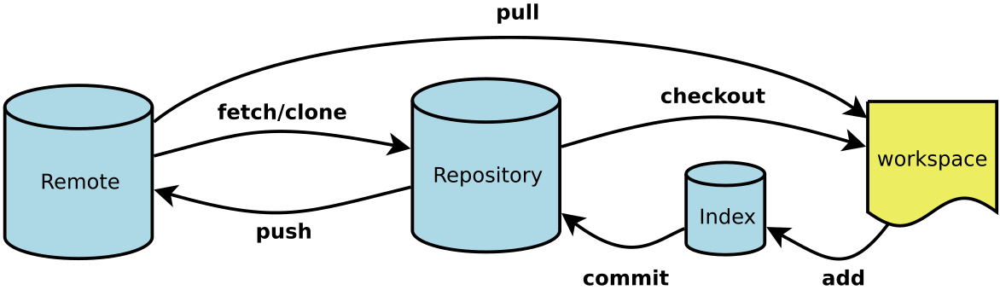
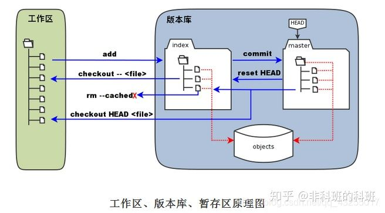
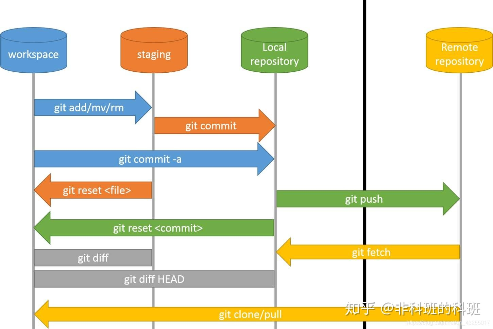

[[TOC]]

# 基础

## 基本概念
- 工作区：就是你在电脑里能看到的目录。
- 暂存区：英文叫stage, 或index。一般存放在"git目录"下的index文件（.git/index）中，所以我们把暂存区有时也叫作索引（index）。
- 版本库：工作区有一个隐藏目录.git，这个不算工作区，而是Git的版本库。


- 图示
    - Workspace：工作区
    - Index / Stage：暂存区
    - Repository：仓库区（或本地仓库）
    - Remote：远程仓库



## 参考
- https://git-scm.com/docs

- [图解Git操作，一篇就够](https://zhuanlan.zhihu.com/p/263050507)
- [Git 分支命名规范(完)](https://blog.csdn.net/qq_33858250/article/details/81047883)
- [https://learngitbranching.js.org/](https://learngitbranching.js.org/)


### Git 常用命令大全
- [Git 常用命令大全](https://www.runoob.com/note/56524)


# 安装
## Git
### 下载
- Git的官网 https://git-scm.com/
    - https://git-scm.com/downloads
        - https://mirrors.edge.kernel.org/pub/software/scm/git/
        - https://github.com/git-for-windows/git/releases/download/v2.23.0.windows.1/PortableGit-2.23.0-64-bit.7z.exe
        - https://github.com/git-for-windows/git/releases/download/v2.25.0.windows.1/Git-2.25.0-64-bit.exe

#### portable 版的安装配置
1. 下载 https://github.com/git-for-windows/git/releases/download/v2.27.0.windows.1/PortableGit-2.27.0-64-bit.7z.exe
2. 双击安装到指定的GIT目录
3. 配置 git 的环境变量, 在 Path 中添加 git 的环境变量 E:\TosinJia\tools\portableSoft\PortableGit\cmd
4. cmd命令行测试
```
C:\Users\Tosin>git version
git version 2.27.0.windows.1
```


- [git 的 portable 版的安装配置](https://my.oschina.net/zdtdtel/blog/3054497)

#### CenOS/RedHat
```
[root@bogon ~]# yum install curl-devel expat-devel gettext-devel openssl-devel zlib-devel
[root@bogon ~]# yum -y install git-core
已加载插件：fastestmirror, langpacks
Loading mirror speeds from cached hostfile
 * base: mirrors.neusoft.edu.cn
 * extras: mirrors.tuna.tsinghua.edu.cn
 * updates: mirrors.neusoft.edu.cn
软件包 git-1.8.3.1-20.el7.x86_64 已安装并且是最新版本
无须任何处理
[root@bogon ~]# git --version
git version 1.8.3.1
```

# 可视化工具
## Sourcetree
- [Sourcetree | Free Git GUI for Mac and Windows](https://www.sourcetreeapp.com/)

- [Git/SourceTree版本管理](https://www.bilibili.com/video/BV1Ev411j7e5)

- [【最全面】SourceTree使用教程详解（连接远程仓库，克隆，拉取，提交，推送，新建/切换/合并分支，冲突解决，提交PR）](https://www.cnblogs.com/Can-daydayup/p/13128633.html)


### 配置
- 工具(T)
	- 选项(O)
#### 一般
- SSH客户端配置
    1. SSH秘钥：C:\Users\User\.ssh\id_rsa
    2. SSH客户端：OpenSSH
#### 比较

##### 外部差异比对/合并
- 外部对比工具：BeyondCompare
- 对比命令：D:\tools\portable\Beyond Compare 4\BCompare.exe
- 合并工具：BeyondCompare
- 对比命令：D:\tools\portable\Beyond Compare 4\BCompare.exe

###### 外部差异对比 Ctrl+D

- 文件状态
	- 未暂存文件/已暂存文件
		- -> 选中文件
			1. ->右键->外部差异对比 Ctrl+D
			2. 具体文件窗口 -> 齿轮图标 -> 外部差异对比
- History/Search
	- 选中某次提交
		- -> 选中文件
			1. 具体文件窗口 -> 齿轮图标 -> 外部差异对比


### Git工作流
- [SourceTree的基本使用 Git工作流](https://www.cnblogs.com/tian-xie/p/6264104.html)
#### 使用Git Flow初始化此仓库
- E:\iEnviroment\development\项目\绩效系统\DeewintxPerformanceManagement\.git\config 新增了以下内容
```
[gitflow "branch"]
	master = master
	develop = develop
[gitflow "prefix"]
	feature = feature/
	bugfix = bugfix/
	release = release/
	hotfix = hotfix/
	support = support/
	versiontag = 
[gitflow "path"]
	hooks = E:/iEnviroment/development/项目/绩效系统/DeewintxPerformanceManagement/.git/hooks
```

#### 2. 分支共有5种类型
1) master，最终发布版本，整个项目中有且只有一个
2) develop，项目的开发分支，原则上项目中有且只有一个
3) feature，功能分支，用于开发一个新的功能  
    - F_add_feature_1
    - feature/F_add_feature_202304
4) release，预发布版本，介于develop和master之间的一个版本，主要用于测试 
    - R_v1.0
    - release/V3.1.6-DY
5) hotfix，修复补丁，用于修复master上的bug，直接作用于master
#### 1.获取项目代码
1. 点击克隆/新建

2. 在弹出框中输入项目地址，http或者ssh地址都可以
    - 如果箭头指向的仓库类型表明“这不是一个标准的Git仓库”，可能是有以下原因
        - 1) 项目地址获取错误
        - 2) 没有项目访问权限

3. 点击“克隆”，等待项目克隆完成，完成后，左侧只有一个分支master
    - 克隆完成后，得到的是发布后的master源码，如果想要获取最新的正在开发中的源码，需要对项目流进行初始化，点击“Git工作流”
    - 直接点“确定”，获取develop分支源码

> 开发任务都是在develop分支上完成的

#### 建立新的功能
> 当开发中需要增加一个新的功能时，可新建feature分支，用于增加新功能，并且不影响开发中的develop源码，当新功能增加完成后，完成feature分支，将新功能合并到develop中，更新develop上的代码


1) 新建feature。首先当前开发分支指向develop，点击“Git工作流”
    1. 选择“建立新的分支”
    1. 在预览中可看到，feature分支是从develop分出的，输入功能名称，点击确定，项目结构中增加feature分支，并且当前开发分支指向新建的feature分支

2) 在feature/F_add_feature_202304分支下进行开发任务，并提交

3) 完成feature开发后，将feature中的源码合并到develop分支。将当前分支指向F_add_feature分支，点击“Git工作流”，选择“完成功能”
    - 预览中，表明feature分支将合并到develop，点击确定，进行提交合并，合并成功后

#### 建立新的发布版本
> 当开发到一定阶段，可以发布测试版本时，可以从develop分支，建立release分支，进入预发布测试阶段。

1. 点击“Git工作流”，选择“建立新的发布版本”
    - 预览中可以看到，release是从develop分出的，输入发布版本名‘V3.1.6-DY’，点击确定
    - V3.1.6-DY为阶段性发布版本，主要用于发布前进行测试，后续的开发工作仍旧在develop上进行，如果在测试过程中发现问题，直接在release上进行修改，修改完成后进行提交

2. 对release分支V3.1.6-DY进行修改后或者无需修改，测试完成，可以进行正式发布，在当前分支指向V3.1.6-DY分支下，点击“Git工作流”，选择“完成发布版本”
    - 在预览中可以看到，R_v1.0向develop和master分别合并，点击确定，完成正式发布。
    - 完成合并后，默认指向develop为当前分支，master增加多个版本更新，将master分支推送到origin，完成线上发布    


##### 标签操作
```
User@WIN10-0009 MINGW64 /e/iEnviroment/development/项目/绩效系统/DeewintxPerformanceManagement (develop)
$ git tag
V3.1.6-DY

User@WIN10-0009 MINGW64 /e/iEnviroment/development/项目/绩效系统/DeewintxPerformanceManagement (develop)
$ git show V3.1.6-DY
tag V3.1.6-DY
Tagger: jiatongshun <jiatongshun@dewinfl.com>
Date:   Thu May 4 09:56:23 2023 +0800


commit c87e6ec36d1ec02c286399f6aeb01acf709ce7a0 (tag: V3.1.6-DY, origin/master, origin/HEAD, master)
Merge: 98164be 6021b54
Author: jiatongshun <jiatongshun@dewinfl.com>
Date:   Thu May 4 09:56:22 2023 +0800

    Merge branch 'release/V3.1.6-DY'
```

#### 建立新的修复补丁
> 正式版本发布后，develop可继续进行后续开发，当正式版本出现问题时，需要进行问题的修改，可以在master分支建立修改补丁hotfix。

1. 将当前分支切换到master，点击“Git工作流”，选择“建立新的修复补丁”
    - 预览中hotfix分支是从master拉去出来的，输入修复补丁名，点确定

2. 在该分支下进行master的问题修改，修改完成后进行提交。当所有补丁问题修改完成后，点击“Git工作流”，选择“完成修复补丁”
    - 预览中，H_fix_*向master和develop分别合并，点击确定，完成分支合并。

3. 合并完成后，默认当前分支为develop，master分支有版本需要更新，当前分支切换为master，进行推送，完成补丁修复。

### 合并分支
> 注意：在合并代码之前需要将`需要合并的分支`拉取到最新状态（**避免覆盖别人的代码，或者丢失一些重要文件）!!!!!

- 将dev分支合并到master分支

1. dev分支拉取到最新状态
2. 切换到master分支
3. dev分支->右键->合并dev至当前分支
### Bitbucket账户
- tosinjia@foxmail.com 

### 常见问题
#### sourceTree突然无法启动

1. 找到sourceTree存放的目录 C:\Users\User\AppData\Local\SourceTree;
2. 返回上一级，找到Atlassian文件夹 C:\Users\User\AppData\Local\Atlassian；
3. 删除最新的一条记录 SourceTree.exe_Url_fotyszqgwqyxzebijh5xxsugc3ahm5h5 修改为 SourceTree.exe_Url_fotyszqgwqyxzebijh5xxsugc3ahm5h5.bak；

- [sourceTree突然无法启动，解决方案](https://blog.csdn.net/weixin_44490021/article/details/131232966)

## TortoiseGit
- https://tortoisegit.org/
	- https://tortoisegit.org/download/
		- https://download.tortoisegit.org/tgit/
	- https://tortoisegit.org/docs/
		- https://tortoisegit.org/docs/tortoisegit/tgit-dug.html#tgit-dug-general-icons

- [【TortoiseGit】TortoiseGit安装和配置详细说明](https://blog.csdn.net/weixin_44299027/article/details/121178817)
- [TortoiseGit-使用教程（图文详细版）](https://www.cnblogs.com/linhuaming/p/15725776.html)

- [TortoiseGit 使用教程](https://www.cnblogs.com/anayigeren/p/10177027.html)


### github
#### 方式一
1. [puttygen.exe]PuTTY Key Generator
	1. Generate
	2. Save private key .ppk
	3. Save public key 

2. [pageant.exe]Pageant Key List
	1. AddKey .ppk
	
3. https://github.com/settings/keys
	1. SSH and GPG keys
	2. New SSH key
	
4. Git克隆
	1. URL: git@github.com:TosinJia/git-test.git
	1. 确认
#### 方式二
- [TortoiseGit 和 Git 配置使用同一私钥](https://liwengo.top/2019/09/24/tortoisegit-key/)

1. [D:\tools\portable\PortableGit\cmd\git-gui.exe]Git Gui
	1. -> Help -> Show SSH Key -> Generate Key
	1. -> OK -> OK
	
2. C:\Users\User\.ssh
	- id_rsa
	- id_rsa.pub
	
3. https://github.com/settings/keys
	1. SSH and GPG keys
	2. New SSH key	
```
E:\iEnviroment\development\projects\ideaProjects\VueDemo\test1>git clone git@github.com:TosinJia/TosinJia.git
Cloning into 'TosinJia'...
The authenticity of host 'github.com (20.205.243.166)' can't be established.
ED25519 key fingerprint is SHA256:+DiY3wvvV6TuJJhbpZisF/zLDA0zPMSvHdkr4UvCOqU.
This key is not known by any other names
Are you sure you want to continue connecting (yes/no/[fingerprint])? yes
Warning: Permanently added 'github.com' (ED25519) to the list of known hosts.
remote: Enumerating objects: 70, done.
remote: Counting objects: 100% (70/70), done.
remote: Compressing objects: 100% (38/38), done.
Receiving objects:  40% (27/70)used 68 (delta 13), pack-reused 0
Receiving objects: 100% (70/70), 13.19 KiB | 3.30 MiB/s, done.
Resolving deltas: 100% (15/15), done.
```

4. PuTTY Key Generator
	1. -> Conversions -> Import key -> C:\Users\User\.ssh\id_rsa
	2. -> Save private key -> tortoiseGit.ppk
### 工具
#### pageant.exe
##### [TortoiseGit中Pageant开机自启且自动加载SSH Key](https://blog.csdn.net/Nicolas12/article/details/80981398)
1. Pageant 的开机自启
	- 创建pageant.exe的快捷方式，复制到C:\Users\User\AppData\Roaming\Microsoft\Windows\Start Menu\Programs\Startup
2. 关联加载秘钥ppk
	- 快捷键 -> 目标 "D:\Program Files\TortoiseGit\bin\pageant.exe" C:\Users\User\.ssh\tortoiseGit.ppk

# 实战与应用
## git 分布式控制的实战与应用


- 头像->Settings->SSH and GPG keys->New SSH key
	- Title node1
	- Key cat /root/.ssh/id_rsa_github.pub
	-> Add SSH Key -> 验证密码

- 创建库


### 05 向本地库和远程仓库github提交代码
#### 配置用户信息、查看已有配置信息
```
[root@bogon test05]# git config --global user.name "ts.jia"
[root@bogon test05]# git config --global user.email "TosinJia@foxmail.com"
# 检查已有的配置信息
[root@bogon test05]# git config --list
user.name=ts.jia
user.email=TosinJia@foxmail.com
core.repositoryformatversion=0
core.filemode=true
core.bare=false
core.logallrefupdates=true
```
#### 创建GitHub远程仓库
#### 向本地库和远程仓库github提交代码
```
[root@bogon ~]# mkdir git
[root@bogon ~]# cd git/
[root@bogon git]# git config
用法：git config [选项]

配置文件位置
    --global              使用全局配置文件
    --system              使用系统级配置文件
    --local               使用版本库级配置文件
    -f, --file \<文件>     使用指定的配置文件
    --blob \<blob-id>      read config from given blob object

操作
    --get                 获取值：name [value-regex]
    --get-all             获得所有的值：key [value-regex]
    --get-regexp          根据正则表达式获得值：name-regex [value-regex]
    --replace-all         替换所有匹配的变量：name value [value_regex]
    --add                 添加一个新的变量：name value
    --unset               删除一个变量：name [value-regex]
    --unset-all           删除所有匹配项：name [value-regex]
    --rename-section      重命名小节：old-name new-name
    --remove-section      删除一个小节：name
    -l, --list            列出所有
    -e, --edit            打开一个编辑器
    --get-color \<slot>    找到配置的颜色：[默认]
    --get-colorbool \<slot>
                          找到颜色设置：[stdout-is-tty]

类型
    --bool                值是 "true" 或 "false"
    --int                 值是十进制数
    --bool-or-int         值是 --bool or --int
    --path                值是一个路径（文件或目录名）

其它
    -z, --null            终止值是NUL字节
    --includes            查询时参照 include 指令递归查找

[root@bogon git]# mkdir test05
[root@bogon git]# cd test05/
[root@bogon test05]# git init
初始化空的 Git 版本库于 /root/git/test05/.git/
[root@bogon test05]# tree -af 
.
└── ./.git
    ├── ./.git/branches
    ├── ./.git/config
    ├── ./.git/description
    ├── ./.git/HEAD
    ├── ./.git/hooks
    │   ├── ./.git/hooks/applypatch-msg.sample
    │   ├── ./.git/hooks/commit-msg.sample
    │   ├── ./.git/hooks/post-update.sample
    │   ├── ./.git/hooks/pre-applypatch.sample
    │   ├── ./.git/hooks/pre-commit.sample
    │   ├── ./.git/hooks/prepare-commit-msg.sample
    │   ├── ./.git/hooks/pre-push.sample
    │   ├── ./.git/hooks/pre-rebase.sample
    │   └── ./.git/hooks/update.sample
    ├── ./.git/info
    │   └── ./.git/info/exclude
    ├── ./.git/objects
    │   ├── ./.git/objects/info
    │   └── ./.git/objects/pack
    └── ./.git/refs
        ├── ./.git/refs/heads
        └── ./.git/refs/tags

10 directories, 13 files

[root@bogon test05]# echo "# git-t0102" >> README.md
[root@bogon test05]# git add README.md
[root@bogon test05]# git commit -m "first commit"
[master（根提交） 00c31a9] first commit
 1 file changed, 1 insertion(+)
 create mode 100644 README.md
[root@bogon test05]# git remote add origin git@github.com:TosinJia/git-t0102.git
[root@bogon test05]# git remote -v
origin  git@github.com:TosinJia/git-t0102.git (fetch)
origin  git@github.com:TosinJia/git-t0102.git (push)
[root@bogon test05]# git push -u origin master
Warning: Permanently added the RSA host key for IP address '13.250.177.223' to the list of known hosts.
Counting objects: 3, done.
Writing objects: 100% (3/3), 223 bytes | 0 bytes/s, done.
Total 3 (delta 0), reused 0 (delta 0)
To git@github.com:TosinJia/git-t0102.git
 * [new branch]      master -> master
分支 master 设置为跟踪来自 origin 的远程分支 master。
```
### 06 git log查看提交历史
```
[root@bogon git]# mkdir test06
[root@bogon git]# cd test06/
[root@bogon test06]# git init
Initialized empty Git repository in /root/git/test06/.git/
[root@bogon test06]# vim README.md
[root@bogon test06]# ll
总用量 4
-rw-r--r--. 1 root root 9 2月   3 19:02 README.md
[root@bogon test06]# git status
# On branch master
#
# Initial commit
#
# Untracked files:
#   (use "git add \<file>..." to include in what will be committed)
#
#       README.md
nothing added to commit but untracked files present (use "git add" to track)
[root@bogon test06]# git add README.md 
[root@bogon test06]# git status
# On branch master
#
# Initial commit
#
# Changes to be committed:
#   (use "git rm --cached \<file>..." to unstage)
#
#       new file:   README.md
#
[root@bogon test06]# git rm --cached README.md 
rm 'README.md'
[root@bogon test06]# git status
# On branch master
#
# Initial commit
#
# Untracked files:
#   (use "git add \<file>..." to include in what will be committed)
#
#       README.md
nothing added to commit but untracked files present (use "git add" to track)
[root@bogon test06]# git add README.md 
[root@bogon test06]# git status
# On branch master
#
# Initial commit
#
# Changes to be committed:
#   (use "git rm --cached \<file>..." to unstage)
#
#       new file:   README.md
#
[root@bogon test06]# git commit -m "first commit"
[master (root-commit) a0e18e8] first commit
 1 files changed, 1 insertions(+), 0 deletions(-)
 create mode 100644 README.md
[root@bogon test06]# ll
总用量 4
-rw-r--r--. 1 root root 9 2月   3 19:02 README.md
[root@bogon test06]# git log
commit a0e18e8307968561545f1350bec33a520c8c1f69
Author: tosin \<tosinjia@foxmail.com>
Date:   Sun Feb 3 19:07:30 2019 +0800

    first commit
[root@bogon test06]# git config --list
user.name=tosin
user.email=tosinjia@foxmail.com
core.repositoryformatversion=0
core.filemode=true
core.bare=false
core.logallrefupdates=true
[root@bogon test06]# vim test
[root@bogon test06]# git add test 
[root@bogon test06]# git commmit -m "test's comment"  
git: 'commmit' is not a git command. See 'git --help'.

Did you mean this?
        commit
[root@bogon test06]# git commit -m "test's comment" 
# master分支 本次提交的唯一标记 提交注释
[master bcd7c0d] test's comment
 1 files changed, 1 insertions(+), 0 deletions(-)
# 100 普通文件 644 文件权限
 create mode 100644 test
[root@bogon test06]# git log
commit bcd7c0dd82443ffd4b944dad8799fe9fc7c51ef2
Author: tosin \<tosinjia@foxmail.com>
Date:   Sun Feb 3 19:18:42 2019 +0800

    test's comment

commit a0e18e8307968561545f1350bec33a520c8c1f69
Author: tosin \<tosinjia@foxmail.com>
Date:   Sun Feb 3 19:07:30 2019 +0800

    first commit
```
### 07 git reset 版本撤销

```
[root@bogon git]# mkdir test07
[root@bogon git]# cd test07
[root@bogon test07]# git init
初始化空的 Git 版本库于 /root/git/test07/.git/

[root@bogon test07]# cat a
a content
[root@bogon test07]# git add a
[root@bogon test07]# git commit -m "a commit"
[master（根提交） 533cdbd] a commit
 1 file changed, 1 insertion(+)
 create mode 100644 a
[root@bogon test07]# vim b

[root@bogon test07]# cat b
b content
[root@bogon test07]# git add b
[root@bogon test07]# git commit -m "b commit"
[master d649da8] b commit
 1 file changed, 1 insertion(+)
 create mode 100644 b

[root@bogon test07]# cat c
c content
[root@bogon test07]# git add c
[root@bogon test07]# git commit -m "c commit"
[master b7dde77] c commit
 1 file changed, 1 insertion(+)
 create mode 100644 c
```
- 查看版本提交历史
```
[root@bogon test07]# git log
commit b7dde77882afecefa8a9d6780fe7159699a9110a
Author: ts.jia \<TosinJia@foxmail.com>
Date:   Tue Feb 19 14:48:57 2019 +0800

    c commit

commit d649da8f4fb3f41aa6a96335965829d52bf89030
Author: ts.jia \<TosinJia@foxmail.com>
Date:   Tue Feb 19 14:47:18 2019 +0800

    b commit

commit 533cdbdce7faefb0206f2c0e103ce7f7df0f45f7
Author: ts.jia \<TosinJia@foxmail.com>
Date:   Tue Feb 19 14:46:31 2019 +0800

    a commit
[root@bogon test07]# git log --pretty=oneline
b7dde77882afecefa8a9d6780fe7159699a9110a c commit
d649da8f4fb3f41aa6a96335965829d52bf89030 b commit
533cdbdce7faefb0206f2c0e103ce7f7df0f45f7 a commit
[root@bogon test07]# git log --graph
* commit b7dde77882afecefa8a9d6780fe7159699a9110a
| Author: ts.jia \<TosinJia@foxmail.com>
| Date:   Tue Feb 19 14:48:57 2019 +0800
| 
|     c commit
|  
* commit d649da8f4fb3f41aa6a96335965829d52bf89030
| Author: ts.jia \<TosinJia@foxmail.com>
| Date:   Tue Feb 19 14:47:18 2019 +0800
| 
|     b commit
|  
* commit 533cdbdce7faefb0206f2c0e103ce7f7df0f45f7
  Author: ts.jia \<TosinJia@foxmail.com>
  Date:   Tue Feb 19 14:46:31 2019 +0800
  
      a commit
```
- 版本撤回样例 a->b->c->d 如果用 git reset 方法回到版本c，有以下3种方式
    - --hard
        - 版本库(c) 暂存区(c,删掉版本d的暂存区) 工作区(c，删掉版本d的工作区)
    - --soft
        - 版本库(c) 暂存区(c,保留版本d的暂存区) 工作区(c，保留版本d的工作区)
    - --mixed 默认
        - 版本库(c) 暂存区(c,删除版本d的暂存区) 工作区(c,同时保留版本d的工作区)
```
[root@bogon test07]# cat d
d content
[root@bogon test07]# git add d
[root@bogon test07]# git commit -m "d commit"
[master 32c1c97] d commit
 1 file changed, 1 insertion(+)
 create mode 100644 d
[root@bogon test07]# git log --oneline
32c1c97 d commit
b7dde77 c commit
d649da8 b commit
533cdbd a commit

[root@bogon test07]# git status
# 位于分支 master
无文件要提交，干净的工作区
#   # --hard
[root@bogon test07]# git reset b7dde77 --hard
HEAD 现在位于 b7dde77 c commit
[root@bogon test07]# ll
总用量 12
-rw-r--r--. 1 root root 10 2月  19 14:46 a
-rw-r--r--. 1 root root 10 2月  19 14:47 b
-rw-r--r--. 1 root root 10 2月  19 14:48 c
[root@bogon test07]# git status
# 位于分支 master
无文件要提交，干净的工作区
[root@bogon test07]# git log --oneline
b7dde77 c commit
d649da8 b commit
533cdbd a commit

#   #   --soft
[root@bogon test07]# git reset d649da8 --soft
[root@bogon test07]# ll
总用量 12
-rw-r--r--. 1 root root 10 2月  19 14:46 a
-rw-r--r--. 1 root root 10 2月  19 14:47 b
-rw-r--r--. 1 root root 10 2月  19 14:48 c
# 查看暂存区
[root@bogon test07]# git status
# 位于分支 master
# 要提交的变更：
#   （使用 "git reset HEAD \<file>..." 撤出暂存区）
#
#       新文件：    c
#
[root@bogon test07]# git log --oneline
d649da8 b commit
533cdbd a commit

#   # 再次提交c
[root@bogon test07]# git commit -m "c commit"   
[master 30458af] c commit
 1 file changed, 1 insertion(+)
 create mode 100644 c
[root@bogon test07]# git log --oneline
30458af c commit
d649da8 b commit
533cdbd a commit

#   # 默认
[root@bogon test07]# git reset d649da8
[root@bogon test07]# ll
总用量 12
-rw-r--r--. 1 root root 10 2月  19 14:46 a
-rw-r--r--. 1 root root 10 2月  19 14:47 b
-rw-r--r--. 1 root root 10 2月  19 14:48 c
[root@bogon test07]# git status
# 位于分支 master
# 未跟踪的文件:
#   （使用 "git add \<file>..." 以包含要提交的内容）
#
#       c
提交为空，但是存在尚未跟踪的文件（使用 "git add" 建立跟踪）
# 加入暂存区
[root@bogon test07]# git add c
# 提交
[root@bogon test07]# git commit -m "c commit"
[master a270a2f] c commit
 1 file changed, 1 insertion(+)
 create mode 100644 c
[root@bogon test07]# git log --oneline
a270a2f c commit
d649da8 b commit
533cdbd a commit
```
### 08 git diff使用
- git diff 暂存区（比较前的文件）和工作区（比较后的文件）比较
- git diff --cached 版本库（比较前的文件）和暂存区比较
- git diff HEAD 版本库（比较前的文件）和工作区比较
```
[root@bogon git]# mkdir diff
[root@bogon git]# cd diff
[root@bogon diff]# git init
初始化空的 Git 版本库于 /root/git/diff/.git/
[root@bogon diff]# cat a 
a
[root@bogon diff]# git add a
[root@bogon diff]# git status
# 位于分支 master
#
# 初始提交
#
# 要提交的变更：
#   （使用 "git rm --cached \<file>..." 撤出暂存区）
#
#       新文件：    a
#
[root@bogon diff]# git commit -m "a"
[master（根提交） 306a677] a
 1 file changed, 1 insertion(+)
 create mode 100644 a
[root@bogon diff]# git log
commit 306a677f551a8932d7bce5de47bf796d0d73f753
Author: ts.jia \<TosinJia@foxmail.com>
Date:   Fri Feb 15 19:32:26 2019 +0800

    a
[root@bogon diff]# cat a 
a
ab
[root@bogon diff]# git status
# 位于分支 master
# 尚未暂存以备提交的变更：
#   （使用 "git add \<file>..." 更新要提交的内容）
#   （使用 "git checkout -- \<file>..." 丢弃工作区的改动）
#
#       修改：      a
#
修改尚未加入提交（使用 "git add" 和/或 "git commit -a"）
[root@bogon diff]# git diff
diff --git a/a b/a
index 7898192..1176a53 100644
--- a/a
+++ b/a
@@ -1 +1,2 @@
 a
+ab
[root@bogon diff]# git diff HEAD
diff --git a/a b/a
index 7898192..1176a53 100644
--- a/a
+++ b/a
@@ -1 +1,2 @@
 a
+ab
[root@bogon diff]# git add a
[root@bogon diff]# git diff --cached
diff --git a/a b/a
index 7898192..1176a53 100644
--- a/a
+++ b/a
@@ -1 +1,2 @@
 a
+ab
[root@bogon diff]# git diff --help
```
- 详解
```
[root@bogon diff]# git diff
# a代表变动前的版本、暂存区 b代表变动后的版本、工作区
diff --git a/a b/a
# 两个文件的hash值相比较
index 7898192..1176a53 100644
# ---变动前的版本 暂存区
--- a/a
# +++变动后的版本 工作区
+++ b/a
# -代表变动前 +代表变动后，1代表第一行，1,2代表连续两行
@@ -1 +1,2 @@
# 两个版本没有变化
 a
# 代表变动后的版本在前版本上多了ab
+ab
```
### 09 git log和reflog的区别
- git reflog 查询所有的提交历史
- git log 看不到commit id删除的记录
```
[root@bogon git]# mkdir log
[root@bogon git]# cd log
[root@bogon log]# git init
初始化空的 Git 版本库于 /root/git/log/.git/
[root@bogon log]# cat a 
acontent
[root@bogon log]# git add a
[root@bogon log]# git commit -m "a commit"
[master（根提交） 4d37652] a commit
 1 file changed, 1 insertion(+)
 create mode 100644 a
[root@bogon log]# cat b
b content
[root@bogon log]# git add b
[root@bogon log]# git commit -m "b commit"
[master bd021f9] b commit
 1 file changed, 1 insertion(+)
 create mode 100644 b
[root@bogon log]# cat c
c content
[root@bogon log]# git add c
[root@bogon log]# git commit -m "c commit"     
[master 3291564] c commit
 1 file changed, 1 insertion(+)
 create mode 100644 c
[root@bogon log]# git log
commit 32915640b320c8a10eb48f1807f5876fcd021d6f
Author: ts.jia \<TosinJia@foxmail.com>
Date:   Fri Feb 15 19:55:40 2019 +0800

    c commit

commit bd021f9f33a6224be3826549d9053b8762e01c95
Author: ts.jia \<TosinJia@foxmail.com>
Date:   Fri Feb 15 19:54:33 2019 +0800

    b commit

commit 4d37652577195da507bddfb5d49df9c6c94ca88c
Author: ts.jia \<TosinJia@foxmail.com>
Date:   Fri Feb 15 19:53:47 2019 +0800

    a commit
[root@bogon log]# git reflog
3291564 HEAD@{0}: commit: c commit
bd021f9 HEAD@{1}: commit: b commit
4d37652 HEAD@{2}: commit (initial): a commit
[root@bogon log]# git reset --hard bd021f9
HEAD 现在位于 bd021f9 b commit
[root@bogon log]# git log
commit bd021f9f33a6224be3826549d9053b8762e01c95
Author: ts.jia \<TosinJia@foxmail.com>
Date:   Fri Feb 15 19:54:33 2019 +0800

    b commit

commit 4d37652577195da507bddfb5d49df9c6c94ca88c
Author: ts.jia \<TosinJia@foxmail.com>
Date:   Fri Feb 15 19:53:47 2019 +0800

    a commit
[root@bogon log]# git reflog
bd021f9 HEAD@{0}: reset: moving to bd021f9
3291564 HEAD@{1}: commit: c commit
bd021f9 HEAD@{2}: commit: b commit
4d37652 HEAD@{3}: commit (initial): a commit
```

### 10 git HEAD的解析
- HEAD 告诉我们当前在那个分支上，而且是那一次提交
```
[root@bogon git]# mkdir head
[root@bogon git]# cd head
[root@bogon head]# git init
初始化空的 Git 版本库于 /root/git/head/.git/
[root@bogon head]# tree ./ -afC
.
└── ./.git
    ├── ./.git/branches
    ├── ./.git/config
    ├── ./.git/description
    ├── ./.git/HEAD
    ├── ./.git/hooks
    │   ├── ./.git/hooks/applypatch-msg.sample
    │   ├── ./.git/hooks/commit-msg.sample
    │   ├── ./.git/hooks/post-update.sample
    │   ├── ./.git/hooks/pre-applypatch.sample
    │   ├── ./.git/hooks/pre-commit.sample
    │   ├── ./.git/hooks/prepare-commit-msg.sample
    │   ├── ./.git/hooks/pre-push.sample
    │   ├── ./.git/hooks/pre-rebase.sample
    │   └── ./.git/hooks/update.sample
    ├── ./.git/info
    │   └── ./.git/info/exclude
    ├── ./.git/objects
    │   ├── ./.git/objects/info
    │   └── ./.git/objects/pack
    └── ./.git/refs
        ├── ./.git/refs/heads
        └── ./.git/refs/tags

10 directories, 13 files
[root@bogon head]# cat ./.git/HEAD
ref: refs/heads/master
[root@bogon head]# tree ./.git/refs/heads -af
./.git/refs/heads

0 directories, 0 files
```
- 项目刚创建的时候，git init 在git目录下有个HEAD文件，里边的内容指向了  refs/heads/master ，当时没有master文件，说明没有提交

```
# 创建一次提交
[root@bogon head]# cat a
a content
[root@bogon head]# git add a
[root@bogon head]# git commit -m "a commit"
[master（根提交） 9f2149c] a commit
 1 file changed, 1 insertion(+)
 create mode 100644 a

[root@bogon head]# tree ./ -afC
.
├── ./a
└── ./.git
    ├── ./.git/branches
    ├── ./.git/COMMIT_EDITMSG
    ├── ./.git/config
    ├── ./.git/description
    ├── ./.git/HEAD
    ├── ./.git/hooks
    │   ├── ./.git/hooks/applypatch-msg.sample
    │   ├── ./.git/hooks/commit-msg.sample
    │   ├── ./.git/hooks/post-update.sample
    │   ├── ./.git/hooks/pre-applypatch.sample
    │   ├── ./.git/hooks/pre-commit.sample
    │   ├── ./.git/hooks/prepare-commit-msg.sample
    │   ├── ./.git/hooks/pre-push.sample
    │   ├── ./.git/hooks/pre-rebase.sample
    │   └── ./.git/hooks/update.sample
    ├── ./.git/index
    ├── ./.git/info
    │   └── ./.git/info/exclude
    ├── ./.git/logs
    │   ├── ./.git/logs/HEAD
    │   └── ./.git/logs/refs
    │       └── ./.git/logs/refs/heads
    │           └── ./.git/logs/refs/heads/master
    ├── ./.git/objects
    │   ├── ./.git/objects/7a
    │   │   └── ./.git/objects/7a/bdf70136a3cf1d59f488f6e36913acc238d355
    │   ├── ./.git/objects/9f
    │   │   └── ./.git/objects/9f/2149c1546b5a44a11a9601aafed99cc46302eb
    │   ├── ./.git/objects/bd
    │   │   └── ./.git/objects/bd/dd95b6f5a5e833f9bcea5d753992ba30601673
    │   ├── ./.git/objects/info
    │   └── ./.git/objects/pack
    └── ./.git/refs
        ├── ./.git/refs/heads
        │   └── ./.git/refs/heads/master
        └── ./.git/refs/tags

16 directories, 22 files
[root@bogon head]# cat ./.git/HEAD
ref: refs/heads/master
[root@bogon head]# ll ./.git/refs/heads
总用量 4
-rw-r--r--. 1 root root 41 2月  19 11:15 master
[root@bogon head]# cat ./.git/refs/heads/master
9f2149c1546b5a44a11a9601aafed99cc46302eb
# 查看提交历史 9f2149c 9f2149c1546b5a44a11a9601aafed99cc46302eb 一样
[root@bogon head]# git log --oneline
9f2149c a commit
```
- ./.git/HEAD -> refs/heads/master -> commit id
- 为何不直接执行commit id？

```
# 创建分支
[root@bogon head]# git branch dev
[root@bogon head]# tree ./ -afC
.
├── ./a
└── ./.git
    ├── ./.git/branches
    ├── ./.git/COMMIT_EDITMSG
    ├── ./.git/config
    ├── ./.git/description
    ├── ./.git/HEAD
    ├── ./.git/hooks
    │   ├── ./.git/hooks/applypatch-msg.sample
    │   ├── ./.git/hooks/commit-msg.sample
    │   ├── ./.git/hooks/post-update.sample
    │   ├── ./.git/hooks/pre-applypatch.sample
    │   ├── ./.git/hooks/pre-commit.sample
    │   ├── ./.git/hooks/prepare-commit-msg.sample
    │   ├── ./.git/hooks/pre-push.sample
    │   ├── ./.git/hooks/pre-rebase.sample
    │   └── ./.git/hooks/update.sample
    ├── ./.git/index
    ├── ./.git/info
    │   └── ./.git/info/exclude
    ├── ./.git/logs
    │   ├── ./.git/logs/HEAD
    │   └── ./.git/logs/refs
    │       └── ./.git/logs/refs/heads
    │           ├── ./.git/logs/refs/heads/dev
    │           └── ./.git/logs/refs/heads/master
    ├── ./.git/objects
    │   ├── ./.git/objects/7a
    │   │   └── ./.git/objects/7a/bdf70136a3cf1d59f488f6e36913acc238d355
    │   ├── ./.git/objects/9f
    │   │   └── ./.git/objects/9f/2149c1546b5a44a11a9601aafed99cc46302eb
    │   ├── ./.git/objects/bd
    │   │   └── ./.git/objects/bd/dd95b6f5a5e833f9bcea5d753992ba30601673
    │   ├── ./.git/objects/info
    │   └── ./.git/objects/pack
    └── ./.git/refs
        ├── ./.git/refs/heads
        │   ├── ./.git/refs/heads/dev
        │   └── ./.git/refs/heads/master
        └── ./.git/refs/tags

16 directories, 24 files
[root@bogon head]# cat ./.git/HEAD
ref: refs/heads/master
[root@bogon head]# cat ./.git/refs/heads/master
9f2149c1546b5a44a11a9601aafed99cc46302eb
[root@bogon head]# cat ./.git/refs/heads/dev
9f2149c1546b5a44a11a9601aafed99cc46302eb
```
- ./.git/refs/heads/master 和 ./.git/refs/heads/dev commit id一样，如果没有 refs/heads/master 无法区别指向dev还是master分支
```
# 当前工作区状态，当前位于master分支上
[root@bogon head]# git status
# 位于分支 master
无文件要提交，干净的工作区

# 切到dev分支上
[root@bogon head]# git checkout dev
切换到分支 'dev'
# 引用执行dev分支
[root@bogon head]# cat ./.git/HEAD
ref: refs/heads/dev
[root@bogon head]# git status
# 位于分支 dev
无文件要提交，干净的工作区
```
### 11 git reset和revert的区别
```
[oot@bogon git]# mkdir gitreset
[root@bogon git]# cd gitreset/
[root@bogon gitreset]# git init
初始化空的 Git 版本库于 /root/git/gitreset/.git/

# 4次提交
[root@bogon gitreset]# cat a
a content
[root@bogon gitreset]# git add a
[root@bogon gitreset]# git commit -m "a commit"
[master（根提交） 98d8f40] a commit
 1 file changed, 1 insertion(+)
 create mode 100644 a

[root@bogon gitreset]# cat b
b content
[root@bogon gitreset]# git add b
[root@bogon gitreset]# git commit -m "b commit"
[master 7fd5fba] b commit
 1 file changed, 1 insertion(+)
 create mode 100644 b

[root@bogon gitreset]# cat c
c content
[root@bogon gitreset]# git add c
[root@bogon gitreset]# git commit -m "c commit"
[master dee19c3] c commit
 1 file changed, 1 insertion(+)
 create mode 100644 c

[root@bogon gitreset]# cat d
d content
[root@bogon gitreset]# git add d
[root@bogon gitreset]# git commit -m "d commit"
[master 02c415a] d commit
 1 file changed, 1 insertion(+)
 create mode 100644 d

#查看提交历史
[root@bogon gitreset]# git log --oneline
02c415a d commit
dee19c3 c commit
7fd5fba b commit
98d8f40 a commit

# 查看当前工作区
[root@bogon gitreset]# ll
总用量 16
-rw-r--r--. 1 root root 10 2月  19 11:36 a
-rw-r--r--. 1 root root 10 2月  19 11:38 b
-rw-r--r--. 1 root root 10 2月  19 11:39 c
-rw-r--r--. 1 root root 10 2月  19 11:40 d
[root@bogon gitreset]# git status
# 位于分支 master
无文件要提交，干净的工作区

# reset
[root@bogon gitreset]# git reset --hard dee19c3
HEAD 现在位于 dee19c3 c commit
# 工作区直接把d删除了
[root@bogon gitreset]# ll
总用量 12
-rw-r--r--. 1 root root 10 2月  19 11:36 a
-rw-r--r--. 1 root root 10 2月  19 11:38 b
-rw-r--r--. 1 root root 10 2月  19 11:39 c
# 查看log
[root@bogon gitreset]# git log --oneline
dee19c3 c commit
7fd5fba b commit
98d8f40 a commit
[root@bogon gitreset]# git reflog
dee19c3 HEAD@{0}: reset: moving to dee19c3
02c415a HEAD@{1}: commit: d commit
dee19c3 HEAD@{2}: commit: c commit
7fd5fba HEAD@{3}: commit: b commit
98d8f40 HEAD@{4}: commit (initial): a commit
```
- git reset 直接删除d的这次提交
```
[root@bogon gitreset]# git log --oneline
dee19c3 c commit
7fd5fba b commit
98d8f40 a commit
# revert 回到 7fd5fba b commit
[root@bogon gitreset]# git revert 7fd5fba
# 添加注释
[master 4e8615c] Revert test
 1 file changed, 1 deletion(-)
 delete mode 100644 b

# dee19c3 c commit 没有删除，多增加了一条提交历史
[root@bogon gitreset]# git log --oneline
4e8615c Revert test
dee19c3 c commit
7fd5fba b commit
98d8f40 a commit
# 工作区 b没有了，a、c都保留着
[root@bogon gitreset]# ll
总用量 8
-rw-r--r--. 1 root root 10 2月  19 11:36 a
-rw-r--r--. 1 root root 10 2月  19 11:39 c
```
- git revert 会把revert的commit 删除，做一次新的提交

### 12 git 合并分支并解决合并出现的冲突
```
[root@bogon git]# mkdir branch
[root@bogon git]# cd branch/
[root@bogon branch]# git init
初始化空的 Git 版本库于 /root/git/branch/.git/
[root@bogon branch]# git branch -v
# 做一次提交
[root@bogon branch]# cat a
a content
[root@bogon branch]# git add a
[root@bogon branch]# git commit -m "a commit"
[master（根提交） 146cb22] a commit
 1 file changed, 1 insertion(+)
 create mode 100644 a
[root@bogon branch]# git branch -v
* master 146cb22 a commit

# 创建、切换分支 feature
[root@bogon branch]# git branch feature
[root@bogon branch]# git checkout feature
切换到分支 'feature'
[root@bogon branch]# git branch -v
* feature 146cb22 a commit
  master  146cb22 a commit
[root@bogon branch]# cat a 
a content

# feature分支上 做一次提交
[root@bogon branch]# cat c 
c content
[root@bogon branch]# git log --oneline
146cb22 a commit
[root@bogon branch]# git add c
[root@bogon branch]# git commit -m "c commit"
[feature b846815] c commit
 1 file changed, 1 insertion(+)
 create mode 100644 c
[root@bogon branch]# git log --oneline
b846815 c commit
146cb22 a commit
[root@bogon branch]# git status
# 位于分支 feature
无文件要提交，干净的工作区

# 切到master分支上，master分支有一次提交，feature比master多一次提交
[root@bogon branch]# git checkout master
切换到分支 'master'
[root@bogon branch]# git log --oneline
146cb22 a commit

# 把feature分支合并过来
[root@bogon branch]# git merge feature 
更新 146cb22..b846815
Fast-forward
 c | 1 +
 1 file changed, 1 insertion(+)
 create mode 100644 c
[root@bogon branch]# git log --oneline
b846815 c commit
146cb22 a commit

# 切到feature分支，修改c，提交
[root@bogon branch]# ll
总用量 8
-rw-r--r--. 1 root root 10 2月  19 12:03 a
-rw-r--r--. 1 root root 21 2月  19 12:13 c
[root@bogon branch]# cat c
c content
feature c 
[root@bogon branch]# git add c
[root@bogon branch]# git commit -m "c feature"
[feature 74d46b7] c feature
 1 file changed, 1 insertion(+)
[root@bogon branch]# git status
# 位于分支 feature
无文件要提交，干净的工作区
#   #  查看 feature分支 提交历史，4次提交
[root@bogon branch]# git log --oneline
74d46b7 c feature
b846815 c commit
146cb22 a commit

# 切到master分支，同样修改c，提交
[root@bogon branch]# git checkout master
 换到分支 'master'
[root@bogon branch]# ll
总用量 8
-rw-r--r--. 1 root root 10 2月  19 12:03 a
-rw-r--r--. 1 root root 10 2月  19 12:16 c
[root@bogon branch]# cat c
c content
master c
[root@bogon branch]# git add c
[root@bogon branch]# git commit -m "c master"
[master e0fd6e0] c master
 1 file changed, 1 insertion(+)
#   # master分支提交历史，4次提交
[root@bogon branch]# git log --oneline
e0fd6e0 c master
b846815 c commit
146cb22 a commit

#   # 合并 feature分支，出现合并冲突
[root@bogon branch]# git merge feature
自动合并 c
冲突（内容）：合并冲突于 c
自动合并失败，修正冲突然后提交修正的结果。

[root@bogon branch]# cat c
c content
\<\<\<\<\<\<\< HEAD
master c
=======
feature c 
>>>>>>> feature
# 修改c
[root@bogon branch]# cat c
c content
master c
feature c 
[root@bogon branch]# git add c
[root@bogon branch]# git commit -m "master merge c"
[master 4cf0abe] master merge c
#   # c feature拿过来了，又做了一次新的提交 master merge c
[root@bogon branch]# git log --oneline
4cf0abe master merge c
e0fd6e0 c master
74d46b7 c feature
b846815 c commit
146cb22 a commit
```
### 13 git merge的三种方式
- merge的三种方式
    1. --fast-forward
    2. --no-ff
    3. --squash
- 示例
    - master a->b->c->d
    - feature e->f
    - git checkout master
        - git merge feature a->b->c->d->e->f
        - git merge feature --no-ff a->b->c->d->e->f->g
        - git merge feature --squash a->b->c->d


```
[root@bogon git]# cd merge
[root@bogon merge]# git init
初始化空的 Git 版本库于 /root/git/merge/.git/
# 做一次提交
[root@bogon merge]# cat a
a content
[root@bogon merge]# git add a
[root@bogon merge]# git commit -m "a commit" 
[master（根提交） 25d222d] a commit
 1 file changed, 1 insertion(+)
 create mode 100644 a
[root@bogon merge]# git log --oneline
25d222d a commit

# 创建并切换分支
[root@bogon merge]# git checkout -b feature
切换到一个新分支 'feature'
[root@bogon merge]# git status
# 位于分支 feature
无文件要提交，干净的工作区

#   # 提交b
[root@bogon merge]# cat b 
b content feature
[root@bogon merge]# git add b
[root@bogon merge]# git commit -m "b commit"
[feature 6dab308] b commit
 1 file changed, 1 insertion(+)
 create mode 100644 b
#   # 提交c
[root@bogon merge]# cat c
c content feature
[root@bogon merge]# git add c
[root@bogon merge]# git commit -m "c commit"
[feature b4a76d4] c commit
 1 file changed, 1 insertion(+)
 create mode 100644 c
#   # 提交d
[root@bogon merge]# cat d
d content feature
[root@bogon merge]# git add d
[root@bogon merge]# git commit -m "d commit"
[feature 3c1e13e] d commit
 1 file changed, 1 insertion(+)
 create mode 100644 d
#   # 提交e
[root@bogon merge]# cat e
e content feature
[root@bogon merge]# git add e
[root@bogon merge]# git commit -m "e commit"
[feature 7b1f5d4] e commit
 1 file changed, 1 insertion(+)
 create mode 100644 e
#   # 基于master分支创建feature分支，所以master分支的25d222d a commit也过来了
[root@bogon merge]# git log --oneline
7b1f5d4 e commit
3c1e13e d commit
b4a76d4 c commit
6dab308 b commit
25d222d a commit

# 切到master分支上，
[root@bogon merge]# git checkout master  
切换到分支 'master'
#   # 合并feature分支
[root@bogon merge]# git merge feature

[root@bogon merge]# git log --oneline
7b1f5d4 e commit
3c1e13e d commit
b4a76d4 c commit
6dab308 b commit
25d222d a commit

```
- 方式二
```

# 基于现有分支创建新分支hotfix
[root@bogon merge]# git branch hotfix feature
[root@bogon merge]# git branch -v
  feature 7b1f5d4 e commit
  hotfix  7b1f5d4 e commit
* master  7b1f5d4 e commit
[root@bogon merge]# git checkout hotfix
切换到分支 'hotfix'
#   # 提交历史和feature分支一样
[root@bogon merge]# git log --oneline
7b1f5d4 e commit
3c1e13e d commit
b4a76d4 c commit
6dab308 b commit
25d222d a commit
[root@bogon merge]# cat f
f content
[root@bogon merge]# git add f
[root@bogon merge]# git commit -m "f commit"
[hotfix 68b0732] f commit
 1 file changed, 1 insertion(+)
 create mode 100644 f
[root@bogon merge]# git status
# 位于分支 hotfix
无文件要提交，干净的工作区
[root@bogon merge]# git log --oneline
68b0732 f commit
7b1f5d4 e commit
3c1e13e d commit
b4a76d4 c commit
6dab308 b commit
25d222d a commit
# 切换到master分支
[root@bogon merge]# git checkout master
切换到分支 'master'
[root@bogon merge]# git log --oneline
7b1f5d4 e commit
3c1e13e d commit
b4a76d4 c commit
6dab308 b commit
25d222d a commit
# 合并方式二
[root@bogon merge]# git merge hotfix --no-ff
Merge branch 'hotfix'

# 请输入一个提交信息以解释此合并的必要性，尤其是将一个更新后的上游分支
# 合并到主题分支。
#
# 以 '#' 开头的行将被忽略，而且空提交说明将会终止提交。
".git/MERGE_MSG" 6L, 237C written
Merge made by the 'recursive' strategy.
 f | 1 +
 1 file changed, 1 insertion(+)
 create mode 100644 f
# 把 68b0732 f commit 合并过来后，做了一次新的提交 5d4c34c Merge branch 'hotfix'
[root@bogon merge]# git log --oneline
5d4c34c Merge branch 'hotfix'
68b0732 f commit
7b1f5d4 e commit
3c1e13e d commit
b4a76d4 c commit
6dab308 b commit
25d222d a commit
```
- 方式三
```
# 基于master分支创建新分支squashtest
[root@bogon merge]# git checkout -b squashtest
切换到一个新分支 'squashtest'
#   # 做两次提交
[root@bogon merge]# cat squash 
squash content
[root@bogon merge]# git add squash
[root@bogon merge]# git commit -m "squash"
[squashtest 55de4d9] squash
 1 file changed, 1 insertion(+)
 create mode 100644 squash
[root@bogon merge]# cat squash2
squash2 content
[root@bogon merge]# git add squash2
[root@bogon merge]# git commit -m "squash2 commit"
[squashtest 4547f32] squash2 commit
 1 file changed, 1 insertion(+)
 create mode 100644 squash2
[root@bogon merge]# git log --oneline
4547f32 squash2 commit
55de4d9 squash
5d4c34c Merge branch 'hotfix'
68b0732 f commit
7b1f5d4 e commit
3c1e13e d commit
b4a76d4 c commit
6dab308 b commit
25d222d a commit
[root@bogon merge]# git status
# 位于分支 squashtest
无文件要提交，干净的工作区
# 切换到master分支
[root@bogon merge]# git checkout master 
切换到分支 'master'
[root@bogon merge]# ll
总用量 24
-rw-r--r--. 1 root root 10 2月  19 12:42 a
-rw-r--r--. 1 root root 18 2月  19 12:56 b
-rw-r--r--. 1 root root 18 2月  19 12:56 c
-rw-r--r--. 1 root root 18 2月  19 12:56 d
-rw-r--r--. 1 root root 18 2月  19 12:56 e
-rw-r--r--. 1 root root 10 2月  19 13:57 f
[root@bogon merge]# git log --oneline
5d4c34c Merge branch 'hotfix'
68b0732 f commit
7b1f5d4 e commit
3c1e13e d commit
b4a76d4 c commit
6dab308 b commit
25d222d a commit
# 合并方式三
[root@bogon merge]# git merge squashtest --squash
更新 5d4c34c..4547f32
Fast-forward
压缩提交 -- 未更新 HEAD
 squash  | 1 +
 squash2 | 1 +
 2 files changed, 2 insertions(+)
 create mode 100644 squash
 create mode 100644 squash2
#   # 提交前后提交历史没变，55de4d9 4547f32压缩完放到 5d4c34c
[root@bogon merge]# git log --oneline
5d4c34c Merge branch 'hotfix'
68b0732 f commit
7b1f5d4 e commit
3c1e13e d commit
b4a76d4 c commit
6dab308 b commit
25d222d a commit
#   # squash squash2 两个文件过来了
[root@bogon merge]# ll
总用量 32
-rw-r--r--. 1 root root 10 2月  19 12:42 a
-rw-r--r--. 1 root root 18 2月  19 12:56 b
-rw-r--r--. 1 root root 18 2月  19 12:56 c
-rw-r--r--. 1 root root 18 2月  19 12:56 d
-rw-r--r--. 1 root root 18 2月  19 12:56 e
-rw-r--r--. 1 root root 10 2月  19 13:57 f
-rw-r--r--. 1 root root 15 2月  19 14:08 squash
-rw-r--r--. 1 root root 16 2月  19 14:08 squash2
```
### 14 git创建，删除，重命名分支
1. 查看本地分支
    - git branch -v
2. 创建分支
    - git branch \<branchname>
    - 如果新建的项目没有任何提交，是不能创建分支的
3. 切换分支
    - git checkout \<branchname>
4. 创建并切换分支
    - git checkout -b \<branchname>
5. 删除分支
    - git branch -d \<branchname>
        - 不能在当前分支上面，删除当前分支
    - git branch -D \<branchname>
        - 如果当前需要删除的分支有提交，而没有合并只能使用该命令
6 重命名分支
    - git branch -m \<oldbranchname> \<newbranchname>
        - 可以在当前分支操作


```
[root@bogon git]# mkdir branch2
[root@bogon git]# cd branch2/
[root@bogon branch2]# git init
初始化空的 Git 版本库于 /root/git/branch2/.git/
# 如果新建的项目没有任何提交，是不能创建分支的
[root@bogon branch2]# git branch dev
fatal: 不是一个有效的对象名：'master'。
[root@bogon branch2]# tree ./ -afC
.
└── ./.git
    ├── ./.git/branches
    ├── ./.git/config
    ├── ./.git/description
    ├── ./.git/HEAD
    ├── ./.git/hooks
    │   ├── ./.git/hooks/applypatch-msg.sample
    │   ├── ./.git/hooks/commit-msg.sample
    │   ├── ./.git/hooks/post-update.sample
    │   ├── ./.git/hooks/pre-applypatch.sample
    │   ├── ./.git/hooks/pre-commit.sample
    │   ├── ./.git/hooks/prepare-commit-msg.sample
    │   ├── ./.git/hooks/pre-push.sample
    │   ├── ./.git/hooks/pre-rebase.sample
    │   └── ./.git/hooks/update.sample
    ├── ./.git/info
    │   └── ./.git/info/exclude
    ├── ./.git/objects
    │   ├── ./.git/objects/info
    │   └── ./.git/objects/pack
    └── ./.git/refs
        ├── ./.git/refs/heads
        └── ./.git/refs/tags

10 directories, 13 files
[root@bogon branch2]# ll ./.git/refs/heads
总用量 0
# 先做一次提交
[root@bogon branch2]# cat a
a content
[root@bogon branch2]# git add a
[root@bogon branch2]# git commit a -m "a commit"
[master（根提交） 6bf2070] a commit
 1 file changed, 1 insertion(+)
 create mode 100644 a
[root@bogon branch2]# ll
总用量 4
-rw-r--r--. 1 root root 10 2月  19 14:25 a
[root@bogon branch2]# git log --oneline
6bf2070 a commit
# 成功创建分支dev
[root@bogon branch2]# git branch dev
# 查看本地分支
[root@bogon branch2]# git branch -v
  dev    6bf2070 a commit
* master 6bf2070 a commit
[root@bogon branch2]# git status
# 位于分支 master
无文件要提交，干净的工作区
# 切换到dev分支
[root@bogon branch2]# git checkout dev
切换到分支 'dev'
[root@bogon branch2]# git status
# 位于分支 dev
无文件要提交，干净的工作区

# 回到master 
[root@bogon branch2]# git checkout master
切换到分支 'master'
[root@bogon branch2]# 
# 创建并切换分支
[root@bogon branch2]# git checkout -b feature
切换到一个新分支 'feature'
[root@bogon branch2]# git status
# 位于分支 feature
无文件要提交，干净的工作区
[root@bogon branch2]# git branch -v
  dev     6bf2070 a commit
* feature 6bf2070 a commit
  master  6bf2070 a commit


# 不能删除当前分支 
[root@bogon branch2]# git branch -d feature
error: 无法删除您当前所在的分支 'feature'。
[root@bogon branch2]# git checkout master 
切换到分支 'master'
[root@bogon branch2]# git branch -d feature
已删除分支 feature（曾为 6bf2070）。
[root@bogon branch2]# git branch -v
  dev    6bf2070 a commit
* master 6bf2070 a commit

# dev分支上做一次提交
[root@bogon branch2]# git checkout dev
切换到分支 'dev'
[root@bogon branch2]# ll
总用量 4
-rw-r--r--. 1 root root 10 2月  19 14:25 a
[root@bogon branch2]# cat b
b content
[root@bogon branch2]# git add b
[root@bogon branch2]# git commit -m "b commit"
[dev 0d91428] b commit
 1 file changed, 1 insertion(+)
 create mode 100644 b
[root@bogon branch2]# git status
# 位于分支 dev
无文件要提交，干净的工作区
[root@bogon branch2]# git log --oneline
0d91428 b commit
6bf2070 a commit
[root@bogon branch2]# git checkout master
切换到分支 'master'
[root@bogon branch2]# git branch -v
  dev    0d91428 b commit
* master 6bf2070 a commit
# dev分支做了一次提交，提交没有合并到master，不能使用-d删除
[root@bogon branch2]# git branch -d dev 
error: 分支 'dev' 没有完全合并。
如果您确认要删除它，执行 'git branch -D dev'。
#
[root@bogon branch2]# git branch -D dev  
已删除分支 dev（曾为 0d91428）。

# 重命名分支 可以在当前分支操作
[root@bogon branch2]# git branch -v
* master 6bf2070 a commit
[root@bogon branch2]# git checkout -b dev
切换到一个新分支 'dev'
[root@bogon branch2]# git branch -m dev feature
[root@bogon branch2]# git branch -v
* feature 6bf2070 a commit
  master  6bf2070 a commit
```
## GitHub的实战应用
- [github 双重认证2FA](https://blog.csdn.net/aaaadong/article/details/124595036)
### 实战测试
#### 新创建项目
1. New repository: miniprogram-testdemo
```
…or create a new repository on the command line
echo "# miniprogram-testdemo" >> README.md
git init
git add README.md
git commit -m "first commit"
git branch -M main
git remote add origin git@github.com:TosinJia/miniprogram-testdemo.git
git push -u origin main

…or push an existing repository from the command line
git remote add origin git@github.com:TosinJia/miniprogram-testdemo.git
git branch -M main
git push -u origin main

…or import code from another repository
You can initialize this repository with code from a Subversion, Mercurial, or TFS project.
```
2. create a new repository on the command line
```
E:\TosinJia\WeChatProjects\demo\github\miniprogram-testdemo>git init
Initialized empty Git repository in E:/TosinJia/WeChatProjects/demo/github/miniprogram-testdemo/.git/

E:\TosinJia\WeChatProjects\demo\github\miniprogram-testdemo>echo "# miniprogram-testdemo" >> README.md

E:\TosinJia\WeChatProjects\demo\github\miniprogram-testdemo>git add README.md

E:\TosinJia\WeChatProjects\demo\github\miniprogram-testdemo>git commit -m "first commit"
[master (root-commit) e5b37b1] first commit
 1 file changed, 1 insertion(+)
 create mode 100644 README.md

E:\TosinJia\WeChatProjects\demo\github\miniprogram-testdemo>git branch -M main

E:\TosinJia\WeChatProjects\demo\github\miniprogram-testdemo>git remote add origin git@github.com:TosinJia/miniprogram-testdemo.git

E:\TosinJia\WeChatProjects\demo\github\miniprogram-testdemo>git push -u origin main
Warning: Permanently added the RSA host key for IP address '13.229.188.59' to the list of known hosts.
Enumerating objects: 3, done.
Counting objects: 100% (3/3), done.
Writing objects: 100% (3/3), 237 bytes | 118.00 KiB/s, done.
Total 3 (delta 0), reused 0 (delta 0), pack-reused 0
To github.com:TosinJia/miniprogram-testdemo.git
 * [new branch]      main -> main
Branch 'main' set up to track remote branch 'main' from 'origin'.


```
#### 从github上取得项目
- [如何使用git命令从github上取得项目](https://www.cnblogs.com/kevinTangwen/p/9625680.html)

1. github 添加sshkey
```
C:\Users\Tosin>ssh-keygen.exe -t rsa -C "TosinJia@foxmail.com"
Generating public/private rsa key pair.
Enter file in which to save the key (C:\Users\Tosin/.ssh/id_rsa):
Created directory 'C:\Users\Tosin/.ssh'.
Enter passphrase (empty for no passphrase):
Enter same passphrase again:
Your identification has been saved in C:\Users\Tosin/.ssh/id_rsa.
Your public key has been saved in C:\Users\Tosin/.ssh/id_rsa.pub.
The key fingerprint is:
SHA256:557UEJ3EsF+f40TuxGQ5F0cpAGJQFsP9dQHHoW5rIsw TosinJia@foxmail.com
The key's randomart image is:
+---[RSA 2048]----+
|     .+Bo.o+o.o**|
|      o.o. +.+o++|
|          + +.+*.|
|           +..*.+|
|        S o .o B.|
|        oo o. * .|
|         Eo..o o |
|         o..o    |
|          o      |
+----[SHA256]-----+

Settings->Account settings->SSH and GPG keys->SSH keys->New
将 C:\Users\Tosin/.ssh/id_rsa.pub 中全部内容复制到key中
```
2. clone 项目
```
E:\TosinJia\WeChatProjects\demo>mkdir github

E:\TosinJia\WeChatProjects\demo>cd github

E:\TosinJia\WeChatProjects\demo\github>git version
git version 2.27.0.windows.1

E:\TosinJia\WeChatProjects\demo\github>git init
Initialized empty Git repository in E:/TosinJia/WeChatProjects/demo/github/.git/

E:\TosinJia\WeChatProjects\demo\github>git config --global user.name "ts.jia"

E:\TosinJia\WeChatProjects\demo\github>git config --global user.email "TosinJia@foxmail.com"

E:\TosinJia\WeChatProjects\demo\github>git config -list
error: did you mean `--list` (with two dashes)?

E:\TosinJia\WeChatProjects\demo\github>git config --list
core.symlinks=false
core.autocrlf=true
core.fscache=true
color.diff=auto
color.status=auto
color.branch=auto
color.interactive=true
help.format=html
diff.astextplain.textconv=astextplain
rebase.autosquash=true
filter.lfs.clean=git-lfs clean -- %f
filter.lfs.smudge=git-lfs smudge -- %f
filter.lfs.process=git-lfs filter-process
filter.lfs.required=true
credential.helper=helper-selector
user.name=ts.jia
user.email=TosinJia@foxmail.com
core.repositoryformatversion=0
core.filemode=false
core.bare=false
core.logallrefupdates=true
core.symlinks=false
core.ignorecase=true

# 手动回车
E:\TosinJia\WeChatProjects\demo\github>git clone git@github.com:TosinJia/echarts-for-weixin.git
Cloning into 'echarts-for-weixin'...
The authenticity of host 'github.com (52.74.223.119)' can't be established.
RSA key fingerprint is SHA256:nThbg6kXUpJWGl7E1IGOCspRomTxdCARLviKw6E5SY8.
Are you sure you want to continue connecting (yes/no/[fingerprint])? yes
Warning: Permanently added 'github.com,52.74.223.119' (RSA) to the list of known hosts.		【回车】
remote: Enumerating objects: 99, done.
remote: Counting objects: 100% (99/99), done.	【回车】
remote: Compressing objects: 100% (80/80), done.
Rremote: Total 412 (delta 36), reused 55 (delta 19), pack-reused 313                                                    Receiving objects: 100% (412/412), 1.89 MiB | 21.00 KiB/s, done.
Resolving deltas: 100% (188/188), done.

E:\TosinJia\WeChatProjects\demo\github>cd echarts-for-weixin

E:\TosinJia\WeChatProjects\demo\github\echarts-for-weixin>git remote -v
origin  git@github.com:TosinJia/echarts-for-weixin.git (fetch)
origin  git@github.com:TosinJia/echarts-for-weixin.git (push)
```

### 1. 远程分支创建、删除、拉取、重命名、覆盖
1. 向远程仓库增加分支
    - 首先在本地增加一个分支，然后使用git push -u origin \<branchename>
```
[root@bogon GitHub]# mkdir test
[root@bogon GitHub]# cd test/
[root@bogon test]# git init
初始化空的 Git 版本库于 /root/git/GitHub/test/.git/
# 将远程地址加进来
[root@bogon test]# git remote add origin git@github.com:TosinJia/git-t0102.git
# 查看远程地址
[root@bogon test]# git remote -v
origin  git@github.com:TosinJia/git-t0102.git (fetch)
origin  git@github.com:TosinJia/git-t0102.git (push)
# 做一次提交
[root@bogon test]# cat a
a content
[root@bogon test]# git add a
[root@bogon test]# git commit -m "a commit"
[master（根提交） 4cb61a1] a commit
 1 file changed, 1 insertion(+)
 create mode 100644 a

[root@bogon test]# ll
 用量 4
-rw-r--r--. 1 root root 10 2月  19 16:16 a
# 创建切换分支feature
[root@bogon test]# git checkout -b feature
切换到一个新分支 'feature'
[root@bogon test]# git status
# 位于分支 feature
无文件要提交，干净的工作区
[root@bogon test]# cat b
b content
[root@bogon test]# git add b
[root@bogon test]# git commit -m "b commit"
[feature d16e193] b commit
 1 file changed, 1 insertion(+)
 create mode 100644 b
[root@bogon test]# git log --oneline
d16e193 b commit
4cb61a1 a commit
# 向远程分支提交
[root@bogon test]# git push -u origin feature
Counting objects: 6, done.
Compressing objects: 100% (3/3), done.
Writing objects: 100% (6/6), 445 bytes | 0 bytes/s, done.
Total 6 (delta 0), reused 0 (delta 0)
remote: 
remote: Create a pull request for 'feature' on GitHub by visiting:
remote:      https://github.com/TosinJia/git-t0102/pull/new/feature
remote: 
To git@github.com:TosinJia/git-t0102.git
 * [new branch]      feature -> feature
分支 feature 设置为跟踪来自 origin 的远程分支 feature。

```
2. 拉取远程分支
    - git pull origin \<branchname>，当本地有一样的分支，他会先合并
```
[root@bogon test]# git checkout master
切换到分支 'master'
[root@bogon test]# git status
# 位于分支 master
无文件要提交，干净的工作区
[root@bogon test]# ll
总用量 4
-rw-r--r--. 1 root root 10 2月  19 16:16 a
# 拉取远程分支
[root@bogon test]# git pull origin master
pull remote branch
# 请输入一个提交信息以解释此合并的必要性，尤其是将一个更新后的上游分支
# 合并到主题分支。
#
# 以 '#' 开头的行将被忽略，而且空提交说明将会终止提交。
".git/MERGE_MSG" 5L, 233C written
Merge made by the 'recursive' strategy.
 README.md | 1 +
 1 file changed, 1 insertion(+)
 create mode 100644 README.md
[root@bogon test]# git log --oneline
5acfc15 pull remote branch
4cb61a1 a commit
00c31a9 first commit
[root@bogon test]# ll
总用量 8
-rw-r--r--. 1 root root 10 2月  19 16:16 a
-rw-r--r--. 1 root root 12 2月  19 16:27 README.md
[root@bogon test]# git status
# 位于分支 master
无文件要提交，干净的工作区
```
3. 删除远程分支
    - git push origin --delete \<branchname>
```
[root@bogon test]# git push origin --delete feature
To git@github.com:TosinJia/git-t0102.git
 - [deleted]         feature
```
4. 重命名远程分支 = 1.先删除远程分支 2.重命名本地分支 3 向远程分支增加分支
    - 是前面几个的组合
```

```
5. 用远程分支强制覆盖本地分支
    - git pull origin master
    - git reset --hard FETCH_HEAD
```
[root@bogon test]# cat README.md 
# git-t0102
测试用远程分支强制覆盖本地分支
[root@bogon test]# git add README.md
[root@bogon test]# git commit -m "test用远程分支强制覆盖本地分支"
[master c5255f8] test用远程分支强制覆盖本地分支
 1 file changed, 1 insertion(+)
[root@bogon test]# git log --oneline
c5255f8 test用远程分支强制覆盖本地分支
5acfc15 pull remote branch
4cb61a1 a commit
00c31a9 first commit

# 1. 拉取远程分支过来
[root@bogon test]# git pull origin master
来自 github.com:TosinJia/git-t0102
 * branch            master     -> FETCH_HEAD
Already up-to-date.
[root@bogon test]# git reset --hard FETCH_HEAD
HEAD 现在位于 00c31a9 first commit
[root@bogon test]# git log --oneline
00c31a9 first commit
```
### 2. git merge 和git rebase的区别
- 分支合并 
    - merge 会有清晰的提交历史
    - rebase 没有，简洁的提交历史
```
[root@bogon GitHub]# cd merge
[root@bogon merge]# git init
初始化空的 Git 版本库于 /root/git/GitHub/merge/.git/
# 做一次提交
[root@bogon merge]# cat a
a content
[root@bogon merge]# git add a
[root@bogon merge]# git commit -m "a commit"
[master（根提交） 20f3cc3] a commit
 1 file changed, 1 insertion(+)
 create mode 100644 a
 
[root@bogon merge]# git checkout -b feature
换到一个新分支 'feature'
[root@bogon merge]# cat b 
b content
[root@bogon merge]# git add b
[root@bogon merge]# git commit -m "b commit"
[feature 82e93e0] b commit
 1 file changed, 1 insertion(+)
 create mode 100644 b
#   # 再做一次提交 
[root@bogon merge]# touch c
[root@bogon merge]# git add c
[root@bogon merge]# git commit -m "c"
[feature 164fa33] c
 1 file changed, 0 insertions(+), 0 deletions(-)
 create mode 100644 c
[root@bogon merge]# git log --oneline
164fa33 c
82e93e0 b commit
20f3cc3 a commit

# 切换到master分支
[root@bogon merge]# git checkout master
切换到分支 'master'
[root@bogon merge]# touch d
[root@bogon merge]# git add d
[root@bogon merge]# git commit -m "d"
[master fca8de6] d
 1 file changed, 0 insertions(+), 0 deletions(-)
 create mode 100644 d
[root@bogon merge]# git log --oneline
fca8de6 d
20f3cc3 a commit
```
- merge
```
[root@bogon merge]# git merge feature 
Merge test

# 请输入一个提交信息以解释此合并的必要性，尤其是将一个更新后的上游分支
# 合并到主题分支。
#
# 以 '#' 开头的行将被忽略，而且空提交说明将会终止提交。

".git/MERGE_MSG" 6L, 226C written
Merge made by the 'recursive' strategy.
 b | 1 +
 c | 0
 2 files changed, 1 insertion(+)
 create mode 100644 b
 create mode 100644 c
[root@bogon merge]# git log --oneline
6bc3702 Merge test
fca8de6 d
164fa33 c
82e93e0 b commit
20f3cc3 a commit
[root@bogon merge]# git log --graph --oneline
*   6bc3702 Merge test
|\  
| * 164fa33 c
| * 82e93e0 b commit
* | fca8de6 d
|/  
* 20f3cc3 a commit
```
- rebase

```
[root@bogon merge]# git log --oneline
6bc3702 Merge test
fca8de6 d
164fa33 c
82e93e0 b commit
20f3cc3 a commit
# 回到合并之前，master仅有2次提交
[root@bogon merge]# git reset --hard fca8de6
HEAD 现在位于 fca8de6 d

fatal: unrecognized argument: --online
[root@bogon merge]# git log --oneline
fca8de6 d
20f3cc3 a commit
[root@bogon merge]# git log --oneline --graph
* fca8de6 d
* 20f3cc3 a commit
[root@bogon merge]# git checkout feature 
切换到分支 'feature'
[root@bogon merge]# git log --oneline
164fa33 c
82e93e0 b commit
20f3cc3 a commit
[root@bogon merge]# git checkout master
切换到分支 'master'

# rebase
[root@bogon merge]# git rebase feature
首先，重置头指针以便在上面重放您的工作...
正应用：d
[root@bogon merge]# git log --oneline
d863f4d d
164fa33 c
82e93e0 b commit
20f3cc3 a commit
[root@bogon merge]# git log --oneline --graph
* d863f4d d
* 164fa33 c
* 82e93e0 b commit
* 20f3cc3 a commit
```
### 3. 解决git rebase合并中出现的冲突
- 解决步骤
    1. git rebase \<branchname>
    2. git status
    3. git add \<解决完的冲突文件>
    4. git rebase --continue
    5. git status

```
[root@bogon GitHub]# mkdir rebase
[root@bogon GitHub]# cd rebase
[root@bogon rebase]# git init
初始化空的 Git 版本库于 /root/git/GitHub/rebase/.git/
# 做一次提交
[root@bogon rebase]# touch a
[root@bogon rebase]# git add a
[root@bogon rebase]# git commit -m "a commit"
[master（根提交） a967fbb] a commit
 1 file changed, 0 insertions(+), 0 deletions(-)
 create mode 100644 a
# 创建、切换到feature，做一次提交
[root@bogon rebase]# git checkout -b feature

# 切换到一个新分支 'feature'
[root@bogon rebase]# cat a
a feature
[root@bogon rebase]# git add a
[root@bogon rebase]# git commit -m "a feature commit"
[feature c1d5440] a feature commit
 1 file changed, 1 insertion(+)
[root@bogon rebase]# git log --oneline
c1d5440 a feature commit
a967fbb a commit

# 切到master，修改a
[root@bogon rebase]# git checkout master
切换到分支 'master'
[root@bogon rebase]# cat a 
a master
[root@bogon rebase]# git add a
[root@bogon rebase]# git commit -m "a master commit" 
[master 9f0a6de] a master commit
 1 file changed, 1 insertion(+)
[root@bogon rebase]# git log --oneline
9f0a6de a master commit
a967fbb a commit

# 合并 feature
[root@bogon rebase]# git rebase feature 
首先，重置头指针以便在上面重放您的工作...
正应用：a master commit
使用索引来重建一个（三路合并的）基础目录树...
M       a
转而在基础版本上打补丁及进行三路合并...
自动合并 a
冲突（内容）：合并冲突于 a
无法合并变更。
补丁失败于 0001 a master commit
失败的补丁文件副本位于：
   /root/git/GitHub/rebase/.git/rebase-apply/patch

当您解决了此问题后，执行 "git rebase --continue"。
如果您想跳过此补丁，则执行 "git rebase --skip"。
要恢复原分支并停止变基，执行 "git rebase --abort"。

[root@bogon rebase]# git status
# 头指针分离于 c1d5440
# 您正在将分支 'master' 变基到 'c1d5440'。
#   （解决冲突，然后运行 "git rebase --continue"）
#   （使用 "git rebase --skip" 跳过此补丁）
#   （使用 "git rebase --abort" 以检出原有分支）
#
# 未合并的路径：
#   （使用 "git reset HEAD \<file>..." 撤出暂存区）
#   （使用 "git add \<file>..." 标记解决方案）
#
#       双方修改：     a
#
修改尚未加入提交（使用 "git add" 和/或 "git commit -a"）
# 查看、修改a
[root@bogon rebase]# cat a
\<\<\<\<\<\<\< HEAD
a feature
=======
a master
>>>>>>> a master commit
# 修改a
[root@bogon rebase]# cat a
a feature
a master
[root@bogon rebase]# git status
# 头指针分离于 c1d5440
# 您正在将分支 'master' 变基到 'c1d5440'。
#   （解决冲突，然后运行 "git rebase --continue"）
#   （使用 "git rebase --skip" 跳过此补丁）
#   （使用 "git rebase --abort" 以检出原有分支）
#
# 未合并的路径：
#   （使用 "git reset HEAD \<file>..." 撤出暂存区）
#   （使用 "git add \<file>..." 标记解决方案）
#
#       双方修改：     a
#
修改尚未加入提交（使用 "git add" 和/或 "git commit -a"）
[root@bogon rebase]# git add a
[root@bogon rebase]# git status
# 头指针分离于 c1d5440
# 您正在将分支 'master' 变基到 'c1d5440'。
#   （所有冲突已解决：运行 "git rebase --continue"）
#
# 要提交的变更：
#   （使用 "git reset HEAD \<file>..." 撤出暂存区）
#
#       修改：      a
#
[root@bogon rebase]# git rebase --continue
正应用：a master commit
[root@bogon rebase]# git status
# 位于分支 master
无文件要提交，干净的工作区

```


### 4. git将新开发的功能推送到远程仓库
- 情况以：需要开发一个新功能，解决步骤
    1. 拉取远程仓库代码
        - git pull origin master
    2. 创建新的分支，并在这个分支上开发新功能代码，提交
        - git checkout -b feature
    3. 将新功能代码合并到master分支
        - git merge feature 
    4. 将master分支推送到远程
        - git push origin master

```
[root@bogon GitHub]# mkdir newfeature
[root@bogon GitHub]# cd newfeature/
[root@bogon newfeature]# git init
初始化空的 Git 版本库于 /root/git/GitHub/newfeature/.git/
[root@bogon newfeature]# git remote add origin git@github.com:TosinJia/git-test.git
[root@bogon newfeature]# git pull origin master
remote: Enumerating objects: 8, done.
remote: Counting objects: 100% (8/8), done.
remote: Compressing objects: 100% (6/6), done.
remote: Total 33 (delta 5), reused 2 (delta 2), pack-reused 25
Unpacking objects: 100% (33/33), done.
来自 github.com:TosinJia/git-test
 * branch            master     -> FETCH_HEAD
[root@bogon newfeature]# ll
总用量 24
drwxr-xr-x. 3 root root 31 3月   1 18:19 1
-rw-r--r--. 1 root root 58 3月   1 18:19 git01.txt
-rw-r--r--. 1 root root 11 3月   1 18:19 README.md
-rw-r--r--. 1 root root  8 3月   1 18:19 分支.txt
-rw-r--r--. 1 root root  6 3月   1 18:19 新功能.txt
-rw-r--r--. 1 root root 12 3月   1 18:19 新建发布版本.txt
-rw-r--r--. 1 root root 16 3月   1 18:19 新建新的修复补丁.txt
[root@bogon newfeature]# git checkout -b feature
切换到一个新分支 'feature'
[root@bogon newfeature]# cat README.md 
# git-test
new feature
[root@bogon newfeature]# git add README.md
[root@bogon newfeature]# git commit -m "new feature develop over"
[feature 6dfc217] new feature develop over
 1 file changed, 1 insertion(+)
[root@bogon newfeature]# git checkout master 
切换到分支 'master'
[root@bogon newfeature]# git merge feature 
更新 6d4453a..6dfc217
Fast-forward
 README.md | 1 +
 1 file changed, 1 insertion(+)
[root@bogon newfeature]# cat README.md 
# git-test
new feature

[root@bogon newfeature]# git push origin master
Counting objects: 5, done.
Compressing objects: 100% (2/2), done.
Writing objects: 100% (3/3), 288 bytes | 0 bytes/s, done.
Total 3 (delta 1), reused 0 (delta 0)
remote: Resolving deltas: 100% (1/1), completed with 1 local object.
To git@github.com:TosinJia/git-test.git
   6d4453a..6dfc217  master -> master
```

### 5. git stash的用法
- 情况二：正在开发新代码，而且暂存区、本地块都有代码，在这个时候，线上有个棘手的bug需要修复，你需要停止手上的新功能开发。解决步骤
    1. 将现有的暂存区、工作区的代码保留
        - git stash 
    2. 然后创建新分支，修复bug
        - git checkout -b hotfix
    3. 重新将stash里边的内容拿取出来
        - git stash pop
```
[root@bogon newfeature]# git checkout -b session
切换到一个新分支 'session'
[root@bogon newfeature]# cat a 
a 
git stash的用法
[root@bogon newfeature]# git add a
[root@bogon newfeature]# cat b 
b 
git stash的用法
[root@bogon newfeature]# git status
# 位于分支 session
# 要提交的变更：
#   （使用 "git reset HEAD \<file>..." 撤出暂存区）
#
#       新文件：    a
#
# 未跟踪的文件:
#   （使用 "git add \<file>..." 以包含要提交的内容）
#
#       b
#==#  这时候线上有棘手问题需要解决
[root@bogon newfeature]# git stash
Saved working directory and index state WIP on session: 6dfc217 new feature develop over
HEAD 现在位于 6dfc217 new feature develop over
[root@bogon newfeature]# git checkout master
切换到分支 'master'
[root@bogon newfeature]# git checkout -b hotfix
切换到一个新分支 'hotfix'
#==#  假设解决完了棘手问题
[root@bogon newfeature]# git checkout session 
切换到分支 'session'
[root@bogon newfeature]# git status
# 位于分支 session
# 未跟踪的文件:
#   （使用 "git add \<file>..." 以包含要提交的内容）
#
#       b
[root@bogon newfeature]# git stash pop
# 位于分支 session
# 要提交的变更：
#   （使用 "git reset HEAD \<file>..." 撤出暂存区）
#
#       新文件：    a
#
# 未跟踪的文件:
#   （使用 "git add \<file>..." 以包含要提交的内容）
#
#       b
丢弃了 refs/stash@{0} (75ca45f2969277fef82bc2679a15ca9a1e3b4925)
[root@bogon newfeature]# git stash pop
未发现 stash。
[root@bogon newfeature]# git stash pop --index
未发现 stash。
#==# 第二次操作
[root@bogon newfeature]# git stash
Saved working directory and index state WIP on session: 6dfc217 new feature develop over
HEAD 现在位于 6dfc217 new feature develop over
[root@bogon newfeature]# git status
# 位于分支 session
# 未跟踪的文件:
#   （使用 "git add \<file>..." 以包含要提交的内容）
#
#       b
提交为空，但是存在尚未跟踪的文件（使用 "git add" 建立跟踪）
[root@bogon newfeature]# git stash pop --index
\<stdin>:7: trailing whitespace.
a 
warning: 1 行有空白字符误用。
# 位于分支 session
# 要提交的变更：
#   （使用 "git reset HEAD \<file>..." 撤出暂存区）
#
#       新文件：    a
#
# 未跟踪的文件:
#   （使用 "git add \<file>..." 以包含要提交的内容）
#
#       b
丢弃了 refs/stash@{0} (e7df580b4b6086dd42b5167ea60bc3bad2e4549b)

#==# 帮助
[root@bogon newfeature]# git stash --help
```
### 6. git cherry-pick的用法
- 情况三：比如你在某个分支开发代码，然后别人在另外的分支开发代码，现在别人已经提交好了代码，然后你想要别人的某几次提交，间隔，或者某一个提交。解决办法
    - git cherry-pick
- 用法
    1. 合并某一个或某几个提交
        - git cherry-pick \<commitid> \<commitid>
    2. 合并连续的提交，合并的时候不包括左边的，但是包括右边的
        - git cherry-pick \<commitid>...\<commitid>
```
[root@bogon GitHub]# mkdir cherry
[root@bogon GitHub]# cd cherry
[root@bogon cherry]# git init 
初始化空的 Git 版本库于 /root/git/GitHub/cherry/.git/
[root@bogon cherry]# touch a
[root@bogon cherry]# git add a
[root@bogon cherry]# git commit -m "a commit"
[master（根提交） c407410] a commit
 1 file changed, 0 insertions(+), 0 deletions(-)
 create mode 100644 a
#==# 创建切换分支，做多次提交
[root@bogon cherry]# git checkout -b hotfix
切换到一个新分支 'hotfix'
[root@bogon cherry]# touch b
[root@bogon cherry]# git add b
[root@bogon cherry]# git commit -m "b commit"
[hotfix 4880dc2] b commit
 1 file changed, 0 insertions(+), 0 deletions(-)
 create mode 100644 b
[root@bogon cherry]# touch c
[root@bogon cherry]# git add c
[root@bogon cherry]# git commit -m "c commit"
[hotfix b1877b7] c commit
 1 file changed, 0 insertions(+), 0 deletions(-)
 create mode 100644 c
[root@bogon cherry]# touch d
[root@bogon cherry]# git add d
[root@bogon cherry]# git commit -m "d commit"
[hotfix a412c50] d commit
 1 file changed, 0 insertions(+), 0 deletions(-)
 create mode 100644 d
[root@bogon cherry]# git log --oneline
a412c50 d commit
b1877b7 c commit
4880dc2 b commit
c407410 a commit
[root@bogon cherry]# git checkout master 
切换到分支 'master'
[root@bogon cherry]# git log --oneline
c407410 a commit
#==# 获取其他分支的某次提交
[root@bogon cherry]# git cherry-pick b1877b7
[master 283dd60] c commit
 1 file changed, 0 insertions(+), 0 deletions(-)
 create mode 100644 c
[root@bogon cherry]# git log --oneline
283dd60 c commit
c407410 a commit

[root@bogon cherry]# git checkout -b feature
切换到一个新分支 'feature'
[root@bogon cherry]# touch e
[root@bogon cherry]# git add e
[root@bogon cherry]# git commit -m "e commit"
[feature 08a18f8] e commit
 1 file changed, 0 insertions(+), 0 deletions(-)
 create mode 100644 e
[root@bogon cherry]# touch f
[root@bogon cherry]# git add f
[root@bogon cherry]# git commit -m "f commit"
[feature 33ef38a] f commit
 1 file changed, 0 insertions(+), 0 deletions(-)
 create mode 100644 f
[root@bogon cherry]# git log --oneline
33ef38a f commit
08a18f8 e commit
283dd60 c commit
c407410 a commit
[root@bogon cherry]# touch d
[root@bogon cherry]# git add d
[root@bogon cherry]# git commit -m "d feature commit"
[feature 5bff7a8] d feature commit
 1 file changed, 0 insertions(+), 0 deletions(-)
 create mode 100644 d
[root@bogon cherry]# git log --oneline
5bff7a8 d feature commit
33ef38a f commit
08a18f8 e commit
283dd60 c commit
c407410 a commit
```

### 7. git format-patch以及冲突的解决

- 案例
    - master a->b
    - feature a->b->c
        - 将bc两次提交的不同生成patch给master，然后master应用补丁
- 应用场景
    - 没有远程仓库权限，fork远程仓库代码，然后clone到本地，接着修改，这是一个很小的修改，然后你没有权限直接push到别人的仓库里边，这时候你就把修改的代码生成一个patch

- 生成补丁 git format-patch --help
    1. 生成patch 
        - git format-patch \<commitid> 
    2. 检查这个patch是否可用 
        - git apply-check *.patch 
    3. 应用patch，创建git am这个应用环境 
        - git am *patch 
    4. git apply --reject *.patch
        - 会在当前文件夹下生成这个rej，看这个rej文件说明，去修改相应冲突的文件，修改完之后，用git add \<冲突的文件>
    5. 解决
        - git am --resolved

```
[root@localhost GitHub]# mkdir patch
[root@localhost GitHub]# cd patch/
[root@localhost patch]# git init
Initialized empty Git repository in /root/git/GitHub/patch/.git/
[root@localhost patch]# touch a
[root@localhost patch]# git add a
[root@localhost patch]# git commit -m "a commit"     
[master (root-commit) 8b72e42] a commit
 0 files changed, 0 insertions(+), 0 deletions(-)
 create mode 100644 a

[root@localhost patch]# git checkout -b feature
Switched to a new branch 'feature'
[root@localhost patch]# echo "b content feature" > b
[root@localhost patch]# git add b 
[root@localhost patch]# git commit -m "b commit feature"    
[feature 5c7ccec] b commit feature
 1 files changed, 1 insertions(+), 0 deletions(-)
 create mode 100644 b
#==# 同时修改a
[root@localhost patch]# cat a 

a content feature
[root@localhost patch]# git add a 
[root@localhost patch]# git commit -m "a commit feature"
[feature 16c8cd0] a commit feature
 1 files changed, 2 insertions(+), 0 deletions(-)
[root@localhost patch]# git log --oneline
16c8cd0 a commit feature
5c7ccec b commit feature
8b72e42 a commit
[root@localhost patch]# git checkout master
Switched to branch 'master'
#==# 修改a
[root@localhost patch]# cat a 
master
master
[root@localhost patch]# git add a
[root@localhost patch]# git commit -m "a commit master"  
[master be58f8a] a commit master
 1 files changed, 2 insertions(+), 0 deletions(-)
[root@localhost patch]# git log --oneline
be58f8a a commit master
8b72e42 a commit
[root@localhost patch]# git checkout feature
Switched to branch 'feature'
[root@localhost patch]# git log --oneline
16c8cd0 a commit feature
5c7ccec b commit feature
8b72e42 a commit
[root@localhost patch]# git format-patch 8b72e42
0001-b-commit-feature.patch
0002-a-commit-feature.patch
#==# 切回master
[root@localhost patch]# git checkout master
Switched to branch 'master'
[root@localhost patch]# ll
总用量 12
-rw-r--r--. 1 root root 400 3月   2 11:35 0001-b-commit-feature.patch
-rw-r--r--. 1 root root 363 3月   2 11:35 0002-a-commit-feature.patch
-rw-r--r--. 1 root root  14 3月   2 11:36 a
#==# 这个补丁可以用
[root@localhost patch]# git apply --check 0001-b-commit-feature.patch 
#==# 这个补丁不能用
[root@localhost patch]# git apply --check 0002-a-commit-feature.patch 
error: patch failed: a:0
error: a: patch does not apply
#==# 应用这两个patch
[root@localhost patch]# git am *patch
Applying: b commit feature
Applying: a commit feature
error: patch failed: a:0
error: a: patch does not apply
Patch failed at 0002 a commit feature
When you have resolved this problem run "git am --resolved".
If you would prefer to skip this patch, instead run "git am --skip".
To restore the original branch and stop patching run "git am --abort".
[root@localhost patch]# ll
总用量 16
-rw-r--r--. 1 root root 400 3月   2 11:35 0001-b-commit-feature.patch
-rw-r--r--. 1 root root 363 3月   2 11:35 0002-a-commit-feature.patch
-rw-r--r--. 1 root root  14 3月   2 11:36 a
-rw-r--r--. 1 root root  18 3月   2 11:51 b
#==# 会生成一个.rej片段
[root@localhost patch]# git apply 0002-a-commit-feature.patch --reject
Checking patch a...
error: while searching for:

error: patch failed: a:0
Applying patch a with 1 rejects...
Rejected hunk #1.
[root@localhost patch]# ll
总用量 20
-rw-r--r--. 1 root root 400 3月   2 11:35 0001-b-commit-feature.patch
-rw-r--r--. 1 root root 363 3月   2 11:35 0002-a-commit-feature.patch
-rw-r--r--. 1 root root  14 3月   2 11:53 a
-rw-r--r--. 1 root root  67 3月   2 11:53 a.rej
-rw-r--r--. 1 root root  18 3月   2 11:51 b
[root@localhost patch]# cat a.rej 
diff a/a b/a    (rejected hunks)
@@ -0,0 +1,2 @@
+
+a content feature
[root@localhost patch]# cat a
master
master a content feature
[root@localhost patch]# git status
# On branch master
# Changed but not updated:
#   (use "git add \<file>..." to update what will be committed)
#   (use "git checkout -- \<file>..." to discard changes in working directory)
#
#       modified:   a
#
# Untracked files:
#   (use "git add \<file>..." to include in what will be committed)
#
#       0001-b-commit-feature.patch
#       0002-a-commit-feature.patch
#       a.rej
no changes added to commit (use "git add" and/or "git commit -a")
[root@localhost patch]# git add a
[root@localhost patch]# git status
# On branch master
# Changes to be committed:
#   (use "git reset HEAD \<file>..." to unstage)
#
#       modified:   a
#
# Untracked files:
#   (use "git add \<file>..." to include in what will be committed)
#
#       0001-b-commit-feature.patch
#       0002-a-commit-feature.patch
#       a.rej

[root@localhost patch]# git am --resolved
Applying: a commit feature
[root@localhost patch]# cat a
master
master a content feature
[root@localhost patch]# git status
# On branch master
# Untracked files:
#   (use "git add \<file>..." to include in what will be committed)
#
#       0001-b-commit-feature.patch
#       0002-a-commit-feature.patch
#       a.rej
nothing added to commit but untracked files present (use "git add" to track)

```
- 再操作一遍
```
[root@localhost patch]# ll
总用量 20
-rw-r--r--. 1 root root 400 3月   2 11:35 0001-b-commit-feature.patch
-rw-r--r--. 1 root root 363 3月   2 11:35 0002-a-commit-feature.patch
-rw-r--r--. 1 root root  32 3月   2 12:00 a
-rw-r--r--. 1 root root  67 3月   2 11:53 a.rej
-rw-r--r--. 1 root root  18 3月   2 11:51 b
[root@localhost patch]# rm -rf a.rej 
[root@localhost patch]# rm -f 000*
[root@localhost patch]# ll
总用量 8
-rw-r--r--. 1 root root 32 3月   2 12:00 a
-rw-r--r--. 1 root root 18 3月   2 11:51 b
[root@localhost patch]# git checkout -b hotfix
Switched to a new branch 'hotfix'
[root@localhost patch]# git branch
  feature
* hotfix
  master
#==# 修改a  
[root@localhost patch]# cat a 
master
master a content feature
hotfix
[root@localhost patch]# git add a
[root@localhost patch]# git commit -m "a commit hotfix"
[hotfix cef186a] a commit hotfix
 1 files changed, 1 insertions(+), 0 deletions(-)
[root@localhost patch]# git log --oneline
cef186a a commit hotfix
6b729f9 a commit feature
1b26b72 b commit feature
be58f8a a commit master
8b72e42 a commit
#==# 生成
[root@localhost patch]# git format-patch 6b729f9 -o /root/
/root/0001-a-commit-hotfix.patch
[root@localhost patch]# git checkout master
Switched to branch 'master'
#==# 修改a
[root@localhost patch]# cat a
master
master a content feature
master after hotfix
[root@localhost patch]# git add a
[root@localhost patch]# git commit -m "a commit master2"
[master 1bf516a] a commit master2
 1 files changed, 1 insertions(+), 0 deletions(-)
#==# 检查
[root@localhost patch]# git apply --check /root/0001-a-commit-hotfix.patch 
error: patch failed: a:1
error: a: patch does not apply
[root@localhost patch]# git status
# On branch master
nothing to commit (working directory clean)
[root@localhost patch]# ll
总用量 8
-rw-r--r--. 1 root root 52 3月   2 12:20 a
-rw-r--r--. 1 root root 18 3月   2 11:51 b
[root@localhost patch]# git am /root/0001-a-commit-hotfix.patch 
Applying: a commit hotfix
error: patch failed: a:1
error: a: patch does not apply
Patch failed at 0001 a commit hotfix
When you have resolved this problem run "git am --resolved".
If you would prefer to skip this patch, instead run "git am --skip".
To restore the original branch and stop patching run "git am --abort".
[root@localhost patch]# ll
总用量 8
-rw-r--r--. 1 root root 52 3月   2 12:20 a
-rw-r--r--. 1 root root 18 3月   2 11:51 b
[root@localhost patch]# git status
# On branch master
nothing to commit (working directory clean)
[root@localhost patch]# git apply --reject /root/0001-a-commit-hotfix.patch 
Checking patch a...
error: while searching for:
master
master a content feature

error: patch failed: a:1
Applying patch a with 1 rejects...
Rejected hunk #1.
[root@localhost patch]# ll
总用量 12
-rw-r--r--. 1 root root 52 3月   2 12:30 a
-rw-r--r--. 1 root root 88 3月   2 12:30 a.rej
-rw-r--r--. 1 root root 18 3月   2 11:51 b
[root@localhost patch]# cat a.rej 
  ff a/a b/a    (rejected hunks)
@@ -1,2 +1,3 @@
 master
 master a content feature
+hotfix
[root@localhost patch]# cat a
master
master a content feature
master after hotfix +hotfix
[root@localhost patch]# git add a
[root@localhost patch]# git status
# On branch master
# Changes to be committed:
#   (use "git reset HEAD \<file>..." to unstage)
#
#       modified:   a
#
# Untracked files:
#   (use "git add \<file>..." to include in what will be committed)
#
#       a.rej
[root@localhost patch]# git am --resolved
Applying: a commit hotfix
[root@localhost patch]# git status
# On branch master
# Untracked files:
#   (use "git add \<file>..." to include in what will be committed)
#
#       a.rej
nothing added to commit but untracked files present (use "git add" to track)

```

## Gitlab的实战应用

### git删除远程已经提交记录
- [git删除远程已经提交记录](https://zhuanlan.zhihu.com/p/602293643)
	- [删除git上的远程提交记录](https://blog.csdn.net/csdnwr/article/details/118416762)
- [git push 报错 pre-receive hook declined](https://blog.csdn.net/zhanglexianggo/article/details/115792658)
	- GitLab
        -  设置->仓库->受保护分支
            - 取消保护 / （开启）允许强制推送
            - 分支 允许合并 允许推送和合并 允许强制推送 保护

```
User@WIN10-0009 MINGW64 /e/iEnviroment/development/项目/企业官网/老版企业官网/deewintx_website (main)
$ git log
commit 788df89099c83d749358e2df1fd1b227230aed9d (HEAD -> main, origin/main)
Author: jiatongshun <jiatongshun@dewinfl.com>
Date:   Mon Jun 12 13:52:32 2023 +0800

    优化配置

commit 9fe82f3ddb3fd6e0aab349f133900c08157b071e
Author: jiatongshun <jiatongshun@dewinfl.com>
Date:   Mon Jun 12 11:21:10 2023 +0800

    老版企业官网代码归档

User@WIN10-0009 MINGW64 /e/iEnviroment/development/项目/企业官网/老版企业官网/deewintx_website (main)
# 重设本地提交到指定提交记录
$ git reset --hard 9fe82f3ddb3fd6e0aab349f133900c08157b071e
HEAD is now at 9fe82f3 老版企业官网代码归档

User@WIN10-0009 MINGW64 /e/iEnviroment/development/项目/企业官网/老版企业官网/deewintx_website (main)
# 然后执行清理。注意此动作不会留下版本记录，要特别慎重。
$ git clean -f -d
Removing src/main/resources/static/images/api/detail-sprites/

User@WIN10-0009 MINGW64 /e/iEnviroment/development/项目/企业官网/老版企业官网/deewintx_website (main)
$ git push -f
Total 0 (delta 0), reused 0 (delta 0), pack-reused 0
remote: GitLab: You are not allowed to force push code to a protected branch on this project.
To http://192.168.151.48/ts.jia/deewintx_website.git
 ! [remote rejected] main -> main (pre-receive hook declined)
error: failed to push some refs to 'http://192.168.151.48/ts.jia/deewintx_website.git'

User@WIN10-0009 MINGW64 /e/iEnviroment/development/项目/企业官网/老版企业官网/deewintx_website (main)
# 最后推送到远程库中
$ git push -f
Total 0 (delta 0), reused 0 (delta 0), pack-reused 0
To http://192.168.151.48/ts.jia/deewintx_website.git
 + 788df89...9fe82f3 main -> main (forced update)

User@WIN10-0009 MINGW64 /e/iEnviroment/development/项目/企业官网/老版企业官网/deewintx_website (main)
$ git log
commit 9fe82f3ddb3fd6e0aab349f133900c08157b071e (HEAD -> main, origin/main)
Author: jiatongshun <jiatongshun@dewinfl.com>
Date:   Mon Jun 12 11:21:10 2023 +0800

    老版企业官网代码归档
```


### Gitlab仓库迁移
- [Gitlab仓库迁移到新地址的方式](https://www.cnblogs.com/HJ-study/p/13306972.html)

#### 方式二  Gitlab（整个项目）全库迁移
> 用命令行实现Gitlab上某个项目的全库迁移，包括该项目的各个分支、提交记录以及标签。


- 核心指令
```
$ git clone http://10.1.180.183/jiatongshun/dytxcms-vue.git						#把远程仓库的项目克隆到本地
$ git branch -r																	#查看远程分支
$ git branch																	#查看本地分支
$ git branch -r | grep -v '\->' | while read remote; do git branch --track "${remote#origin/}" "$remote";done	#切换出全部分支
$ git branch																	#再次查看本地分支，可以看到本地已切出全部分支
$ git fetch --all																#获取该项目远程库的所有分支及其内容
$ git fetch --tags																#获取该项目远程库的标签

$ git remote -v
$ git remote rename origin old-origin											#将原来的origin重命名一下
$ git remote add origin http://192.168.56.106/ts.jia/dytxcms-vue.git			#指定需要迁移到的目标地址
$ git push origin --all		                                                    #推送所有分支及其内容 需要输入用户名密码 #git push -u origin --all
$ git push --tags           					                                #推送标签 #git push -u origin --tags	
```


1. 首先登录到新地址的Gitlab页面，新建一个空项目，这时新建的项目是没有分支的。
```
Command line instructions
You can also upload existing files from your computer using the instructions below.

Git global setup
git config --global user.name "贾同顺"
git config --global user.email "jiatongshun@deewinfl.com"

Create a new repository
git clone ssh://git@http://192.168.56.106:2222/ts.jia/dytxcms-vue.git
cd dytxcms-vue
git switch -c main
touch README.md
git add README.md
git commit -m "add README"
git push -u origin main

Push an existing folder
cd existing_folder
git init --initial-branch=main
git remote add origin ssh://git@http://192.168.56.106:2222/ts.jia/dytxcms-vue.git
git add .
git commit -m "Initial commit"
git push -u origin main

Push an existing Git repository
cd existing_repo
git remote rename origin old-origin
git remote add origin ssh://git@http://192.168.56.106:2222/ts.jia/dytxcms-vue.git
git push -u origin --all
git push -u origin --tags
```
2. 点击Git Bash Here 使用命令把旧地址的项目克隆到本地 (地址栏输入bash [D:\tools\portable\PortableGit\bin\bash.exe])
```
User@WIN10-0009 MINGW64 /e/iEnviroment/development/项目/企业官网/仓库迁移/方式1
$ git clone http://10.1.180.183/jiatongshun/dytxcms-vue.git						#把远程仓库的项目克隆到本地
Cloning into 'dytxcms-vue'...
remote: Enumerating objects: 594, done.
remote: Counting objects: 100% (594/594), done.
remote: Compressing objects: 100% (331/331), done.
remote: Total 1725 (delta 220), reused 403 (delta 122), pack-reused 1131
Receiving objects: 100% (1725/1725), 3.56 MiB | 3.00 MiB/s, done.
Resolving deltas: 100% (341/341), done.
Updating files: 100% (864/864), done.

User@WIN10-0009 MINGW64 /e/iEnviroment/development/项目/企业官网/仓库迁移/方式1
$ ls																			#再次查看当前路径下文件，可以看到已经把这个项目克隆到本地
dytxcms-vue

User@WIN10-0009 MINGW64 /e/iEnviroment/development/项目/企业官网/仓库迁移/方式1
$ cd dytxcms-vue/																#进入到项目名目录下

User@WIN10-0009 MINGW64 /e/iEnviroment/development/项目/企业官网/仓库迁移/方式1/dytxcms-vue (master)
$ ls																			#查看该项目路径下的文件
README.md  dytx-cms   pom.xml         ruoyi-admin   ruoyi-framework  ruoyi-quartz  ruoyi-ui        sql
bpmn       dytx-file  ruoyi-activiti  ruoyi-common  ruoyi-generator  ruoyi-system  ruoyi-workFlow

User@WIN10-0009 MINGW64 /e/iEnviroment/development/项目/企业官网/仓库迁移/方式1/dytxcms-vue (master)
$ git branch -r																	#查看远程分支
  origin/HEAD -> origin/master
  origin/master

User@WIN10-0009 MINGW64 /e/iEnviroment/development/项目/企业官网/仓库迁移/方式1/dytxcms-vue (master)
$ git branch																	#查看本地分支
* master

User@WIN10-0009 MINGW64 /e/iEnviroment/development/项目/企业官网/仓库迁移/方式1/dytxcms-vue (master)
$ git branch -r | grep -v '\->' | while read remote; do git branch --track "${remote#origin/}" "$remote";done	#切换出全部分支
fatal: A branch named 'master' already exists.

User@WIN10-0009 MINGW64 /e/iEnviroment/development/项目/企业官网/仓库迁移/方式1/dytxcms-vue (master)
$ git branch																	#再次查看本地分支，可以看到本地已切出全部分支
* master

User@WIN10-0009 MINGW64 /e/iEnviroment/development/项目/企业官网/仓库迁移/方式1/dytxcms-vue (master)
$ git fetch --all																#获取该项目远程库的所有分支及其内容
Fetching origin

User@WIN10-0009 MINGW64 /e/iEnviroment/development/项目/企业官网/仓库迁移/方式1/dytxcms-vue (master)
$ git fetch --tags																#获取该项目远程库的标签

User@WIN10-0009 MINGW64 /e/iEnviroment/development/项目/企业官网/仓库迁移/方式1/dytxcms-vue (master)
$ ls
README.md  dytx-cms   pom.xml         ruoyi-admin   ruoyi-framework  ruoyi-quartz  ruoyi-ui        sql
bpmn       dytx-file  ruoyi-activiti  ruoyi-common  ruoyi-generator  ruoyi-system  ruoyi-workFlow
```
3. 把本地整个项目打包压缩，移到需要的路径下面，（也可以在当前路径直接提交代码到新地址）
4. 点击Git Bash Here 使用命令把代码提交到远程Gitlab库
```
User@WIN10-0009 MINGW64 /e/iEnviroment/development/项目/企业官网/仓库迁移/方式1/dytxcms-vue (master)
$ git remote -v
origin  http://10.1.180.183/jiatongshun/dytxcms-vue.git (fetch)
origin  http://10.1.180.183/jiatongshun/dytxcms-vue.git (push)

User@WIN10-0009 MINGW64 /e/iEnviroment/development/项目/企业官网/仓库迁移/方式1/dytxcms-vue (master)
$ git remote rename origin old-origin											#将原来的origin重命名一下

User@WIN10-0009 MINGW64 /e/iEnviroment/development/项目/企业官网/仓库迁移/方式1/dytxcms-vue (master)
$ git remote -v
old-origin      http://10.1.180.183/jiatongshun/dytxcms-vue.git (fetch)
old-origin      http://10.1.180.183/jiatongshun/dytxcms-vue.git (push)

User@WIN10-0009 MINGW64 /e/iEnviroment/development/项目/企业官网/仓库迁移/方式1/dytxcms-vue (master)
$ git remote add origin http://192.168.56.106/ts.jia/dytxcms-vue.git			#指定需要迁移到的目标地址

User@WIN10-0009 MINGW64 /e/iEnviroment/development/项目/企业官网/仓库迁移/方式1/dytxcms-vue (master)
$ git push origin --all															#推送所有分支及其内容 需要输入用户名密码
Enumerating objects: 1725, done.
Counting objects: 100% (1725/1725), done.
Delta compression using up to 6 threads
Compressing objects: 100% (1104/1104), done.
Writing objects: 100% (1725/1725), 3.56 MiB | 2.75 MiB/s, done.
Total 1725 (delta 341), reused 1725 (delta 341), pack-reused 0
error: unable to rewind rpc post data - try increasing http.postBuffer
error: RPC failed; curl 65 ioctl callback returned error 2
send-pack: unexpected disconnect while reading sideband packet
fatal: the remote end hung up unexpectedly
Everything up-to-date

User@WIN10-0009 MINGW64 /e/iEnviroment/development/项目/企业官网/仓库迁移/方式1/dytxcms-vue (master)
$ git push --tags																#推送标签
Everything up-to-date
```


## 综合实战

```
\>git clone https://e.coding.net/svtech/truckfinance/dy-api.git
\>cd dy-pcweb
\dy-pcweb>git branch -a
* master
  remotes/origin/HEAD -> origin/master
  remotes/origin/master
  remotes/origin/master-dev
\dy-pcweb>git checkout -b master-dev origin/master-dev
Switched to a new branch 'master-dev'
Branch 'master-dev' set up to track remote branch 'master-dev' from 'origin'.


E:\iEnviroment\development\projects\ideaProjects\DyEtc>git clone https://e.coding.net/svtech/truckfinance/dy-admin-vue.git
Cloning into 'dy-admin-vue'...
remote: Enumerating objects: 3586, done.
remote: Counting objects: 100% (3586/3586), done.
remote: Compressing objects: 100% (1644/1644), done.
remote: Total 3586 (delta 1889), reused 2493 (delta 1185), pack-reused 0R
Receiving objects: 100% (3586/3586), 5.23 MiB | 5.12 MiB/s, done.
Resolving deltas: 100% (1889/1889), done.

E:\iEnviroment\development\projects\ideaProjects\DyEtc>cd dy-admin-vue

E:\iEnviroment\development\projects\ideaProjects\DyEtc\dy-admin-vue>git branch -a
* master
  remotes/origin/HEAD -> origin/master
  remotes/origin/master
  remotes/origin/master-dev

E:\iEnviroment\development\projects\ideaProjects\DyEtc\dy-admin-vue>git checkout -b master-dev remotes/origin/master-dev
Switched to a new branch 'master-dev'
Branch 'master-dev' set up to track remote branch 'master-dev' from 'origin'.

E:\iEnviroment\development\projects\ideaProjects\DyEtc\dy-admin-vue>git branch -a
  master
* master-dev
  remotes/origin/HEAD -> origin/master
  remotes/origin/master
  remotes/origin/master-dev
```

## Git Docker
### Git
#### 版本控制工具
##### 版本控制工具的概念
- 版本控制工具是一种记录一个或如若干个文件内容的变化，方便将来查看特定的版本的修订情况的系统。
	1. 记录文件的所有历史变化
	2. 随时可以恢复到任何一个历史状态
	3. 多人协作开发或修改
	4. 错误修复
	5. 多功能并行开发
- 分类
	1. 本地版本控制：wps，恢复的功能
	2. 集中化的版本控制工具		SVN
	3. 分布式版本控制工具			Git
##### 不同版本控制工具的优缺点
1. 本地版本控制：
	- 优点：简单，很多系统是内置；适合管理本地的文件
	- 缺点：只适合少量的文件，不支持基于项目的管理；支持文件类型单一；不支持网络，无法实现多人协同操作。
2. 集中化的版本控制工具
	- 优点：适合多人协同开发；代码集中化管理。
	- 缺点：单点故障；必须联网工作，无法单机本地工作
3. 分布式版本控制工具
	- 优点：适合多人协同开发；代码集中化管理；可以离线工作，先提交本地仓库，在一些特定时间上传；每个计算机都是一个完整仓库：强本分。
##### Git分布式版本控制工具
- 有Linux创始人开发，作为Linux内核代码管理系统使用。
- git的设计考虑了很多的方面：
	- 速度
	- 简单
	- 对非线性开发模式是强力支持
	- 完全分布式
	- 有管理Linux内核代码的能力，（速度，数据量）
- git原理
	- Git保存的是快照不是区别。
	- 所以git中的版本是独立，随时想去某个可以快速读取。
#### Git安装
#####  window版本
- https://github.com/git-for-windows/git/releases/download/v2.25.0.windows.1/Git-2.25.0-64-bit.exe
- 下载好，安装，一直点击下一步就可以。

##### 实操
- git的工作区域
	- Git repository		Git仓库
	- staging area			暂存已经修改的文件
	- working directory	编写修改文件

###### 本地仓库
> 新建一个文件，在工作目录中编辑，编辑好后，保存到暂存区，从暂存区中保存到仓库中

0. 工作目录--右键-->Git Bash Here
	- 清屏 inux命令 ctrl+l、clear
	- git status 查看状态
	- git log 查看操作的日志

1. 配置用户信息、查看帮助
```
# 配置用户信息
TosinJia@TosinJia-PC MINGW64 /e/git-workspace
## 1. 设置用户名
$ git config --global user.name "ts.jia"

TosinJia@TosinJia-PC MINGW64 /e/git-workspace
## 2. 设置用户邮箱
$ git config --global user.email "TosinJia@foxmail.com"

TosinJia@TosinJia-PC MINGW64 /e/git-workspace
## 3. 查看设置
$ git config --list
diff.astextplain.textconv=astextplain
filter.lfs.clean=git-lfs clean -- %f
filter.lfs.smudge=git-lfs smudge -- %f
filter.lfs.process=git-lfs filter-process
filter.lfs.required=true
http.sslbackend=openssl
http.sslcainfo=E:/Program Files/Git/mingw64/ssl/certs/ca-bundle.crt
core.autocrlf=true
core.fscache=true
core.symlinks=false
credential.helper=manager
user.name=ts.jia
user.email=TosinJia@foxmail.com

TosinJia@TosinJia-PC MINGW64 /e/git-workspace
# 帮助
## 1. 查看帮助
$ git help
## 2. 查看add命令帮助 打开 file:///E:/Program%20Files/Git/mingw64/share/doc/git-doc/git-add.html
$ git help add
```
2. 添加文件到本地库
```
TosinJia@TosinJia-PC MINGW64 /e/git-workspace
$ mkdir git-windows-test

TosinJia@TosinJia-PC MINGW64 /e/git-workspace
$ ls -la
total 8
drwxr-xr-x 1 TosinJia 197121 0 二月   10 12:44 ./
drwxr-xr-x 1 TosinJia 197121 0 二月   10 12:24 ../
drwxr-xr-x 1 TosinJia 197121 0 二月   10 12:44 git-windows-test/

TosinJia@TosinJia-PC MINGW64 /e/git-workspace
$ cd git-windows-test/

TosinJia@TosinJia-PC MINGW64 /e/git-workspace/git-windows-test
# 1. 创建本地库
$ git init
Initialized empty Git repository in E:/git-workspace/git-windows-test/.git/

TosinJia@TosinJia-PC MINGW64 /e/git-workspace/git-windows-test (master)
# 2. 创建文件
$ touch README

TosinJia@TosinJia-PC MINGW64 /e/git-workspace/git-windows-test (master)
# 查看状态
$ git status
On branch master

No commits yet

Untracked files:
  (use "git add \<file>..." to include in what will be committed)
        README

nothing added to commit but untracked files present (use "git add" to track)

TosinJia@TosinJia-PC MINGW64 /e/git-workspace/git-windows-test (master)
# 3. 将文件添加暂存区
$ git add README

TosinJia@TosinJia-PC MINGW64 /e/git-workspace/git-windows-test (master)
$ git status
On branch master

No commits yet

Changes to be committed:
  (use "git rm --cached \<file>..." to unstage)
        new file:   README


TosinJia@TosinJia-PC MINGW64 /e/git-workspace/git-windows-test (master)
# 4. 将文件提交本地库中  -m "add REDME"（注释）
$ git commit -m "add README"
[master (root-commit) 8b373dc] add README
 1 file changed, 0 insertions(+), 0 deletions(-)
 create mode 100644 README

TosinJia@TosinJia-PC MINGW64 /e/git-workspace/git-windows-test (master)
$ git status
On branch master
nothing to commit, working tree clean

TosinJia@TosinJia-PC MINGW64 /e/git-workspace/git-windows-test (master)
# 查看操作的日志
$ git log
commit 8b373dc25b551a34d02ead8ec5800d66f18a5c86 (HEAD -> master)
Author: ts.jia \<TosinJia@foxmail.com>
Date:   Mon Feb 10 12:49:52 2020 +0800

    add README
```
3. 修改文件提交本地库
```
TosinJia@TosinJia-PC MINGW64 /e/git-workspace/git-windows-test (master)
# 1. 修改、查看文件内容
$ vim README

$ cat README
READ ME!

TosinJia@TosinJia-PC MINGW64 /e/git-workspace/git-windows-test (master)
$ git status
On branch master
Changes not staged for commit:
  (use "git add \<file>..." to update what will be committed)
  (use "git restore \<file>..." to discard changes in working directory)
        modified:   README

no changes added to commit (use "git add" and/or "git commit -a")

TosinJia@TosinJia-PC MINGW64 /e/git-workspace/git-windows-test (master)
# 2. 注意：如果是新建的文件需要先添加暂存区，然后提交本地库，如果是修改可以使用下面命令直接提交本地库
$ git commit -a -m "modified README"
warning: LF will be replaced by CRLF in README.
The file will have its original line endings in your working directory
[master 94b61df] modified README
 1 file changed, 1 insertion(+)

TosinJia@TosinJia-PC MINGW64 /e/git-workspace/git-windows-test (master)
$ git status
On branch master
nothing to commit, working tree clean

TosinJia@TosinJia-PC MINGW64 /e/git-workspace/git-windows-test (master)
$ git log
commit 94b61df90e1f077e8a65f3c2a936d90dc3c5cfb2 (HEAD -> master)
Author: ts.jia \<TosinJia@foxmail.com>
Date:   Mon Feb 10 13:01:32 2020 +0800

    modified README

commit 8b373dc25b551a34d02ead8ec5800d66f18a5c86
Author: ts.jia \<TosinJia@foxmail.com>
Date:   Mon Feb 10 12:49:52 2020 +0800

    add README
```
4. 删除本地库文件
```
TosinJia@TosinJia-PC MINGW64 /e/git-workspace/git-windows-test (master)
# 1. 删除本地文件README
$ rm README

TosinJia@TosinJia-PC MINGW64 /e/git-workspace/git-windows-test (master)
# 2. 让git不在追踪README文件
$ git rm README
rm 'README'

TosinJia@TosinJia-PC MINGW64 /e/git-workspace/git-windows-test (master)
# 3. 提交本地库
$ git commit -m "delete README"
[master 51861fa] delete README
 1 file changed, 1 deletion(-)
 delete mode 100644 README

TosinJia@TosinJia-PC MINGW64 /e/git-workspace/git-windows-test (master)
$ git status
On branch master
nothing to commit, working tree clean

```
5. 切换分支
```
TosinJia@TosinJia-PC MINGW64 /e/git-workspace/git-windows-test (master)
# 1. 查看操作的日志, commit 分支名称
$ git log
commit 51861fa80cf00b7162bb455404a2dc94cdefd3f0 (HEAD -> master, feature)
Author: ts.jia \<TosinJia@foxmail.com>
Date:   Mon Feb 10 13:05:43 2020 +0800

    delete README

commit 94b61df90e1f077e8a65f3c2a936d90dc3c5cfb2
Author: ts.jia \<TosinJia@foxmail.com>
Date:   Mon Feb 10 13:01:32 2020 +0800

    modified README

commit 8b373dc25b551a34d02ead8ec5800d66f18a5c86
Author: ts.jia \<TosinJia@foxmail.com>
Date:   Mon Feb 10 12:49:52 2020 +0800

    add README

TosinJia@TosinJia-PC MINGW64 /e/git-workspace/git-windows-test (master)
# 2. 切换分支 modified README
$ git checkout 94b61df90e1f077e8a65f3c2a936d90dc3c5cfb2
Note: switching to '94b61df90e1f077e8a65f3c2a936d90dc3c5cfb2'.

You are in 'detached HEAD' state. You can look around, make experimental
changes and commit them, and you can discard any commits you make in this
state without impacting any branches by switching back to a branch.

If you want to create a new branch to retain commits you create, you may
do so (now or later) by using -c with the switch command. Example:

  git switch -c \<new-branch-name>

Or undo this operation with:

  git switch -

Turn off this advice by setting config variable advice.detachedHead to false

HEAD is now at 94b61df modified README

TosinJia@TosinJia-PC MINGW64 /e/git-workspace/git-windows-test ((94b61df...))
$ ll
total 1
-rw-r--r-- 1 TosinJia 197121 10 二月   10 13:17 README

TosinJia@TosinJia-PC MINGW64 /e/git-workspace/git-windows-test ((94b61df...))
$ cat README
READ ME!

TosinJia@TosinJia-PC MINGW64 /e/git-workspace/git-windows-test ((94b61df...))
# 3. 切换回master分支
$ git checkout master
Previous HEAD position was 94b61df modified README
Switched to branch 'master'

TosinJia@TosinJia-PC MINGW64 /e/git-workspace/git-windows-test (master)
```

###### 远程仓库
- git	github
	- github远程仓库实现了代码集中化管理，实现代码共享。
	- 前面讲文件提交本地库，提交远程仓需要多操作一步即可。
- git远程仓库的访问协议：
	- ssh协议
	- http/https协议
	- git协议
- 常用git远程仓库：
	- GitHub
	- gitlab

>  将git本地库文件提交远程仓库（GitHub）

1. GitHub创建仓库 git-windows-test https://github.com/new 
	- https://github.com/TosinJia/git-windows-test
	- 删除仓库 https://github.com/TosinJia/git-t0102/settings
2. 生成ssh密钥
```
# 1. 进入根目录查看ssh秘钥信息
TosinJia@TosinJia-PC MINGW64 /e/git-workspace
$ cd git-windows-test/

TosinJia@TosinJia-PC MINGW64 /e/git-workspace/git-windows-test (master)
$ cd ~

TosinJia@TosinJia-PC MINGW64 ~
$ ll ~/.ssh/
total 0

TosinJia@TosinJia-PC MINGW64 ~
# 2. 生成ssh秘钥，三次回车
$ ssh-keygen.exe -t rsa -C "TosinJia@foxmail.com"

TosinJia@TosinJia-PC MINGW64 ~
$ ll ~/.ssh/
total 5
-rw-r--r-- 1 TosinJia 197121 2610 二月   10 13:44 id_rsa
-rw-r--r-- 1 TosinJia 197121  574 二月   10 13:44 id_rsa.pub

TosinJia@TosinJia-PC MINGW64 ~
# 3. 查看公钥
$ cat ~/.ssh/id_rsa.pub
ssh-rsa AAAAB3NzaC1yc2EAAAADAQABAAABgQDK/e+T4o2wI95l3+9X24oJcPfjerfIa+lC0cltK7z7TErlqRB0pwV5l7K0vLwgVBJt4suMyoROG7pi5hNw2LTlU0Gd2WOgv21MrybYGqhNucmQILgRyn1sdMpCj56k1VKXkKrUcuitVGBrhBFkTESlUGSe1LRGVgcxg64mODwxWHtXQD03pFRIewEj6fZymc7Y2boG0hcqob1R4KsdrTpaWRrDk52EvZmYB77yvXL9tyzB/+Ds0Y5dxzVb6i3g5wRiOPZgGhUrKj0nVh9Qi30RL63Rcmh/M33hcEdHW5HgFDytWXJWAzv8YXlrolgbeSxRzC4Kz8grYFtSAkYkxuZdRxwkVdvIUyeiIBDVrn9/RJC5LCi19ozTxoS+TPUC4EyTpNcnkMDX8MSUNKP4MnBnkarL06pM28BGCvS7xcK2voSSoy5iL8YGIP9SfA/wmQBAF9tOOPMosExaTkEJARd3Uc/XWjE76Og37orw26s6/b7tlRsvj7if97kOBIIz4d8= TosinJia@foxmail.com

```
3. 将生成公钥复制到GitHub中
	- 头像->Settings->SSH and GPG keys->New SSH key
		- Title node1
		- Key cat ~/.ssh/id_rsa.pub
		-> Add SSH Key -> 验证密码

```
# 4. 测试git和GitHub是否可以连接成功
TosinJia@TosinJia-PC MINGW64 ~
$ ssh -T git@github.com
The authenticity of host 'github.com (52.74.223.119)' can't be established.
RSA key fingerprint is SHA256:nThbg6kXUpJWGl7E1IGOCspRomTxdCARLviKw6E5SY8.
Are you sure you want to continue connecting (yes/no/[fingerprint])? yes
Warning: Permanently added 'github.com,52.74.223.119' (RSA) to the list of known hosts.
Hi TosinJia! You've successfully authenticated, but GitHub does not provide shell access.

# 5. 进去本地库目录
TosinJia@TosinJia-PC MINGW64 ~
$ cd E:\git-workspace\git-windows-test
bash: cd: E:git-workspacegit-windows-test: No such file or directory

TosinJia@TosinJia-PC MINGW64 ~
$ cd E:/git-workspace/git-windows-test

TosinJia@TosinJia-PC MINGW64 /e/git-workspace/git-windows-test (master)

# 6. 再次创建README，添加到暂存区，提交本地库
$ touch README
$ git add README
$ git commit -m "new file README"

TosinJia@TosinJia-PC MINGW64 /e/git-workspace/git-windows-test (master)
$ git status
On branch master
nothing to commit, working tree clean

TosinJia@TosinJia-PC MINGW64 /e/git-workspace/git-windows-test (master)
$ git log
commit 78efcdb8f3e222fce8e7620f42650b3726d57175 (HEAD -> master)
Author: ts.jia \<TosinJia@foxmail.com>
Date:   Mon Feb 10 14:02:16 2020 +0800

    new file README

commit 51861fa80cf00b7162bb455404a2dc94cdefd3f0 (feature)
Author: ts.jia \<TosinJia@foxmail.com>
Date:   Mon Feb 10 13:05:43 2020 +0800

    delete README

commit 94b61df90e1f077e8a65f3c2a936d90dc3c5cfb2
Author: ts.jia \<TosinJia@foxmail.com>
Date:   Mon Feb 10 13:01:32 2020 +0800

    modified README

commit 8b373dc25b551a34d02ead8ec5800d66f18a5c86
Author: ts.jia \<TosinJia@foxmail.com>
Date:   Mon Feb 10 12:49:52 2020 +0800

    add README


TosinJia@TosinJia-PC MINGW64 /e/git-workspace/git-windows-test (master)
# 7. 连接本地库到GitHub中，origin 为别名
$ git remote add origin git@github.com:TosinJia/git-windows-test.git

TosinJia@TosinJia-PC MINGW64 /e/git-workspace/git-windows-test (master)
# 8. 提交本地库master分支到远程仓库中
$ git push -u origin master
Warning: Permanently added the RSA host key for IP address '13.250.177.223' to the list of known hosts.
Enumerating objects: 9, done.
Counting objects: 100% (9/9), done.
Compressing objects: 100% (4/4), done.
Writing objects: 100% (9/9), 688 bytes | 86.00 KiB/s, done.
Total 9 (delta 1), reused 0 (delta 0)
remote: Resolving deltas: 100% (1/1), done.
To github.com:TosinJia/git-windows-test.git
 * [new branch]      master -> master
Branch 'master' set up to track remote branch 'master' from 'origin'.

# 修改文件、提交本地库、提交远程库
TosinJia@TosinJia-PC MINGW64 /e/git-workspace/git-windows-test (master)
$ vim README

TosinJia@TosinJia-PC MINGW64 /e/git-workspace/git-windows-test (master)
$ cat README
hello git-windows-test!

TosinJia@TosinJia-PC MINGW64 /e/git-workspace/git-windows-test (master)
$ git commit -a -m "remodified README"
warning: LF will be replaced by CRLF in README.
The file will have its original line endings in your working directory
[master 4bad332] remodified README
 1 file changed, 1 insertion(+)

TosinJia@TosinJia-PC MINGW64 /e/git-workspace/git-windows-test (master)
$ git push -u origin master
Enumerating objects: 5, done.
Counting objects: 100% (5/5), done.
Writing objects: 100% (3/3), 272 bytes | 272.00 KiB/s, done.
Total 3 (delta 0), reused 0 (delta 0)
To github.com:TosinJia/git-windows-test.git
   78efcdb..4bad332  master -> master
Branch 'master' set up to track remote branch 'master' from 'origin'.
```