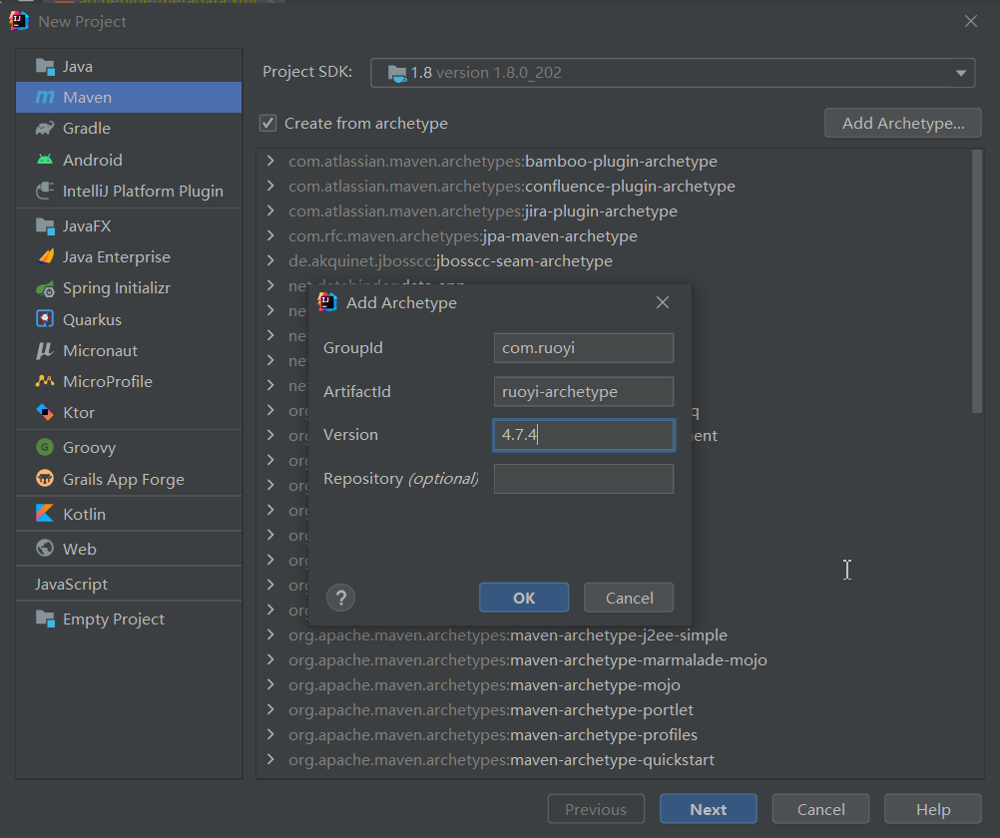
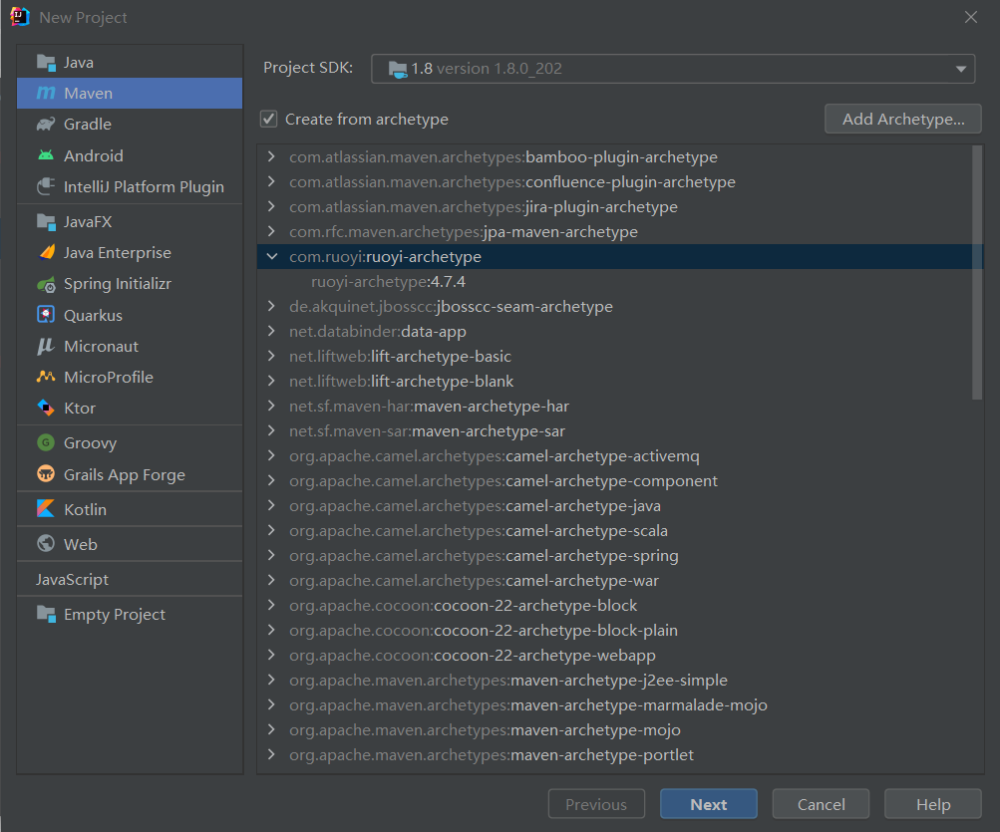
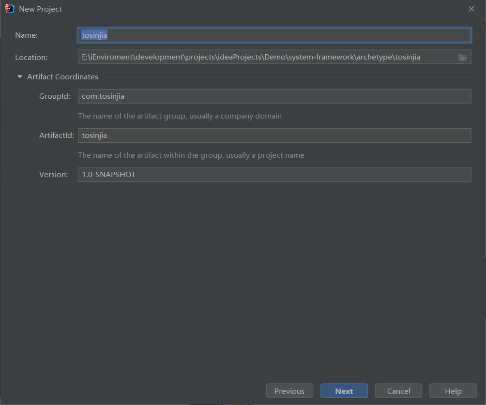
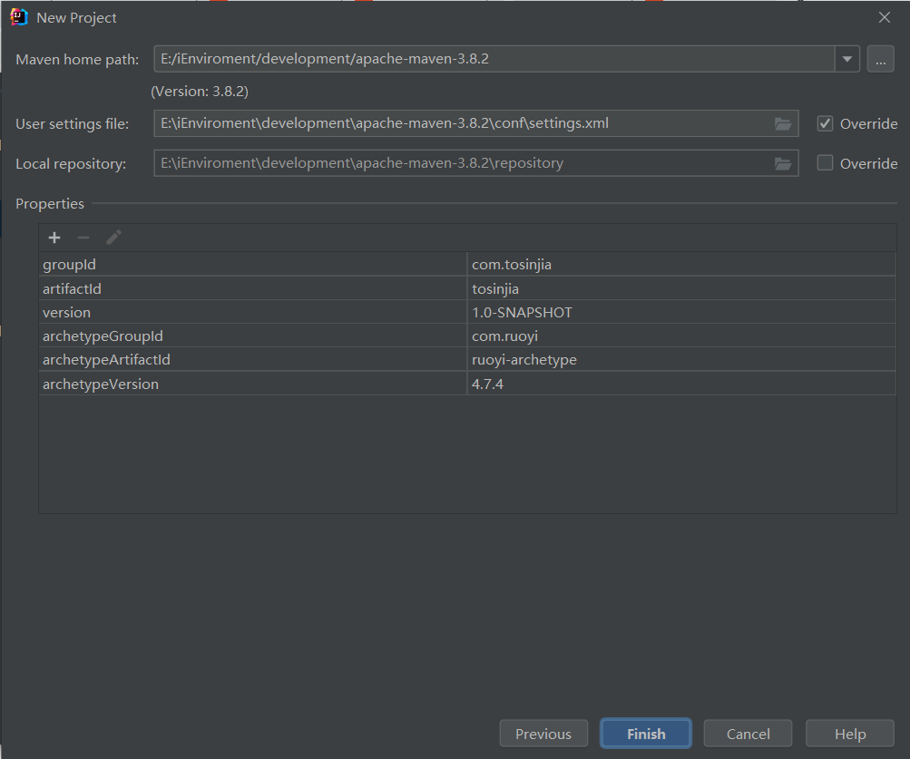

# Maven
[[TOC]]

## 脚手架
- [Maven脚手架最佳实践](https://blog.csdn.net/z69183787/article/details/104754411)
- [Maven之自定义archetype生成项目骨架(构建脚手架项目)](https://blog.csdn.net/btt2013/article/details/125173893)
- [Maven Archetype 多 Module 自定义代码脚手架](https://juejin.cn/post/7052965570660007967)
- [手把手教你创建项目maven脚手架，maven archetype](https://blog.csdn.net/typedefJava/article/details/122453417)

### 创建Archetype

#### 创建Archetype
```
E:\iEnviroment\development\projects\ideaProjects\Demo\system-framework\RuoYi>mvn archetype:create-from-project
[INFO] Scanning for projects...
[INFO] ------------------------------------------------------------------------
[INFO] Reactor Build Order:
[INFO]
[INFO] ruoyi                                                              [pom]
[INFO] ruoyi-common                                                       [jar]
[INFO] ruoyi-system                                                       [jar]
[INFO] ruoyi-framework                                                    [jar]
[INFO] ruoyi-quartz                                                       [jar]
[INFO] ruoyi-generator                                                    [jar]
[INFO] ruoyi-admin                                                        [jar]
[INFO]
[INFO] --------------------------< com.ruoyi:ruoyi >---------------------------
[INFO] Building ruoyi 4.7.4                                               [1/7]
[INFO] --------------------------------[ pom ]---------------------------------
[INFO]
[INFO] >>> maven-archetype-plugin:3.2.1:create-from-project (default-cli) > generate-sources @ ruoyi >>>
[INFO]
[INFO] <<< maven-archetype-plugin:3.2.1:create-from-project (default-cli) < generate-sources @ ruoyi <<<
[INFO]
[INFO]
[INFO] --- maven-archetype-plugin:3.2.1:create-from-project (default-cli) @ ruoyi ---
[INFO] Setting default groupId: com.ruoyi
[INFO] Setting default artifactId: ruoyi
[INFO] Setting default version: 4.7.4
[INFO] Setting default package: com.ruoyi
[WARN] Maven will be executed in interactive mode, but no input stream has been configured for this MavenInvoker instance.
[INFO] Scanning for projects...
[INFO]
[INFO] ---------------------< com.ruoyi:ruoyi-archetype >----------------------
[INFO] Building ruoyi-archetype 4.7.4
[INFO] --------------------------[ maven-archetype ]---------------------------
[INFO]
[INFO] --- maven-resources-plugin:3.2.0:resources (default-resources) @ ruoyi-archetype ---
[WARNING] Using platform encoding (GBK actually) to copy filtered resources, i.e. build is platform dependent!
[INFO] Using 'null' encoding to copy filtered properties files.
[INFO] Copying 678 resources
[INFO]
[INFO] --- maven-resources-plugin:3.2.0:testResources (default-testResources) @ ruoyi-archetype ---
[WARNING] Using platform encoding (GBK actually) to copy filtered resources, i.e. build is platform dependent!
[INFO] Using 'null' encoding to copy filtered properties files.
[INFO] Copying 2 resources
[INFO]
[INFO] --- maven-archetype-plugin:3.2.1:jar (default-jar) @ ruoyi-archetype ---
[INFO] Building archetype jar: E:\iEnviroment\development\projects\ideaProjects\Demo\system-framework\RuoYi\target\generated-sources\archetype\target\ruoyi-archetype-4.7.4.jar
[INFO] Building jar: E:\iEnviroment\development\projects\ideaProjects\Demo\system-framework\RuoYi\target\generated-sources\archetype\target\ruoyi-archetype-4.7.4.jar
[INFO] ------------------------------------------------------------------------
[INFO] BUILD SUCCESS
[INFO] ------------------------------------------------------------------------
[INFO] Total time:  5.841 s
[INFO] Finished at: 2022-06-18T22:34:25+08:00
[INFO] ------------------------------------------------------------------------
[INFO] Archetype project created in E:\iEnviroment\development\projects\ideaProjects\Demo\system-framework\RuoYi\target\generated-sources\archetype
[INFO] ------------------------------------------------------------------------
[INFO] Reactor Summary for ruoyi 4.7.4:
[INFO]
[INFO] ruoyi .............................................. SUCCESS [ 13.078 s]
[INFO] ruoyi-common ....................................... SKIPPED
[INFO] ruoyi-system ....................................... SKIPPED
[INFO] ruoyi-framework .................................... SKIPPED
[INFO] ruoyi-quartz ....................................... SKIPPED
[INFO] ruoyi-generator .................................... SKIPPED
[INFO] ruoyi-admin ........................................ SKIPPED
[INFO] ------------------------------------------------------------------------
[INFO] BUILD SUCCESS
[INFO] ------------------------------------------------------------------------
[INFO] Total time:  13.731 s
[INFO] Finished at: 2022-06-18T22:34:25+08:00
[INFO] ------------------------------------------------------------------------

```

- 这里最核心的部分就在于怎么修改`target/generated-sources/archetype/src/main/resources/archetype-resources`下的文件。
- 如果不修改直接继续的话，最终生成的项目会发现module的名称不会变，包名也不会变，代码里引用的会有一堆报错。
##### 完善补充
1. 在项目根目录下添加 archetype.properties，参考maven官方文档，以下配置仅供参考
```
# 指定哪些文件或目录不打包到 archetype
excludePatterns=archetype.properties,*.iml,.idea/,.idea/libraries,logs/,bin/,doc/,sql/,ry.bat,ry.sh

# 设置变量（由于.gitignore不能直接打包到archetype，并且不能通过archetype生成到新的项目）
gitignore=.gitignore

# 自定义 archetype 相关配置（不设置则会使用默认的，也就是当前项目配置为基础 + archetype）
archetype.groupId=com.ruoyi
archetype.artifactId=ruoyi-archetype
# 不指定版本则跟随当前项目
#archetype.version=4.7.4
```
2. 复制项目.gitignore文件，并重命名为 __gitignore__
3. 检查项目各项配置，确认无误之后，在项目根目录下执行命令
```
E:\iEnviroment\development\projects\ideaProjects\Demo\system-framework\RuoYi>mvn archetype:create-from-project -Darchetype.properties=archetype.properties
```

#### 修改父pom
1. 找到根目录的pom文件`target/generated-sources/archetype/src/main/resources/archetype-resources/pom.xml`，会发现缺少module信息，这个必须加上。
```
    <modules>
        <module>${rootArtifactId}-admin</module>
        <module>${rootArtifactId}-framework</module>
        <module>${rootArtifactId}-system</module>
        <module>${rootArtifactId}-quartz</module>
        <module>${rootArtifactId}-generator</module>
        <module>${rootArtifactId}-common</module>
    </modules>
```
2. 父pom依赖引用的每个module也要修改，groupId 和 artifactId 按照以下的方式来改，不要写死！！
```
    <!-- 依赖声明 -->
    <dependencyManagement>
        <dependencies>
            ... ...
            <!-- 定时任务-->
            <dependency>
                <groupId>${groupId}</groupId>
                <artifactId>${rootArtifactId}-quartz</artifactId>
                <version>${version}</version>
            </dependency>

            <!-- 代码生成-->
            <dependency>
                <groupId>${groupId}</groupId>
                <artifactId>${rootArtifactId}-generator</artifactId>
                <version>${version}</version>
            </dependency>

            <!-- 核心模块-->
            <dependency>
                <groupId>${groupId}</groupId>
                <artifactId>${rootArtifactId}-framework</artifactId>
                <version>${version}</version>
            </dependency>

            <!-- 系统模块-->
            <dependency>
                <groupId>${groupId}</groupId>
                <artifactId>${rootArtifactId}-system</artifactId>
                <version>${version}</version>
            </dependency>

            <!-- 通用工具-->
            <dependency>
                <groupId>${groupId}</groupId>
                <artifactId>${rootArtifactId}-common</artifactId>
                <version>${version}</version>
            </dependency>

        </dependencies>
    </dependencyManagement>

```
#### 修改module
- 这个就是图中的问题，默认生成的module可能就是模板项目的名字，需要修改成类似__rootArtifactId__-client这种形式，注意是双下划线。
- 然后module中的互相引用 groupId 和 artifactId 按照父 pom 的方式对应修改。

```
    <dependencies>

        <!-- 核心模块-->
        <dependency>
            <groupId>${groupId}</groupId>
            <artifactId>${rootArtifactId}-framework</artifactId>
        </dependency>

        <!-- 定时任务-->
        <dependency>
            <groupId>${groupId}</groupId>
            <artifactId>${rootArtifactId}-quartz</artifactId>
        </dependency>

        <!-- 代码生成-->
        <dependency>
            <groupId>${groupId}</groupId>
            <artifactId>${rootArtifactId}-generator</artifactId>
        </dependency>

    </dependencies>
```

#### 补充修改
1. target/generated-sources/archetype/src/main/resources/archetype-resources/__rootArtifactId__-admin/src/main/resources/application.yml
```
server:
  # 服务器的HTTP端口，默认为80
  port: ${serverPort}

# MyBatis
mybatis:
    # 搜索指定包别名
    typeAliasesPackage: ${groupId}.**.domain
```


#### archetype-metadata 修改
0. 补充修改`target/generated-sources/archetype/src/test/resources/projects/basic/archetype.properties`
```{7}
#Mon Jun 20 14:29:34 CST 2022
package=it.pkg
version=0.1-SNAPSHOT
groupId=archetype.it
gitignore=.gitignore
artifactId=basic
serverPort=8080
```


1. 找到`target/generated-sources/archetype/src/main/resources/META-INF/maven/archetype-metadata.xml`文件，确保modules相关的部分，重点注意看 id 、dir、name 的书写方式。
```{9-12,68-73}
<?xml version="1.0" encoding="UTF-8"?>
<archetype-descriptor xsi:schemaLocation="https://maven.apache.org/plugins/maven-archetype-plugin/archetype-descriptor/1.1.0 http://maven.apache.org/xsd/archetype-descriptor-1.1.0.xsd" name="ruoyi"
    xmlns="https://maven.apache.org/plugins/maven-archetype-plugin/archetype-descriptor/1.1.0"
    xmlns:xsi="http://www.w3.org/2001/XMLSchema-instance">
  <requiredProperties>
    <requiredProperty key="gitignore">
      <defaultValue>.gitignore</defaultValue>
    </requiredProperty>
    <requiredProperty key="serverPort">
      <!-- 也可以加上defaultValue，则变成非必填 -->
      <!--      <defaultValue>8080</defaultValue>-->
    </requiredProperty>
  </requiredProperties>
  <fileSets>
    <fileSet filtered="true" encoding="UTF-8">
      <directory>sql</directory>
      <includes>
        <include>**/*.html</include>
      </includes>
    </fileSet>
    <fileSet encoding="UTF-8">
      <directory>bin</directory>
      <includes>
        <include>**/*.bat</include>
      </includes>
    </fileSet>
    <fileSet encoding="UTF-8">
      <directory>doc</directory>
      <includes>
        <include>**/*.docx</include>
      </includes>
    </fileSet>
    <fileSet encoding="UTF-8">
      <directory>.github</directory>
      <includes>
        <include>**/*.yml</include>
      </includes>
    </fileSet>
    <fileSet encoding="UTF-8">
      <directory>sql</directory>
      <includes>
        <include>**/*.pdm</include>
        <include>**/*.sql</include>
      </includes>
    </fileSet>
    <fileSet encoding="UTF-8">
      <directory></directory>
      <includes>
        <include>.gitignore</include>
        <include>LICENSE</include>
        <include>README.md</include>
        <include>ry.bat</include>
        <include>ry.sh</include>
        <include>__gitignore__</include>
      </includes>
    </fileSet>
  </fileSets>
  <modules>
    <module id="${rootArtifactId}-admin" dir="__rootArtifactId__-admin" name="${rootArtifactId}-admin">
      <fileSets>
        <fileSet filtered="true" packaged="true" encoding="UTF-8">
          <directory>src/main/java</directory>
          <includes>
            <include>**/*.java</include>
          </includes>
        </fileSet>

        <fileSet encoding="UTF-8" filtered="true">
          <directory>src/main/resources</directory>
          <includes>
            <include>**/*.yml</include>
          </includes>
        </fileSet>
        <fileSet filtered="true" encoding="UTF-8">
          <directory>src/main/resources</directory>
          <includes>
            <include>**/*.txt</include>
            <include>**/*.xml</include>
            <include>**/*.html</include>
            <include>**/*.properties</include>
          </includes>
        </fileSet>
        <fileSet encoding="UTF-8">
          <directory>src/main/resources</directory>
          <includes>
            <include>**/*.otf</include>
            <include>**/*.jpg</include>
            <include>**/*.css</include>
            <include>**/*.gif</include>
            <include>**/*.svg</include>
            <include>**/*.ttf</include>
            <include>**/*.png</include>
            <include>**/*.js</include>
            <include>**/*.eot</include>
            <include>**/*.woff</include>
            <include>**/*.ico</include>
            <include>**/*.yml</include>
            <include>**/*.woff2</include>
          </includes>
        </fileSet>
      </fileSets>
    </module>
    <module id="${rootArtifactId}-framework" dir="__rootArtifactId__-framework" name="${rootArtifactId}-framework">
      <fileSets>
        <fileSet filtered="true" packaged="true" encoding="UTF-8">
          <directory>src/main/java</directory>
          <includes>
            <include>**/*.java</include>
          </includes>
        </fileSet>
      </fileSets>
    </module>
    <module id="${rootArtifactId}-system" dir="__rootArtifactId__-system" name="${rootArtifactId}-system">
      <fileSets>
        <fileSet filtered="true" packaged="true" encoding="UTF-8">
          <directory>src/main/java</directory>
          <includes>
            <include>**/*.java</include>
          </includes>
        </fileSet>
        <fileSet filtered="true" encoding="UTF-8">
          <directory>src/main/resources</directory>
          <includes>
            <include>**/*.xml</include>
          </includes>
        </fileSet>
      </fileSets>
    </module>
    <module id="${rootArtifactId}-quartz" dir="__rootArtifactId__-quartz" name="${rootArtifactId}-quartz">
      <fileSets>
        <fileSet filtered="true" packaged="true" encoding="UTF-8">
          <directory>src/main/java</directory>
          <includes>
            <include>**/*.java</include>
          </includes>
        </fileSet>
        <fileSet filtered="true" encoding="UTF-8">
          <directory>src/main/resources</directory>
          <includes>
            <include>**/*.xml</include>
            <include>**/*.html</include>
          </includes>
        </fileSet>
      </fileSets>
    </module>
    <module id="${rootArtifactId}-generator" dir="__rootArtifactId__-generator" name="${rootArtifactId}-generator">
      <fileSets>
        <fileSet filtered="true" packaged="true" encoding="UTF-8">
          <directory>src/main/java</directory>
          <includes>
            <include>**/*.java</include>
          </includes>
        </fileSet>
        <fileSet filtered="true" encoding="UTF-8">
          <directory>src/main/resources</directory>
          <includes>
            <include>**/*.xml</include>
            <include>**/*.vm</include>
            <include>**/*.html</include>
          </includes>
        </fileSet>
        <fileSet encoding="UTF-8">
          <directory>src/main/resources</directory>
          <includes>
            <include>**/*.yml</include>
          </includes>
        </fileSet>
      </fileSets>
    </module>
    <module id="${rootArtifactId}-common" dir="__rootArtifactId__-common" name="${rootArtifactId}-common">
      <fileSets>
        <fileSet filtered="true" packaged="true" encoding="UTF-8">
          <directory>src/main/java</directory>
          <includes>
            <include>**/*.java</include>
          </includes>
        </fileSet>
      </fileSets>
    </module>
  </modules>
</archetype-descriptor>
```
2. 进入 target/generated-sources/archetype目录，执行命令
```{68-69}
E:\iEnviroment\development\projects\ideaProjects\Demo\system-framework\RuoYi\target\generated-sources\archetype>mvn clean
[INFO] Scanning for projects...
[INFO]
[INFO] ---------------------< com.ruoyi:ruoyi-archetype >----------------------
[INFO] Building ruoyi-archetype 4.7.4
[INFO] --------------------------[ maven-archetype ]---------------------------
[INFO]
[INFO] --- maven-clean-plugin:2.5:clean (default-clean) @ ruoyi-archetype ---
[INFO] Deleting E:\iEnviroment\development\projects\ideaProjects\Demo\system-framework\RuoYi\target\generated-sources\archetype\target
[INFO] ------------------------------------------------------------------------
[INFO] BUILD SUCCESS
[INFO] ------------------------------------------------------------------------
[INFO] Total time:  1.229 s
[INFO] Finished at: 2022-06-18T23:11:08+08:00
[INFO] ------------------------------------------------------------------------

E:\iEnviroment\development\projects\ideaProjects\Demo\system-framework\RuoYi\target\generated-sources\archetype>mvn install
[INFO] Scanning for projects...
[INFO]
[INFO] ---------------------< com.ruoyi:ruoyi-archetype >----------------------
[INFO] Building ruoyi-archetype 4.7.4
[INFO] --------------------------[ maven-archetype ]---------------------------
[INFO]
[INFO] --- maven-resources-plugin:3.2.0:resources (default-resources) @ ruoyi-archetype ---
[WARNING] Using platform encoding (GBK actually) to copy filtered resources, i.e. build is platform dependent!
[INFO] Using 'null' encoding to copy filtered properties files.
[INFO] Copying 678 resources
[INFO]
[INFO] --- maven-resources-plugin:3.2.0:testResources (default-testResources) @ ruoyi-archetype ---
[WARNING] Using platform encoding (GBK actually) to copy filtered resources, i.e. build is platform dependent!
[INFO] Using 'null' encoding to copy filtered properties files.
[INFO] Copying 2 resources
[INFO]
[INFO] --- maven-archetype-plugin:3.2.1:jar (default-jar) @ ruoyi-archetype ---
[INFO] Building archetype jar: E:\iEnviroment\development\projects\ideaProjects\Demo\system-framework\RuoYi\target\generated-sources\archetype\target\ruoyi-archetype-4.7.4.jar
[INFO] Building jar: E:\iEnviroment\development\projects\ideaProjects\Demo\system-framework\RuoYi\target\generated-sources\archetype\target\ruoyi-archetype-4.7.4.jar
[INFO]
[INFO] --- maven-archetype-plugin:3.2.1:integration-test (default-integration-test) @ ruoyi-archetype ---
[INFO] Processing Archetype IT project: basic
[INFO] ----------------------------------------------------------------------------
[INFO] Using following parameters for creating project from Archetype: ruoyi-archetype:4.7.4
[INFO] ----------------------------------------------------------------------------
[INFO] Parameter: groupId, Value: archetype.it
[INFO] Parameter: artifactId, Value: basic
[INFO] Parameter: version, Value: 0.1-SNAPSHOT
[INFO] Parameter: package, Value: it.pkg
[INFO] Parameter: packageInPathFormat, Value: it/pkg
[INFO] Parameter: version, Value: 0.1-SNAPSHOT
[INFO] Parameter: package, Value: it.pkg
[INFO] Parameter: groupId, Value: archetype.it
[INFO] Parameter: artifactId, Value: basic
[INFO] Parent element not overwritten in E:\iEnviroment\development\projects\ideaProjects\Demo\system-framework\RuoYi\target\generated-sources\archetype\target\test-classes\projects\ba
sic\project\basic\basic-admin\pom.xml
[INFO] Parent element not overwritten in E:\iEnviroment\development\projects\ideaProjects\Demo\system-framework\RuoYi\target\generated-sources\archetype\target\test-classes\projects\ba
sic\project\basic\basic-framework\pom.xml
[INFO] Parent element not overwritten in E:\iEnviroment\development\projects\ideaProjects\Demo\system-framework\RuoYi\target\generated-sources\archetype\target\test-classes\projects\ba
sic\project\basic\basic-system\pom.xml
[INFO] Parent element not overwritten in E:\iEnviroment\development\projects\ideaProjects\Demo\system-framework\RuoYi\target\generated-sources\archetype\target\test-classes\projects\ba
sic\project\basic\basic-quartz\pom.xml
[INFO] Parent element not overwritten in E:\iEnviroment\development\projects\ideaProjects\Demo\system-framework\RuoYi\target\generated-sources\archetype\target\test-classes\projects\ba
sic\project\basic\basic-generator\pom.xml
[INFO] Parent element not overwritten in E:\iEnviroment\development\projects\ideaProjects\Demo\system-framework\RuoYi\target\generated-sources\archetype\target\test-classes\projects\ba
sic\project\basic\basic-common\pom.xml
[INFO] Project created from Archetype in dir: E:\iEnviroment\development\projects\ideaProjects\Demo\system-framework\RuoYi\target\generated-sources\archetype\target\test-classes\projec
ts\basic\project\basic
[INFO]
[INFO] --- maven-install-plugin:3.0.0-M1:install (default-install) @ ruoyi-archetype ---
[INFO] Installing E:\iEnviroment\development\projects\ideaProjects\Demo\system-framework\RuoYi\target\generated-sources\archetype\target\ruoyi-archetype-4.7.4.jar to E:\iEnviroment\development\apache-maven-3.8.2\repository\com\ruoyi\ruoyi-archetype\4.7.4\ruoyi-archetype-4.7.4.jar
[INFO] Installing E:\iEnviroment\development\projects\ideaProjects\Demo\system-framework\RuoYi\target\generated-sources\archetype\pom.xml to E:\iEnviroment\development\apache-maven-3.8.2\repository\com\ruoyi\ruoyi-archetype\4.7.4\ruoyi-archetype-4.7.4.pom
[INFO]
[INFO] --- maven-archetype-plugin:3.2.1:update-local-catalog (default-update-local-catalog) @ ruoyi-archetype ---
[INFO] ------------------------------------------------------------------------
[INFO] BUILD SUCCESS
[INFO] ------------------------------------------------------------------------
[INFO] Total time:  6.963 s
[INFO] Finished at: 2022-06-18T23:13:57+08:00
[INFO] ------------------------------------------------------------------------
```
- E:\iEnviroment\development\apache-maven-3.8.2\repository\archetype-catalog.xml
```
<?xml version="1.0" encoding="UTF-8"?>
<archetype-catalog xsi:schemaLocation="http://maven.apache.org/plugins/maven-archetype-plugin/archetype-catalog/1.0.0 http://maven.apache.org/xsd/archetype-catalog-1.0.0.xsd"
    xmlns="http://maven.apache.org/plugins/maven-archetype-plugin/archetype-catalog/1.0.0"
    xmlns:xsi="http://www.w3.org/2001/XMLSchema-instance">
  <archetypes>
    <archetype>
      <groupId>com.ruoyi</groupId>
      <artifactId>ruoyi-archetype</artifactId>
      <version>4.7.4</version>
      <description>若依管理系统</description>
    </archetype>
  </archetypes>
</archetype-catalog>
```

3. 执行下mvn deploy上传到nexus
    - target/generated-sources/archetype/pom.xml
    ```
    <!--指定仓库地址-->
    <distributionManagement>
        <repository>
        <!--此名称要和settings.xml中设置的ID一致-->
        <id>test</id>
        <url>http://192.168.56.106:8081/repository/test-release/</url>
        </repository>
    </distributionManagement>
    ```
```
E:\iEnviroment\development\projects\ideaProjects\Demo\system-framework\RuoYi\target\generated-sources\archetype>mvn deploy
[INFO] Scanning for projects...
[INFO]
[INFO] ---------------------< com.ruoyi:ruoyi-archetype >----------------------
[INFO] Building ruoyi-archetype 4.7.4
[INFO] --------------------------[ maven-archetype ]---------------------------
[INFO]
[INFO] --- maven-resources-plugin:3.2.0:resources (default-resources) @ ruoyi-archetype ---
[WARNING] Using platform encoding (GBK actually) to copy filtered resources, i.e. build is platform dependent!
[INFO] Using 'null' encoding to copy filtered properties files.
[INFO] Copying 678 resources
[INFO]
[INFO] --- maven-resources-plugin:3.2.0:testResources (default-testResources) @ ruoyi-archetype ---
[WARNING] Using platform encoding (GBK actually) to copy filtered resources, i.e. build is platform dependent!
[INFO] Using 'null' encoding to copy filtered properties files.
[INFO] Copying 2 resources
[INFO]
[INFO] --- maven-archetype-plugin:3.2.1:jar (default-jar) @ ruoyi-archetype ---
[INFO] Building archetype jar: E:\iEnviroment\development\projects\ideaProjects\Demo\system-framework\RuoYi\target\generated-sources\archetype\target\ruoyi-archetype-4.7.4.jar
[INFO] Building jar: E:\iEnviroment\development\projects\ideaProjects\Demo\system-framework\RuoYi\target\generated-sources\archetype\target\ruoyi-archetype-4.7.4.jar
[INFO]
[INFO] --- maven-archetype-plugin:3.2.1:integration-test (default-integration-test) @ ruoyi-archetype ---
[INFO] Processing Archetype IT project: basic
[INFO] ----------------------------------------------------------------------------
[INFO] Using following parameters for creating project from Archetype: ruoyi-archetype:4.7.4
[INFO] ----------------------------------------------------------------------------
[INFO] Parameter: groupId, Value: archetype.it
[INFO] Parameter: artifactId, Value: basic
[INFO] Parameter: version, Value: 0.1-SNAPSHOT
[INFO] Parameter: package, Value: it.pkg
[INFO] Parameter: packageInPathFormat, Value: it/pkg
[INFO] Parameter: version, Value: 0.1-SNAPSHOT
[INFO] Parameter: package, Value: it.pkg
[INFO] Parameter: groupId, Value: archetype.it
[INFO] Parameter: artifactId, Value: basic
[INFO] Parent element not overwritten in E:\iEnviroment\development\projects\ideaProjects\Demo\system-framework\RuoYi\target\generated-sources\archetype\target\test-classes\projects\ba
sic\project\basic\basic-admin\pom.xml
[INFO] Parent element not overwritten in E:\iEnviroment\development\projects\ideaProjects\Demo\system-framework\RuoYi\target\generated-sources\archetype\target\test-classes\projects\ba
sic\project\basic\basic-framework\pom.xml
[INFO] Parent element not overwritten in E:\iEnviroment\development\projects\ideaProjects\Demo\system-framework\RuoYi\target\generated-sources\archetype\target\test-classes\projects\ba
sic\project\basic\basic-system\pom.xml
[INFO] Parent element not overwritten in E:\iEnviroment\development\projects\ideaProjects\Demo\system-framework\RuoYi\target\generated-sources\archetype\target\test-classes\projects\ba
sic\project\basic\basic-quartz\pom.xml
[INFO] Parent element not overwritten in E:\iEnviroment\development\projects\ideaProjects\Demo\system-framework\RuoYi\target\generated-sources\archetype\target\test-classes\projects\ba
sic\project\basic\basic-generator\pom.xml
[INFO] Parent element not overwritten in E:\iEnviroment\development\projects\ideaProjects\Demo\system-framework\RuoYi\target\generated-sources\archetype\target\test-classes\projects\ba
sic\project\basic\basic-common\pom.xml
[INFO] Project created from Archetype in dir: E:\iEnviroment\development\projects\ideaProjects\Demo\system-framework\RuoYi\target\generated-sources\archetype\target\test-classes\projec
ts\basic\project\basic
[INFO]
[INFO] --- maven-install-plugin:3.0.0-M1:install (default-install) @ ruoyi-archetype ---
[INFO] Installing E:\iEnviroment\development\projects\ideaProjects\Demo\system-framework\RuoYi\target\generated-sources\archetype\target\ruoyi-archetype-4.7.4.jar to E:\iEnviroment\dev
elopment\apache-maven-3.8.2\repository\com\ruoyi\ruoyi-archetype\4.7.4\ruoyi-archetype-4.7.4.jar
[INFO] Installing E:\iEnviroment\development\projects\ideaProjects\Demo\system-framework\RuoYi\target\generated-sources\archetype\pom.xml to E:\iEnviroment\development\apache-maven-3.8
.2\repository\com\ruoyi\ruoyi-archetype\4.7.4\ruoyi-archetype-4.7.4.pom
[INFO]
[INFO] --- maven-archetype-plugin:3.2.1:update-local-catalog (default-update-local-catalog) @ ruoyi-archetype ---
[INFO]
[INFO] --- maven-deploy-plugin:3.0.0-M2:deploy (default-deploy) @ ruoyi-archetype ---
Uploading to test: http://192.168.56.106:8081/repository/test-release/com/ruoyi/ruoyi-archetype/4.7.4/ruoyi-archetype-4.7.4.jar
Uploaded to test: http://192.168.56.106:8081/repository/test-release/com/ruoyi/ruoyi-archetype/4.7.4/ruoyi-archetype-4.7.4.jar (4.1 MB at 1.6 MB/s)
Uploading to test: http://192.168.56.106:8081/repository/test-release/com/ruoyi/ruoyi-archetype/4.7.4/ruoyi-archetype-4.7.4.pom
Uploaded to test: http://192.168.56.106:8081/repository/test-release/com/ruoyi/ruoyi-archetype/4.7.4/ruoyi-archetype-4.7.4.pom (1.3 kB at 2.9 kB/s)
Downloading from test: http://192.168.56.106:8081/repository/test-release/com/ruoyi/ruoyi-archetype/maven-metadata.xml
Uploading to test: http://192.168.56.106:8081/repository/test-release/com/ruoyi/ruoyi-archetype/maven-metadata.xml
Uploaded to test: http://192.168.56.106:8081/repository/test-release/com/ruoyi/ruoyi-archetype/maven-metadata.xml (304 B at 819 B/s)
[INFO] ------------------------------------------------------------------------
[INFO] BUILD SUCCESS
[INFO] ------------------------------------------------------------------------
[INFO] Total time:  11.669 s
[INFO] Finished at: 2022-06-19T00:20:32+08:00
[INFO] ------------------------------------------------------------------------
```

### 使用Archetype
#### 命令行

```{36-40,46}
E:\iEnviroment\development\projects\ideaProjects\Demo\system-framework\archetype>mvn archetype:generate -DarchetypeCatalog=local
[INFO] Scanning for projects...
Downloading from alimaven: http://maven.aliyun.com/nexus/content/groups/public/org/apache/maven/plugins/maven-antrun-plugin/1.3/maven-antrun-plugin-1.3.pom
Downloaded from alimaven: http://maven.aliyun.com/nexus/content/groups/public/org/apache/maven/plugins/maven-antrun-plugin/1.3/maven-antrun-plugin-1.3.pom (0 B at 0 B/s)
Downloading from alimaven: http://maven.aliyun.com/nexus/content/groups/public/org/apache/maven/plugins/maven-plugins/12/maven-plugins-12.pom
Downloaded from alimaven: http://maven.aliyun.com/nexus/content/groups/public/org/apache/maven/plugins/maven-plugins/12/maven-plugins-12.pom (0 B at 0 B/s)
Downloading from alimaven: http://maven.aliyun.com/nexus/content/groups/public/org/apache/maven/plugins/maven-antrun-plugin/1.3/maven-antrun-plugin-1.3.jar
Downloaded from alimaven: http://maven.aliyun.com/nexus/content/groups/public/org/apache/maven/plugins/maven-antrun-plugin/1.3/maven-antrun-plugin-1.3.jar (0 B at 0 B/s)
Downloading from alimaven: http://maven.aliyun.com/nexus/content/groups/public/org/apache/maven/plugins/maven-assembly-plugin/2.2-beta-5/maven-assembly-plugin-2.2-beta-5.pom
Downloaded from alimaven: http://maven.aliyun.com/nexus/content/groups/public/org/apache/maven/plugins/maven-assembly-plugin/2.2-beta-5/maven-assembly-plugin-2.2-beta-5.pom (0 B at 0 B/s)
Downloading from alimaven: http://maven.aliyun.com/nexus/content/groups/public/org/apache/maven/plugins/maven-plugins/16/maven-plugins-16.pom
Downloaded from alimaven: http://maven.aliyun.com/nexus/content/groups/public/org/apache/maven/plugins/maven-plugins/16/maven-plugins-16.pom (0 B at 0 B/s)
Downloading from alimaven: http://maven.aliyun.com/nexus/content/groups/public/org/apache/maven/plugins/maven-assembly-plugin/2.2-beta-5/maven-assembly-plugin-2.2-beta-5.jar
Downloaded from alimaven: http://maven.aliyun.com/nexus/content/groups/public/org/apache/maven/plugins/maven-assembly-plugin/2.2-beta-5/maven-assembly-plugin-2.2-beta-5.jar (0 B at 0 B/s)
Downloading from alimaven: http://maven.aliyun.com/nexus/content/groups/public/org/apache/maven/plugins/maven-release-plugin/2.5.3/maven-release-plugin-2.5.3.pom
Downloaded from alimaven: http://maven.aliyun.com/nexus/content/groups/public/org/apache/maven/plugins/maven-release-plugin/2.5.3/maven-release-plugin-2.5.3.pom (0 B at 0 B/s)
Downloading from alimaven: http://maven.aliyun.com/nexus/content/groups/public/org/apache/maven/release/maven-release/2.5.3/maven-release-2.5.3.pom
Downloaded from alimaven: http://maven.aliyun.com/nexus/content/groups/public/org/apache/maven/release/maven-release/2.5.3/maven-release-2.5.3.pom (0 B at 0 B/s)
Downloading from alimaven: http://maven.aliyun.com/nexus/content/groups/public/org/apache/maven/plugins/maven-release-plugin/2.5.3/maven-release-plugin-2.5.3.jar
Downloaded from alimaven: http://maven.aliyun.com/nexus/content/groups/public/org/apache/maven/plugins/maven-release-plugin/2.5.3/maven-release-plugin-2.5.3.jar (0 B at 0 B/s)
[INFO]
[INFO] ------------------< org.apache.maven:standalone-pom >-------------------
[INFO] Building Maven Stub Project (No POM) 1
[INFO] --------------------------------[ pom ]---------------------------------
[INFO]
[INFO] >>> maven-archetype-plugin:3.2.1:generate (default-cli) > generate-sources @ standalone-pom >>>
[INFO]
[INFO] <<< maven-archetype-plugin:3.2.1:generate (default-cli) < generate-sources @ standalone-pom <<<
[INFO]
[INFO]
[INFO] --- maven-archetype-plugin:3.2.1:generate (default-cli) @ standalone-pom ---
[INFO] Generating project in Interactive mode
[INFO] No archetype defined. Using maven-archetype-quickstart (org.apache.maven.archetypes:maven-archetype-quickstart:1.0)
Choose archetype:
1: local -> com.ruoyi:ruoyi-archetype (若依管理系统)
Choose a number or apply filter (format: [groupId:]artifactId, case sensitive contains): : 1
Define value for property 'groupId': com.tosin
Define value for property 'artifactId': tosin
Define value for property 'version' 1.0-SNAPSHOT: :
Define value for property 'package' com.tosin: :
Confirm properties configuration:
groupId: com.tosin
artifactId: tosin
version: 1.0-SNAPSHOT
package: com.tosin
 Y: :
[INFO] ----------------------------------------------------------------------------
[INFO] Using following parameters for creating project from Archetype: ruoyi-archetype:4.7.4
[INFO] ----------------------------------------------------------------------------
[INFO] Parameter: groupId, Value: com.tosin
[INFO] Parameter: artifactId, Value: tosin
[INFO] Parameter: version, Value: 1.0-SNAPSHOT
[INFO] Parameter: package, Value: com.tosin
[INFO] Parameter: packageInPathFormat, Value: com/tosin
[INFO] Parameter: package, Value: com.tosin
[INFO] Parameter: version, Value: 1.0-SNAPSHOT
[INFO] Parameter: groupId, Value: com.tosin
[INFO] Parameter: artifactId, Value: tosin
[INFO] Parent element not overwritten in E:\iEnviroment\development\projects\ideaProjects\Demo\system-framework\archetype\tosin\tosin-admin\pom.xml
[INFO] Parent element not overwritten in E:\iEnviroment\development\projects\ideaProjects\Demo\system-framework\archetype\tosin\tosin-framework\pom.xml
[INFO] Parent element not overwritten in E:\iEnviroment\development\projects\ideaProjects\Demo\system-framework\archetype\tosin\tosin-system\pom.xml
[INFO] Parent element not overwritten in E:\iEnviroment\development\projects\ideaProjects\Demo\system-framework\archetype\tosin\tosin-quartz\pom.xml
[INFO] Parent element not overwritten in E:\iEnviroment\development\projects\ideaProjects\Demo\system-framework\archetype\tosin\tosin-generator\pom.xml
[INFO] Parent element not overwritten in E:\iEnviroment\development\projects\ideaProjects\Demo\system-framework\archetype\tosin\tosin-common\pom.xml
[INFO] Project created from Archetype in dir: E:\iEnviroment\development\projects\ideaProjects\Demo\system-framework\archetype\tosin
[INFO] ------------------------------------------------------------------------
[INFO] BUILD SUCCESS
[INFO] ------------------------------------------------------------------------
[INFO] Total time:  06:22 min
[INFO] Finished at: 2022-06-18T23:30:54+08:00
[INFO] ------------------------------------------------------------------------
```
##### 完整形式
```
mvn archetype:generate -DarchetypeCatalog=local -DgroupId=com.tosinjia -DartifactId=tosinjia -Dversion=0.0.1-SNAPSHOT -Dpackage=com.tosinjia -DserverPort=8000 -DarchetypeGroupId=com.ruoyi -DarchetypeArtifactId=ruoyi-archetype -DarchetypeVersion=4.7.4 -DinteractiveMode=false
```

##### 参数介绍
- groupId、artifactId、version、package(源码包名)、serverPort 需要生成的项目配置
- archetypeGroupId、archetypeArtifactId、archetypeVersion 指定生成项目的原型
- interactiveMode（交互模式） 为必填参数，默认为true。执行时需要进行二次确认，如果不想要二次确认，则可以设置为false
#### IDEA
1. 新建项目，选择 Maven，勾选 Create from archetype，选择 Add Archetype...，添加后不显示

2. C:\Users\User\AppData\Local\JetBrains\IntelliJIdea2021.2\Maven\Indices\UserArchetypes.xml
```
<archetypes>
    <archetype groupId="com.ruoyi" artifactId="ruoyi-archetype" version="4.7.4" />
</archetypes>
```
3. 使用Archetype创建项目




- [IDEA如何添加和删除自定义的Archetype原型](https://blog.csdn.net/gao_zhennan/article/details/123261538)
- [如何在 IDEA 中添加 Maven 项目的 Archetype（解决添加不起作用的问题）](https://blog.csdn.net/qq_52827181/article/details/121479427)

### 异常：Invoker process ended with result different than 0!
```
E:\iEnviroment\development\projects\ideaProjects\Demo\system-framework\RuoYi>mvn archetype:create-from-project
[INFO] Scanning for projects...
[INFO] ------------------------------------------------------------------------
[INFO] Reactor Build Order:
[INFO]
[INFO] ruoyi                                                              [pom]
[INFO] ruoyi-common                                                       [jar]
[INFO] ruoyi-system                                                       [jar]
[INFO] ruoyi-framework                                                    [jar]
[INFO] ruoyi-quartz                                                       [jar]
[INFO] ruoyi-generator                                                    [jar]
[INFO] ruoyi-admin                                                        [jar]
[INFO]
[INFO] --------------------------< com.ruoyi:ruoyi >---------------------------
[INFO] Building ruoyi 4.7.4                                               [1/7]
[INFO] --------------------------------[ pom ]---------------------------------
[INFO]
[INFO] >>> maven-archetype-plugin:3.2.1:create-from-project (default-cli) > generate-sources @ ruoyi >>>
[INFO]
[INFO] <<< maven-archetype-plugin:3.2.1:create-from-project (default-cli) < generate-sources @ ruoyi <<<
[INFO]
[INFO]
[INFO] --- maven-archetype-plugin:3.2.1:create-from-project (default-cli) @ ruoyi ---
[INFO] Setting default groupId: com.ruoyi
[INFO] Setting default artifactId: ruoyi
[INFO] Setting default version: 4.7.4
[INFO] Setting default package: com.ruoyi
[WARN] Maven will be executed in interactive mode, but no input stream has been configured for this MavenInvoker instance.
[ERROR] Error executing Maven.
[ERROR] The specified user settings file does not exist: C:\Users\User\.m2\settings.xml
[INFO] ------------------------------------------------------------------------
[INFO] Reactor Summary for ruoyi 4.7.4:
[INFO]
[INFO] ruoyi .............................................. FAILURE [  8.759 s]
[INFO] ruoyi-common ....................................... SKIPPED
[INFO] ruoyi-system ....................................... SKIPPED
[INFO] ruoyi-framework .................................... SKIPPED
[INFO] ruoyi-quartz ....................................... SKIPPED
[INFO] ruoyi-generator .................................... SKIPPED
[INFO] ruoyi-admin ........................................ SKIPPED
[INFO] ------------------------------------------------------------------------
[INFO] BUILD FAILURE
[INFO] ------------------------------------------------------------------------
[INFO] Total time:  9.519 s
[INFO] Finished at: 2022-06-18T22:22:06+08:00
[INFO] ------------------------------------------------------------------------
[ERROR] Failed to execute goal org.apache.maven.plugins:maven-archetype-plugin:3.2.1:create-from-project (default-cli) on project ruoyi: Invoker process ended with result different tha
n 0! -> [Help 1]
[ERROR]
[ERROR] To see the full stack trace of the errors, re-run Maven with the -e switch.
[ERROR] Re-run Maven using the -X switch to enable full debug logging.
[ERROR]
[ERROR] For more information about the errors and possible solutions, please read the following articles:
[ERROR] [Help 1] http://cwiki.apache.org/confluence/display/MAVEN/MojoFailureException


E:\iEnviroment\development\projects\ideaProjects\Demo\system-framework\RuoYi>mvn -e archetype:create-from-project
[INFO] Error stacktraces are turned on.
[INFO] Scanning for projects...
[INFO] ------------------------------------------------------------------------
[INFO] Reactor Build Order:
[INFO]
[INFO] ruoyi                                                              [pom]
[INFO] ruoyi-common                                                       [jar]
[INFO] ruoyi-system                                                       [jar]
[INFO] ruoyi-framework                                                    [jar]
[INFO] ruoyi-quartz                                                       [jar]
[INFO] ruoyi-generator                                                    [jar]
[INFO] ruoyi-admin                                                        [jar]
[INFO]
[INFO] --------------------------< com.ruoyi:ruoyi >---------------------------
[INFO] Building ruoyi 4.7.4                                               [1/7]
[INFO] --------------------------------[ pom ]---------------------------------
[INFO]
[INFO] >>> maven-archetype-plugin:3.2.1:create-from-project (default-cli) > generate-sources @ ruoyi >>>
[INFO]
[INFO] <<< maven-archetype-plugin:3.2.1:create-from-project (default-cli) < generate-sources @ ruoyi <<<
[INFO]
[INFO]
[INFO] --- maven-archetype-plugin:3.2.1:create-from-project (default-cli) @ ruoyi ---
[INFO] Setting default groupId: com.ruoyi
[INFO] Setting default artifactId: ruoyi
[INFO] Setting default version: 4.7.4
[INFO] Setting default package: com.ruoyi
[WARN] Maven will be executed in interactive mode, but no input stream has been configured for this MavenInvoker instance.
[ERROR] Error executing Maven.
[ERROR] The specified user settings file does not exist: C:\Users\User\.m2\settings.xml
[INFO] ------------------------------------------------------------------------
[INFO] Reactor Summary for ruoyi 4.7.4:
[INFO]
[INFO] ruoyi .............................................. FAILURE [  7.123 s]
[INFO] ruoyi-common ....................................... SKIPPED
[INFO] ruoyi-system ....................................... SKIPPED
[INFO] ruoyi-framework .................................... SKIPPED
[INFO] ruoyi-quartz ....................................... SKIPPED
[INFO] ruoyi-generator .................................... SKIPPED
[INFO] ruoyi-admin ........................................ SKIPPED
[INFO] ------------------------------------------------------------------------
[INFO] BUILD FAILURE
[INFO] ------------------------------------------------------------------------
[INFO] Total time:  7.807 s
[INFO] Finished at: 2022-06-18T22:25:17+08:00
[INFO] ------------------------------------------------------------------------
[ERROR] Failed to execute goal org.apache.maven.plugins:maven-archetype-plugin:3.2.1:create-from-project (default-cli) on project ruoyi: Invoker process ended with result different tha
n 0! -> [Help 1]
org.apache.maven.lifecycle.LifecycleExecutionException: Failed to execute goal org.apache.maven.plugins:maven-archetype-plugin:3.2.1:create-from-project (default-cli) on project ruoyi:
 Invoker process ended with result different than 0!
    at org.apache.maven.lifecycle.internal.MojoExecutor.execute (MojoExecutor.java:215)
    at org.apache.maven.lifecycle.internal.MojoExecutor.execute (MojoExecutor.java:156)
    at org.apache.maven.lifecycle.internal.MojoExecutor.execute (MojoExecutor.java:148)
    at org.apache.maven.lifecycle.internal.LifecycleModuleBuilder.buildProject (LifecycleModuleBuilder.java:117)
    at org.apache.maven.lifecycle.internal.LifecycleModuleBuilder.buildProject (LifecycleModuleBuilder.java:81)
    at org.apache.maven.lifecycle.internal.builder.singlethreaded.SingleThreadedBuilder.build (SingleThreadedBuilder.java:56)
    at org.apache.maven.lifecycle.internal.LifecycleStarter.execute (LifecycleStarter.java:128)
    at org.apache.maven.DefaultMaven.doExecute (DefaultMaven.java:305)
    at org.apache.maven.DefaultMaven.doExecute (DefaultMaven.java:192)
    at org.apache.maven.DefaultMaven.execute (DefaultMaven.java:105)
    at org.apache.maven.cli.MavenCli.execute (MavenCli.java:972)
    at org.apache.maven.cli.MavenCli.doMain (MavenCli.java:293)
    at org.apache.maven.cli.MavenCli.main (MavenCli.java:196)
    at sun.reflect.NativeMethodAccessorImpl.invoke0 (Native Method)
    at sun.reflect.NativeMethodAccessorImpl.invoke (NativeMethodAccessorImpl.java:62)
    at sun.reflect.DelegatingMethodAccessorImpl.invoke (DelegatingMethodAccessorImpl.java:43)
    at java.lang.reflect.Method.invoke (Method.java:498)
    at org.codehaus.plexus.classworlds.launcher.Launcher.launchEnhanced (Launcher.java:282)
    at org.codehaus.plexus.classworlds.launcher.Launcher.launch (Launcher.java:225)
    at org.codehaus.plexus.classworlds.launcher.Launcher.mainWithExitCode (Launcher.java:406)
    at org.codehaus.plexus.classworlds.launcher.Launcher.main (Launcher.java:347)
Caused by: org.apache.maven.plugin.MojoFailureException: Invoker process ended with result different than 0!
    at org.apache.maven.archetype.mojos.CreateArchetypeFromProjectMojo.execute (CreateArchetypeFromProjectMojo.java:267)
    at org.apache.maven.plugin.DefaultBuildPluginManager.executeMojo (DefaultBuildPluginManager.java:137)
    at org.apache.maven.lifecycle.internal.MojoExecutor.execute (MojoExecutor.java:210)
    at org.apache.maven.lifecycle.internal.MojoExecutor.execute (MojoExecutor.java:156)
    at org.apache.maven.lifecycle.internal.MojoExecutor.execute (MojoExecutor.java:148)
    at org.apache.maven.lifecycle.internal.LifecycleModuleBuilder.buildProject (LifecycleModuleBuilder.java:117)
    at org.apache.maven.lifecycle.internal.LifecycleModuleBuilder.buildProject (LifecycleModuleBuilder.java:81)
    at org.apache.maven.lifecycle.internal.builder.singlethreaded.SingleThreadedBuilder.build (SingleThreadedBuilder.java:56)
    at org.apache.maven.lifecycle.internal.LifecycleStarter.execute (LifecycleStarter.java:128)
    at org.apache.maven.DefaultMaven.doExecute (DefaultMaven.java:305)
    at org.apache.maven.DefaultMaven.doExecute (DefaultMaven.java:192)
    at org.apache.maven.DefaultMaven.execute (DefaultMaven.java:105)
    at org.apache.maven.cli.MavenCli.execute (MavenCli.java:972)
    at org.apache.maven.cli.MavenCli.doMain (MavenCli.java:293)
    at org.apache.maven.cli.MavenCli.main (MavenCli.java:196)
    at sun.reflect.NativeMethodAccessorImpl.invoke0 (Native Method)
    at sun.reflect.NativeMethodAccessorImpl.invoke (NativeMethodAccessorImpl.java:62)
    at sun.reflect.DelegatingMethodAccessorImpl.invoke (DelegatingMethodAccessorImpl.java:43)
    at java.lang.reflect.Method.invoke (Method.java:498)
    at org.codehaus.plexus.classworlds.launcher.Launcher.launchEnhanced (Launcher.java:282)
    at org.codehaus.plexus.classworlds.launcher.Launcher.launch (Launcher.java:225)
    at org.codehaus.plexus.classworlds.launcher.Launcher.mainWithExitCode (Launcher.java:406)
    at org.codehaus.plexus.classworlds.launcher.Launcher.main (Launcher.java:347)
[ERROR]
[ERROR] Re-run Maven using the -X switch to enable full debug logging.
[ERROR]
[ERROR] For more information about the errors and possible solutions, please read the following articles:
[ERROR] [Help 1] http://cwiki.apache.org/confluence/display/MAVEN/MojoFailureException


E:\iEnviroment\development\projects\ideaProjects\Demo\system-framework\RuoYi>mvn -eX archetype:create-from-project
[INFO] Error stacktraces are turned on.
[INFO] Scanning for projects...
[INFO] ------------------------------------------------------------------------
[INFO] Reactor Build Order:
[INFO]
[INFO] ruoyi                                                              [pom]
[INFO] ruoyi-common                                                       [jar]
[INFO] ruoyi-system                                                       [jar]
[INFO] ruoyi-framework                                                    [jar]
[INFO] ruoyi-quartz                                                       [jar]
[INFO] ruoyi-generator                                                    [jar]
[INFO] ruoyi-admin                                                        [jar]
[INFO]
[INFO] --------------------------< com.ruoyi:ruoyi >---------------------------
[INFO] Building ruoyi 4.7.4                                               [1/7]
[INFO] --------------------------------[ pom ]---------------------------------
[INFO]
[INFO] ------------------------------------------------------------------------
[INFO] Skipping ruoyi
[INFO] This project has been banned from the build due to previous failures.
[INFO] ------------------------------------------------------------------------
[INFO] ------------------------------------------------------------------------
[INFO] Reactor Summary for ruoyi 4.7.4:
[INFO]
[INFO] ruoyi .............................................. FAILURE [  0.004 s]
[INFO] ruoyi-common ....................................... SKIPPED
[INFO] ruoyi-system ....................................... SKIPPED
[INFO] ruoyi-framework .................................... SKIPPED
[INFO] ruoyi-quartz ....................................... SKIPPED
[INFO] ruoyi-generator .................................... SKIPPED
[INFO] ruoyi-admin ........................................ SKIPPED
[INFO] ------------------------------------------------------------------------
[INFO] BUILD FAILURE
[INFO] ------------------------------------------------------------------------
[INFO] Total time:  0.673 s
[INFO] Finished at: 2022-06-18T22:22:50+08:00
[INFO] ------------------------------------------------------------------------
[ERROR] Unknown lifecycle phase "X". You must specify a valid lifecycle phase or a goal in the format <plugin-prefix>:<goal> or <plugin-group-id>:<plugin-artifact-id>[:<plugin-version>
]:<goal>. Available lifecycle phases are: validate, initialize, generate-sources, process-sources, generate-resources, process-resources, compile, process-classes, generate-test-source
s, process-test-sources, generate-test-resources, process-test-resources, test-compile, process-test-classes, test, prepare-package, package, pre-integration-test, integration-test, po
st-integration-test, verify, install, deploy, pre-clean, clean, post-clean, pre-site, site, post-site, site-deploy. -> [Help 1]
org.apache.maven.lifecycle.LifecyclePhaseNotFoundException: Unknown lifecycle phase "X". You must specify a valid lifecycle phase or a goal in the format <plugin-prefix>:<goal> or <plu
gin-group-id>:<plugin-artifact-id>[:<plugin-version>]:<goal>. Available lifecycle phases are: validate, initialize, generate-sources, process-sources, generate-resources, process-resou
rces, compile, process-classes, generate-test-sources, process-test-sources, generate-test-resources, process-test-resources, test-compile, process-test-classes, test, prepare-package,
 package, pre-integration-test, integration-test, post-integration-test, verify, install, deploy, pre-clean, clean, post-clean, pre-site, site, post-site, site-deploy.
    at org.apache.maven.lifecycle.internal.DefaultLifecycleExecutionPlanCalculator.calculateLifecycleMappings (DefaultLifecycleExecutionPlanCalculator.java:248)
    at org.apache.maven.lifecycle.internal.DefaultLifecycleExecutionPlanCalculator.calculateMojoExecutions (DefaultLifecycleExecutionPlanCalculator.java:217)
    at org.apache.maven.lifecycle.internal.DefaultLifecycleExecutionPlanCalculator.calculateExecutionPlan (DefaultLifecycleExecutionPlanCalculator.java:126)
    at org.apache.maven.lifecycle.internal.DefaultLifecycleExecutionPlanCalculator.calculateExecutionPlan (DefaultLifecycleExecutionPlanCalculator.java:144)
    at org.apache.maven.lifecycle.internal.builder.BuilderCommon.resolveBuildPlan (BuilderCommon.java:97)
    at org.apache.maven.lifecycle.internal.LifecycleModuleBuilder.buildProject (LifecycleModuleBuilder.java:111)
    at org.apache.maven.lifecycle.internal.LifecycleModuleBuilder.buildProject (LifecycleModuleBuilder.java:81)
    at org.apache.maven.lifecycle.internal.builder.singlethreaded.SingleThreadedBuilder.build (SingleThreadedBuilder.java:56)
    at org.apache.maven.lifecycle.internal.LifecycleStarter.execute (LifecycleStarter.java:128)
    at org.apache.maven.DefaultMaven.doExecute (DefaultMaven.java:305)
    at org.apache.maven.DefaultMaven.doExecute (DefaultMaven.java:192)
    at org.apache.maven.DefaultMaven.execute (DefaultMaven.java:105)
    at org.apache.maven.cli.MavenCli.execute (MavenCli.java:972)
    at org.apache.maven.cli.MavenCli.doMain (MavenCli.java:293)
    at org.apache.maven.cli.MavenCli.main (MavenCli.java:196)
    at sun.reflect.NativeMethodAccessorImpl.invoke0 (Native Method)
    at sun.reflect.NativeMethodAccessorImpl.invoke (NativeMethodAccessorImpl.java:62)
    at sun.reflect.DelegatingMethodAccessorImpl.invoke (DelegatingMethodAccessorImpl.java:43)
    at java.lang.reflect.Method.invoke (Method.java:498)
    at org.codehaus.plexus.classworlds.launcher.Launcher.launchEnhanced (Launcher.java:282)
    at org.codehaus.plexus.classworlds.launcher.Launcher.launch (Launcher.java:225)
    at org.codehaus.plexus.classworlds.launcher.Launcher.mainWithExitCode (Launcher.java:406)
    at org.codehaus.plexus.classworlds.launcher.Launcher.main (Launcher.java:347)
[ERROR]
[ERROR] Re-run Maven using the -X switch to enable full debug logging.
[ERROR]
[ERROR] For more information about the errors and possible solutions, please read the following articles:
[ERROR] [Help 1] http://cwiki.apache.org/confluence/display/MAVEN/LifecycleP haseNotFoundException

```
- E:\iEnviroment\development\apache-maven-3.8.2\conf\settings.xml 复制到 C:\Users\User\.m2\


- [mvn archetype:create-from-project报错，Invoker process ended with result different than 0!](https://blog.csdn.net/haiyoung/article/details/104389061)
## 私服


### 安装
#### Docker安装Maven私服
- [使用Docker搭建Maven私服](https://blog.csdn.net/u012943767/article/details/79475718)

### 仓库的类型
- proxy 远程仓库的代理 比如说nexus配置了一个central repository的proxy,当用户向这个proxy请求一个artifact的时候，会现在本地查找，如果找不到，则会从远程仓库下载，然后返回给用户。
- hosted 宿主仓库 用户可以把自己的一些仓库deploy到这个仓库中
- group 仓库组 是nexus特有的概念，目的是将多个仓库整合，对用户暴露统一的地址，这样就不需要配置多个仓库地址。
### 使用
#### 准备工作
1. 创建仓库 点击Create repository,然后选择maven2(hosted)然后输入仓库名称（test-release）。在version policy中选择这个仓库的类型，这里选择release,在Deployment policy中选择Allow redeploy（这个很重要）.

2. 创建用户 点击左侧菜单栏的Users菜单，然后点击Create local user.我这里创建了一个用户 tosinjia:tj123456
#### 本地操作

1. 修改本地settings.xml 上面指定私库的账号密码。
```{6-12}
<?xml version="1.0" encoding="UTF-8"?>
<settings xmlns="http://maven.apache.org/SETTINGS/1.2.0"
          xmlns:xsi="http://www.w3.org/2001/XMLSchema-instance"
          xsi:schemaLocation="http://maven.apache.org/SETTINGS/1.2.0 https://maven.apache.org/xsd/settings-1.2.0.xsd">
          
  <servers>
	<server>
	  <id>test</id>
      <username>tosinjia</username>
      <password>tj123456</password>
	</server>
  </servers>
</settings>
```
2. 创建一个Maven项目 pop.xml如下
```{9-11,17-24,42-63}
<?xml version="1.0" encoding="UTF-8"?>

<project xmlns="http://maven.apache.org/POM/4.0.0" xmlns:xsi="http://www.w3.org/2001/XMLSchema-instance"
  xsi:schemaLocation="http://maven.apache.org/POM/4.0.0 http://maven.apache.org/xsd/maven-4.0.0.xsd">
  <modelVersion>4.0.0</modelVersion>

  <groupId>com.tosin.utils</groupId>
  <artifactId>tosin-utils</artifactId>
  <!--注意限定版本一定为RELEASE,因为上传的对应仓库的存储类型为RELEASE-->
  <version>1.0-RELEASE</version>
  <packaging>jar</packaging>

  <name>tosin-utils</name>
  <!-- FIXME change it to the project's website -->
  <url>http://www.example.com</url>

  <!--指定仓库地址-->
  <distributionManagement>
    <repository>
      <!--此名称要和settings.xml中设置的ID一致-->
      <id>test</id>
      <url>http://192.168.56.106:8081/repository/test-release/</url>
    </repository>
  </distributionManagement>

  <properties>
    <project.build.sourceEncoding>UTF-8</project.build.sourceEncoding>
    <maven.compiler.source>1.7</maven.compiler.source>
    <maven.compiler.target>1.7</maven.compiler.target>
  </properties>

  <dependencies>
    <dependency>
      <groupId>junit</groupId>
      <artifactId>junit</artifactId>
      <version>4.11</version>
      <scope>test</scope>
    </dependency>
  </dependencies>

  <build>
    <plugins>
      <!--发布代码Jar插件-->
      <plugin>
        <groupId>org.apache.maven.plugins</groupId>
        <artifactId>maven-deploy-plugin</artifactId>
        <version>2.7</version>
      </plugin>
      <!--发布源码插件-->
      <plugin>
        <groupId>org.apache.maven.plugins</groupId>
        <artifactId>maven-source-plugin</artifactId>
        <version>2.2.1</version>
        <executions>
          <execution>
            <phase>package</phase>
            <goals>
              <goal>jar</goal>
            </goals>
          </execution>
        </executions>
      </plugin>
    </plugins>
  </build>
</project>
```
3. mvn deploy
4. 上传成功，回到Nexus的网页中search查看结果。

#### 测试依赖
```
    <dependencies>
        <dependency>
            <groupId>com.tosin.utils</groupId>
            <artifactId>tosin-utils</artifactId>
            <version>1.0-RELEASE</version>
        </dependency>
    </dependencies>
    <repositories>
        <repository>
            <id>test</id>
            <url>http://192.168.56.106:8081/repository/test-release/</url>
        </repository>
    </repositories>
```