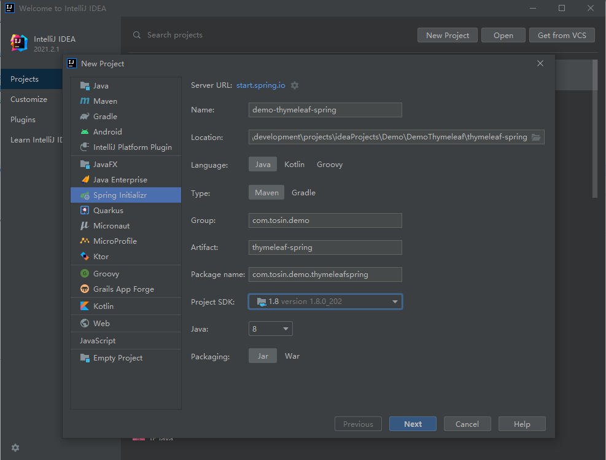
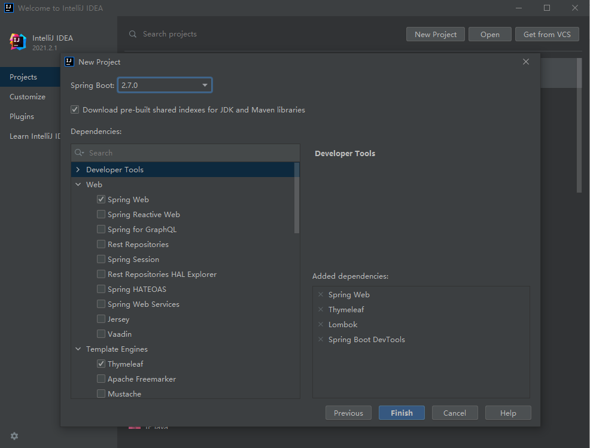

[[TOC]]

# Thymeleaf
- [Thymeleaf Official Website](https://www.thymeleaf.org/)
    - [Documentation - Thymeleaf](https://www.thymeleaf.org/documentation.html)
        - https://www.thymeleaf.org/doc/tutorials/2.1/usingthymeleaf.html
            - [Tutorial: Using Thymeleaf | setting-value-to-specific-attributes](https://www.thymeleaf.org/doc/tutorials/2.1/usingthymeleaf.html#setting-value-to-specific-attributes)
            - [Tutorial: Using Thymeleaf | fixed-value-boolean-attributes](https://www.thymeleaf.org/doc/tutorials/2.1/usingthymeleaf.html#fixed-value-boolean-attributes)
            - [Tutorial: Using Thymeleaf | appendix-b-expression-utility-objects](https://www.thymeleaf.org/doc/tutorials/2.1/usingthymeleaf.html#appendix-b-expression-utility-objects)
        - https://www.thymeleaf.org/doc/tutorials/2.1/thymeleafspring.html
- https://www.jianshu.com/p/ac8201031334
- [Thymeleaf快速入门](https://www.lookroot.cn/archives/12)
- [thymeleaf 语法大全](https://blog.csdn.net/qq_30725371/article/details/80108742)
## 搭建环境
- https://start.spring.io/




- 不是通过SpringBoot的控制器去 直接打开index.html
    - http://localhost:63342/demo-thymeleaf-spring/templates/index.html?_ijt=pv8n5ejhcvjvkr5ff31hm40rku&_ij_reload=RELOAD_ON_SAVE
- 通过控制器打开
    - http://127.0.0.1:8000/index

## Thymeleaf常用语法

### 语法标记

### 支持渲染的属性
- [Tutorial: Using Thymeleaf | setting-value-to-specific-attributes](https://www.thymeleaf.org/doc/tutorials/2.1/usingthymeleaf.html#setting-value-to-specific-attributes)
- [Tutorial: Using Thymeleaf | fixed-value-boolean-attributes](https://www.thymeleaf.org/doc/tutorials/2.1/usingthymeleaf.html#fixed-value-boolean-attributes)
- 这类属性很多，每个属性都针对特定的HTML5属性：

### 注释类型
- 在碎片里面，我们是可以使用控制传递的数据的，比如上面的User对象，但是开发工具在component.html页面中可能不能识别到User对象，我们可以打一个注释
```
    <!--/*@thymesVar id="user" type="com.tosin.demo.thymeleafspring.vo.UserVO"*/-->
    <p th:text="${user.name}"></p>
```
### 碎片（组件）
- 日常开发中呢我们经常将有些可以复用的部分抽离出来
- 新建一个templates/component.html,一个文件里面可以写多个碎片，使用th:fragment来定义
```
<!doctype html>
<html lang="ch" xmlns:th="http://www.thymeleaf.org">

<!--定义碎片（组件）-->
<!--使用th:fragment来定义-->
<footer th:fragment="com1">
    this is com1.
</footer>
<!--直接使用JQuery选择器定义-->
<footer id="com2">
    this is com2.
</footer>

</html>
```
- 使用碎片主要有两种方式replace和insert
```
<!--    使用碎片（组件）-->
<!--    使用碎片主要有两种方式replace和insert,在index.html中编写-->
<!--    th:replace-->
    <div th:replace="~{component::com1}"></div>
<!--    th:insert-->
    <div th:insert="~{component::com1}"></div>
<!--    常见jQuery选择方式-->
    <div th:insert="~{component::#com2}"></div>
```
- 这两种方式的区别就是，replace会将新标签完全替换原本的标签，也就是说原本写th:replace属性的标签就不会渲染出来，insert是往这个地方插入标签

#### 组件传递参数
- 定义
```
<!--组件传递参数-->
<footer th:fragment="com3(message)">
    组件传递参数.
    <p th:text="${message}"></p>
</footer>
```
- 使用
```
<div th:insert="~{component::com3('传递的数据')}"></div>
```
#### 局部替换组件
- 我们使用一个组件的时候，想要局部替换掉这个组件里面的部分内容该怎么做呢？通过传递参数的方式传递一个组件过来，并把这个组件替换原本的一部分
```
<!--局部替换组件-->
<footer th:fragment="com4(message)">
    <div th:replace="${message}">原本的模板</div>
</footer>
```
```

```
### 基本对象
#### 上下文对象
```
${#ctx.#request}
${#ctx.#response}
${#ctx.#session}
${#ctx.#servletContext}
```
#### 请求/会话属性
```
${session.xxx}                 
${application.xxx}          
${#request.getAttribute('xxx')}
```

### 工具类
- [appendix-b-expression-utility-objects](https://www.thymeleaf.org/doc/tutorials/2.1/usingthymeleaf.html#appendix-b-expression-utility-objects)
- 在thymeleaf里面是可以直接使用一些Java的函数的，并且你可以通过传递参数的方式把一些自己写的方法传递给页面，在里面调用也是可以的
- 一些可以直接的使用函数
	- #dates
	- #calendars
	- #strings
	- #numbers
	- #objects
	- #bools
	- #arrays
	- #lists
	- #sets
	- #maps
	- #aggregates
- 以日期格式化来举例
```
<p th:text="${#dates.format( user.createTime, 'yyyy-MM-dd HH:mm:ss')}"></p>
```