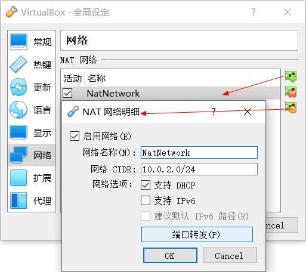
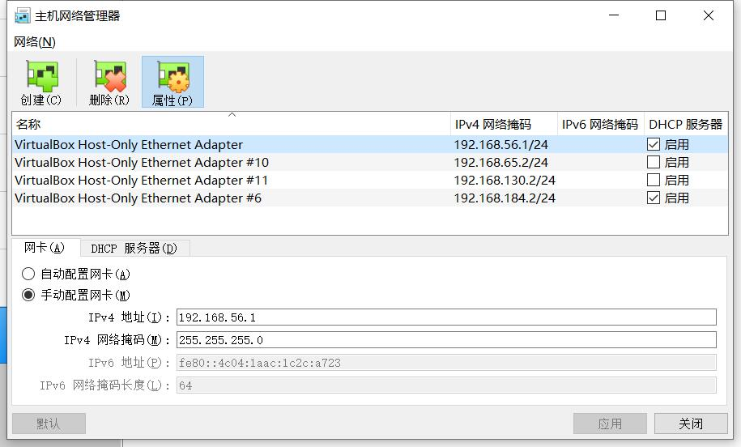
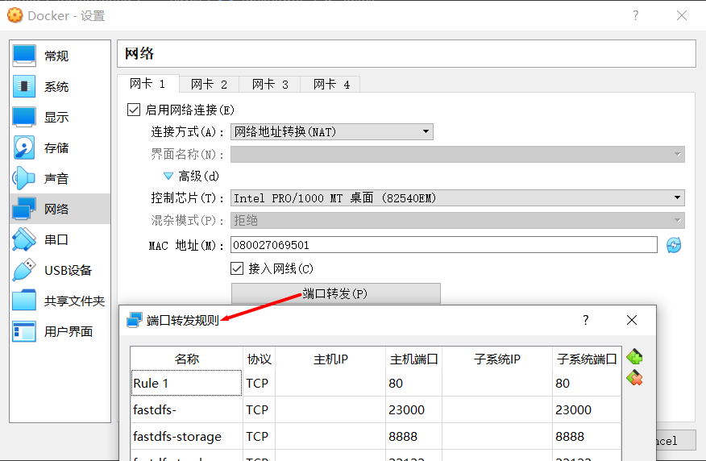
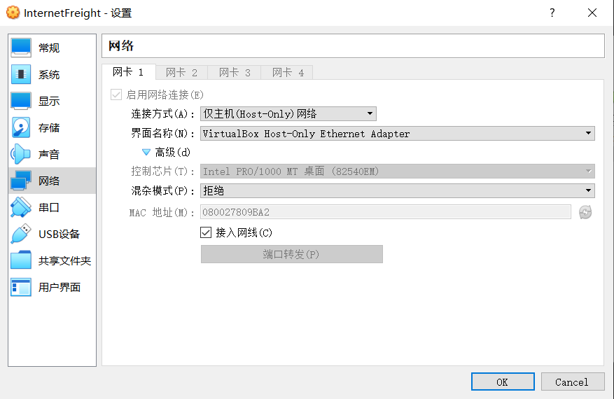
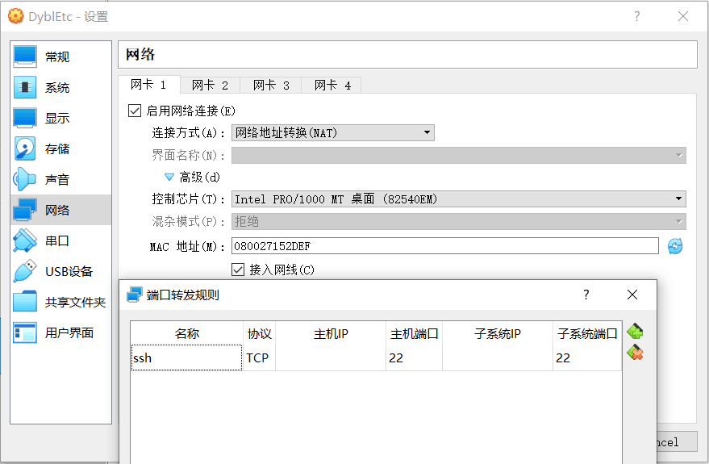
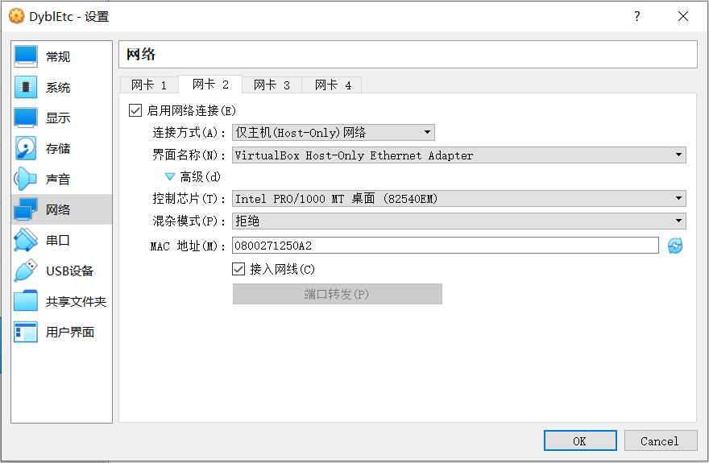

# 虚拟机
[[TOC]]

## 系统
- [系统镜像](https://msdn.itellyou.cn/)


## VirtualBox
### 官网
- https://www.virtualbox.org/
    - https://www.virtualbox.org/wiki/Downloads

### 虚拟机通用目录结构

- TosinJia
    - IdeaProjects
    - ProgramShortcut
    - tools
        - portableSoft

### 功能菜单

#### 管理

##### 全局设定

##### 主机网络管理器


#### 视图
功能 | 快捷键 | 说明
---|---|---
全屏模式 | HOST+F | HOST+Home 显示隐藏菜单
无缝模式 | HOST+L |
自动缩放模式 | HOST+C |
自动调整窗口都大小 | HOST+A |
自动调整显示尺寸 | | 全屏模式下，上下没有铺满全屏

#### 设备
##### 共享文件夹
- 勾选 自动挂载
- [VirtualBox主机与虚拟机文件夹共享](https://jingyan.baidu.com/article/d2b1d102cf998b5c7f37d442.html)

### 安装Windows10
- [VirtualBox中安装Windows10](https://baijiahao.baidu.com/s?id=1655255236440515338&wfr=spider&for=pc)

- [2020免费版win10激活密钥大全（有效激活)](http://www.xitongcheng.com/jiaocheng/win10_article_55870.html)
```
win10专业版用户请依次输入：
slmgr /ipk W269N-WFGWX-YVC9B-4J6C9-T83GX
slmgr /skms kms.03k.org
slmgr /ato
```

#### 问题汇总
##### FATAL: INT18: BOOT FAILURE
- 启用EFI（只针对某些系统）设置。安装的时候启用，后边取消，会提示FATAL: INT18: BOOT FAILURE
##### E_FAIL (0x80004005)
- 修改虚拟机名称，报 E_FAIL (0x80004005)，
    1. 修改文件夹名称
    2. 点击 *.vbox 重新加载虚拟机，修改虚拟机名称

#### 操作步骤
##### 核心操作
1. 修改 默认虚拟电脑位置：C:\Users\Lenovo\VirtualBox VMs D:\VirtualBox\VMs
2. win10 无法识别 .iso，上级加载为G盘，选择G盘即可

### 网络配置

模式 | NAT | BRIDGED | INTERNAL | HOST-ONLY
| --- | --- | --- | --- | --- |
虚拟机 -> 主机 | 可以 | 可以 | 不可以 | 可以
主机 -> 虚拟机 | 不可以 | 可以 | 不可以 | 可以
虚拟机 -> 其他主机 | 可以 | 可以 | 不可以 | 可以
其他主机 -> 主机 | 不可以 | 可以 | 不可以 | 不可以
虚拟机之间 | 不可以 | 可以 | 同网络可以 | 可以


#### NAT

#### HOST-ONLY

- 虚拟机
```
[root@CentOS-7 ~]# ifconfig
enp0s3: flags=4163<UP,BROADCAST,RUNNING,MULTICAST>  mtu 1500
        inet 192.168.56.102  netmask 255.255.255.0  broadcast 192.168.56.255
        inet6 fe80::806f:eb6c:8c0f:1819  prefixlen 64  scopeid 0x20<link>
        ether 08:00:27:80:9b:a2  txqueuelen 1000  (Ethernet)
        RX packets 813  bytes 318572 (311.1 KiB)
        RX errors 0  dropped 0  overruns 0  frame 0
        TX packets 512  bytes 305221 (298.0 KiB)
        TX errors 0  dropped 0 overruns 0  carrier 0  collisions 0

lo: flags=73<UP,LOOPBACK,RUNNING>  mtu 65536
        inet 127.0.0.1  netmask 255.0.0.0
        inet6 ::1  prefixlen 128  scopeid 0x10<host>
        loop  txqueuelen 1000  (Local Loopback)
        RX packets 2107  bytes 129182 (126.1 KiB)
        RX errors 0  dropped 0  overruns 0  frame 0
        TX packets 2107  bytes 129182 (126.1 KiB)
        TX errors 0  dropped 0 overruns 0  carrier 0  collisions 0


```
- 主机
```
C:\Users\User>ipconfig
以太网适配器 以太网 2:

   连接特定的 DNS 后缀 . . . . . . . :
   本地链接 IPv6 地址. . . . . . . . : fe80::357f:200c:72f5:6fca%24
   IPv4 地址 . . . . . . . . . . . . : 172.16.6.89
   子网掩码  . . . . . . . . . . . . : 255.255.255.0
   默认网关. . . . . . . . . . . . . : 172.16.6.254

以太网适配器 VirtualBox Host-Only Network:

   连接特定的 DNS 后缀 . . . . . . . :
   本地链接 IPv6 地址. . . . . . . . : fe80::4c04:1aac:1c2c:a723%2
   IPv4 地址 . . . . . . . . . . . . : 192.168.56.1
   子网掩码  . . . . . . . . . . . . : 255.255.255.0
   默认网关. . . . . . . . . . . . . :
```
- [virtualbox 常用网络模式解释和配置](https://cizixs.com/2017/03/09/virtualbox-network-mode-explained/)

#### 参考

- [VirtualBox 网络设置详解](https://reverland.bitbucket.io/VirtualBox_net.html)

- [VirtualBox四种网络模式及典型配置](https://blog.csdn.net/dkfajsldfsdfsd/article/details/79444582)

- 可以配置多网卡模式
    - [【VirtualBox】虚拟机网络设置详细教程](https://developer.aliyun.com/article/149551)

- [快速理解VirtualBox的四种网络连接方式](https://www.cnblogs.com/york-hust/archive/2012/03/29/2422911.html)


- [virtualBox虚拟机网络配置教程](https://blog.csdn.net/wyj19950908/article/details/98966137)

#### 多网卡配置
- https://zhuanlan.zhihu.com/p/341328334

1. 关闭虚拟机





2. 启动虚拟机，进入CentOS进行额外的配置

```
[root@CentOS-7 ~]# ip addr
1: lo: <LOOPBACK,UP,LOWER_UP> mtu 65536 qdisc noqueue state UNKNOWN group default qlen 1000
    link/loopback 00:00:00:00:00:00 brd 00:00:00:00:00:00
    inet 127.0.0.1/8 scope host lo
       valid_lft forever preferred_lft forever
    inet6 ::1/128 scope host 
       valid_lft forever preferred_lft forever
2: enp0s3: <BROADCAST,MULTICAST,UP,LOWER_UP> mtu 1500 qdisc pfifo_fast state UP group default qlen 1000
    link/ether 08:00:27:15:2d:ef brd ff:ff:ff:ff:ff:ff
    inet 10.0.2.15/24 brd 10.0.2.255 scope global noprefixroute dynamic enp0s3
       valid_lft 86360sec preferred_lft 86360sec
    inet6 fe80::806f:eb6c:8c0f:1819/64 scope link noprefixroute 
       valid_lft forever preferred_lft forever
3: enp0s8: <BROADCAST,MULTICAST,UP,LOWER_UP> mtu 1500 qdisc pfifo_fast state UP group default qlen 1000
    link/ether 08:00:27:12:50:a2 brd ff:ff:ff:ff:ff:ff
    inet 192.168.56.104/24 brd 192.168.56.255 scope global noprefixroute dynamic enp0s8
       valid_lft 560sec preferred_lft 560sec
    inet6 fe80::e832:a2fa:3348:ca90/64 scope link noprefixroute 
       valid_lft forever preferred_lft forever

# 查看网卡状态，可以看到enp0s8网卡缺少配置文件，需要自己配置
[root@CentOS-7 ~]# service network status
Configured devices:
lo enp0s3
Currently active devices:
lo enp0s3 enp0s8
```
3. 添加网卡配置文件
```
一、使用nmcli con查看网卡uuid
[root@CentOS-7 ~]# nmcli con
NAME                UUID                                  TYPE      DEVICE 
enp0s3              de52877b-61ff-40db-a1dc-6abe8669d2cd  ethernet  enp0s3 
Wired connection 1  faa000fb-7e3d-3f4e-90c5-b9f5bcf091fb  ethernet  enp0s8

二、使用ip addr或者ifconfig查看网卡mac地址
[root@CentOS-7 ~]# ip addr
3: enp0s8: <BROADCAST,MULTICAST,UP,LOWER_UP> mtu 1500 qdisc pfifo_fast state UP group default qlen 1000
    link/ether 08:00:27:12:50:a2 brd ff:ff:ff:ff:ff:ff
    inet 192.168.56.104/24 brd 192.168.56.255 scope global noprefixroute dynamic enp0s8
       valid_lft 538sec preferred_lft 538sec
    inet6 fe80::e832:a2fa:3348:ca90/64 scope link noprefixroute 
       valid_lft forever preferred_lft forever


三、将/etc/sysconfig/network-scripts/ifcfg-enp0s3拷贝一份，重命名成ifcfg-enp0s8。然后修改enp0s8的网卡配置文件，修改完成以后，使用service network restart重启网络使配置生效
[root@CentOS-7 ~]# cp /etc/sysconfig/network-scripts/ifcfg-enp0s3 /etc/sysconfig/network-scripts/ifcfg-enp0s8

[root@CentOS-7 ~]# vim /etc/sysconfig/network-scripts/ifcfg-enp0s3
TYPE="Ethernet"
PROXY_METHOD="none"
BROWSER_ONLY="no"
BOOTPROTO="dhcp"
DEFROUTE="yes"
IPV4_FAILURE_FATAL="no"
IPV6INIT="yes"
IPV6_AUTOCONF="yes"
IPV6_DEFROUTE="yes"
IPV6_FAILURE_FATAL="no"
IPV6_ADDR_GEN_MODE="stable-privacy"
NAME="enp0s3"
UUID="de52877b-61ff-40db-a1dc-6abe8669d2cd"
DEVICE="enp0s3"
ONBOOT="yes"

[root@CentOS-7 ~]# vim /etc/sysconfig/network-scripts/ifcfg-enp0s8
TYPE="Ethernet"
PROXY_METHOD="none"
BROWSER_ONLY="no"
#BOOTPROTO="dhcp"
BOOTPROTO=none
HWADDR=08:00:27:12:50:a2
DEFROUTE="yes"
IPV4_FAILURE_FATAL="no"
IPV6INIT="yes"
IPV6_AUTOCONF="yes"
IPV6_DEFROUTE="yes"
IPV6_FAILURE_FATAL="no"
IPV6_ADDR_GEN_MODE="stable-privacy"
#NAME="enp0s3"
NAME=enp0s8
UUID="faa000fb-7e3d-3f4e-90c5-b9f5bcf091fb"
#DEVICE="enp0s3"
DEVICE=enp0s8
ONBOOT="yes"

# IP
IPADDR=192.168.56.103
# 子网掩码
NETMASK=255.255.255.0
# 网关
GATEWAY=192.168.56.1
```
4. 重启服务器、查看网卡
```
[root@CentOS-7 ~]# ip addr
1: lo: <LOOPBACK,UP,LOWER_UP> mtu 65536 qdisc noqueue state UNKNOWN group default qlen 1000
    link/loopback 00:00:00:00:00:00 brd 00:00:00:00:00:00
    inet 127.0.0.1/8 scope host lo
       valid_lft forever preferred_lft forever
    inet6 ::1/128 scope host 
       valid_lft forever preferred_lft forever
2: enp0s3: <BROADCAST,MULTICAST,UP,LOWER_UP> mtu 1500 qdisc pfifo_fast state UP group default qlen 1000
    link/ether 08:00:27:15:2d:ef brd ff:ff:ff:ff:ff:ff
    inet 10.0.2.15/24 brd 10.0.2.255 scope global noprefixroute dynamic enp0s3
       valid_lft 86377sec preferred_lft 86377sec
    inet6 fe80::806f:eb6c:8c0f:1819/64 scope link noprefixroute 
       valid_lft forever preferred_lft forever
3: enp0s8: <BROADCAST,MULTICAST,UP,LOWER_UP> mtu 1500 qdisc pfifo_fast state UP group default qlen 1000
    link/ether 08:00:27:12:50:a2 brd ff:ff:ff:ff:ff:ff
    inet 192.168.56.103/24 brd 192.168.56.255 scope global noprefixroute enp0s8
       valid_lft forever preferred_lft forever
    inet6 fe80::e832:a2fa:3348:ca90/64 scope link noprefixroute 
       valid_lft forever preferred_lft forever
```
### 导入导出虚拟机
#### 导入
1. 选择要导入的虚拟电脑 D:\VMware backup\centos.ova
2. 虚拟电脑导入设置
    1. 修改名称
    2. 修改虚拟硬盘文件名
3. 选择为所有网卡重新生成MAC地址（勾选重新初始化所有网卡的MAC地址）
4. 导入


### 1. 没有全屏
- 设备->安装增强功能...


### 2. 扩容
#### [virtualbox ubuntu 磁盘大小扩容](https://www.cnblogs.com/fsong/p/11759261.html)

[如何在Virtualbox中对Ubuntu系统根分区扩容](https://blog.csdn.net/LEON1741/article/details/56494797)


```

VBoxManage.exe clonehd "H:\VirtualBox\VMs\ubuntu\ubuntu.vmdk" "H:\VirtualBox\VMs\ubuntu\ubuntu.vdi"  -format VDI

10+50G
VBoxManage.exe modifyhd "H:\VirtualBox\VMs\ubuntu\ubuntu.vdi" --resize 61440

替换存储文件为 ubuntu.vdi


sudo apt-get install gparted
sudo gparted

删除原有磁盘空间
1. 禁用swap交换空间。右键linux-swap空间的磁盘，选择禁用交换空间。
2. 删除该交换空间。
3. 删除整个交换空间所属的磁盘分区，此时，交换空间所属的磁盘分区与刚新分配的磁盘分区合并到一起了，成为了一个更大的磁盘分区。

重新生成磁盘分区
1. 生成50G的新分区。未分配的分区中右键选择新建。
2. 在弹出的对话框中输入新创建的分区数据，新分区的文件类型一定要选择与目前sda1分区的文件系统一样的格式。设置该分区之后的空余空间为1G。
3. 剩下的就是swap分区空间。未分配分区右键选择新建，弹出的对话框中文件类型选择linux-swap

磁盘分区写入分区表
1. /dev/sda1	ext4
2. /dev/sda2	ext4
3. /dev/sda3	linux-swap
此时，系统已经生成了3个分区，原来的sda1分区依然存在，紧接着是新生成的50G补充分区sda2，最后是swap分区sda3。
注意：这3个分区顺序不能错，swap分区必须位于最后，否则将不能执行合并！

退出该工具，重启系统。


Ubuntu磁盘分区表重写
1. 查看当前磁盘分区情况

root@tosinjia-VirtualBox:~# df -h
Filesystem      Size  Used Avail Use% Mounted on
udev            474M     0  474M   0% /dev
tmpfs            99M  3.6M   96M   4% /run
/dev/sda1       8.8G  5.7G  2.7G  68% /
tmpfs           495M  216K  495M   1% /dev/shm
tmpfs           5.0M  4.0K  5.0M   1% /run/lock
tmpfs           495M     0  495M   0% /sys/fs/cgroup
tmpfs            99M   48K   99M   1% /run/user/1000
tmpfs            99M     0   99M   0% /run/user/0
root@tosinjia-VirtualBox:~# fdisk -l /dev/sda
Disk /dev/sda: 60 GiB, 64424509440 bytes, 125829120 sectors
Units: sectors of 1 * 512 = 512 bytes
Sector size (logical/physical): 512 bytes / 512 bytes
I/O size (minimum/optimal): 512 bytes / 512 bytes
Disklabel type: dos
Disk identifier: 0xe9265ebf

Device     Boot     Start       End   Sectors Size Id Type
/dev/sda1  *         2048  18874367  18872320   9G 83 Linux
/dev/sda2        18874368 123731967 104857600  50G 83 Linux
/dev/sda3       123731968 125829119   2097152   1G 82 Linux swap / Solaris

2. 关闭swap分区

root@tosinjia-VirtualBox:~# free -m
              total        used        free      shared  buff/cache   available
Mem:            989         623          90           8         276         198
Swap:             0           0           0
root@tosinjia-VirtualBox:~# swapoff -a
swapoff: cannot find the device for UUID=dc3e2979-3dd9-4d02-9960-0bf1615a4766
root@tosinjia-VirtualBox:~# free -m
              total        used        free      shared  buff/cache   available
Mem:            989         623          89           8         277         198
Swap:             0           0           0


root@tosinjia-VirtualBox:~# fdisk /dev/sda

Welcome to fdisk (util-linux 2.27.1).
Changes will remain in memory only, until you decide to write them.
Be careful before using the write command.


Command (m for help): p
Disk /dev/sda: 60 GiB, 64424509440 bytes, 125829120 sectors
Units: sectors of 1 * 512 = 512 bytes
Sector size (logical/physical): 512 bytes / 512 bytes
I/O size (minimum/optimal): 512 bytes / 512 bytes
Disklabel type: dos
Disk identifier: 0xe9265ebf

Device     Boot     Start       End   Sectors Size Id Type
/dev/sda1  *         2048  18874367  18872320   9G 83 Linux
/dev/sda2        18874368 123731967 104857600  50G 83 Linux
/dev/sda3       123731968 125829119   2097152   1G 82 Linux swap / Solaris

Command (m for help): d
Partition number (1-3, default 3): 1

Partition 1 has been deleted.

Command (m for help): d
Partition number (2,3, default 3): 2

Partition 2 has been deleted.

Command (m for help): p
Disk /dev/sda: 60 GiB, 64424509440 bytes, 125829120 sectors
Units: sectors of 1 * 512 = 512 bytes
Sector size (logical/physical): 512 bytes / 512 bytes
I/O size (minimum/optimal): 512 bytes / 512 bytes
Disklabel type: dos
Disk identifier: 0xe9265ebf

Device     Boot     Start       End Sectors Size Id Type
/dev/sda3       123731968 125829119 2097152   1G 82 Linux swap / Solaris

前2个分区已经消失了

4. 重新建立新的分区信息

Command (m for help): n
Partition type
   p   primary (1 primary, 0 extended, 3 free)
   e   extended (container for logical partitions)
Select (default p): p
Partition number (1,2,4, default 1): 1
First sector (2048-125829119, default 2048): 
Last sector, +sectors or +size{K,M,G,T,P} (2048-123731967, default 123731967): 

Created a new partition 1 of type 'Linux' and of size 59 GiB.

Command (m for help): p
Disk /dev/sda: 60 GiB, 64424509440 bytes, 125829120 sectors
Units: sectors of 1 * 512 = 512 bytes
Sector size (logical/physical): 512 bytes / 512 bytes
I/O size (minimum/optimal): 512 bytes / 512 bytes
Disklabel type: dos
Disk identifier: 0xe9265ebf

Device     Boot     Start       End   Sectors Size Id Type
/dev/sda1            2048 123731967 123729920  59G 83 Linux
/dev/sda3       123731968 125829119   2097152   1G 82 Linux swap / Solaris

新分区信心建立完成，主分区已经有59G空间了。
5. 分区信息写入分区表

Command (m for help): w
The partition table has been altered.
Calling ioctl() to re-read partition table.
Re-reading the partition table failed.: Device or resource busy

The kernel still uses the old table. The new table will be used at the next reboot or after you run partprobe(8) or kpartx(8).

6. 重启系统并生效
root@tosinjia-VirtualBox:~# reboot

root@tosinjia-VirtualBox:~# df -h
Filesystem      Size  Used Avail Use% Mounted on
udev            474M     0  474M   0% /dev
tmpfs            99M  3.5M   96M   4% /run
/dev/sda1       8.8G  5.7G  2.7G  68% /
tmpfs           495M  188K  495M   1% /dev/shm
tmpfs           5.0M  4.0K  5.0M   1% /run/lock
tmpfs           495M     0  495M   0% /sys/fs/cgroup
tmpfs            99M   32K   99M   1% /run/user/108
tmpfs            99M     0   99M   0% /run/user/0
root@tosinjia-VirtualBox:~# resize2fs /dev/sda1
resize2fs 1.42.13 (17-May-2015)
Filesystem at /dev/sda1 is mounted on /; on-line resizing required
old_desc_blocks = 1, new_desc_blocks = 4
The filesystem on /dev/sda1 is now 15466240 (4k) blocks long.

root@tosinjia-VirtualBox:~# df -h
Filesystem      Size  Used Avail Use% Mounted on
udev            474M     0  474M   0% /dev
tmpfs            99M  3.5M   96M   4% /run
/dev/sda1        58G  5.7G   50G  11% /
tmpfs           495M  188K  495M   1% /dev/shm
tmpfs           5.0M  4.0K  5.0M   1% /run/lock
tmpfs           495M     0  495M   0% /sys/fs/cgroup
tmpfs            99M   28K   99M   1% /run/user/108
tmpfs            99M     0   99M   0% /run/user/0
root@tosinjia-VirtualBox:~# fdisk -l /dev/sda
Disk /dev/sda: 60 GiB, 64424509440 bytes, 125829120 sectors
Units: sectors of 1 * 512 = 512 bytes
Sector size (logical/physical): 512 bytes / 512 bytes
I/O size (minimum/optimal): 512 bytes / 512 bytes
Disklabel type: dos
Disk identifier: 0xe9265ebf

Device     Boot     Start       End   Sectors Size Id Type
/dev/sda1            2048 123731967 123729920  59G 83 Linux
/dev/sda3       123731968 125829119   2097152   1G 82 Linux swap / Solaris


SecureCRT链接失败+ubuntu中root用户登录失败(https://blog.csdn.net/ke_yi_/article/details/81559288)
SecureCRT 127.0.0.1:50001 root

tosinjia@tosinjia-VirtualBox:~$ sudo vim /etc/ssh/sshd_config 
#PermitRootLogin prohibit-password
PermitRootLogin yes

tosinjia@tosinjia-VirtualBox:~$ service sshd restart


```

#### 调整扩大VMDK格式的磁盘空间
##### [windows中VirtualBox调整扩大VMDK格式的磁盘空间](https://www.cnblogs.com/luobo-zhang/p/8128185.html)

1. 切换到VirtualBox目录
```
C:\Program Files\Oracle\VirtualBox
```
2. 执行clonehd命令并转为vdi
```
VBoxManage.exe clonehd "G:\VMware\VirtualBox VMs\win7_bigdata\win7_1-disk002.vmdk" "G:\VMware\VirtualBox VMs\win7_bigdata\win7_1-disk002.vdi"  -format VDI
0%...10%...20%...30%...40%...50%...60%...70%...80%...90%...100%
Clone medium created in format 'VDI'. UUID: 3ee0bc94-89f5-49fa-8983-90c002367d21
```
3. 执行modifyhd命令,这里的51200是MB单位
```
VBoxManage.exe modifyhd "G:\VMware\VirtualBox VMs\win7_bigdata\win7_1-disk002.vdi" --resize 51200
0%...10%...20%...30%...40%...50%...60%...70%...80%...90%...100%
```
4. 如果想用vid重新设置即可,重新挂载硬盘即可,不折不挠的继续往下看下一步

5. 如果想转回去,挂载硬盘即可
    - 虚拟机 -> 存储 -> 移除 win7_1-disk002.vmdk 添加 win7_1-disk002-expand.vmdk
```
VBoxManage.exe clonehd "G:\VMware\VirtualBox VMs\win7_bigdata\win7_1-disk002.vdi" "G:\VMware\VirtualBox VMs\win7_bigdata\win7_1-disk002-expand.vmdk" -format VMDK
0%...10%...20%...30%...40%...50%...60%...70%...80%...90%...100%
Clone medium created in format 'VMDK'. UUID: 7463d519-4134-4485-bc03-97d9bcfcefe1
```

6. 系统中的划分新增加的硬盘空间
    - windows 
        - 计算机 -> 管理 -> 磁盘管理 -> 选中需要扩展的磁盘 -> 扩展卷


### 移动整个目录文件
1. 复制整个目录问价到移动硬盘
2. 右键 -> 删除 -> 只是移除
3. 双击 复制目录下的 .vbox 文件

### 移动存储文件
1. 移动 ubuntu2.vmdk 文件
```
C:\Program Files\Oracle\VirtualBox>VBoxManage internalcommands sethduuid "C:/Users/TosinJia/VirtualBox VMs/ubuntu2/ubuntu2.vmdk"
UUID changed to: c92d8638-885e-4abd-9480-ad3ef61c7d70
```
2. 修改 ubuntu2.vbox 文件，ubuntu2.vmdk中相关的两处UUID

3. 虚拟机-设置
	- 存储
		- 控制器：SATA
			- 删除之前的报错文件
			- 添加虚拟硬盘 
4. 导出 ubuntu2.ova
5. 导入 ubuntu2.ova ubuntu2_1